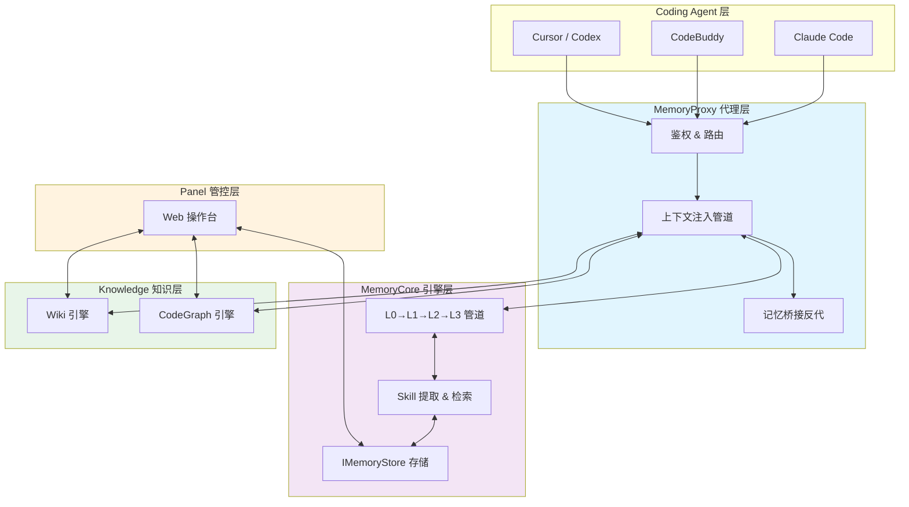
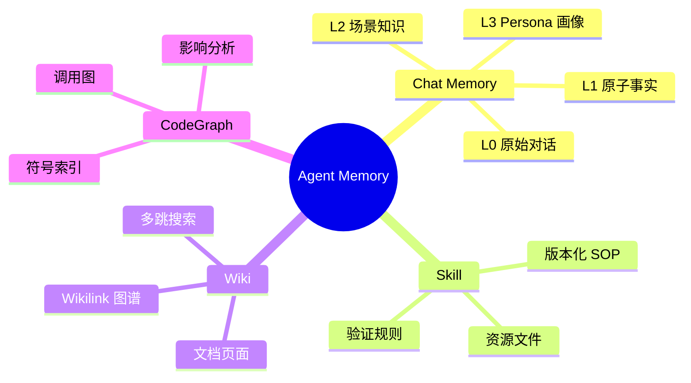
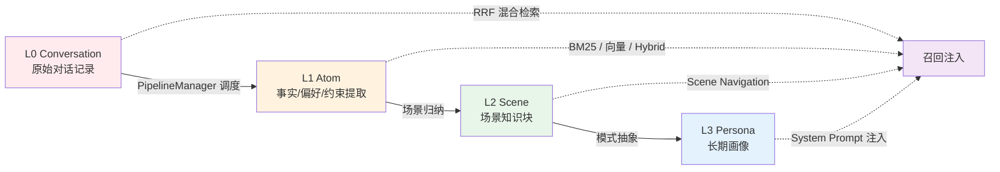
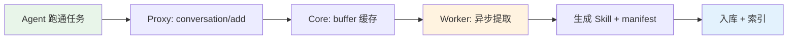
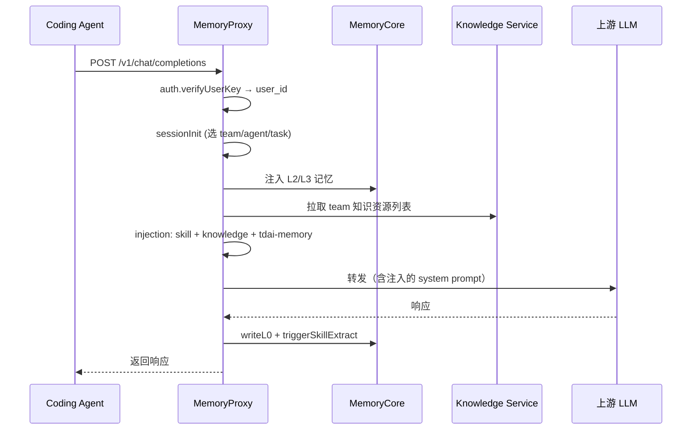
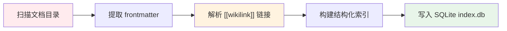

# TencentDB Agent Memory 源码深度解析：让 Agent 团队共享经验、不共享隐私

> "别重构旧鉴权模块，移动端还在用。" —— 这种代价很高的上下文，不应该靠人每次提醒。
>
> Agent 的经验、文档、代码，都应该沉淀成可复用的资产，让下一位 Agent 直接读档。

---

## 一、引言：Agent 团队的"记忆鸿沟"

> *"Any sufficiently advanced agent is indistinguishable from a forgetful intern."*
>
> 每个新加入团队的 Agent，都像是一个失忆的新员工——没有记忆、没有经验、从零开始。

### 1.1 真实场景：每次都是"重新认识"

想象这样一个场景：你的团队有三个 Coding Agent——一个负责核心模块开发，一个做代码审查，一个修 Bug。

```
周一：Agent-A 跑通了鉴权模块的迁移方案，花了 3 小时摸索。
周二：Agent-B 审查代码时，完全不知道 Agent-A 踩过的坑，又问了一遍同样的问题。
周三：Agent-C 修 Bug 时，不小心把 Agent-A 迁移过的模块又改回了旧方案。
```

这不是假设，而是 **几乎所有 Agent 开发团队的日常**。根本问题只有一个：

> **Agent 换 Session 就失忆。**

### 1.2 为什么 RAG 不够？

很多团队的第一反应是："上 RAG 不就行了？把文档、代码、聊天记录都向量化，让 Agent 检索。"

但 RAG 解决的是 **"能查到什么"**，而不是：

- ❌ "谁可以用这份知识？"
- ❌ "哪个版本是当前正确的？"
- ❌ "这份经验应该给哪个 Agent？"
- ❌ "这段对话里哪些是事实、哪些是闲聊？"

RAG 是"图书馆"——书在那里，但你需要自己找、自己判断、自己组装。

**TencentDB Agent Memory 做的是"操作系统"**——它管理记忆的生命周期、权限、版本、注入时机，让 Agent **不用查就知道该知道的事**。

### 1.3 项目概况

[TencentDB Agent Memory](https://github.com/TencentCloud/TencentDB-Agent-Memory) 是一个开源的 Agent 记忆管理系统：

| 指标 | 值 |
|------|-----|
| **Stars** | 19,000+ |
| **协议** | MIT |
| **语言** | TypeScript |
| **核心资产** | Chat Memory / Skill / Wiki / CodeGraph |

### 1.4 源码研读路径

本文将从四个组件深入源码：

```
┌──────────────┐    ┌──────────────┐    ┌──────────────────────┐
│ MemoryCore   │◄──►│ MemoryProxy  │◄──►│ MemoryKnowledge      │
│ 记忆引擎      │    │ Agent 通道   │    │ Wiki + CodeGraph     │
└──────────────┘    └──────────────┘    └──────────────────────┘
                           ▲
                           │
                    ┌──────────────┐
                    │ MemoryPanel  │
                    │ 管控面板      │
                    └──────────────┘
```

---

## 二、总体架构：四层记忆资产 + 三组件部署

### 2.1 架构总览

TencentDB Agent Memory 的架构可以用一张图来概括：



**数据流向**：

```
Agent 请求 → Proxy 鉴权 & 拦截 → 注入记忆上下文 → 转发 LLM
                                          ↓
LLM 响应 → Proxy 捕获对话 → Core 沉淀资产（L0→L1→L2→L3）
```

### 2.2 四种记忆资产对比

整个系统的核心是 **四类记忆资产**，它们各自解决不同的问题：

| 资产类型 | 来源 | 粒度 | 解决什么问题 |
|---------|------|------|-------------|
| **Chat Memory** | 对话逐层提取 | L0 原始 → L1 事实 → L2 场景 → L3 画像 | 跨会话保留偏好、决策、交互历史 |
| **Skill** | 从跑通的任务中提炼 | 版本化 SOP + 资源文件 + 验证规则 | 可复用的操作方法（排障、Review、上线检查） |
| **Wiki** | 文档结构化 | 页面 + `[[wikilink]]` 链接图谱 | 让 Agent 按需阅读，不整库注入 |
| **CodeGraph** | 代码符号索引 | 文件 → 符号 → 调用关系 → 影响路径 | 改代码前先做 impact analysis |

这四类资产形成了一个 **完整的记忆生态**：



### 2.3 三层解耦设计

整个系统采用了 **三层解耦** 的架构哲学：

| 层 | 组件 | 解耦目标 |
|---|------|---------|
| **记忆引擎层** | MemoryCore | 与宿主解耦（HostAdapter 模式） |
| **上下文代理层** | MemoryProxy | 与 LLM 协议解耦（Anthropic + OpenAI 双协议） |
| **知识服务层** | MemoryPanel + MemoryKnowledge | 独立的管控和知识处理 |

这种设计让 MemoryCore 可以被任何 Agent 框架接入——无论是 OpenClaw、Hermes、Gateway 还是 CLI，只需要实现 `HostAdapter` 接口即可。

---

## 三、MemoryCore 深度解析：记忆不是平铺记录，而是逐层生长

### 3.1 TdaiCore：宿主中立的核心 Facade

`TdaiCore` 是整个记忆系统的核心 Facade（门面类），位于 `tdai-core.ts` 中。它的设计哲学可以用一句话概括：

> **Core 只依赖接口，不依赖任何具体宿主。**

```typescript
// tdai-core.ts 核心构造函数签名
class TdaiCore {
  constructor(
    hostAdapter: HostAdapter,       // 宿主适配器
    llmRunnerFactory: LLMRunnerFactory  // LLM 运行器工厂
  ) { ... }
}
```

`TdaiCore` 暴露了三个核心方法链：

| 方法 | 时机 | 作用 |
|------|------|------|
| `handleBeforeRecall()` | 每次 Agent 请求前 | 召回记忆并注入上下文 |
| `handleTurnCommitted()` | 每轮对话完成后 | 捕获对话，写入 L0 原始记录 |
| `handleShutdown()` | Agent 关闭时 | Pipeline 冲刷，确保异步提取完成 |

**设计洞察**：这种 Facade + Adapter 模式让 Core 完全不知道自己在为谁服务。它可以对接 OpenClaw、Hermes、甚至是一个简单的 CLI 脚本——只要宿主实现了 `HostAdapter` 接口。

### 3.2 L0→L1→L2→L3 分层记忆管道

这是 TencentDB Agent Memory 最具创新性的设计。记忆不是平铺的一堆聊天记录，而是 **逐层抽象、逐层生长** 的管道：



各层的职责和数据来源：

| 层级 | 名称 | 数据来源 | 核心文件 | 检索方式 |
|------|------|---------|---------|---------|
| **L0** | Conversation（原始对话） | `auto-capture.ts` 逐消息捕获 | `store/types.ts` → `L0Record` | 向量索引（可选延迟嵌入） |
| **L1** | Atom（原子事实） | LLM 从对话中提取事实、偏好、约束 | `store/types.ts` → `MemoryRecord` | BM25 + 向量 + RRF 混合检索 |
| **L2** | Scene（场景知识） | 按项目/场景归纳 L1 事实 | `store/types.ts` → `MemoryRecord` | Scene Navigation 机制 |
| **L3** | Persona（长期画像） | 跨场景的模式抽象 | `store/types.ts` → `ProfileRecord` | System Prompt 直接注入 |

**L0 捕获**（`auto-capture.ts`）：
- 每轮对话的每一条消息都被记录
- 支持可选的延迟嵌入（lazy embedding），避免写入时的向量计算延迟

**L1 提取**：
- 异步 Worker 从 L0 中提取结构化事实
- 例如："移动端还在用旧鉴权模块"、"用户偏好 Rust 而非 Go"

**召回策略**（`auto-recall.ts`）采用双通道注入：
- `prependContext`：在对话开头注入相关记忆（用于上下文补充）
- `appendSystemContext`：在 system prompt 末尾追加画像信息（用于行为指导）

### 3.3 记忆存储抽象：IMemoryStore 接口

MemoryCore 不关心数据存在哪里——它只依赖 `IMemoryStore` 接口：

```
IMemoryStore 统一接口
├── L0/L1 读写
├── 全文搜索
├── Profile 同步
└── 审计日志
```

**双后端实现**：

| 后端 | 场景 | 技术栈 |
|------|------|-------|
| **SQLite（本地）** | 开发/单机部署 | sqlite-vec（向量） + FTS5（全文检索） |
| **Tencent Cloud VectorDB（云端）** | 生产/多机部署 | 腾讯云向量数据库 |

**三维度隔离**是隐私边界的核心保障：

```sql
-- buildIsolationWhere 生成的 WHERE 子句示例
WHERE teamId = ? AND (userId = ? OR userId IS NULL) AND agentId = ?
```

| 维度 | 含义 | 示例 |
|------|------|------|
| `teamId` | 团队边界 | `team-frontend` |
| `userId` | 用户边界 | `user-alice`（可为空，表示团队共享） |
| `agentId` | Agent 边界 | `agent-reviewer` |

这意味着 Agent-A 的记忆不会泄露给 Agent-B，除非它们在同一个 team 下且权限匹配。这是 **SQL 层面的硬约束**，不是应用层的软限制。

### 3.4 Skill 模块：从"练过一次"到"全队可用"

Skill 是这个系统最有价值的资产类型——它把 **一次跑通的操作** 提炼成 **全队可复用的 SOP**。

**Skill 数据结构**（`skill/types.ts`）：

```
Skill
├── manifest          # 元数据：名称、描述、触发关键词
├── versionedSnapshot # 版本化快照（Markdown 指令）
├── resources         # 关联资源文件（脚本、模板）
└── validationRules   # 验证规则（确保 Skill 执行正确）
```

**抽取链路**：



**路由策略**（三种检索模式）：

| 模式 | 适用场景 | 算法 |
|------|---------|------|
| **BM25** | 关键词明确的 Skill | 全文检索 |
| **Embedding** | 语义相关的 Skill | 向量相似度 |
| **Hybrid（RRF 融合）** | 综合场景 | BM25 + Embedding 的倒数排名融合 |

**版本管理**采用 head 版本 + 历史版本的 Git-like 设计，支持 TTL 过期机制——长时间未被访问的 Skill 会被自动归档。

**审计钩子**：
- `onSkillCreated`：Skill 创建时触发
- `onSkillAccessed`：Skill 被检索时触发
- `onSkillArchived`：Skill 过期归档时触发

---

## 四、MemoryProxy 深度解析：给 Agent 挂上记忆的通道

如果说 MemoryCore 是大脑，MemoryProxy 就是 **神经系统**——它负责把记忆注入到 Agent 的每次请求中。

### 4.1 请求处理总流程

每次 Agent 向 LLM 发起请求，MemoryProxy 都会拦截并处理：



**五步处理链**（`server.ts` + `handler.ts`）：

1. **鉴权**：`verifyUserKey` → 解析出 `user_id`
2. **Session Init**：引导选择 team/agent/task
3. **Injection**：skill + knowledge + tdai-memory 注入 system prompt
4. **转发**：将含注入上下文的请求转发给上游 LLM
5. **捕获**：writeL0 记录对话 + triggerSkillExtract 触发 Skill 提取

### 4.2 双协议支持

MemoryProxy 同时支持两大 LLM 协议，这使得它可以作为 **任意 Agent 的统一网关**：

| 协议 | 文件 | 端点 | 适配 Agent |
|------|------|------|-----------|
| **OpenAI Completions** | `handler.ts` | `/v1/chat/completions` | Claude Code、Cursor、Codex |
| **Anthropic Messages** | `anthropicHandler.ts` | `/v1/messages` | Claude API 直连 |

消息格式通过 `flattenMessagesForOpik` 统一化，确保无论上游用什么协议，下游的记忆系统都能一致处理。

**请求路由**支持多 Agent 分流：

```
Claude Code 请求 → ccRequestRouting → main / fork / sidequery
CodeBuddy 请求   → 独立路由
Codex 请求       → 独立路由
```

### 4.3 上下文注入管道（Injection Pipeline）

这是 Proxy 最核心的功能——**在恰当的时机，把恰当的记忆，注入到恰当的位置**。

三种 Injector 各司其职：

| Injector | 作用 | 注入内容 |
|----------|------|---------|
| `skill` | RAG 检索注入 | 根据当前任务检索并注入相关 Skill |
| `knowledge` | 知识工具列表 | 拉取 team 的 Wiki/CodeGraph 资源列表 |
| `tdai-memory` | L2/L3 注入 | 场景知识和 Persona 画像 |

**注入时机**分两个阶段：

1. **Session Init 预热**：在对话开始时注入 L2/L3 记忆，让 Agent 一上来就有上下文
2. **每轮请求追加**：根据当前对话内容，动态检索并注入相关 Skill 和 L1 事实

**记忆工具注入**（`<memory-tools-guide>`）是一个巧妙设计——它告诉 LLM **如何主动搜索记忆**，而不是被动等待注入。这让 Agent 可以在需要时主动调用记忆检索接口。

### 4.4 记忆桥接（Memory Bridge + Skill Bridge）

当注入的记忆不够用时，LLM 需要 **主动检索**。但 Agent 不应该持有记忆系统的访问凭证——这会带来安全风险。

**解决方案**：Memory Bridge 和 Skill Bridge 作为反代层：

```
LLM (通过 Bash/curl) → Memory Bridge (反代 + 注入鉴权) → MemoryCore
```

- LLM 通过 `curl http://localhost:port/memory/search?q=...` 发起检索
- Bridge 自动注入鉴权 token 和用户身份
- LLM **无需感知**任何凭证

这让记忆检索对 Agent 来说就像调用本地服务一样简单。

### 4.5 可观测性与成本控制

生产环境中，记忆系统本身也需要被监控和优化：

| 系统 | 用途 |
|------|------|
| **Opik** | trace/span 自动上报，追踪每次记忆注入和检索 |
| **Langfuse** | generation 报告，分析记忆对 LLM 输出的影响 |
| **ClickHouse** | 用量记录（token / cost / cache hit），成本分析 |
| **Cost Guard** | 为不同 Agent 配置不同模型（如 Agent-Review 用 Haiku，Agent-Dev 用 Sonnet） |
| **Rate Limit** | TPM / QPM 限流，多 Pod 通过 Redis 原子计数实现分布式限流 |

---

## 五、MemoryKnowledge 深度解析：知识不整库注入，而是按需调用

### 5.1 Wiki 引擎：Karpathy 的 LLM 知识库思想的工程实现

Andrej Karpathy 曾提出一个观点：**LLM 不需要读完整文档，只需要读相关片段**。TencentDB Agent Memory 的 Wiki 引擎正是这一思想的工程实现。

**文档摄取流程**（`ingest-v2/`）：



**索引存储**：
- 使用 SQLite `index.db`，包含 BM25 FTS（全文检索）+ page_meta（页面元数据）+ graph_edge（链接图谱）
- **内存占用与 Wiki 总数解耦**——不管有多少文档，内存占用只和当前查询相关

**图搜索**（`graphMultiHopSearch`）：
1. BM25 种子搜索：先用关键词找到初始页面
2. 多跳 BFS 扩展：从种子页面出发，沿着 `[[wikilink]]` 链接扩展
3. 返回语义相关 + 结构关联的页面集合

**源码分析**（`manager.ts`）：
- 文档扫描支持 Markdown、MDX 等格式
- 索引构建是增量式的，只更新变更的文档
- 查询流程支持单跳和多跳搜索

### 5.2 CodeGraph 引擎：不只是"代码在这"，而是"改了影响哪"

CodeGraph 复用了 `@colbymchenry/codegraph` 项目，通过 `bridge.ts` 封装。

它解决了传统代码搜索的痛点：

| 传统搜索 | CodeGraph |
|---------|-----------|
| "关键词在哪行" | "谁调用了这个函数" |
| 文本匹配 | 符号级索引 |
| 孤立的结果 | 调用图 + 影响路径 |

**Agent 使用路径**：

```
1. /v3/tools/list    → 发现可用的 CodeGraph 工具
2. /v3/tools/call    → 查询 callers（谁调用了我）
                      → 查询 callees（我调用了谁）
                      → 查询影响路径（改这里会影响哪些模块）
```

**定期自动同步**代码库变更，确保索引与代码一致。

---

## 六、MemoryPanel 管控面板：面向团队的操作台

MemoryPanel 是面向人类用户的 Web 操作台，让团队管理员可以可视化管理记忆资产。

### 6.1 资产管理体系

**四层可见性**控制：

| 可见性 | 范围 | 示例 |
|--------|------|------|
| `private` | 仅创建者 | 个人偏好、个人笔记 |
| `team` | 团队所有成员 | 团队规范、公共 Skill |
| `restricted` | ACL 指定成员 | 敏感配置、受限文档 |
| `agent` | 定向装配给特定 Agent | Agent 专属指令 |

**实体模型**：`Team → User → Agent → Task` 四层关系，每个记忆资产都挂载在这棵树的某个节点上。

**资产背包**功能：
- 搜索：按关键词、标签、类型搜索资产
- 审核：新 Skill 需要审核后才上线
- 版本管理：查看历史版本、回滚
- Agent 绑定：将 Skill 装配到特定 Agent

### 6.2 冷启动：先读档，再开工

新团队接入时，MemoryPanel 提供 **一键导入** 能力：

```
代码库导入  → CodeGraph 自动索引
文档导入    → Wiki 自动构建
对话导入    → Skill 与 Chat Memory 自动提取
```

这让团队可以从已有的代码库、文档和对话历史中 **冷启动**，而不需要从零开始积累记忆。

---

## 七、配置与部署实战

### 7.1 一键部署：三件套 Docker Compose

`start-all.sh` 脚本启动三个组件：

```bash
# MemoryCore + MemoryProxy + MemoryPanel/Knowledge
./start-all.sh
```

`.env` 配置中最重要的两组参数：

| 配置组 | 作用 | 示例 |
|--------|------|------|
| `memory` 组 LLM 参数 | 控制记忆提取、摘要生成的模型 | `memory.llm.model=claude-haiku` |
| `proxy` 组 LLM 参数 | 控制注入上下文时使用的模型 | `proxy.llm.model=claude-sonnet` |

### 7.2 MemoryProxy 配置深度解析

`config.example.yaml` 中的关键配置段：

| 配置段 | 作用 | 关键参数 |
|--------|------|---------|
| `upstream.agents` | Per-Agent 路由与凭据隔离 | 每个 Agent 独立的 API key、模型选择 |
| `tdai.memory` | 四级记忆注入/写入控制 | L0/L1/L2/L3 的开关 |
| `injection` | 上下文注入管道 | skill/knowledge/tdai-memory 的注入策略 |
| `storage` | 存储迁移链 | Redis → COS/SQLite/FS/Memory |
| `ccRequestRouting` | Claude Code 请求分流 | main / fork / sidequery 的识别与路由 |

### 7.3 零配置启动 vs 生产调优

**最小配置**（开箱即用）：
```yaml
memory-tencentdb:
  enabled: true
```

**生产推荐配置**（全链路参数）：
- `capture`：控制 L0 捕获的粒度和延迟
- `extraction`：控制 L1 事实提取的 prompt 和模型
- `pipeline`：控制 L0→L1→L2→L3 的调度频率
- `recall`：控制召回的 top-k、检索模式（BM25/Embedding/Hybrid）
- `persona`：控制 L3 Persona 的更新策略
- `embedding`：控制向量模型的选用和缓存策略

---

## 八、与其他方案的对比分析

| 维度 | 普通 RAG | 聊天历史 | TencentDB Agent Memory |
|------|---------|---------|----------------------|
| 跨会话理解 | △ 只能检索 | △ 只能回溯 | ✅ Chat Memory（L0→L3 逐层理解） |
| 可执行经验沉淀 | — 无法沉淀 | — 无法沉淀 | ✅ Skill（版本化 SOP） |
| 文档结构关系 | △ 切片丢失关系 | — 无关 | ✅ Wiki + Link Graph |
| 代码影响范围 | △ 文本命中 | — 无关 | ✅ CodeGraph（调用图 + 影响路径） |
| 权限/版本/状态 | — 无 | — 无 | ✅ 四层可见性 + 版本管理 |
| 团队分享与装配 | — 无 | — 无 | ✅ Asset Backpack + Agent 绑定 |

---

## 九、源码中的关键设计模式总结

TencentDB Agent Memory 的源码中有六个值得学习的设计模式：

### 1. Host Adapter 模式

Core 与宿主完全解耦，只依赖 `HostAdapter` 接口。这使得它可以接入任何 Agent 框架。

### 2. 分层记忆管道

L0→L1→L2→L3 逐层抽象，从原始对话到长期画像。每一层都是上一层的 **压缩与提炼**，而非简单的存储。

### 3. 能力降级

- Embedding 服务不可用时 → 自动降级 BM25
- VectorDB 不可用时 → 自动降级 SQLite
- 这不是 bug，而是设计——系统在任何降级场景下都能工作

### 4. 隔离维度

`teamId + userId + agentId` 三维隔离，在 SQL WHERE 子句层面硬约束。隐私边界不是应用层的软限制，而是数据库层的硬约束。

### 5. 桥接模式

Memory Bridge / Skill Bridge 让 LLM 通过 `curl` 访问记忆，同时自动注入鉴权。LLM 无需持有 token，安全且简洁。

### 6. 请求分类

`ccRequestRouting` 识别 main（主线任务）/ fork（分支任务）/ sidequery（旁路查询），差异化处理。主线任务的记忆会被持久化，旁路查询的记忆则会被丢弃。

---

## 总结

> *"Memory is not a warehouse of chat logs. It's an operating system for team experience."*

TencentDB Agent Memory 的核心理念是：**记忆不是聊天记录仓库，而是团队经验的操作系统**。

### 架构亮点回顾

| 亮点 | 价值 |
|------|------|
| **四层记忆资产** | Chat Memory / Skill / Wiki / CodeGraph 覆盖 Agent 工作的全维度 |
| **三组件解耦** | Core / Proxy / Panel 各司其职，独立演进 |
| **双协议支持** | Anthropic + OpenAI，适配所有主流 Agent |
| **按需注入** | 不整库塞给 LLM，而是在恰当的时机注入恰当的记忆 |
| **逐层生长** | L0→L1→L2→L3，从原始对话到长期画像 |
| **能力降级** | 任何依赖不可用时，系统仍能工作 |

### 最佳实践清单

1. **先跑通再优化**：用零配置启动，确认记忆系统工作正常后再调优
2. **Skill 重于 Memory**：Skill 是可执行的 SOP，对团队的直接价值最大
3. **合理分配 LLM 预算**：记忆提取用便宜模型（Haiku），Agent 推理用好模型（Sonnet）
4. **定期审计 Skill**：过期或低质量的 Skill 会干扰 Agent，需要定期清理
5. **权限先行**：从一开始就设置好 team/user/agent 隔离，避免后期数据混乱

### 未来展望

- **自动记忆路由**：根据 Agent 的任务类型，自动决定注入哪些记忆
- **私有仓库 SSH 接入**：CodeGraph 支持通过 SSH 访问私有代码库
- **更多 Agent 框架适配**：目前支持 OpenClaw/Hermes/Gateway/CLI，未来可扩展到 LangChain、AutoGen、CrewAI 等
- **多模态记忆**：支持图片、音频等非文本记忆资产

---

## 参考文章

1. **TencentDB Agent Memory 官方仓库**  
   https://github.com/TencentCloud/TencentDB-Agent-Memory

2. **记忆分层设计（L0→L3）**  
   源码路径：`MemoryCore/src/store/types.ts`, `MemoryCore/src/pipeline/auto-capture.ts`

3. **上下文注入管道**  
   源码路径：`MemoryProxy/src/handler.ts`, `MemoryProxy/src/anthropicHandler.ts`

4. **Wiki 引擎：Karpathy 的 LLM 知识库思想**  
   源码路径：`MemoryKnowledge/src/ingest-v2/manager.ts`

5. **CodeGraph 代码影响分析**  
   源码路径：`MemoryKnowledge/src/codegraph/bridge.ts`  
   依赖项目：https://github.com/colbymchenry/codegraph

6. **记忆桥接与反代**  
   源码路径：`MemoryProxy/src/memory-bridge.ts`, `MemoryProxy/src/skill-bridge.ts`

7. **可观测性集成（Opik / Langfuse / ClickHouse）**  
   源码路径：`MemoryProxy/src/observability/`

8. **Skill 模块设计与版本管理**  
   源码路径：`MemoryCore/src/skill/types.ts`, `MemoryCore/src/skill/`

9. **IMemoryStore 存储抽象与三维度隔离**  
   源码路径：`MemoryCore/src/store/store.ts`, `MemoryCore/src/store/buildIsolationWhere.ts`

10. **一键部署与配置**  
    源码路径：`scripts/start-all.sh`, `config/config.example.yaml`

---

*本文由小伟整理，源码基于 TencentDB Agent Memory 公开仓库分析，截至 2026 年 8 月。*
