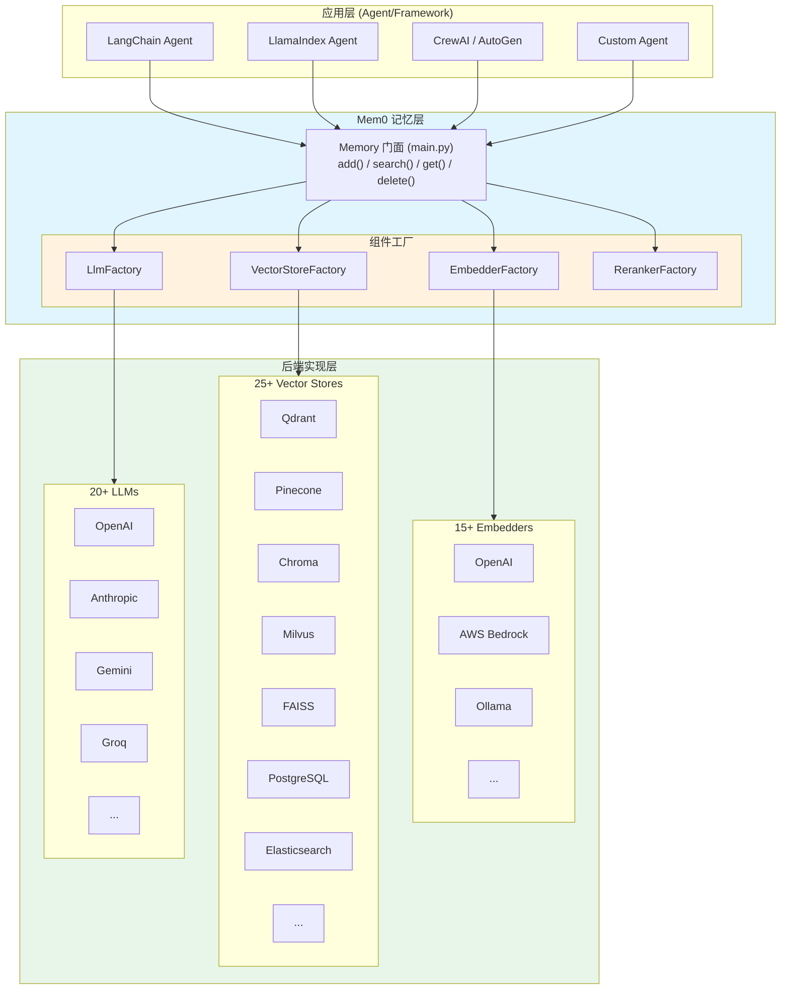
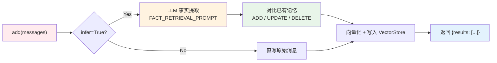

# Mem0 源码深度解析：Universal Memory Layer for AI Agents

> *"Any sufficiently advanced memory is indistinguishable from a living mind."*
>
> Agent 的记忆不应该只是聊天记录的堆砌。它应该像人脑一样：自动提取、结构化存储、按需检索、随时间演化。

---

## 一、引言：Agent 的"记忆困境"

> "我昨天明明告诉过你我不吃香菜，为什么今天的推荐里还有？"
>
> "这个用户上次已经拒绝过这个方案了，别再提了。"

这是每一个开发过 AI Agent 的人都会遇到的痛点。Agent 很聪明，但它们有一个致命弱点：**换 Session 就失忆**。

### 1.1 为什么 RAG 不够？

很多团队的第一反应是："上 RAG 不就行了？把聊天记录向量化，让 Agent 检索。"

但 RAG 解决的是 **"能查到什么"**，而不是：

- ❌ "哪些信息是事实，哪些是闲聊？"
- ❌ "用户现在的偏好和三个月前一样吗？"
- ❌ "这段记忆属于哪个用户、哪个 Agent？"

RAG 是"图书馆"——书在那里，但你需要自己找、自己判断。

**Mem0 做的是"记忆层"**——它自动从对话中提取事实，结构化存储，并在需要时精准注入。

### 1.2 项目概况

[Mem0 (mem0ai)](https://github.com/mem0ai/mem0) 是一个开源的 AI 记忆层项目：

| 指标 | 值 |
|------|-----|
| **Stars** | 62,000+ |
| **协议** | Apache-2.0 |
| **语言** | Python |
| **定位** | Universal Memory Layer for AI Agents |

---

## 二、总体架构：记忆层的三层模型

Mem0 的架构可以概括为 **三层模型**：



### 数据流全景

```
对话消息 (messages)
       ↓
  Memory.add()
       ↓
┌─────────────────────────────────┐
│  LLM 事实提取 (infer=True)       │
│  FACT_RETRIEVAL_PROMPT          │
│  提取事实、偏好、计划              │
└─────────────────────────────────┘
       ↓
┌─────────────────────────────────┐
│  对比已有记忆 (Diff)             │
│  决策：ADD / UPDATE / DELETE     │
└─────────────────────────────────┘
       ↓
┌─────────────────────────────────┐
│  向量化 (Embedder)               │
│  写入向量存储 (VectorStore)      │
└─────────────────────────────────┘
       ↓
返回结果：{"results": [{"id": "...", "memory": "...", "event": "ADD"}]}
```

### 核心模块概览

| 模块 | 源码路径 | 职责 |
|------|---------|------|
| **Memory 门面** | `mem0/memory/main.py` | 统一的 add/search/get/delete 接口 |
| **向量存储** | `mem0/vector_stores/` | 25+ 种向量数据库适配 |
| **嵌入模型** | `mem0/embeddings/` | 15+ 种嵌入模型适配 |
| **LLM 适配** | `mem0/llms/` | 20+ 种 LLM 适配（事实提取） |
| **配置系统** | `mem0/configs/` | Pydantic 配置模型，热插拔 |

---

## 三、Memory 门面深度解析：从对话到记忆的全链路

`Memory` 类（位于 `mem0/memory/main.py`）是整个系统的门面（Facade）。它隐藏了底层向量库、LLM、嵌入模型的复杂性，对外提供简洁的 API。

### 3.1 核心方法清单

| 方法 | 作用 |
|------|------|
| `add()` / `async add()` | 添加记忆（核心入口） |
| `search()` / `async search()` | 语义检索记忆 |
| `get()` | 按 ID 获取单条记忆 |
| `get_all()` / `get_all_async()` | 列出所有记忆 |
| `update()` | 更新记忆内容 |
| `delete()` / `delete_all()` | 删除记忆 |
| `history()` | 获取记忆变更历史 |
| `chat()` | 基于记忆的对话接口 |
| `reset()` | 重置存储 |

### 3.2 add() 方法全链路源码分析

这是 Mem0 的核心。它接收原始对话，自动提取事实并存储。

**方法签名**：
```python
def add(
    self,
    messages,
    *,
    user_id: Optional[str] = None,
    agent_id: Optional[str] = None,
    run_id: Optional[str] = None,
    metadata: Optional[Dict[str, Any]] = None,
    infer: bool = True,
    ...
) -> dict:
```

**关键参数解析**：

| 参数 | 说明 |
|------|------|
| `messages` | 支持 `str` 或 `List[Dict]`（如 `[{"role": "user", "content": "Hi"}]`） |
| `user_id` / `agent_id` / `run_id` | **三元身份隔离**，决定记忆归属 |
| `infer` | `True`：LLM 提取事实；`False`：直写原始消息 |

**处理流程**：



#### 事实提取逻辑（`infer=True`）

当 `infer=True`（默认）时，Mem0 会调用 LLM 提取事实。它使用 `FACT_RETRIEVAL_PROMPT`，要求 LLM 从对话中提取结构化信息：

1. **个人偏好**（喜欢吃香菜、偏好 Python 等）
2. **重要个人信息**（姓名、职业、关系等）
3. **计划和意图**（下周去北京、目标减肥等）
4. **活动偏好**（喜欢登山、常去星巴克等）
5. **健康偏好**（乳糖不耐、失眠等）
6. **职业信息**（职位、工作习惯等）

LLM 返回 JSON 格式的事实列表，例如：
```json
{"facts": ["用户不喜欢吃香菜", "用户计划下周去北京出差"]}
```

#### 增量更新决策

Mem0 不会简单追加所有事实。它会对比已有记忆，决定：
- **ADD**：全新事实
- **UPDATE**：已有事实的新版本（如"计划去北京" → "计划下个月去上海"）
- **DELETE**：已失效的事实

### 3.3 search() 方法源码分析

```python
def search(
    self,
    query: str,
    *,
    top_k: int = 20,
    filters: Optional[Dict[str, Any]] = None,
    threshold: float = 0.1,
    rerank: bool = False,
    ...
) -> dict:
```

**关键参数**：

| 参数 | 说明 |
|------|------|
| `query` | 检索查询（如"我上次说了什么关于旅行的"） |
| `top_k` | 返回结果数量（默认 20） |
| `filters` | 过滤条件（`{"user_id": "u1", "agent_id": "a1"}`） |
| `threshold` | 最低相似度阈值（默认 0.1） |
| `rerank` | 是否启用重排序（默认 False） |

**检索流程**：
1. 查询向量化（调用 Embedder）
2. 向量数据库检索（调用 VectorStore）
3. 应用 `filters` 和 `threshold` 过滤
4. 可选 Reranker 重排序
5. 返回格式化结果

### 3.4 实体身份隔离机制

Mem0 设计了严格的身份隔离，防止元数据污染身份字段：

```python
# mem0/memory/main.py
_IDENTITY_KEYS = {"user_id", "agent_id", "run_id", "actor_id"}

def _strip_identity_keys(metadata, existing_payload, ...):
    """防止调用者通过 metadata 设置身份字段"""
    clean = {}
    for key, value in metadata.items():
        if key not in _IDENTITY_KEYS:
            clean[key] = value
        elif value != existing_payload.get(key):
            logger.warning(f"ignoring metadata[{key}]...")
    return clean
```

这是**应用层的安全约束**，确保身份字段只能通过参数设置，不能通过元数据绕过。

---

## 四、向量存储层：25+ 种后端统一抽象

Mem0 支持 **25+ 种**向量数据库后端，全部通过 `VectorStoreBase` 抽象接口统一。

### 4.1 VectorStoreBase 抽象接口

位于 `mem0/vector_stores/base.py`：

```python
class VectorStoreBase(ABC):
    @abstractmethod
    def create_col(self, name, vector_size, distance):
        """Create a new collection."""
        pass

    @abstractmethod
    def insert(self, vectors, payloads=None, ids=None):
        """Insert vectors into a collection."""
        pass

    @abstractmethod
    def search(self, query, vectors, top_k=5, filters=None):
        """Search for similar vectors.
        注意：所有实现必须返回相似度分数，分数越高表示越相似（范围 [0, 1]）。
        使用距离度量的实现必须转换：
        - Cosine distance: score = max(0.0, 1.0 - distance)
        - L2 distance: score = 1.0 / (1.0 + distance)
        """
        pass

    @abstractmethod
    def delete(self, vector_id):
        """Delete a vector by ID."""
        pass

    @abstractmethod
    def update(self, vector_id, vector=None, payload=None):
        """Update a vector and its payload."""
        pass
    
    @abstractmethod
    def list(self, filters=None, top_k=None):
        """List all memories."""
        pass
```

**统一评分规范**是 Mem0 设计的一大亮点：无论底层向量库用什么距离度量（Cosine、L2、Inner Product），上层看到的都是统一的 `score ∈ [0, 1]`。

### 4.2 后端矩阵对比

| 后端 | 类型 | 源码文件 | 适用场景 |
|------|------|---------|---------|
| **Qdrant** | 向量数据库 | `qdrant.py` | 默认后端，过滤+向量混合检索 |
| **Pinecone** | 托管向量库 | `pinecone.py` | Serverless，适合生产环境 |
| **Chroma** | 本地/嵌入式 | `chroma.py` | 开发友好，零配置 |
| **Milvus** | 分布式向量库 | `milvus.py` | 大规模生产场景 |
| **FAISS** | 本地内存 | `faiss.py` | 超快检索，无持久化 |
| **Redis** | 内存数据库 | `redis.py` | 缓存+向量一体化 |
| **PostgreSQL** | 关系数据库 | `pgvector.py` | 已有 PG 基础设施 |
| **Elasticsearch** | 搜索引擎 | `elasticsearch.py` | 全文+向量混合搜索 |
| **Weaviate** | 向量数据库 | `weaviate.py` | 知识图谱集成 |
| **MongoDB** | 文档数据库 | `mongodb.py` | 已有 Mongo 基础设施 |
| **Azure AI Search** | 云服务 | `azure_ai_search.py` | Azure 生态 |
| **OpenSearch** | 搜索引擎 | `opensearch.py` | AWS 生态 |

### 4.3 工厂模式源码

`VectorStoreFactory` 负责动态加载后端：

```python
# mem0/utils/factory.py
class VectorStoreFactory:
    _providers = {}
    
    @classmethod
    def register(cls, name, provider_class):
        cls._providers[name] = provider_class
    
    @classmethod
    def create(cls, provider, config):
        if provider not in cls._providers:
            raise ValueError(f"Unknown vector store provider: {provider}")
        return cls._providers[provider](config)
```

切换向量库只需改配置：
```python
# 从 Qdrant 切换到 Chroma
config = {"vector_store": {"provider": "chroma", "config": {"collection_name": "my_memories"}}}
m = Memory.from_config(config)
```

---

## 五、LLM 与 Embedding 适配层：插件化设计

### 5.1 Embedding 适配矩阵（15+ 种）

| Embedder | 源码文件 | 特点 |
|----------|---------|------|
| **OpenAI** | `openai.py` | 默认，text-embedding-3-small/large |
| **AWS Bedrock** | `aws_bedrock.py` | Titan 嵌入模型 |
| **Ollama** | `ollama.py` | 开源模型本地部署 |
| **Gemini** | `gemini.py` | Google 嵌入 |
| **HuggingFace** | `huggingface.py` | 开源嵌入模型 |
| **FastEmbed** | `fastembed.py` | 超快轻量嵌入（Qdrant 出品） |
| **Azure OpenAI** | `azure_openai.py` | 企业合规 |

### 5.2 LLM 适配矩阵（20+ 种，事实提取引擎）

| LLM | 源码文件 | 特点 |
|-----|---------|------|
| **OpenAI** | `openai.py` | 默认事实提取，gpt-4o-mini/3.5 |
| **Anthropic** | `anthropic.py` | Claude 事实提取 |
| **Gemini** | `gemini.py` | Google 事实提取 |
| **Groq** | `groq.py` | 高速提取（Llama 等） |
| **Ollama** | `ollama.py` | 本地开源模型 |
| **LiteLLM** | `litellm.py` | 统一多厂商接口 |
| **vLLM** | `vllm.py` | 本地高性能推理 |

### 5.3 插件化架构优势

```
切换 LLM/Embedder 只需改配置，代码零修改
```

这种设计让 Mem0 具备极强的**环境适应性**：
- 企业内网：用 Ollama + Qdrant（全本地）
- 云端生产：用 OpenAI + Pinecone（全托管）
- 混合部署：用 Groq 提取 + Chroma 存储（性价比）

---

## 六、核心 Prompt 深度解析：记忆提取的"大脑"

Mem0 的"智能"很大程度上来自精心设计的 Prompt。位于 `mem0/configs/prompts.py`。

### 6.1 FACT_RETRIEVAL_PROMPT（事实提取）

这是 Mem0 的核心 Prompt，指导 LLM 从对话中提取结构化事实：

```python
FACT_RETRIEVAL_PROMPT = """
You are a Personal Information Organizer, specialized in accurately storing facts, 
user memories, and preferences...

Types of Information to Remember:
1. Store Personal Preferences: Likes, dislikes, specific preferences...
2. Maintain Important Personal Details: Names, relationships, important dates...
3. Track Plans and Intentions: Upcoming events, trips, goals...
4. Remember Activity and Service Preferences: Dining, travel, hobbies...
5. Monitor Health and Wellness Preferences: Dietary restrictions, fitness...
6. Store Professional Details: Job titles, work habits, career goals...
7. Miscellaneous Information Management: Favorite books, movies, brands...

Few-shot examples:
Input: Hi, my name is John. I am a software engineer.
Output: {"facts" : ["Name is John", "Is a Software engineer"]}

Input: Me favourite movies are Inception and Interstellar.
Output: {"facts" : ["Favourite movies are Inception and Interstellar"]}
"""
```

**设计亮点**：
1. **七类记忆分类**：确保 LLM 全面捕捉各类信息，不遗漏
2. **Few-shot 示例**：明确输出格式（JSON），过滤无关信息（如"树有树枝"这类常识不记录）
3. **JSON 约束**：强制结构化输出，方便后续处理

### 6.2 MEMORY_ANSWER_PROMPT（记忆问答）

当 Agent 需要基于记忆回答问题时：

```python
MEMORY_ANSWER_PROMPT = """
You are an expert at answering questions based on the provided memories...
- Extract relevant information from the memories based on the question.
- If no relevant information is found, make sure you don't say no information is found. 
  Instead, accept the question and provide a general response.
"""
```

**降级策略**：当记忆中没有答案时，不要说"找不到信息"，而是给出通用回答。这提升了用户体验。

### 6.3 Procedural Memory（程序记忆）

与事实记忆不同，程序记忆是**"如何做"**的知识：

```python
PROCEDURAL_MEMORY_SYSTEM_PROMPT = """
You are an expert at creating procedural memories - instructions for how to do things...
"""
```

例如："如何使用公司内部的 CLI 工具部署服务"，这类知识更适合用程序记忆存储。

---

## 七、配置系统：Pydantic 驱动的热插拔架构

Mem0 的配置系统基于 Pydantic，类型安全且支持热插拔。

### 7.1 MemoryConfig 配置模型

位于 `mem0/configs/base.py`：

```python
class MemoryConfig(BaseModel):
    vector_store: VectorStoreConfig = Field(
        description="Configuration for the vector store",
        default_factory=VectorStoreConfig,
    )
    llm: LlmConfig = Field(
        description="Configuration for the language model",
        default_factory=LlmConfig,
    )
    embedder: EmbedderConfig = Field(
        description="Configuration for the embedding model",
        default_factory=EmbedderConfig,
    )
    history_db_path: str = Field(
        description="Path to the history database",
        default=os.path.join(mem0_dir, "history.db"),
    )
    reranker: Optional[RerankerConfig] = Field(
        description="Configuration for the reranker",
        default=None,
    )
    custom_instructions: Optional[str] = Field(
        description="Custom instructions for fact extraction",
        default=None,
    )
```

### 7.2 零配置 vs 生产配置

**最小配置（零配置启动）**：
```python
from mem0 import Memory
m = Memory()  # 使用默认 Qdrant + OpenAI + OpenAI Embedding
```

**生产完整配置**：
```python
config = {
    "vector_store": {
        "provider": "qdrant",
        "config": {
            "host": "localhost",
            "port": 6333,
            "collection_name": "my_memories"
        }
    },
    "llm": {
        "provider": "openai",
        "config": {
            "model": "gpt-4o-mini",
            "temperature": 0.1
        }
    },
    "embedder": {
        "provider": "openai",
        "config": {
            "model": "text-embedding-3-small"
        }
    },
    "custom_instructions": "只记录与软件开发相关的偏好。"
}
m = Memory.from_config(config)
```

---

## 八、高级特性源码分析

### 8.1 Reranker 重排序

```python
def search(self, query, ..., rerank: bool = False, ...):
```

当 `rerank=True` 时，Mem0 会调用 Reranker 对 top_k 结果进行精排。

**RerankerFactory** 位于 `mem0/utils/factory.py`，支持多种重排序模型。适用于对精度要求高的场景，但会增加延迟。

### 8.2 记忆版本与历史

Mem0 记录每次记忆的变更历史，通过 SQLite `history.db` 存储：

```python
def history(self, memory_id: str) -> list:
    """Get the history of changes for a memory by ID."""
```

每次 `UPDATE` 或 `DELETE` 都会记录变更时间、旧值、新值。这对于**审计和回溯**非常有用。

### 8.3 安全设计

| 机制 | 源码位置 | 作用 |
|------|---------|------|
| **敏感字段脱敏** | `_SENSITIVE_FIELDS_EXACT` | 自动过滤 `api_key`, `password` 等 |
| **运行时对象保护** | `_RUNTIME_FIELDS` | 保护 `auth`, `connection_class` 等非序列化对象 |
| **身份隔离** | `_IDENTITY_KEYS` | 防止元数据污染 `user_id` 等身份字段 |

### 8.4 Telemetry 遥测

`mem0.memory.telemetry` 模块捕获匿名使用统计：
- `add` 调用次数
- `search` 调用次数
- `delete` 调用次数

保护隐私：不上传具体记忆内容，仅统计操作频率。

---

## 九、与其他记忆方案的对比分析

| 维度 | 原生 Session History | RAG | Mem0 |
|------|---------------------|-----|------|
| **自动提取** | — | — | ✅ LLM 自动提取事实 |
| **结构化存储** | 线性堆叠 | 文档切片 | ✅ 结构化事实记忆 |
| **增量更新** | — | 重新索引 | ✅ ADD/UPDATE/DELETE 自动决策 |
| **语义检索** | — | ✅ | ✅ |
| **身份隔离** | Session 级 | 元数据过滤 | ✅ user_id/agent_id/run_id 三元隔离 |
| **记忆演化** | — | — | ✅ 历史追踪 |
| **多后端支持** | — | 依赖 RAG 框架 | ✅ 25+ 向量库 + 15+ 嵌入 + 20+ LLM |
| **可执行记忆** | — | — | ❌ （TencentDB Agent Memory 有 Skill） |

**Mem0 的核心优势**在于：
1. **自动事实提取**：不需要手动整理记忆，LLM 自动从对话中提取
2. **增量更新决策**：自动判断 ADD/UPDATE/DELETE，保持记忆新鲜
3. **插件化架构**：几乎支持所有主流向量库和 LLM

**Mem0 的不足**在于：
1. 没有 Skill/SOP 记忆（不像 TencentDB Agent Memory 有可执行经验沉淀）
2. 没有代码影响分析（CodeGraph）
3. 依赖 LLM 提取，有成本和延迟开销

---

## 十、源码中的关键设计模式总结

### 1. Factory 模式
`EmbedderFactory` / `VectorStoreFactory` / `LlmFactory` 统一接口，插件化后端。切换后端只需改配置，不改代码。

### 2. Facade 模式
`Memory` 类统一 `add/search/get/delete` 接口，隐藏底层向量库、LLM、嵌入模型的复杂性。

### 3. 策略模式
`infer=True`（LLM 提取事实）vs `infer=False`（直写原始消息），根据场景选择不同策略。

### 4. BaseModel 配置驱动
Pydantic 模型热插拔，类型安全，支持零配置启动和生产调优。

### 5. 安全脱敏
敏感字段自动过滤，身份隔离防污染，`_IDENTITY_KEYS` 硬约束。

### 6. 统一评分规范
所有向量库返回 `score ∈ [0, 1]`，距离度量自动转换，上层无感知。

---

## 总结

> *"Memory is not a log of conversations. It's a living, evolving representation of knowledge."*

Mem0 的核心理念是：**记忆不是聊天记录，而是自动提取、结构化存储、按需检索的知识层**。

### 架构亮点回顾

| 亮点 | 价值 |
|------|------|
| **三层模型** | Memory → Factory → Backend，清晰解耦 |
| **LLM 自动提取** | 从对话中自动提取事实，不需要人工整理 |
| **ADD/UPDATE/DELETE 决策** | 自动维护记忆新鲜度，避免过期信息干扰 |
| **25+ 向量库支持** | 适配几乎所有主流向量数据库 |
| **插件化架构** | 切换 LLM/Embedder/VectorStore 只需改配置 |
| **统一评分规范** | 所有后端返回统一 score，上层无感知 |

### 最佳实践清单

1. **选型建议**：
   - 开发测试：Chroma + Ollama（全本地，零成本）
   - 小规模生产：Qdrant + OpenAI（默认配置）
   - 大规模生产：Pinecone/Milvus + Groq（高性能）
2. **成本控制**：事实提取用便宜模型（gpt-4o-mini / Claude Haiku）
3. **自定义指令**：通过 `custom_instructions` 限制提取范围（如"只记录技术偏好"）
4. **身份隔离**：严格使用 `user_id` / `agent_id` 隔离不同用户/Agent 的记忆
5. **定期清理**：使用 `delete_all()` 清理过期或无效记忆

### 未来展望

- **Temporal Memory**：时间维度记忆（如"用户**曾经**喜欢 X，但现在喜欢 Y"）
- **Entity Graph**：实体关系图（人、地点、事件的关联）
- **Multi-Agent 记忆共享**：跨 Agent 的记忆隔离与共享策略
- **Skill 记忆**：可执行的 SOP 记忆（类似 TencentDB Agent Memory 的 Skill）

---

## 参考文章

1. **Mem0 官方仓库**  
   https://github.com/mem0ai/mem0

2. **Memory 门面源码**  
   `mem0/memory/main.py`

3. **向量存储抽象接口**  
   `mem0/vector_stores/base.py`

4. **核心 Prompt 定义**  
   `mem0/configs/prompts.py`

5. **配置系统定义**  
   `mem0/configs/base.py`

6. **组件工厂实现**  
   `mem0/utils/factory.py`

7. **安全脱敏机制**  
   `mem0/memory/main.py` (`_SENSITIVE_FIELDS_EXACT`, `_IDENTITY_KEYS`)

8. **Embedder 适配层**  
   `mem0/embeddings/openai.py`, `mem0/embeddings/ollama.py`

9. **LLM 适配层**  
   `mem0/llms/openai.py`, `mem0/llms/anthropic.py`

10. **Telemetry 遥测模块**  
    `mem0/memory/telemetry.py`

---

*本文由小伟整理，源码基于 Mem0 (mem0ai/mem0) 公开仓库分析，截至 2026 年 8 月。*
