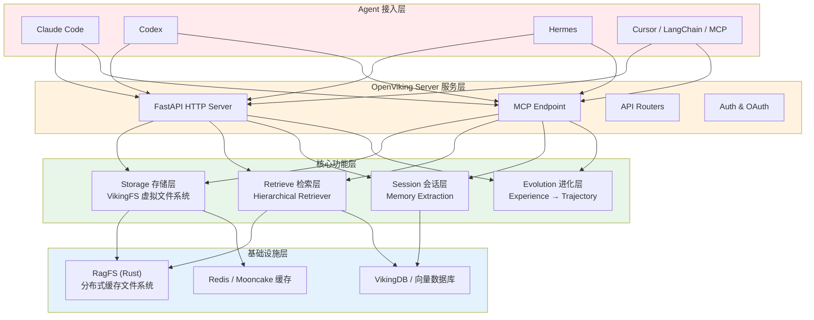
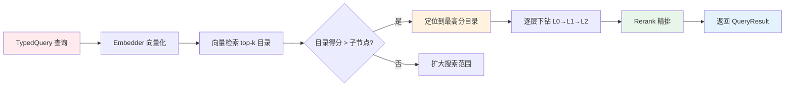
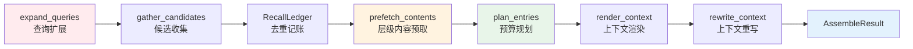
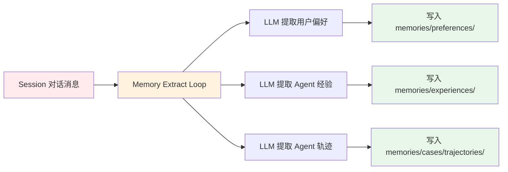
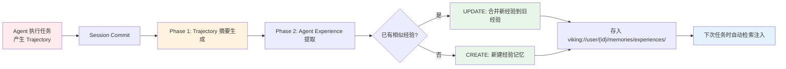

# OpenViking 源码深度解析：The Context Database for AI Agents

> *"Any sufficiently advanced context is indistinguishable from a living mind."*
>
> Agent 的上下文不应该是一堆塞进 prompt 的碎片。它应该像一个有生命力的文件系统：可浏览、可追溯、按需加载、自我进化。

---

## 一、引言：Agent 的"上下文困境"

> "我上次明明告诉过你我不吃香菜，为什么今天的推荐里还有？"
>
> "这个用户的历史对话已经 50 轮了，全塞进 context 窗口又贵又慢，不塞又丢失关键信息。"

这是每一个开发过 AI Agent 的人都会遇到的痛点。Agent 需要**海量上下文**——用户偏好、项目文档、代码结构、操作经验——但面临一个根本矛盾：

- **上下文窗口有限**：全塞进去 token 成本高、注意力分散
- **RAG 碎片化**：向量检索丢失文档结构关系，结果孤立无援
- **记忆无演化**：Agent 每次对话都是"零状态"，不会从经验中学习

### 1.1 为什么 OpenViking 不同？

OpenViking 提出了一个**范式级别的转变**：

> 不要用"黑盒向量存储"管理 Agent 上下文，而是用 **`viking://` 虚拟文件系统**——Agent 通过 `ls`/`tree`/`find` 浏览自己的上下文，像开发者操作文件一样确定性地定位知识。

### 1.2 项目概况

[OpenViking (volcengine/OpenViking)](https://github.com/volcengine/OpenViking) 是火山引擎开源的 AI Agent 上下文数据库：

| 指标 | 值 |
|------|-----|
| **Stars** | 28,000+ |
| **协议** | AGPLv3 |
| **语言** | Python + Rust |
| **定位** | Self-evolving Context Database for AI Agents |
| **学术背书** | VikingMem 论文被 **VLDB 2026** 接收 |

### 1.3 核心创新一句话

> **统一文件系统（viking://） + 三层按需加载（L0/L1/L2） + 层级检索 + 自我进化 = 一个会成长的 Agent 上下文操作系统。**

---

## 二、总体架构：统一上下文数据库

### 2.1 架构总览

OpenViking 的架构可以用一张图来概括：



### 2.2 `viking://` 虚拟文件系统

OpenViking 最核心的创新是 **`viking://` URI 协议**。所有上下文——记忆、资源、Skill、会话——都统一在一个虚拟文件系统中：

```
viking://
├── resources/              # 资源：项目文档、代码库、网页等
│   └── my_project/
│       ├── docs/
│       │   ├── api/
│       │   └── tutorials/
│       └── src/
└── user/
    └── {user_id}/
        ├── memories/
        │   └── preferences/
        │       ├── writing_style
        │       └── coding_habits
        ├── resources/
        │   └── private_project/
        ├── skills/
        │   ├── search_code
        │   └── analyze_data
        └── peers/
            └── web-visitor-alice/
```

Agent 可以通过标准的文件操作访问上下文：
- `ov ls viking://resources/` — 列出资源
- `ov tree viking://resources/project -L 2` — 查看目录树
- `ov find "what is openviking"` — 语义搜索

### 2.3 L0/L1/L2 三层上下文模型

这是 OpenViking 节省 token 的核心机制。**每个文件和目录都有三层表示**：

| 层级 | 名称 | 大小 | 用途 | 对应文件 |
|------|------|------|------|---------|
| **L0** | Abstract（摘要） | ~100 tokens | 快速相关性判断 | `.abstract.md` |
| **L1** | Overview（概览） | ~2K tokens | 结构规划和场景理解 | `.overview.md` |
| **L2** | Details（详情） | 完整原文 | 按需加载，只在需要时读取 | 原文件本身 |

```
viking://resources/my_project/
├── .abstract               # L0: ~100 tokens - 一句话摘要
├── .overview               # L1: ~2K tokens - 结构+核心要点
└── docs/
    ├── .abstract
    ├── .overview
    └── api/
        ├── auth.md         # L2: 完整内容，按需加载
        └── endpoints.md
```

**设计哲学**：永远不要一次性把全文塞进 context。先读摘要判断相关性，再读概览了解结构，最后才按需读取细节。这就像人类阅读文档的方式——先看标题和摘要，再决定要不要读全文。

---

## 三、Storage 层：VikingFS 虚拟文件系统

### 3.1 VikingFS 核心抽象

`VikingFS` 类（`openviking/storage/viking_fs.py`）是整个存储层的核心 Facade。它封装了 AGFS（Agent Graph File System）绑定客户端，提供基于 Viking URI 的文件操作。

**核心职责**：

| 职责 | 说明 |
|------|------|
| **URI 转换** | `viking://` ↔ 内部路径的双向转换 |
| **L0/L1 读取** | 读取 `.abstract.md` 和 `.overview.md` |
| **关系管理** | 维护 `.relations.json` 文件关系图 |
| **语义搜索** | 向量检索 + Rerank 混合搜索 |
| **向量同步** | 文件删除/移动时同步向量存储 |

**源码分析**（`viking_fs.py`）：

```python
class VikingFS:
    """OpenViking file system abstraction layer.
    
    Encapsulates the AGFS binding client, providing file operation
    interface based on Viking URI.
    """
    
    # 关键方法
    # ls() / tree() / read() / write() / search() / rm() / mv()
```

### 3.2 内容写入管道（Content Write）

写入文件时，OpenViking 自动触发 L0/L1 摘要生成：

```
写入文件 → 触发 L0/L1 生成 → 向量化 → 全文索引 → 关系提取 → 完成
```

- `storage/content_write.py`：写入流程编排
- L0/L1 生成使用 LLM 异步处理，不阻塞写入
- 向量化 + 全文索引（BM25）同步更新

### 3.3 事务系统与观察者模式

- `storage/transaction/`：保证写入、索引、关系更新的原子性
- `storage/observers/`：观察者模式监听文件系统事件
  - 文件创建 → 触发索引
  - 文件删除 → 清理向量
  - 文件修改 → 重新生成摘要

### 3.4 向量存储适配

`storage/vectordb/` + `storage/vectordb_adapters/` 提供统一的向量存储接口 `VikingDBManager`，支持多种向量数据库后端。

---

## 四、Retrieve 层：意图驱动的层级检索

### 4.1 HierarchicalRetriever（层级检索器）

这是 OpenViking 检索的**核心引擎**，位于 `openviking/retrieve/hierarchical_retriever.py`。

**检索流程**：



**核心参数**（源码常量）：

| 参数 | 值 | 含义 |
|------|-----|------|
| `MAX_CONVERGENCE_ROUNDS` | 3 | 多次轮次得分不变则停止 |
| `DIRECTORY_DOMINANCE_RATIO` | 1.2 | 目录得分必须超过子节点 1.2 倍才算"主导" |
| `GLOBAL_SEARCH_TOPK` | 10 | 全局检索候选数 |
| `MAX_PARALLEL_CHILD_SEARCHES` | 4 | 并行子节点搜索上限 |

**评分传播算法**：

```python
# hierarchical_retriever.py
self.hotness_alpha = self.retrieval_config.hotness_alpha  # 热度衰减系数
self.score_propagation_alpha = self.retrieval_config.score_propagation_alpha  # 分数传播系数
```

分数不仅计算当前节点，还会向父目录和子节点传播，确保**相关上下文完整保留**。

### 4.2 Context Assembler Pipeline（上下文组装管道）

这是**单次请求的完整流水线**，位于 `openviking/retrieve/context_assembler/`：



**管道各模块职责**：

| 模块 | 源码文件 | 作用 |
|------|---------|------|
| **expand_queries** | `expansion.py` | 查询改写与意图分析，扩展同义词和相关查询 |
| **gather_candidates** | `gather.py` | 从向量库收集候选节点 |
| **RecallLedger** | `ledger.py` | 跨轮次去重记账，避免重复注入 |
| **prefetch_contents** | `tiers.py` | 按需预取 L0/L1/L2 内容 |
| **plan_entries** | `budget.py` | token 预算分配（per_entry_cap） |
| **render_context** | `render.py` | 渲染为 Agent 可读格式 |
| **rewrite_context** | `rewrite.py` | 上下文重写优化 |

**pipeline.py** 中的 `assemble_context()` 函数在一次 HTTP 请求中完成全链路：

```python
# retrieve/context_assembler/pipeline.py
async def assemble_context(*, service, ctx, params) -> AssembleResult:
    """Run the full assembly pipeline for one request."""
    # expand → gather → dedup → prefetch → budget → render → rewrite
```

### 4.3 记忆生命周期与热度衰减

`retrieve/memory_lifecycle.py` 中的 `hotness_score` 函数实现了**记忆热度衰减算法**：

```python
def hotness_score(
    created_at: float,
    last_accessed_at: float,
    access_count: int,
    alpha: float  # 衰减系数
) -> float:
    """计算记忆热度分数：新记忆 + 高频访问 → 高分"""
```

这个算法确保**常用的、新的记忆优先被检索到**，而陈旧的、低频的记忆自然降级。

---

## 五、Session 层：会话即记忆

### 5.1 Session 管理

`openviking/session/session.py` 是整个会话管理的核心：

> **Session as Context: Sessions integrated into L0/L1/L2 system.**

**核心组件**：

| 组件 | 源码 | 作用 |
|------|------|------|
| **Session 类** | `session.py` | 会话上下文管理 |
| **SessionCompressor v2/v3** | `compressor_v2.py`, `compressor_v3.py` | 会话压缩（保留关键信息，丢弃冗余） |
| **Retention** | `retention.py` | 保留策略与 token 预算分配 |
| **AutoCommitPolicy** | `auto_commit_policy.py` | 自动提交策略 |

**Token 预算分配**（`retention.py`）：

```python
def plan_retention(session, budget) -> RetentionPlan:
    """根据预算规划保留哪些消息、压缩哪些消息"""
```

### 5.2 记忆提取流水线



**核心源码文件**：

| 模块 | 路径 | 作用 |
|------|------|------|
| **ExtractContextProvider** | `session/memory/core.py` | 抽象接口，定义提取协议 |
| **Extract Loop** | `session/memory/extract_loop.py` | 提取循环：遍历消息 → LLM 提取 → 入库 |
| **Memory Updater** | `session/memory/memory_updater.py` | 记忆更新器 |
| **Streaming Updater** | `session/memory/streaming_memory_updater.py` | 流式记忆更新（低延迟） |
| **Memory Isolation** | `session/memory/memory_isolation_handler.py` | 用户/Agent 维度隔离 |
| **Memory Type Registry** | `session/memory/memory_type_registry.py` | 记忆类型注册表 |

**提取流程**：

1. Session Commit 触发提取
2. `ExtractLoop` 按类型（用户偏好 / Agent 经验 / Agent 轨迹）分别处理
3. 每个类型通过对应的 `ContextProvider` 准备提取上下文
4. LLM 执行提取，返回结构化数据
5. `MemoryUpdater` 写入 VikingFS

### 5.3 Skill 管理

- `core/skill_loader.py`：解析 `SKILL.md` 文件（frontmatter + body）
- `session/skill/dedup.py`：Skill 去重（避免重复提取）
- `session/skill/skill_operation_updater.py`：Skill 操作更新

**SKILL.md 格式**：

```markdown
---
name: search_code
description: Search and navigate codebase
allowed-tools: Bash(grep), Bash(find)
---

# How to search this codebase
1. Use grep for exact matches
2. Use find for file discovery
...
```

### 5.4 工具结果摘要（Tool Result Synopsis）

`session/tool_result_synopsis.py`：将 Agent 工具调用的结果自动压缩为摘要，节省上下文空间。

```python
def generate_tool_result_synopsis(result: str, max_tokens: int = 200) -> str:
    """生成工具调用结果的摘要，保留关键信息"""
```

---

## 六、自我进化（Agent Evolution）：从"执行者"到"进化者"

> *"A tool that learns is more powerful than a tool that merely acts."*

这是 OpenViking **最具前瞻性的设计**——Agent 不仅执行任务，还能**从任务经验中提炼知识，持续进化**。

### 6.1 进化架构总览



### 6.2 两阶段经验提取

OpenViking 采用**两阶段经验提取**机制：

| 阶段 | 源码 | 作用 |
|------|------|------|
| **Phase 1** | `session/memory/extract_loop.py` | 从会话消息中提取 Trajectory（任务执行轨迹摘要） |
| **Phase 2** | `session/memory/agent_experience_context_provider.py` | 基于 Trajectory 摘要，提炼 Agent Experience（可复用经验） |

#### Phase 2 详细流程

`AgentExperienceContextProvider` 的核心逻辑：

1. 给定新的 Trajectory 摘要
2. 向量检索 top-5 相似已有经验
3. 加载 top-3 候选经验的 source_trajectories 作为 grounding 材料
4. LLM 决策：**UPDATE（合并） / CREATE（新建） / SKIP（跳过）**
5. 无 Tool Call——所有上下文预取完成，纯 Prompt 决策

```python
# openviking/session/memory/agent_experience_context_provider.py
SEARCH_TOP_K = 5          # 检索 top-5 候选经验
SOURCE_TRAJ_TOP_K = 3     # 仅加载 top-3 的 source_trajectories
MAX_SOURCE_TRAJS = 3      # 每个经验最多加载 3 条源轨迹
```

### 6.3 Experience Lineage（经验谱系）

`session/memory/experience_lineage.py` 实现了完整的**经验谱系追溯**：

- 每个经验记录**来源于哪些 Trajectory**
- 标签系统：`experience_source_tag()` 生成精确检索标签
- 轨迹结果分类：

```python
TRAJECTORY_OUTCOMES = ("success", "failure", "partial", "unknown", "unfinished")
```

这使得 Agent 可以**追溯某条经验是从哪些成功或失败的任务中提炼出来的**，而不是凭空产生。

### 6.4 Merge Operation（合并操作）

`session/memory/merge_op/` 提供 5 种合并策略：

| 策略 | 源码 | 作用 |
|------|------|------|
| **replace** | `replace.py` | 用新内容完全替换旧内容 |
| **patch** | `patch.py` | 增量补丁式更新 |
| **link_merge** | `link_merge.py` | 链接关联式合并 |
| **sum** | `sum.py` | 聚合式合并 |
| **immutable** | `immutable.py` | 不可变写入（新建） |

**工厂模式**（`merge_op/factory.py`）根据配置动态选择合并策略。

### 6.5 Agent Evolution Service

`service/agent_evolution_service.py` 提供进化查询服务：

- `list_trajectories_by_experience()`：按经验查询所有来源轨迹
- 支持按时间范围、结果分类（成功/失败）过滤
- 用于**进化可视化**：让用户看到 Agent 是如何从失败中学到经验的

### 6.6 Agent Evolution Config

`server/agent_evolution_config.py`：`AgentEvolutionConfigProvider` 提供账户级进化配置管理，支持按账户开关进化功能。

### 6.7 Session Train（训练引擎）

`session/train/` 将 Agent 经验转化为**可训练数据**：

| 模块 | 作用 |
|------|------|
| `engine.py` | 训练引擎核心 |
| `pipeline.py` | 训练流水线 |
| `batch_runner.py` | 批量训练执行器 |
| `gradients.py` | 梯度/反馈信号处理 |
| `components/` | 训练组件 |

**设计理念**：将 Agent 的成功/失败经验转化为 Fine-tuning 数据，形成**经验 → 数据 → 模型优化**的闭环。

### 6.8 自我进化的完整闭环

```
执行任务 → 产生 Trajectory → 提取 Experience → 合并/创建经验
    ↓                                              ↑
检索经验 ← 下次任务 ←────────────────────────── 经验沉淀
    ↓
执行得更好 → 新的 Trajectory → 进一步优化经验
```

这是一个**正反馈循环**：Agent 每次执行都产生新的经验数据，经验被提炼后存储，下次执行时自动注入，不断提升任务成功率。

### 6.9 Benchmark 数据佐证

根据官方 Benchmark 报告：

| 指标 | 无 OpenViking | 有 OpenViking | 提升 |
|------|--------------|---------------|------|
| **LoCoMo 用户记忆准确率** | 24-57% | **80-83%** | +23-59pp |
| **tau2-bench Retail 任务成功率** | 70.94% | **77.81%** | +6.87pp |
| **tau2-bench Airline 任务成功率** | 54.38% | **66.25%** | +11.87pp |
| **输入 Token 消耗** | 100% | **8.9-65.7%** | 降低 34.3-91.0% |
| **查询延迟** | 100% | **33.9-41.6%** | 降低 58.45-66.10% |

---

## 七、Ingest 层：数据摄取与同步

### 7.1 Ingest Orchestrator

`openviking/ingest/orchestrator.py`：`IngestOrchestrator` 类负责**增量回灌已有会话**：

```python
class IngestOrchestrator:
    async def backfill_source(self, name, harness_cfg, *, dry_run=False):
        """增量回灌指定数据源的会话历史"""
```

### 7.2 多数据源适配

`ingest/sources/` 支持多数据源：

| 数据源 | 说明 |
|--------|------|
| **Claude Code** | Claude Code 会话日志 |
| **Codex** | OpenAI Codex 会话 |
| **Cursor** | Cursor IDE 会话 |
| **Custom** | 自定义数据源 |

- `ingest/poller.py`：增量 watch 模式（轮询新会话）
- `ingest/replay.py`：会话回放（历史数据全量导入）

### 7.3 资源 Watch 管理

- `resource/watch_manager.py`：Git Watch、Feishu Watch 等
- `resource/processing_mode.py`：处理模式控制（实时 / 批处理）
- `resource/watch_scheduler.py`：调度任务

---

## 八、Server 层：HTTP 服务与 Agent 集成

### 8.1 服务启动与引导

- `server/bootstrap.py`：服务启动流程
- `server/app.py`：FastAPI 应用
- `server/config.py`：配置加载（`ov.conf`）

### 8.2 MCP Endpoint

`server/mcp_endpoint.py`：MCP 协议支持

Agent 通过 MCP 调用 OpenViking 的检索和写入能力：
- `tools/list`：发现可用工具
- `tools/call`：调用检索/写入工具

### 8.3 API 路由

- `server/routers/`：RESTful API 路由
- `server/auth/`、`server/oauth/`：认证与鉴权
- `server/api_keys/`：API Keys 管理
- `server/openviking_assets.py`：静态资源服务

---

## 九、RagFS：Rust 实现的分布式缓存文件系统

### 9.1 为什么用 Rust？

OpenViking 的文件系统底层（RagFS）使用 **Rust 实现**，原因有三：

1. **高性能 I/O**：文件读写、目录遍历、缓存命中——Rust 的零成本抽象比 Python 快 10-100 倍
2. **低延迟缓存**：毫秒级缓存命中，不阻塞 Agent 请求
3. **内存安全**：Rust 的所有权系统保证并发安全

### 9.2 RagFS 架构

| Crate | 作用 |
|-------|------|
| **`ragfs/`** | 核心文件系统实现 |
| **`ragfs-cache-redis/`** | Redis 缓存后端 |
| **`ragfs-cache-mooncake/`** | Mooncake 分布式缓存 |
| **`ragfs-cache-yuanrong/`** | YuanRong 缓存 |
| **`ragfs-python-native/`** | Python Native 绑定（PyO3） |
| **`ragfs-python/`** | Python 高层封装 |

### 9.3 缓存策略

```
热数据 → 内存缓存（极快）
     ↓ 未命中
温数据 → Redis/Mooncake 缓存（快）
     ↓ 未命中
冷数据 → 磁盘存储（持久）
```

**淘汰策略**：
- 热数据预热：频繁访问的目录和文件自动预热到缓存
- 冷数据淘汰：长时间未访问的数据从缓存中移除

---

## 十、配置与部署

### 10.1 零配置启动

```bash
pip install openviking --upgrade
openviking-server init      # 交互式向导
openviking-server doctor    # 环境检查
openviking-server           # 启动
```

`init` 向导自动配置：
- LLM Provider（Volcengine、OpenAI、Kimi、GLM、Ollama）
- 向量存储
- 写入 `~/.openviking/ov.conf`

### 10.2 配置体系

`ov.conf` 是主配置文件，支持：

| 配置项 | 说明 |
|--------|------|
| LLM Provider | Volcengine、OpenAI、Kimi、GLM、Ollama |
| Embedding 模型 | text-embedding-3-small 等 |
| Rerank 模型 | 可选，提升检索精度 |
| 向量存储 | 本地 / VikingDB |

### 10.3 Docker 与生产部署

```yaml
# docker-compose.yml
services:
  openviking:
    image: openviking/openviking:latest
    ports:
      - "8080:8080"
    volumes:
      - ~/.openviking:/root/.openviking
```

`Caddyfile`：反向代理配置，支持 HTTPS 和负载均衡。

---

## 十一、与其他方案的对比分析

| 维度 | Mem0 | Hindsight | OpenViking |
|------|------|-----------|-----------|
| **核心理念** | Universal Memory Layer（通用记忆层） | Agent Memory That Learns（会学习的记忆） | Context Database（上下文数据库） |
| **上下文组织** | 事实提取 + 向量存储 | 记忆图谱 + 学习反馈 | ✅ 虚拟文件系统 + 目录树 |
| **层级加载** | — | — | ✅ L0/L1/L2 按需加载 |
| **检索方式** | 语义检索 + 过滤 | 图谱遍历 + 语义检索 | ✅ 意图驱动层级检索 + 可追溯轨迹 |
| **资源管理** | — | — | ✅ 代码/文档/Skill/Memory 统一管理 |
| **自动记忆提取** | ✅ LLM 提取事实 | ✅ 从交互中学习 | ✅ Session → Memory 异步提取 |
| **自我进化** | — | ✅ 学习反馈循环 | ✅ Experience → Trajectory 正反馈 |
| **Skill 管理** | — | — | ✅ SKILL.md 原生支持 |
| **多 Agent 隔离** | 三元隔离 | 多租户 | ✅ Peer ID + Namespace |
| **技术栈** | Python | Python + TypeScript | ✅ Python + Rust（高性能 RagFS） |
| **开源协议** | Apache-2.0 | — | AGPLv3 |

**OpenViking 的核心优势**：
1. **文件系统范式**：Agent 用 `ls`/`tree`/`find` 浏览上下文，像操作文件一样确定性地定位知识
2. **L0/L1/L2 按需加载**：永远不一次性塞全文，先摘要再概览最后细节
3. **层级检索**：向量定位目录 → 逐层下钻 → Rerank 精排
4. **自我进化**：Trajectory → Experience → 下次任务自动注入的正反馈循环
5. **Rust 高性能底层**：RagFS 提供毫秒级缓存命中

---

## 十二、源码中的关键设计模式总结

### 1. 虚拟文件系统抽象

`viking://` URI 协议贯穿全局，Agent 用 `ls`/`tree`/`find` 浏览上下文。这不是一个比喻——OpenViking 真的实现了完整的文件系统语义。

### 2. 三层上下文模型

L0/L1/L2 按需加载，节省 token。每个文件和目录都有独立的 `.abstract.md` 和 `.overview.md`。

### 3. 意图驱动的层级检索

向量定位目录 → 逐层下钻 → Rerank 精排。不是扁平的 top-k 检索，而是**带上下文的目录浏览**。

### 4. 上下文组装管道

单次 HTTP 完成：查询扩展 → 候选收集 → 去重 → 预算 → 渲染 → 重写。`assemble_context()` 一个函数替代了过去每个 Agent 插件各自实现的搜索-读取循环。

### 5. 会话即记忆

Session Commit → 异步提取 → 长期记忆。对话历史不是日志，而是可提炼的知识源。

### 6. Rust + Python 混合架构

Rust 负责高性能 I/O（RagFS），Python 负责业务逻辑。兼顾性能与开发效率。

### 7. 记忆隔离机制

Peer ID + Namespace 多维度隔离。不同用户、不同 Agent 的记忆严格隔离。

### 8. 观察者模式

文件系统事件驱动索引更新：创建 → 索引，删除 → 清理，修改 → 重新生成摘要。

### 9. 自我进化闭环

Trajectory → Experience → Trajectory 正反馈循环。Agent 每次执行都变得更好。

---

## 总结

> *"Memory is not a log of conversations. It's a living, evolving representation of context."*

OpenViking 的核心理念是：**Agent 上下文不是"黑盒向量存储"，而是"可浏览、可调试、可演化的虚拟文件系统"**。

### 架构亮点回顾

| 亮点 | 价值 |
|------|------|
| **viking:// URI** | Agent 用 `ls`/`tree`/`find` 浏览上下文，确定性定位知识 |
| **L0/L1/L2 三层加载** | 按需加载，token 消耗降低 34-91% |
| **层级检索** | 向量定位目录 → 逐层下钻 → Rerank 精排 |
| **上下文组装管道** | 单次 HTTP 完成全链路，替代各插件各自实现 |
| **自我进化** | Experience → Trajectory 正反馈循环，任务成功率提升 6-12pp |
| **RagFS Rust 底层** | 毫秒级缓存命中，零成本抽象 |

### 最佳实践清单

1. **零配置启动**：先跑通 `openviking-server init`，确认环境正常后再调优
2. **选择正确的 LLM**：摘要生成用便宜模型（Haiku/gpt-4o-mini），检索用中等模型
3. **定期监控热度分数**：使用 `hotness_score` 观察哪些记忆被频繁访问
4. **开启自我进化**：确保 Agent Evolution 配置开启，让 Agent 从经验中学习
5. **合理设置预算**：通过 `budget.py` 控制每次检索的 token 上限
6. **利用 RagFS 缓存**：热数据预热，冷数据淘汰，保持低延迟

### 未来展望

- **VikingDB 云端托管**：官方托管服务，支持更大规模
- **多模态记忆**：支持图片、视频等非文本上下文
- **更多 Agent 生态集成**：目前支持 Claude Code / Codex / Hermes / Cursor / LangChain，未来会扩展
- **企业私有化部署**：BYOC（Bring Your Own Cloud）支持

---

## 参考资料

1. **OpenViking 官方仓库**  
   https://github.com/volcengine/OpenViking

2. **VikingMem 论文（VLDB 2026 接收）**  
   Jiajie Fu et al., "VikingMem: A Memory Base Management System for Stateful LLM-based Applications", arXiv:2605.29640, 2026.  
   https://arxiv.org/abs/2605.29640

3. **官方文档**  
   https://docs.openviking.ai/

4. **博客：The Database Paradigm for Context Engineering**  
   https://blog.openviking.ai/post/openviking-context-database/

5. **Benchmark 报告**  
   https://blog.openviking.ai/post/openviking-benchmark-results/

6. **VikingFS 虚拟文件系统**  
   源码路径：`openviking/storage/viking_fs.py`

7. **层级检索器**  
   源码路径：`openviking/retrieve/hierarchical_retriever.py`

8. **上下文组装管道**  
   源码路径：`openviking/retrieve/context_assembler/pipeline.py`

9. **Session 管理与会话压缩**  
   源码路径：`openviking/session/session.py`

10. **记忆提取与经验提炼**  
    源码路径：`openviking/session/memory/core.py`, `openviking/session/memory/agent_experience_context_provider.py`

11. **经验谱系追溯**  
    源码路径：`openviking/session/memory/experience_lineage.py`

12. **Merge Operation 合并策略**  
    源码路径：`openviking/session/memory/merge_op/`

13. **Agent Evolution Service**  
    源码路径：`openviking/service/agent_evolution_service.py`

14. **Session Train 训练引擎**  
    源码路径：`openviking/session/train/`

15. **RagFS Rust 文件系统**  
    源码路径：`crates/ragfs/`, `crates/ragfs-cache-redis/`, `crates/ragfs-python-native/`

16. **SKILL.md 解析器**  
    源码路径：`openviking/core/skill_loader.py`

17. **Mem0 官方仓库**（对比参考）  
    https://github.com/mem0ai/mem0

18. **Hindsight 官方仓库**（对比参考）  
    https://github.com/vectorize-io/hindsight

---

*本文由小伟整理，源码基于 OpenViking (volcengine/OpenViking) 公开仓库分析，截至 2026 年 8 月。*
