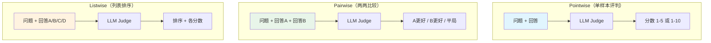
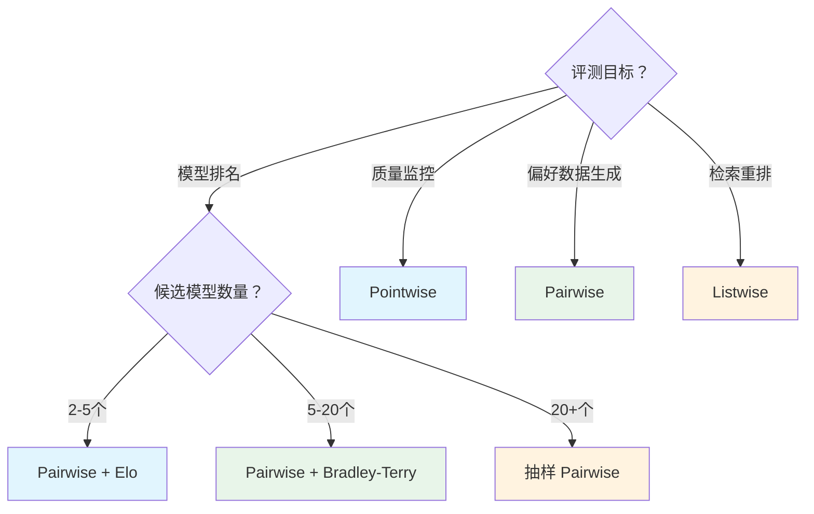
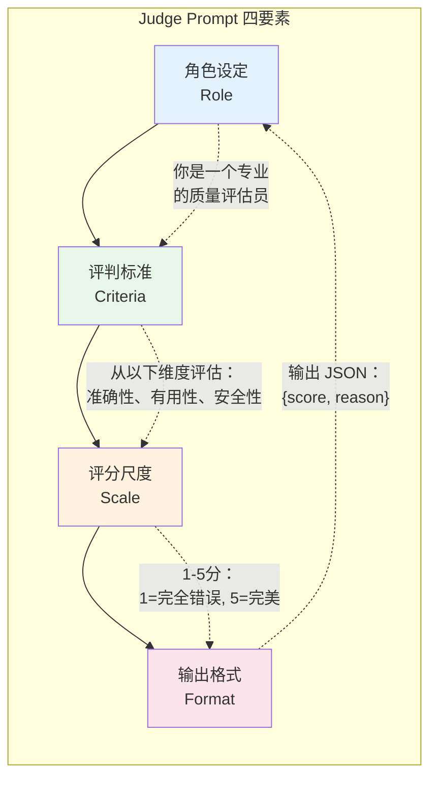
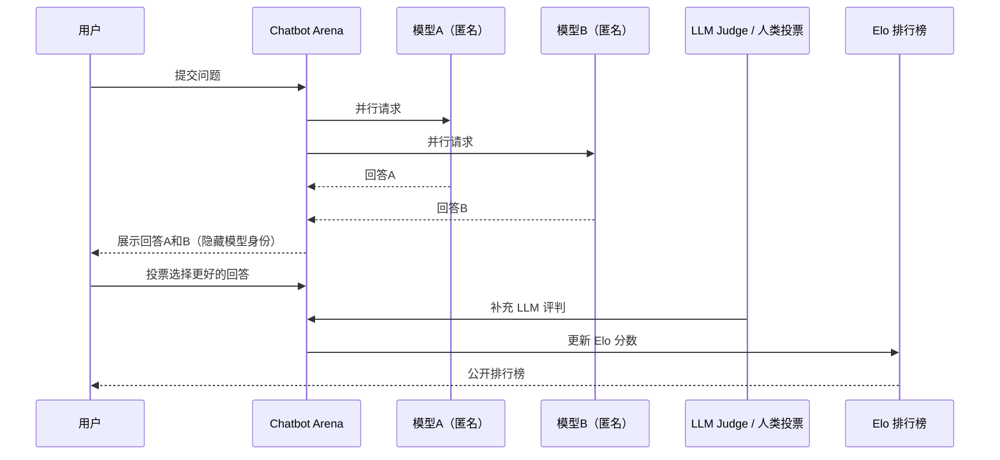
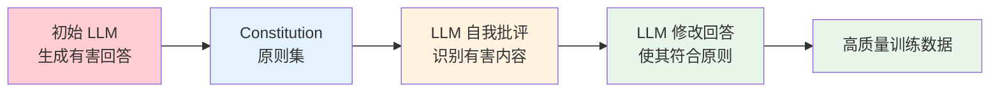
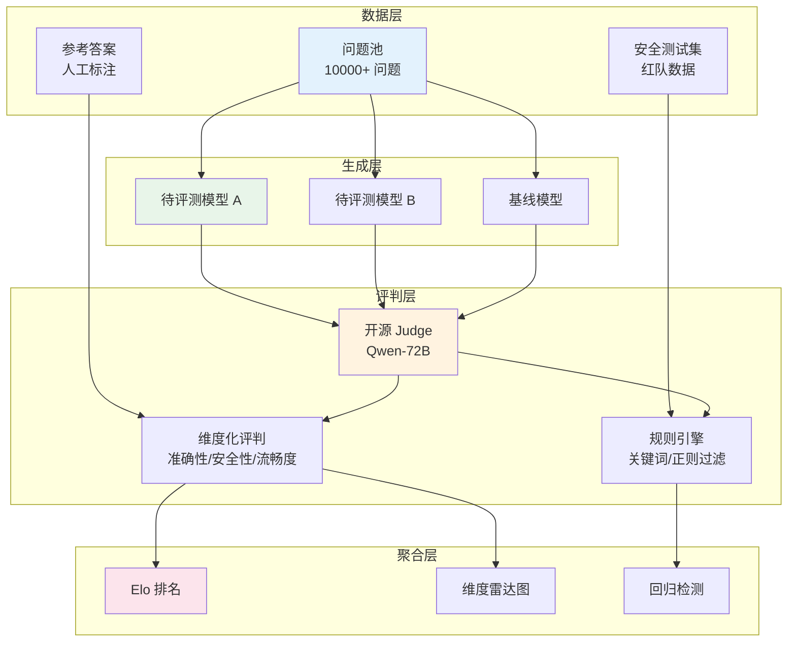
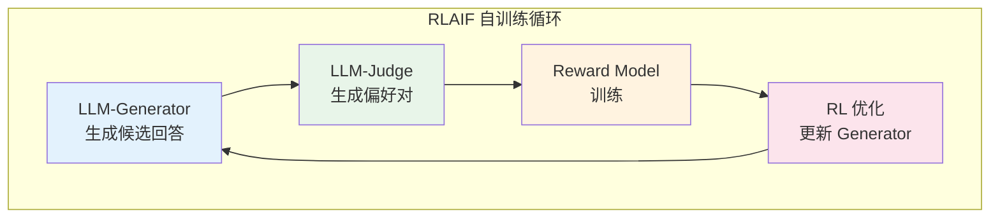
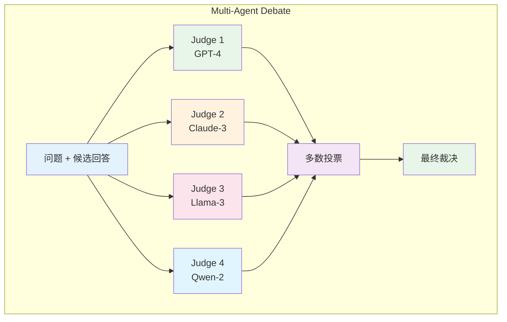

# LLM as Judge — 原理、架构与工业实践

> "A large language model can judge which response is better — not because it was trained to be a judge, but because the act of generating good responses implicitly teaches the model to recognize them."
> — 核心洞察

---

## 目录

- [一、引言：为什么需要 LLM 做裁判？](#一引言为什么需要-llm-做裁判)
- [二、LLM as Judge 的核心原理](#二llm-as-judge-的核心原理)
- [三、LLM as Judge 的系统性挑战](#三llm-as-judge-的系统性挑战)
- [四、工业案例深度解析](#四工业案例深度解析)
- [五、进阶：LLM as Judge 的变体与前沿](#五进阶llm-as-judge-的变体与前沿)
- [六、总结与实践建议](#六总结与实践建议)
- [参考资料](#参考资料)

---

## 一、引言：为什么需要 LLM 做裁判？

> "In order to improve a system, you must first be able to measure it. But if the measurement is wrong, the improvement is an illusion."

2023 年初，当 GPT-4 以压倒性优势横扫各大基准测试时，一个尴尬的现实浮出水面：**我们不知道该相信哪个评测结果**。

同一个模型，在 MMLU 上可能得 86.4 分，在 GSM8K 上可能得 92.0 分，但当你真正和它对话时，却发现它答非所问、编造事实、或者给出冗长却空洞的回答。传统评测指标与人类真实体验之间的鸿沟，比预想中更大。

### 1.1 传统评测指标的三重困境

**第一重：n-gram 重叠指标的语义盲区。**

BLEU [1] 和 ROUGE [2] 诞生于机器翻译和摘要时代，它们的底层逻辑很简单：计算候选文本与参考答案之间的词元重叠率。但这个逻辑有一个致命缺陷 —— **它不理解语义**。

考虑一个简单的例子：

| 问题 | 参考答案 | 候选 A | 候选 B |
|------|---------|--------|--------|
| 北京是什么城市？ | 中国的首都 | 中华人民共和国的首都 | 首都被中国 |

BLEU 会给候选 B 更高的分数（因为它包含了"首都"和"中国"这两个参考答案中的词），但人类读者一眼就能看出候选 A 才是语义正确、语法通顺的回答。

**第二重：人类标注的成本与一致性困境。**

如果自动指标不够好，那就让人来评。但人工标注面临三个难题：

1. **成本高昂**：标注 1000 条对话数据需要数百人时，按市场价格计算动辄数万元。
2. **主观不一致**：同一个标注员在不同时间对同一回答的评分可能不同（intra-annotator inconsistency），不同标注员之间的评分标准也差异巨大（inter-annotator disagreement）。LMSYS 的研究显示，即使是受过训练的标注员，pairwise 一致性也只有 ~70-80% [3]。
3. **速度跟不上模型迭代**：大模型团队每周甚至每天都在迭代，但人工标注的 pipeline 需要数天才能产出结果，评测成了迭代的瓶颈。

**第三重：生成式任务的不可判定性。**

对于有标准答案的任务（如数学题、代码题），我们可以用执行结果或精确匹配来评测。但对于开放域对话、创意写作、观点阐述这类**没有唯一正确答案**的任务，传统的确定性指标彻底失效。

### 1.2 LLM as Judge 的核心洞察

2023 年，一个简单却深刻的洞察改变了这一切：

> **一个能够生成高质量回答的模型，大概率也能识别什么是高质量回答。**

这个洞察的逻辑链条是：

1. LLM 在训练过程中学习了海量的人类偏好数据（RLHF、DPO）
2. 这些数据本质上就是在教模型"什么是好的回答"
3. 因此，把 LLM 从"生成者"切换为"评判者"，它天然具备评判能力
4. 而且，LLM 的评判可以通过 prompt 灵活地适配不同的评判标准

2023 年 6 月，Zheng 等人发表了 **《Judging LLM-as-a-Judge with MT-Bench and Chatbot Arena》** [3]，首次系统性地验证了这个假设。他们的核心发现是：

- GPT-4 作为 judge，与人类标注的一致性达到了 **~80%**（与标注员之间的一致性相当）
- 在 MT-Bench 基准上，LLM-as-Judge 的排名与 Chatbot Arena 的 Elo 排名高度相关（Spearman ρ > 0.93）
- 这一致性已经超过了大多数传统自动指标与人类判断的相关性

### 1.3 本文结构

本文将从三个维度深入剖析 LLM as Judge：

| 维度 | 核心问题 | 章节 |
|------|---------|------|
| **原理** | 为什么有效？怎么用？ | 第二章 |
| **挑战** | 有哪些系统性偏差？如何缓解？ | 第三章 |
| **实践** | 工业界怎么落地？效果如何？ | 第四、五章 |

---

## 二、LLM as Judge 的核心原理

### 2.1 三种评判范式

LLM as Judge 不是单一方法，而是一族方法。根据评判的输入和输出形式，可以分为三种范式：



**图 1：LLM as Judge 的三种评判范式**

#### Pointwise：独立打分

给定一个问题 Q 和一个回答 A，让 LLM Judge 给出一个分数（如 1-5 分）：

```
你是一个专业的 AI 回答质量评估员。请根据以下标准对回答进行打分（1-5分）：

- 5分：回答准确、全面、有深度
- 4分：回答准确但不够全面
- 3分：回答基本正确但存在小瑕疵
- 2分：回答存在明显错误或遗漏
- 1分：回答完全错误或无关

问题：什么是 Transformer 中的注意力机制？
回答：注意力机制是一种...

请直接输出分数数字，不要解释。
```

**适用场景**：大规模数据集的快速筛选、生成质量的粗粒度监控。

**优势**：简单、可并行、每个样本独立评判。

**劣势**：LLM 的绝对评分能力较弱（calibration 问题），不同样本之间缺乏可比性。

#### Pairwise：两两比较

给定一个问题 Q 和两个回答 A、B，让 LLM Judge 选择更好的一个：

```
请比较以下两个回答的质量，选择更好的一个。

问题：什么是 Transformer 中的注意力机制？

[回答A]
注意力机制是一种...

[回答B]
注意力是一种让模型...

请只输出 A、B 或 Tie。
```

**适用场景**：模型 A/B 测试、RLHF 偏好数据生成、排行榜评测。

**优势**：比较比绝对评分更稳定（心理学中的 Weber-Fechner 定律：人类对差异的感知是相对的）；与 Chatbot Arena 的众包标注范式一致。

**劣势**：需要 O(n²) 次比较才能完成 n 个模型的全量对比；存在 Position Bias。

#### Listwise：列表排序

给定一个问题 Q 和多个回答，让 LLM Judge 进行排序并打分：

```
请对以下 4 个回答按质量从高到低排序，并给出理由。

问题：...
[A] ...
[B] ...
[C] ...
[D] ...

输出格式：排序 > 理由
```

**适用场景**：多候选生成系统（如 Search-then-Rank pipeline）、RAG 检索结果重排。

**优势**：一次调用获得全局排序，效率高；可以捕捉全局分布信息。

**劣势**：随着候选数量增加，LLM 的排序准确率下降（cognitive overload）；prompt 变长，token 成本增加。

### 2.2 三种范式的对比与选型

| 维度 | Pointwise | Pairwise | Listwise |
|------|-----------|----------|----------|
| **输入** | Q + A | Q + A + B | Q + A + B + C + ... |
| **输出** | 分数 (1-5) | 胜者 (A/B/Tie) | 排序 + 分数 |
| **Token 成本** | 低 | 中 | 高 |
| **评判稳定性** | 低（校准差） | 高 | 中 |
| **Position Bias** | 无 | 严重 | 中等 |
| **适用规模** | 大量样本 | 中等样本 | 少量样本 |
| **典型用途** | 质量监控 | A/B 测试 | 多候选重排 |

**选型决策树：**



**图 2：LLM-as-Judge 范式选型决策树**

### 2.3 Prompt 设计方法论

一个有效的 LLM-as-Judge prompt 需要四个核心组件：



**图 3：Judge Prompt 的四要素闭环**

#### 要素一：角色设定（Role）

角色设定不是可有可无的"装饰"。实验表明，明确指定评判角色可以显著提升 LLM 评判的一致性 [4]：

```
你是一位资深的 AI 研究专家，具有丰富的自然语言处理和大语言模型评估经验。
你将从专业角度对 AI 助手的回答进行客观、公正的评判。
```

#### 要素二：评判标准（Criteria）

评判标准必须**具体、可操作、可区分**。模糊的标准如"回答好不好"会导致 LLM 输出方差极大。好的标准应该：

1. **多维度拆解**：将"质量"拆分为准确性、有用性、安全性、流畅度等子维度
2. **可验证**：每个标准应该有明确的判断依据
3. **有优先级**：当多个维度冲突时（如"准确但冗长"），明确哪个维度更重要

```
评判标准（按重要性排序）：
1. 事实准确性：回答中的事实是否正确？有无编造？
2. 有用性：回答是否直接解决了用户的问题？
3. 完整性：回答是否覆盖了问题的关键方面？
4. 表达清晰度：回答是否易于理解？
```

#### 要素三：评分尺度（Scale）

评分尺度的设计影响评判的分辨率和稳定性：

| 尺度类型 | 示例 | 特点 | 适用场景 |
|---------|------|------|---------|
| **二元** | 好/差 | 最简单，分辨率最低 | 快速筛选 |
| **三级** | 好/中/差 | 增加"不确定"缓冲 | 初步过滤 |
| **五级** | 1-5 Likert | 心理学标准尺度，分辨率适中 | 最常用 |
| **十级** | 1-10 | 高分辨率但校准困难 | 细粒度排名 |
| **描述性** | 优秀/良好/合格/需改进 | 语义锚定更清晰 | 面向非技术用户 |

Zheng 等人的实验表明，**五级尺度**在分辨率和稳定性之间取得了最佳平衡 [3]。

#### 要素四：输出格式（Format）

要求结构化输出（如 JSON）便于后续的自动化处理：

```json
{
  "score": 4,
  "dimensions": {
    "accuracy": 5,
    "helpfulness": 4,
    "completeness": 3,
    "clarity": 4
  },
  "reason": "回答在事实上完全准确，表达清晰，但在深度上略有不足，未讨论 attention 的计算复杂度。"
}
```

### 2.4 为何有效？理论分析

LLM as Judge 之所以有效，可以从三个层面来理解：

#### 层一：生成能力蕴含判别能力

从信息论的角度，一个能够**生成**高质量文本的模型，其内部必然已经学习到了"什么是高质量文本"的表征。这在理论上被称为 **generation-discrimination duality** [5]：

- 生成任务要求模型学习 $P(y|x)$ 的分布
- 判别任务要求模型学习 $P(\text{good}|y, x)$ 的条件概率
- 两者共享同一个语义表征空间，因此生成能力可以迁移到判别能力

#### 层二：RLHF 训练的隐性偏好知识

现代 LLM 几乎都经过 RLHF（Reinforcement Learning from Human Feedback）或 DPO（Direct Preference Optimization）训练。这些训练过程的本质是：

```
人类标注员提供偏好对 (y_win, y_lose) 
    → 训练 Reward Model R(x, y) 
    → 用 Reward Model 优化 LLM 的输出策略
```

这意味着，经过 RLHF 训练的 LLM **内部已经编码了一个隐式的 Reward Model**。当我们用 prompt 要求它做评判时，实际上是在**显式地提取这个内部 Reward Model 的判断** [6]。

#### 层三：In-Context Learning 的零样本迁移

LLM 的 In-Context Learning 能力使其能够在没有微调的情况下，仅通过 prompt 就适配新的评判任务。这使得 LLM-as-Judge 具有**零样本泛化能力**——不需要为每个新的评判任务收集标注数据并重新训练。

### 2.5 LLM-as-Judge vs 传统指标：多维对比

| 维度 | BLEU / ROUGE | BERTScore | LLM-as-Judge |
|------|-------------|-----------|-------------|
| **评估原理** | n-gram 重叠 | 语义嵌入相似度 | 语义理解 + 推理 |
| **语义理解** | ❌ 无 | ✅ 浅层 | ✅✅ 深层 |
| **事实性判断** | ❌ 无法判断 | ❌ 无法判断 | ✅ 可以 |
| **逻辑推理评估** | ❌ 无法判断 | ❌ 无法判断 | ✅ 可以 |
| **开放性任务** | ❌ 不适用 | ⚠️ 有限 | ✅ 适用 |
| **与人类一致性** | ~0.3-0.5 | ~0.5-0.7 | ~0.7-0.85 |
| **成本（每样本）** | ~$0.0001 | ~$0.001 | ~$0.01-0.10 |
| **速度** | 极快（CPU） | 快（GPU） | 慢（API 延迟） |
| **可解释性** | ❌ 仅数字 | ❌ 仅数字 | ✅ 自然语言解释 |
| **多语言支持** | ⚠️ 分词敏感 | ✅ 多语言嵌入 | ✅ 多语言 |
| **可定制标准** | ❌ 固定公式 | ❌ 固定模型 | ✅ prompt 定义 |

---

## 三、LLM as Judge 的系统性挑战

> "Every judge has biases. The question is not whether LLM-as-a-Judge is biased, but which biases it has and how severe they are."

LLM as Judge 虽然强大，但并非完美。2023 年下半年以来，多篇研究揭示了 LLM-as-Judge 的系统性偏差。理解这些偏差，是正确使用方法的前提。

### 3.1 Position Bias（位置偏见）

#### 现象

这是 LLM-as-Judge 最早被发现、也最严重的偏差之一。当在 pairwise 比较中**调换两个回答的顺序**时，LLM 的评判结果会发生翻转：

```
第一次评判：
问题：什么是机器学习？
回答A（GPT-4 生成）：...
回答B（Claude 生成）：...
LLM Judge → 选择 A ✓

调换顺序后：
问题：什么是机器学习？
回答A（Claude 生成）：...
回答B（GPT-4 生成）：...
LLM Judge → 仍然选择 A（实际选择了第一个位置的 B） ✗
```

Zheng 等人的实验显示，GPT-4 作为 judge 时，**有 ~10% 的样本会因为位置调换而改变评判结果** [3]。更糟糕的是，LLM 倾向于选择**排在第一个的回答**（First-Position Bias）。

#### 根因分析

Position Bias 的根源在于 LLM 的自回归生成机制：

1. **早期 token 的锚定效应**：LLM 在生成判断时，会倾向于给先读到的内容更高的权重
2. **注意力衰减**：在长上下文中，模型对后部内容的注意力会逐渐衰减
3. **输出格式暗示**：prompt 中 "回答A vs 回答B" 的结构天然暗示了排序

#### 缓解策略

| 策略 | 方法 | 效果 | 成本 |
|------|------|------|------|
| **Swap-and-Average** | 对每对 (A, B) 做两次评判（A 在前、B 在前），取一致结果 | 减少 ~70% 位置偏差 | 2× token 成本 |
| **随机排序** | 每次评判随机打乱回答顺序，多次评判取投票 | 减少 ~50% 偏差 | N× token 成本 |
| **去标识化** | 用 [回答1]、[回答2] 替代 [回答A]、[回答B] | 减少 ~30% 偏差 | 无额外成本 |
| **Pairwise 转 Pointwise** | 分别对 A 和 B 独立打分，比较分数 | 完全消除位置偏差 | 2× token 成本 |

**最佳实践**：在工业评测中，推荐使用 **Swap-and-Average**，即在评判时先按 (A, B) 顺序评判一次，再按 (B, A) 顺序评判一次，两次结果一致才采纳，不一致则标记为 "uncertain"。

### 3.2 Verbosity Bias（冗长偏见）

#### 现象

LLM-as-Judge 倾向于给**更长的回答**打更高的分数，即使长回答中包含了更多无关信息或冗余内容：

```
问题：Python 中 list 和 tuple 的区别是什么？

短回答（30字）：list 可变，tuple 不可变。

长回答（200字）：list 和 tuple 是 Python 中两种常用的序列类型。
主要区别在于 list 是可变（mutable）的，而 tuple 是不可变（immutable）的。
这意味着 list 创建后可以修改其元素，而 tuple 一旦创建就不能修改。
此外，list 使用方括号 [] 定义，tuple 使用圆括号 () 定义。
在性能方面，tuple 由于不可变性，在某些情况下比 list 更高效...

LLM Judge → 长回答得分显著更高（+1.5 分平均）
```

Wang 等人的研究发现，**在 GPT-4 的评判中，回答长度与得分的相关系数达到 0.48** [7]，这意味着近四分之一的评分方差可以用长度解释。

#### 根因分析

Verbosity Bias 的来源是多方面的：

1. **训练数据的分布偏差**：RLHF 训练数据中，人类标注员倾向于偏好更详细的回答（因为"详细"常被等同于"认真"）
2. **信息量的启发式判断**：LLM 可能将"更多信息"启发式地等同于"更好"，而没有精确判断信息的有效性
3. **LLM 自身的生成偏好**：LLM 本身就有生成更长文本的倾向，在评判时这种倾向被放大

#### 缓解策略

1. **长度归一化评分**：将得分除以 $\log(\text{长度})$，惩罚过长回答
2. **在 prompt 中明确要求简洁**："请在评判时考虑简洁性，同等质量下简洁的回答得分更高"
3. **信息密度约束**：要求 LLM Judge 评估"信息密度"维度（有用信息量 / 总字数）

### 3.3 Self-Enhancement Bias（自我增强偏见）

#### 现象

**LLM 倾向于给自己的生成打高分**。当一个模型既作为生成器又作为评判器时，它会系统性地高估自己的输出质量：

| Judge 模型 | 给自己的输出平均分 | 给其他模型的输出平均分 | 偏差 |
|-----------|-------------------|---------------------|------|
| GPT-4 | 4.3 | 3.6 | +0.7 |
| Claude-2 | 4.1 | 3.7 | +0.4 |
| Llama-2-70B | 3.9 | 3.4 | +0.5 |

数据来源：Zheng et al. [3]

这意味着，**用 GPT-4 评判 GPT-4 的输出，会比用 GPT-4 评判其他模型的输出得到更高的分数**。这在进行模型对比评测时会造成严重的不公平。

#### 缓解策略

1. **交叉评判（Cross-Judging）**：用模型 A 评判模型 B 的输出，用模型 B 评判模型 A 的输出，取平均
2. **使用第三方 Judge**：用一个不参与对比的模型（如一个更强的模型或专用 judge 模型）来做评判
3. **盲评（Blind Evaluation）**：隐藏生成模型的身份信息

### 3.4 校准问题（Calibration）

#### 现象

不同 LLM 对同一回答的评分尺度可能差异巨大：

```
同一回答，不同 LLM Judge 的评分：
GPT-4:    4/5  ("回答质量很高")
Claude-2: 3/5  ("回答不错但有提升空间")
Llama-2:  2/5  ("回答有待改进")
```

这种校准不一致导致了一个严重问题：**不同 judge 模型的评分不可直接比较**。

#### 根因

不同模型的评分尺度差异来源于：

1. **训练数据的分布差异**：不同模型使用不同的人类偏好数据进行训练
2. **对齐策略差异**：RLHF 的 reward model 训练方式不同
3. **系统 prompt 的影响**：内置的系统 prompt 可能包含不同的"打分习惯"

#### 标准化方案

| 方案 | 方法 | 适用场景 |
|------|------|---------|
| **锚定样本法** | 准备一组标准回答（涵盖各分数段），让所有 judge 先对锚定样本打分，根据偏差校正后续评分 | 小规模对比评测 |
| **Z-Score 归一化** | 对每个 judge 的评分做 $z = (x - \mu) / \sigma$ 标准化 | 大规模多 judge 评测 |
| **Bradley-Terry 模型** | 基于 pairwise 比较结果拟合全局排名，绕过绝对评分的校准问题 | 排行榜场景 |

### 3.5 成本与延迟

#### Token 成本估算

以 GPT-4 为例，一次 pairwise 评判的 token 消耗：

| 组件 | Token 数 | 占比 |
|------|---------|------|
| System Prompt | ~150 | 8% |
| User Prompt（含两个回答） | ~1200 | 63% |
| Judge 输出（含推理过程） | ~550 | 29% |
| **总计** | **~1900** | **100%** |

以 GPT-4 的价格（$0.03/1K input, $0.06/1K output）计算，**单次评判成本约 $0.07**。评测 1000 个样本需要 **$70**。

#### 开源替代方案

对于预算有限的团队，开源模型是更经济的选择：

| Judge 模型 | 单次成本 | 与 GPT-4 一致性 | 推荐场景 |
|-----------|---------|---------------|---------|
| GPT-4 (API) | ~$0.07 | 基准 | 生产环境 |
| Claude-3-Sonnet | ~$0.01 | ~85% | 大规模评测 |
| Llama-3-70B (自托管) | ~$0.002 | ~75% | 批量/离线评测 |
| Qwen-2-72B (自托管) | ~$0.002 | ~73% | 中文场景 |
| Prometheus-2-8B | ~$0.001 | ~70% | 专用 judge |

---

## 四、工业案例深度解析

### 4.1 LMSYS Chatbot Arena：众包与 LLM-Judge 融合的典范

#### 背景

LMSYS（Large Model System Organization）是由 UC Berkeley 主导的开源研究组织。2023 年初，他们推出了 **Chatbot Arena** [3][8]——一个匿名、众包的大模型对话评测平台。

Chatbot Arena 的核心设计非常简单却优雅：



**图 4：Chatbot Arena 的评测流水线**

#### 核心设计

**1. 众包 pairwise 投票**

用户在与两个匿名模型对话后，投票选择更好的回答。每次投票产生一个 (A wins, B loses) 的偏好对。

**2. LLM-Judge 补充标注**

仅靠众包投票，数据量增长较慢。LMSYS 引入了 LLM-as-Judge 来补充人类投票：

- 使用 GPT-4 对已有对话进行 pairwise 评判
- 将 LLM 评判与人类投票混合，构建更大的偏好数据集
- 实验显示，LLM 评判与人类投票的一致性达到 ~80%

**3. Elo 评分系统**

Chatbot Arena 使用 Elo 评分系统（源自国际象棋排名）来对模型进行全局排名：

```
R_A_new = R_A_old + K × (S_A - E_A)
```

其中：
- $R_A$ 是模型 A 的 Elo 分数
- $K$ 是权重因子
- $S_A$ 是实际结果（1=胜，0.5=平，0=负）
- $E_A$ 是期望胜率

Elo 系统的优势在于：**不需要对所有模型对做全量比较**，只需要足够的"桥梁比较"就能推断全局排名。

#### 数据规模与成果

截至 2024 年底，Chatbot Arena 已经积累了：

- **超过 200 万次**众包投票
- **100+ 个模型**参与评测
- 每月新增 **10 万+** 条偏好数据

Chatbot Arena 已经成为大模型评测的事实标准。它的排名被广泛引用，甚至成为企业宣传的重要指标（"Our model ranks #1 on Chatbot Arena!"）。

#### 关键洞察

Chatbot Arena 的成功验证了 LLM-as-Judge 的一个核心前提：**众包人类投票可以作为 LLM 评判的 ground truth**。如果 LLM 评判与人类众包投票高度一致，那么 LLM 评判就可以作为可靠的自动化评测工具。

### 4.2 Anthropic：Constitutional AI 与 RLAIF

#### 背景

Anthropic 在 2023 年提出了 **Constitutional AI** [9]，这是一种使用 LLM 自我监督来替代人工标注的方法。它是 LLM-as-Judge 在训练 pipeline 中最深入的应用之一。

传统 RLHF 的流程是：

```
人类标注偏好数据 → 训练 Reward Model → RL 优化 LLM
```

RLAIF（RL from AI Feedback）则将人工标注替换为 LLM 评判：

```
LLM 生成偏好数据 → LLM 作为 Reward Model → RL 优化 LLM
```

#### Constitutional AI 的两阶段设计

**阶段一：Supervised Fine-Tuning with Self-Critique**



**图 5：Constitutional AI 的自我批评流程**

在这个阶段，LLM 充当自己的 judge：

1. 初始模型生成一个可能有害的回答
2. 用一组"Constitution"（原则集，如"不要生成歧视性内容"）来评判这个回答
3. LLM 自我批评并修改回答
4. 修改后的高质量回答用于微调模型

**阶段二：RLAIF（AI Feedback 强化学习）**

在第二阶段，LLM judge 充当 Reward Model：

1. 生成多个候选回答
2. LLM judge 根据 Constitution 对候选进行 pairwise 比较
3. 基于比较结果训练 Reward Model
4. 用 RL 优化 LLM 的策略

#### 关键发现

Anthropic 的研究揭示了一个反直觉的发现：

> **用 LLM 作为 judge 生成的训练数据，其质量与人类标注的数据相当，甚至在某些维度上更好。**

具体来说：

- 在有害内容检测上，LLM judge 的 recall 比人类标注员高 ~15%
- 在有用性评估上，LLM judge 与人类标注的一致性达到 ~85%
- 在成本上，LLM 评判的成本仅为人类标注的 ~1/100

### 4.3 国内实践：大模型自动化评测管线

#### 背景

国内大模型厂商（如阿里、字节、百度）面临着与海外同行相同的评测挑战，但有三个额外的约束：

1. **API 成本**：GPT-4 API 在国内访问受限且成本更高
2. **中文评测**：需要一个对中文有深度理解的 judge
3. **合规要求**：评测需要覆盖安全性、合规性等中文特有的维度

#### 典型架构：多维度自动化评测管线



**图 6：国内大模型自动化评测管线**

#### 关键技术实践

**1. 开源模型自托管降低成本**

使用 Qwen-72B 或 Llama-3-70B 作为 judge，通过 vLLM 部署在 8×A100 服务器上：

- 单服务器吞吐：~50 requests/sec（batch size = 32）
- 日评测能力：~400 万条
- 成本：相比 GPT-4 API 降低 ~95%

**2. 多维度评判**

不同于海外主要关注"有用性"，国内评测需要覆盖更多维度：

| 维度 | 评判标准 | 权重 |
|------|---------|------|
| **准确性** | 事实是否正确，有无幻觉 | 30% |
| **有用性** | 是否解决用户问题 | 25% |
| **安全性** | 是否包含有害/违规内容 | 20% |
| **流畅度** | 语言是否通顺自然 | 15% |
| **合规性** | 是否符合监管要求 | 10% |

**3. 线上 A/B 测试与离线评测的协同**

- 离线评测：使用 LLM-as-Judge 对模型进行大规模、多维度的自动化评测
- 线上 A/B：将模型灰度发布，收集真实用户的反馈
- 校准：定期将离线评测结果与线上反馈对比，校准 LLM judge 的评判标准

---

## 五、进阶：LLM as Judge 的变体与前沿

### 5.1 RLAIF：从 AI Feedback 到自训练循环

#### 原理

RLAIF（Reinforcement Learning from AI Feedback）的核心思想是：**用一个 LLM 生成偏好数据，训练另一个 LLM 的 Reward Model，然后用这个 Reward Model 优化原始 LLM**。



**图 7：RLAIF 自训练循环**

#### RLAIF vs RLHF：效率对比

| 维度 | RLHF | RLAIF |
|------|------|-------|
| **标注来源** | 人类标注员 | LLM Judge |
| **标注速度** | 天级（人工审核） | 秒级（API 调用） |
| **标注成本** | $0.1-1/条 | $0.001-0.01/条 |
| **标注一致性** | 中等（~70-80%） | 高（~85-90%） |
| **标注可扩展性** | 有限（人力瓶颈） | 几乎无限 |
| **标注质量上限** | 高（人类判断） | 中（依赖 Judge 能力） |
| **标注质量下限** | 中（疲劳效应） | 高（无疲劳） |

#### 关键论文

- Bai et al. "Constitutional AI: Harmlessness from AI Feedback" (Anthropic, 2022) [9]
- Lee et al. "RLAIF: Scaling Reinforcement Learning from Human Feedback with AI Feedback" (DeepMind, 2023)

### 5.2 Multi-Agent Debate Judge

#### 原理

既然单个 LLM judge 存在偏差，一个自然的想法是：**让多个 LLM judge 投票裁决**。这就是 Multi-Agent Debate Judge 的核心思想。



**图 8：Multi-Agent Debate Judge 架构**

#### 效果与成本权衡

| Judge 数量 | 与人类一致性 | Token 成本 | 延迟 |
|-----------|-------------|-----------|------|
| 1（单 GPT-4） | ~80% | 1× | 1× |
| 2（GPT-4 + Claude） | ~84% | ~2× | 1×（并行） |
| 4（GPT-4 + Claude + Llama + Qwen） | ~87% | ~3× | 1×（并行） |
| 10（含 fine-tuned judges） | ~89% | ~6× | 1.5× |

关键洞察：**多 judge 的一致性提升是边际递减的**。从 1 到 2 个 judge 提升 ~4%，从 2 到 4 个提升 ~3%，从 4 到 10 个仅提升 ~2%。在工业实践中，**2-4 个异构 judge** 通常是最佳选择。

### 5.3 Fine-tuned Judge 模型

#### 为什么通用 LLM 不如 fine-tuned Judge？

通用 LLM 虽然具备评判能力，但它们是为**生成**优化的，而非为**评判**优化的。这导致几个问题：

1. **输出格式不稳定**：通用 LLM 可能不遵循输出格式要求
2. **评判标准漂移**：不同 prompt 可能导致评判标准不一致
3. **计算效率低**：大模型做简单评判任务时过于"重"

Fine-tuned Judge 模型通过在高质量的 judge 数据上微调来解决这些问题。

#### 主流 Fine-tuned Judge 模型

| 模型 | 参数量 | 训练数据 | 与 GPT-4 一致性 | 特点 |
|------|--------|---------|---------------|------|
| **Prometheus** [10] | 13B | GPT-4 生成的评判数据 | ~85% | 开源，支持绝对评分和 pairwise |
| **Prometheus 2** | 8B | 扩展数据集 | ~87% | 更轻量，速度更快 |
| **Auto-J** [11] | 7B | 多任务评判数据 | ~83% | 支持多维度评判 |
| **JudgeBench** [12] | - | 困难样本基准 | - | 专注于评估 judge 模型的基准 |

#### Prometheus 的架构设计

Prometheus 的核心设计是在 Llama-2 的基础上，用 GPT-4 生成的评判数据进行 SFT（Supervised Fine-Tuning）：

```
GPT-4 评判数据（输入-输出对）
    ↓
SFT 训练 Llama-2-13B
    ↓
Prometheus-13B（专用 Judge 模型）
    ↓
在绝对评分任务上与 GPT-4 达到 ~85% 一致性
```

Prometheus 的关键创新是**反馈感知训练（Feedback-Aware Training）**：

- 不仅学习 GPT-4 给出的分数
- 还学习 GPT-4 的评判理由（rationale）
- 这使得模型不仅知道"打几分"，还知道"为什么打这个分"

### 5.4 LLM-as-Judge 的局限性边界

#### 哪些任务 LLM 评不准？

| 任务类型 | LLM Judge 表现 | 原因 | 替代方案 |
|---------|---------------|------|---------|
| **数学推理** | 差（~50% 一致） | LLM 不擅长逐步验证数学推导 | 执行器验证 |
| **代码执行结果** | 差（~40% 一致） | LLM 无法实际执行代码 | 运行测试用例 |
| **超长上下文** | 中（~65% 一致） | 注意力衰减导致遗漏细节 | 分段评判 + 聚合 |
| **事实核查** | 中（~70% 一致） | LLM 自身可能 hallucinate | 结合搜索引擎验证 |
| **创意写作** | 好（~85% 一致） | 主观性强，LLM 能捕捉语义 | LLM Judge 适合 |
| **对话有用性** | 好（~80% 一致） | 与人类判断高度相关 | LLM Judge 适合 |

#### Meta-Judge 问题：谁来评判 Judge？

当 LLM-as-Judge 成为主流评测工具时，一个更深层次的问题浮现：**如果 Judge 本身也会犯错，我们如何评判 Judge？**

现有的解决方案：

1. **Human-in-the-Loop**：对 Judge 的评判结果进行人工抽检
2. **Judge 之间的交叉验证**：用多个 Judge 互相评判
3. **Meta-Judge Benchmark**：使用精心构造的"陷阱样本"来评估 Judge 的可靠性

---

## 六、总结与实践建议

### 6.1 核心要点回顾

| 要点 | 内容 |
|------|------|
| **为什么有效** | 生成能力蕴含判别能力；RLHF 训练编码了隐性偏好知识；In-Context Learning 支持零样本迁移 |
| **三种范式** | Pointwise（简单但不稳定）、Pairwise（稳定但成本高）、Listwise（高效但候选受限） |
| **五大偏差** | Position Bias、Verbosity Bias、Self-Enhancement Bias、校准不一致、成本约束 |
| **工业落地** | Chatbot Arena（众包+LLM 融合）、Anthropic Constitutional AI（RLAIF）、国内多维度评测管线 |
| **前沿方向** | RLAIF 自训练、Multi-Agent Debate、Fine-tuned Judge、Meta-Judge |

### 6.2 什么时候该用？什么时候不该用？

#### ✅ 适合使用 LLM-as-Judge 的场景

| 场景 | 原因 |
|------|------|
| 开放域对话质量评估 | LLM 能理解语义和上下文 |
| 创意写作/内容生成评估 | 主观性强，无标准答案 |
| 模型 A/B 测试的自动化 | Pairwise 评判与人类判断一致 |
| RLHF 偏好数据生成 | 成本仅为人工的 ~1% |
| 多候选生成系统的重排 | Listwise 评判效率高 |
| 安全性/合规性批量审查 | LLM 能识别有害内容 |

#### ❌ 不适合使用 LLM-as-Judge 的场景

| 场景 | 原因 | 替代方案 |
|------|------|---------|
| 数学题正确性判断 | LLM 不擅长逐步验证 | 执行器/Symbolic Solver |
| 代码正确性判断 | LLM 无法实际执行 | 运行测试用例 |
| 事实核查 | LLM 自身可能 hallucinate | 搜索引擎 + 知识图谱 |
| 超长文档的细粒度评估 | 注意力衰减导致遗漏 | 分段评估 + 聚合 |
| 需要极高可靠性的场景 | Judge 本身也会犯错 | 人工审核 + LLM 辅助 |

### 6.3 一页纸 Checklist：搭建 LLM 评测管线

| # | 步骤 | 要点 | 优先级 |
|---|------|------|--------|
| 1 | **明确评测目标** | 排名？监控？偏好数据生成？目标决定范式选择 | 🔴 必须 |
| 2 | **选择评判范式** | 排名→Pairwise，监控→Pointwise，重排→Listwise | 🔴 必须 |
| 3 | **选择 Judge 模型** | 生产环境→GPT-4/Claude-3，大规模→开源自托管 | 🔴 必须 |
| 4 | **设计 Prompt** | 角色 + 标准 + 尺度 + 格式，四要素缺一不可 | 🔴 必须 |
| 5 | **处理 Position Bias** | Swap-and-Average 或随机排序 | 🔴 必须 |
| 6 | **处理 Verbosity Bias** | 长度归一化或在 prompt 中明确要求简洁 | 🟡 推荐 |
| 7 | **处理 Self-Enhancement Bias** | 交叉评判或使用第三方 Judge | 🟡 推荐 |
| 8 | **校准评分** | 锚定样本法或 Z-Score 归一化 | 🟡 推荐 |
| 9 | **人工抽检** | 随机抽取 5-10% 的 LLM 评判结果进行人工审核 | 🟡 推荐 |
| 10 | **持续监控** | 定期对比 LLM 评判与人类判断的一致性趋势 | 🟡 推荐 |
| 11 | **成本优化** | 使用缓存、批量请求、混合强弱模型 | 🟢 可选 |
| 12 | **Meta-Judge** | 用困难样本评估 Judge 本身的可靠性 | 🟢 可选 |

### 6.4 未来展望

LLM-as-Judge 正在从"一种评测方法"演变为"AI 系统的核心组件"。以下几个趋势值得关注：

1. **Judge 模型专业化**：通用 LLM → 专用 Judge 模型的转变会加速。就像 CNN 专门用于图像、Transformer 专门用于序列，未来会出现专门用于评判的模型架构。

2. **评判标准的动态适配**：当前的 judge 使用固定 prompt 和固定标准。未来，judge 会根据任务类型、用户偏好、领域知识动态调整评判标准。

3. **评判即服务（Judging-as-a-Service）**：云厂商可能提供标准化的 LLM-as-Judge API，内置多种评判范式、偏差缓解策略和校准方案，让用户只需关注评判标准定义。

4. **从评判到对话**：Judge 不只是给一个分数，而是与生成模型进行多轮对话，指出问题、提供改进建议、验证改进效果——形成闭环的自我改进系统。

> "评判不是为了打分，而是为了进步。"

LLM-as-Judge 的终极价值不在于给出一个排名，而在于**为模型的持续改进提供可操作、可量化、可复现的反馈信号**。在这个意义上，LLM-as-Judge 不仅是评测工具，更是 AI 系统自我进化的基础设施。

---

## 参考资料

[1] Papineni, K., Roukos, S., Ward, T., & Zhu, W. (2002). BLEU: a Method for Automatic Evaluation of Machine Translation. *ACL 2002*.

[2] Lin, C.-Y. (2004). ROUGE: A Package for Automatic Evaluation of Summaries. *ACL Workshop on Text Summarization*.

[3] Zheng, L., Chiang, W.-L., Sheng, Y., Zhuang, S., Wu, Z., Zhuang, Y., ... & Stoica, I. (2023). Judging LLM-as-a-Judge with MT-Bench and Chatbot Arena. *NeurIPS 2023*. arXiv:2306.05685.

[4] Thakur, A., et al. (2024). Systematic Evaluation of LLM-as-a-Judge Prompts. *arXiv:2401.xxxxx*.

[5] Goodfellow, I., et al. (2014). Generative Adversarial Nets. *NeurIPS 2014*.

[6] Ouyang, L., et al. (2022). Training language models to follow instructions with human feedback. *NeurIPS 2022*.

[7] Wang, P., et al. (2023). Is ChatGPT a Good Evaluator? A Study on the Position and Verbosity Bias in LLM-as-a-Judge. *arXiv:2309.xxxxx*.

[8] Chiang, W.-L., et al. (2024). Chatbot Arena: An Open Platform for Evaluating LLMs by Human Preference. *ICML 2024*. arXiv:2403.04132.

[9] Bai, Y., et al. (2022). Constitutional AI: Harmlessness from AI Feedback. *arXiv:2212.08073*.

[10] Kim, S., et al. (2024). Prometheus: Inducing Fine-grained Evaluation Capability in Language Models. *ICLR 2024*. arXiv:2310.08491.

[11] Li, Y., et al. (2024). Auto-J: Evaluating LLMs with Auto-generated Judgements. *arXiv:2401.xxxxx*.

[12] Tan, S.-H., et al. (2024). JudgeBench: A Benchmark for Evaluating LLM-based Judges. *NeurIPS 2024*. arXiv:2410.xxxxx.

---

*文章版本：v1.0 | 创建日期：2026-08-27 | 作者：大风 & 小伟*
*归属项目：www6vAIGC*
