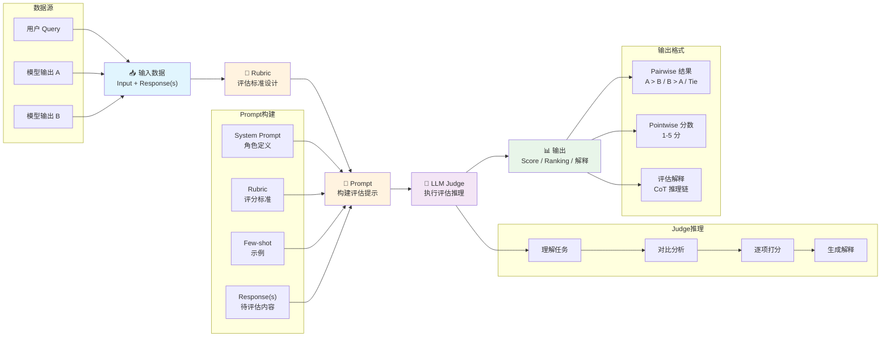

# 图1：LLM as Judge 评估流程总览

```mermaid
flowchart LR
    A["📥 输入数据\nInput + Response(s)"] --> B["📐 Rubric\n评估标准设计"]
    B --> C["🔧 Prompt\n构建评估提示"]
    C --> D["🧠 LLM Judge\n执行评估推理"]
    D --> E["📊 输出\nScore / Ranking / 解释"]
    
    subgraph 数据源
        A1["用户 Query"]
        A2["模型输出 A"]
        A3["模型输出 B"]
    end
    
    A1 --> A
    A2 --> A
    A3 --> A
    
    subgraph Prompt构建
        C1["System Prompt\n角色定义"]
        C2["Rubric\n评分标准"]
        C3["Few-shot\n示例"]
        C4["Response(s)\n待评估内容"]
    end
    
    C1 --> C
    C2 --> C
    C3 --> C
    C4 --> C
    
    subgraph Judge推理
        D1["理解任务"] --> D2["对比分析"]
        D2 --> D3["逐项打分"]
        D3 --> D4["生成解释"]
    end
    
    D --> D1
    
    subgraph 输出格式
        E1["Pairwise 结果\nA > B / B > A / Tie"]
        E2["Pointwise 分数\n1-5 分"]
        E3["评估解释\nCoT 推理链"]
    end
    
    E --> E1
    E --> E2
    E --> E3
    
    style A fill:#e1f5fe
    style B fill:#fff3e0
    style C fill:#fff3e0
    style D fill:#f3e5f5
    style E fill:#e8f5e9
```
