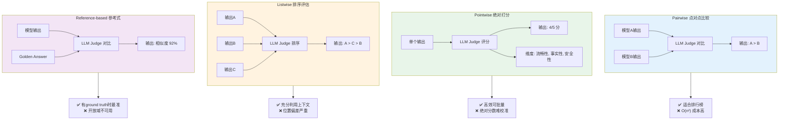

# 图2：四种评估范式对比

```mermaid
flowchart TD
    subgraph 范式A["Pairwise 点对点比较"]
        direction LR
        A1["模型A输出"] --> A0["LLM Judge 对比"]
        A2["模型B输出"] --> A0
        A0 --> A3["输出: A > B"]
    end
    
    subgraph 范式B["Pointwise 绝对打分"]
        direction LR
        B1["单个输出"] --> B0["LLM Judge 评分"]
        B0 --> B2["输出: 4/5 分"]
        B0 --> B3["维度: 流畅性, 事实性, 安全性"]
    end
    
    subgraph 范式C["Listwise 排序评估"]
        direction LR
        C1["输出A"] --> C0["LLM Judge 排序"]
        C2["输出B"] --> C0
        C3["输出C"] --> C0
        C0 --> C4["输出: A > C > B"]
    end
    
    subgraph 范式D["Reference-based 参考式"]
        direction LR
        D1["模型输出"] --> D0["LLM Judge 对比"]
        D2["Golden Answer"] --> D0
        D0 --> D3["输出: 相似度 92%"]
    end
    
    范式A --> T["✅ 适合排行榜\n❌ O(n²) 成本高"]
    范式B --> T2["✅ 高效可批量\n❌ 绝对分数难校准"]
    范式C --> T3["✅ 充分利用上下文\n❌ 位置偏差严重"]
    范式D --> T4["✅ 有ground truth时最准\n❌ 开放域不可用"]
    
    style 范式A fill:#e3f2fd
    style 范式B fill:#e8f5e9
    style 范式C fill:#fff3e0
    style 范式D fill:#f3e5f5
```
