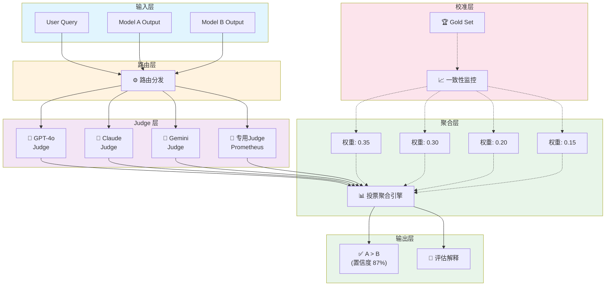

# 图5：多 Judge 投票聚合架构

```mermaid
flowchart TB
    subgraph Input["输入层"]
        Q["User Query"]
        R1["Model A Output"]
        R2["Model B Output"]
    end
    
    subgraph Router["路由层"]
        GATE["⚙️ 路由分发"]
    end
    
    Q --> GATE
    R1 --> GATE
    R2 --> GATE
    
    subgraph Judges["Judge 层"]
        J1["🧠 GPT-4o\nJudge"]
        J2["🧠 Claude\nJudge"]
        J3["🧠 Gemini\nJudge"]
        J4["🧠 专用Judge\nPrometheus"]
    end
    
    GATE --> J1
    GATE --> J2
    GATE --> J3
    GATE --> J4
    
    subgraph Aggregator["聚合层"]
        VOTE["📊 投票聚合引擎"]
        W1["权重: 0.35"]
        W2["权重: 0.30"]
        W3["权重: 0.20"]
        W4["权重: 0.15"]
    end
    
    J1 --> VOTE
    J2 --> VOTE
    J3 --> VOTE
    J4 --> VOTE
    W1 -.-> VOTE
    W2 -.-> VOTE
    W3 -.-> VOTE
    W4 -.-> VOTE
    
    subgraph Output["输出层"]
        RESULT["✅ A > B\n(置信度 87%)"]
        EXPLAIN["📝 评估解释"]
    end
    
    VOTE --> RESULT
    VOTE --> EXPLAIN
    
    subgraph Calibration["校准层"]
        GOLD["🏆 Gold Set"]
        MONITOR["📈 一致性监控"]
    end
    
    GOLD -.-> MONITOR
    MONITOR -.-> W1
    MONITOR -.-> W2
    MONITOR -.-> W3
    MONITOR -.-> W4
    
    style Input fill:#e1f5fe
    style Router fill:#fff3e0
    style Judges fill:#f3e5f5
    style Aggregator fill:#e8f5e9
    style Output fill:#e8f5e9
    style Calibration fill:#fce4ec
```
