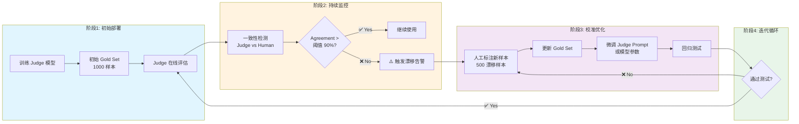

# 图6：人类-in-the-loop 校准流程

```mermaid
flowchart LR
    subgraph Phase1["阶段1: 初始部署"]
        A["训练 Judge 模型"] --> B["初始 Gold Set\n1000 样本"]
        B --> C["Judge 在线评估"]
    end
    
    subgraph Phase2["阶段2: 持续监控"]
        C --> D["一致性检测\nJudge vs Human"]
        D --> E{"Agreement >\n阈值 90%?"}
        E -->|✅ Yes| F["继续使用"]
        E -->|❌ No| G["⚠️ 触发漂移告警"]
    end
    
    subgraph Phase3["阶段3: 校准优化"]
        G --> H["人工标注新样本\n500 漂移样本"]
        H --> I["更新 Gold Set"]
        I --> J["微调 Judge Prompt\n或模型参数"]
        J --> K["回归测试"]
    end
    
    subgraph Phase4["阶段4: 迭代循环"]
        K --> L{"通过测试?"}
        L -->|✅ Yes| C
        L -->|❌ No| H
    end
    
    style Phase1 fill:#e1f5fe
    style Phase2 fill:#fff3e0
    style Phase3 fill:#f3e5f5
    style Phase4 fill:#e8f5e9
```
