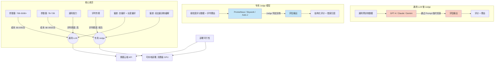

# 图8：专用 Judge 模型 vs 通用 LLM 概念图

```mermaid
graph TB
    subgraph "通用 LLM 做 Judge"
        A1[GPT-4 / Claude / Gemini] -->|通过 Prompt 临时扮演| A2[评估输出]
        A3[通用预训练数据] --> A1
        A2 --> A4[评分 + 理由]
        style A1 fill:#f9d0c4
        style A2 fill:#f9d0c4
    end

    subgraph "专用 Judge 模型"
        B1[Prometheus / Skywork / Auto-J] -->|Judge 特定训练| B2[评估输出]
        B3[细粒度评分数据 + 评判理由] --> B1
        B2 --> B4[结构化评分 + 错误归因]
        style B1 fill:#c4e6f9
        style B2 fill:#c4e6f9
    end

    subgraph "核心差异"
        C1[参数量: 70B-500B+] -->|成本: $0.005/次| D1
        C2[参数量: 7B-72B] -->|成本: $0.0002/次| D2
        C3[通用能力] -->|评判精度: 高| D1
        C4[评判专精] -->|评判精度: 相当| D2
        C5["偏差: 自偏好 + 长度偏好"] --> D1
        C6["偏差: 经去偏训练缓解"] --> D2
    end

    D1((通用 LLM))
    D2((专用 Judge))

    E[部署可行性] --> F1[需要云端 API]
    E --> F2[可本地部署, 消费级 GPU]

    D1 --> F1
    D2 --> F2
```

> **图8 说明**：专用 Judge 模型在评判质量上与通用 LLM 相当，但在参数量、成本和部署便利性上具有显著优势。其核心差异在于训练目标（评判 vs 生成）和训练数据（细粒度评分 vs 通用语料）。
