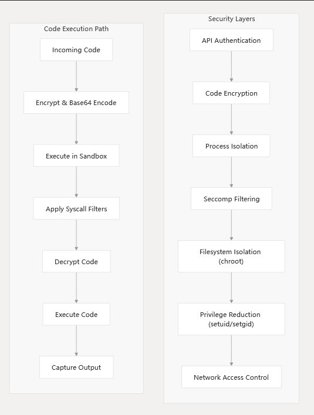
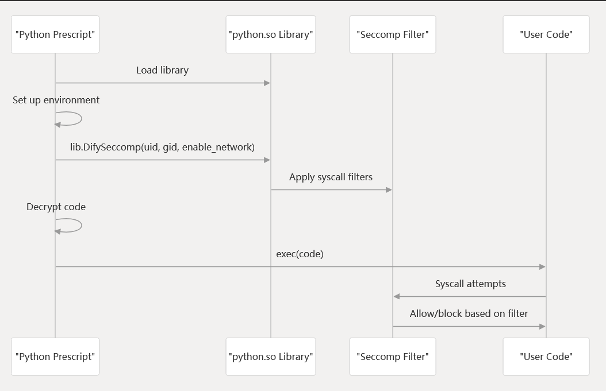

<p></p>
<!-- more -->

# **Security Model**

### **Security Architecture Overview**




### **Syscall Filtering with Seccomp**
**Python Seccomp Implementation**




### 实现
[python.go](https://github.com/langgenius/dify-sandbox/blob/main/internal/core/runner/python/python.go)

```go
type PythonRunner struct {
	runner.TempDirRunner
}

//go:embed prescript.py
var sandbox_fs []byte

func (p *PythonRunner) Run(
	code string,
	timeout time.Duration,
	stdin []byte,
	preload string,
	options *types.RunnerOptions,
) (chan []byte, chan []byte, chan bool, error) {
	configuration := static.GetDifySandboxGlobalConfigurations()

	// initialize the environment
	untrusted_code_path, key, err := p.InitializeEnvironment(code, preload, options)
	if err != nil {
		return nil, nil, nil, err
	}

	// capture the output
	output_handler := runner.NewOutputCaptureRunner()
	output_handler.SetTimeout(timeout)
	output_handler.SetAfterExitHook(func() {
		// remove untrusted code
		os.Remove(untrusted_code_path)
	})

	// create a new process   ### 执行python代码的进程
	cmd := exec.Command(
		configuration.PythonPath,
		untrusted_code_path,
		LIB_PATH,
		key,
	)
	cmd.Env = []string{}
	cmd.Dir = LIB_PATH

	if configuration.Proxy.Socks5 != "" {
		cmd.Env = append(cmd.Env, fmt.Sprintf("HTTPS_PROXY=%s", configuration.Proxy.Socks5))
		cmd.Env = append(cmd.Env, fmt.Sprintf("HTTP_PROXY=%s", configuration.Proxy.Socks5))
	} else if configuration.Proxy.Https != "" || configuration.Proxy.Http != "" {
		if configuration.Proxy.Https != "" {
			cmd.Env = append(cmd.Env, fmt.Sprintf("HTTPS_PROXY=%s", configuration.Proxy.Https))
		}
		if configuration.Proxy.Http != "" {
			cmd.Env = append(cmd.Env, fmt.Sprintf("HTTP_PROXY=%s", configuration.Proxy.Http))
		}
	}

	if len(configuration.AllowedSyscalls) > 0 {
		cmd.Env = append(cmd.Env,
			fmt.Sprintf("ALLOWED_SYSCALLS=%s",
				strings.Trim(strings.Join(strings.Fields(fmt.Sprint(configuration.AllowedSyscalls)), ","), "[]"),
			),
		)
	}

	err = output_handler.CaptureOutput(cmd)
	if err != nil {
		return nil, nil, nil, err
	}

	return output_handler.GetStdout(), output_handler.GetStderr(), output_handler.GetDone(), nil
}

func (p *PythonRunner) InitializeEnvironment(code string, preload string, options *types.RunnerOptions) (string, string, error) {
	if !checkLibAvaliable() {
		// ensure environment is reversed
		releaseLibBinary(false)
	}

	// create a tmp dir and copy the python script
	temp_code_name := strings.ReplaceAll(uuid.New().String(), "-", "_")
	temp_code_name = strings.ReplaceAll(temp_code_name, "/", ".")

    /// 把prescript.py中的placeholder都替换掉
	script := strings.Replace(
		string(sandbox_fs),
		"{{uid}}", strconv.Itoa(static.SANDBOX_USER_UID), 1,
	)

	script = strings.Replace(
		script,
		"{{gid}}", strconv.Itoa(static.SANDBOX_GROUP_ID), 1,
	)

	if options.EnableNetwork {
		script = strings.Replace(
			script,
			"{{enable_network}}", "1", 1,
		)
	} else {
		script = strings.Replace(
			script,
			"{{enable_network}}", "0", 1,
		)
	}

	script = strings.Replace(
		script,
		"{{preload}}",
		fmt.Sprintf("%s\\n", preload),
		1,
	)

	// generate a random 512 bit key
	key_len := 64
	key := make([]byte, key_len)
	_, err := rand.Read(key)
	if err != nil {
		return "", "", err
	}
    /// 代码加密
	// encrypt the code  
	encrypted_code := make([]byte, len(code))
	for i := 0; i < len(code); i++ {
		encrypted_code[i] = code[i] ^ key[i%key_len]
	}

    /// 代码做base64
	// encode code using base64 
	code = base64.StdEncoding.EncodeToString(encrypted_code)
	// encode key using base64
	encoded_key := base64.StdEncoding.EncodeToString(key)

	code = strings.Replace(
		script,
		"{{code}}",
		code,
		1,
	)

	untrusted_code_path := fmt.Sprintf("%s/tmp/%s.py", LIB_PATH, temp_code_name)
	err = os.MkdirAll(path.Dir(untrusted_code_path), 0755)
	if err != nil {
		return "", "", err
	}
	err = os.WriteFile(untrusted_code_path, []byte(code), 0755)
	if err != nil {
		return "", "", err
	}

	return untrusted_code_path, encoded_key, nil
}
```

[prescript.py](https://github.com/langgenius/dify-sandbox/blob/main/internal/core/runner/python/prescript.py)

```python
import ctypes
import os
import sys
import traceback
# setup sys.excepthook
def excepthook(type, value, tb):
    sys.stderr.write("".join(traceback.format_exception(type, value, tb)))
    sys.stderr.flush()
    sys.exit(-1)

sys.excepthook = excepthook

lib = ctypes.CDLL("./python.so")
lib.DifySeccomp.argtypes = [ctypes.c_uint32, ctypes.c_uint32, ctypes.c_bool]
lib.DifySeccomp.restype = None

# get running path
running_path = sys.argv[1]
if not running_path:
    exit(-1)

# get decrypt key
key = sys.argv[2]
if not key:
    exit(-1)

from base64 import b64decode
key = b64decode(key)

os.chdir(running_path)

{{preload}}

lib.DifySeccomp({{uid}}, {{gid}}, {{enable_network}})

code = b64decode("{{code}}")

def decrypt(code, key):
    key_len = len(key)
    code_len = len(code)
    code = bytearray(code)
    for i in range(code_len):
        code[i] = code[i] ^ key[i % key_len]
    return bytes(code)

code = decrypt(code, key)
exec(code)
```
