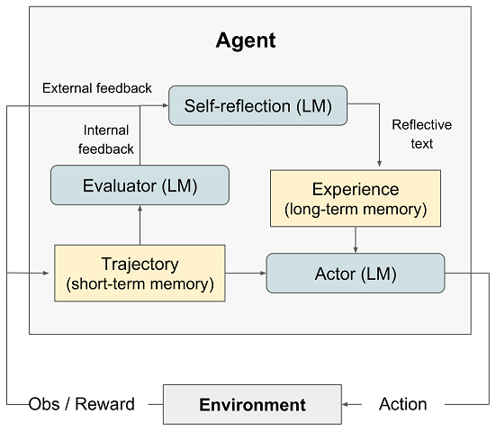
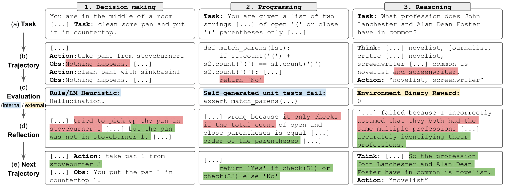
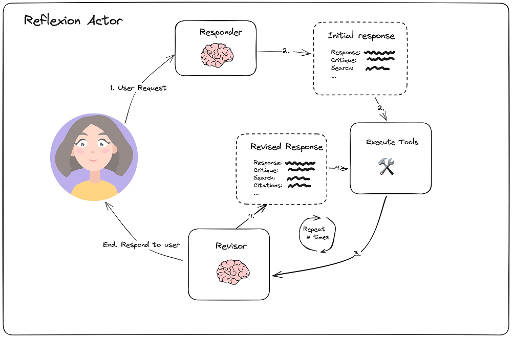

<p></p>
<!-- more -->

# ReAct
### 论文
+ 论文地址  
  [ReAct: Synergizing Reasoning and Acting in Language Models](https://arxiv.org/pdf/2210.03629)   

+ 开源地址  
  [ReAct](https://github.com/ysymyth/ReAct) git  

+ Project page  
  [ReAct: Synergizing Reasoning and Acting in Language Models](https://react-lm.github.io/)    

### 实现[1]


``` python
import json
import sys

folder = './prompts/'
prompt_file = 'prompts_naive.json'
with open(folder + prompt_file, 'r') as f:
    prompt_dict = json.load(f)

webthink_examples = prompt_dict['webthink_simple6']
instruction = """Solve a question answering task with interleaving Thought, Action, Observation steps. Thought can reason about the current situation, and Action can be three types: 
(1) Search[entity], which searches the exact entity on Wikipedia and returns the first paragraph if it exists. If not, it will return some similar entities to search.
(2) Lookup[keyword], which returns the next sentence containing keyword in the current passage.
(3) Finish[answer], which returns the answer and finishes the task.
Here are some examples.
"""
webthink_prompt = instruction + webthink_examples

```

# Reflexion

### 论文
+ 论文地址
  [Reflexion: Language Agents with Verbal Reinforcement Learning](https://arxiv.org/pdf/2303.11366) 

+ 开源地址
  [reflexion](https://github.com/noahshinn/reflexion) git




如图所示，Reflexion框架包含四个组成部分：
+ Actor: Actor由LLM担任，主要工作是基于当前环境生成下一步的动作。
+ Evaluator: Evlauator主要工作是衡量Actor生成结果的质量。就像强化学习中的Reward函数对Actor的执行结果进行打分。
+ Self-reflexion：Self-reflexion一般由LLM担任，是Reflexion框架中最重要的部分。它能结合离散的reward信号(如success/fail)、trajectory等生成具体且详细语言反馈信号，这种反馈信号会储存在Memory中，启发下一次实验的Actor执行动作。相比reward分数，这种语言反馈信号储存更丰富的信息，例如在代码生成任务中，Reward只会告诉你任务是失败还是成功，但是Self-reflexion会告诉你哪一步错了，错误的原因是什么等。
+ Memory：分为短期记忆(short-term)和长期记忆(long-term)。在一次实验中的上下文称为短期记忆，多次试验中Self-reflexion的结果称为长期记忆。类比人类思考过程，在推理阶段Actor会不仅会利用短期记忆，还会结合长期记忆中存储的重要细节，这是Reflexion框架能取得效果的关键。
    


### 实现[10]


+ Initial responder
``` python
import datetime

actor_prompt_template = ChatPromptTemplate.from_messages(
    [
        (
            "system",
            """You are expert researcher.
Current time: {time}

1. {first_instruction}
2. Reflect and critique your answer. Be severe to maximize improvement.
3. Recommend search queries to research information and improve your answer.""",
        ),
        MessagesPlaceholder(variable_name="messages"),
        (
            "user",
            "\n\n<system>Reflect on the user's original question and the"
            " actions taken thus far. Respond using the {function_name} function.</reminder>",
        ),
    ]
).partial(
    time=lambda: datetime.datetime.now().isoformat(),
)
initial_answer_chain = actor_prompt_template.partial(
    first_instruction="Provide a detailed ~250 word answer.",
    function_name=AnswerQuestion.__name__,
) | llm.bind_tools(tools=[AnswerQuestion])
validator = PydanticToolsParser(tools=[AnswerQuestion])

first_responder = ResponderWithRetries(
    runnable=initial_answer_chain, validator=validator
)
```

+ Revision
``` python
revise_instructions = """Revise your previous answer using the new information.
    - You should use the previous critique to add important information to your answer.
        - You MUST include numerical citations in your revised answer to ensure it can be verified.
        - Add a "References" section to the bottom of your answer (which does not count towards the word limit). In form of:
            - [1] https://example.com
            - [2] https://example.com
    - You should use the previous critique to remove superfluous information from your answer and make SURE it is not more than 250 words.
"""


# Extend the initial answer schema to include references.
# Forcing citation in the model encourages grounded responses
class ReviseAnswer(AnswerQuestion):
    """Revise your original answer to your question. Provide an answer, reflection,

    cite your reflection with references, and finally
    add search queries to improve the answer."""

    references: list[str] = Field(
        description="Citations motivating your updated answer."
    )


revision_chain = actor_prompt_template.partial(
    first_instruction=revise_instructions,
    function_name=ReviseAnswer.__name__,
) | llm.bind_tools(tools=[ReviseAnswer])
revision_validator = PydanticToolsParser(tools=[ReviseAnswer])

revisor = ResponderWithRetries(runnable=revision_chain, validator=revision_validator)

```

# 总结
【ReAct 和 Reflexion 实现主要靠 prompt 工程】

# 参考
### ReAct 
1. [hotpotqa.ipynb](https://github.com/ysymyth/ReAct/blob/master/hotpotqa.ipynb) 

### Reflexion
10. [reflexion.ipynb](https://github.com/langchain-ai/langgraph/blob/main/docs/docs/tutorials/reflexion/reflexion.ipynb) git
11. [【论文阅读】Reflexion: 大模型如何从错误经验中学习？](https://zhuanlan.zhihu.com/p/639254455) 

1xx. [Reflection Agents](https://blog.langchain.dev/reflection-agents/)  
   [LangGraph：Reflection Agents 实战](https://www.bilibili.com/video/BV1KJ4m1a7rZ/) V  

1xx. [Reflexion: 带言语强化学习的语言智体](https://zhuanlan.zhihu.com/p/671508578)  
    
### xxx
[Agent四大范式 | CRITIC：吴恩达力推Agent设计范式](https://zhuanlan.zhihu.com/p/691370751)  


###  Practice
[Translation Agent: Agentic translation using reflection workflow](https://github.com/andrewyng/translation-agent)