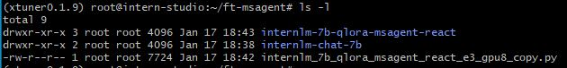
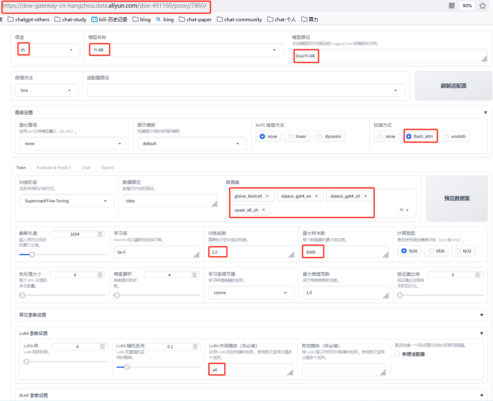
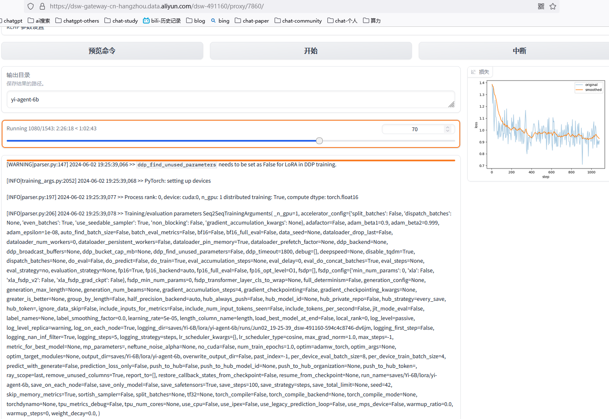
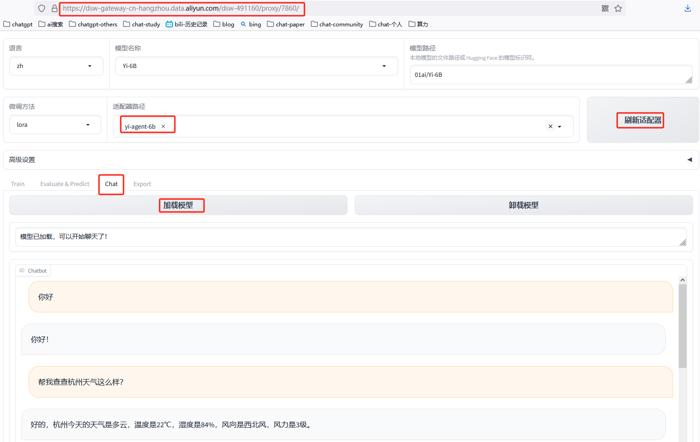

<p></p>
<!-- more -->


# 基于微调的Agent - Function Call[1][2]

+ 基座模型  
  internLM  
+  微调框架  
  xtuner  




# Agent Tuning[3]

+ 基座模型   
  Yi-6B   
+ Datasets  
+  微调框架  
  LLama-Factory

### 环境准备

```
# source code
git clone -b v0.7.1  <https://github.com/hiyouga/LLaMA-Factory.git>
git switch -c v0.7.1
cd LLaMA-Factory

# package 安装
conda create -n llama_factory python=3.10
conda activate llama_factory
pip install llmtuner==0.5.1

# 环境变量
export CUDA_VISIBLE_DEVICES=0 # 使用第一块 GPU
export USE_MODELSCOPE_HUB=1 # 使用魔搭社区下载渠道

# 阿里云必须加这句，不然页面会报异常
$ export GRADIO_ROOT_PATH=/${JUPYTER_NAME}/proxy/7860/

# 启动
python -m llmtuner.webui.interface

```

### 训练流程

```
# flash-attn 安装
pip install flash-attn --no-build-isolation

pip install modelscope -U

```

- 训练脚本

```
# 训练轮数 1.0

CUDA_VISIBLE_DEVICES=0 python src/train_bash.py \\
    --stage sft \\
    --do_train True \\
    --model_name_or_path 01ai/Yi-6B \\
    --finetuning_type lora \\
    --template default \\
    --flash_attn True \\
    --dataset_dir data \\
    --dataset glaive_toolcall,alpaca_gpt4_en,alpaca_gpt4_zh,oaast_sft_zh \\
    --cutoff_len 1024 \\
    --learning_rate 5e-05 \\
    --num_train_epochs 1.0 \\
    --max_samples 8000 \\
    --per_device_train_batch_size 4 \\
    --gradient_accumulation_steps 4 \\
    --lr_scheduler_type cosine \\
    --max_grad_norm 1.0 \\
    --logging_steps 5 \\
    --save_steps 100 \\
    --warmup_steps 0 \\
    --lora_rank 8 \\
    --lora_dropout 0.1 \\
    --lora_target all \\
    --output_dir saves/Yi-6B/lora/yi-agent-6b \\
    --fp16 True \\
    --plot_loss True

```

- 训练配置
    
    
- 训练结果
    

- 效果展示  
  工具调用 - 查询天气  
  【1个epoch好像有点问题】  
    

---


# Tuning
1. [xtuner 实战](https://github.com/InternLM/tutorial/blob/main/xtuner/README.md) 
   4【补充】用 MS-Agent 数据集 赋予 LLM 以 Agent 能力
2. [(4)XTuner 大模型单卡低成本微调实战](https://www.bilibili.com/video/BV1yK4y1B75J/) V
3. [单卡 3 小时训练专属大模型 Agent：基于 LLaMA Factory 实战](https://zhuanlan.zhihu.com/p/678989191)


### AgentTuning
1xx. [基于llama7B的文本嵌入模型ANGLE：兼看Agent微调数据的生成方案](https://mp.weixin.qq.com/s?__biz=MzAxMjc3MjkyMg==&mid=2648404626&idx=1&sn=da5ac106548dd30f14a57a5ce4d90f08)  AgentTuning  
1xx. [LLM之Agent（五）| AgentTuning：清华大学与智谱AI提出AgentTuning提高大语言模型Agent能力](https://zhuanlan.zhihu.com/p/671295938)  
1xx. [AgentTuning解读](https://zhuanlan.zhihu.com/p/663362992?utm_id=0)  

### AgentTuning 实战
1xx. [2024年大模型Agent tuning关键技术Fireact, Agent-FLAN, AgentOhana, Agent LUMOS, STE, ETO,MoE, DebateGPT等](https://zhuanlan.zhihu.com/p/690012170)  

1xx. [Agent-FLAN 技术报告——社区翻译版 ](https://mp.weixin.qq.com/s/UCO_m38QcWdCoT_DIFc96A)

1xx. [LLM 大模型学习必知必会系列(九)：Agent微调最佳实践，用消费级显卡训练属于自己的Agent！](https://cloud.tencent.com/developer/article/2421687)

