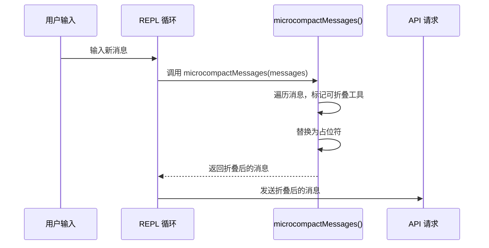
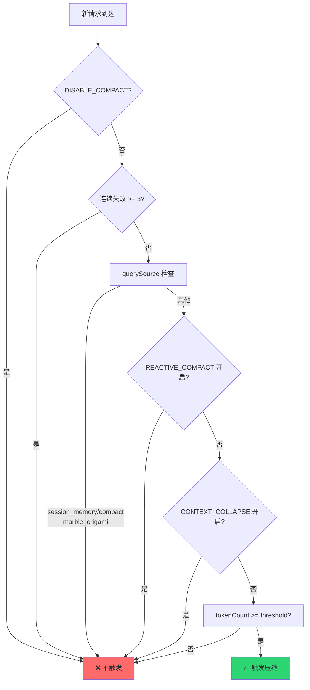
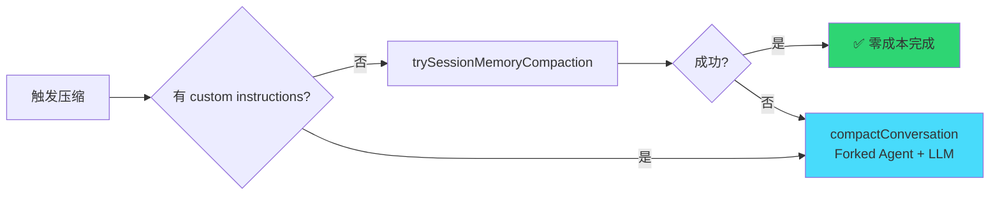
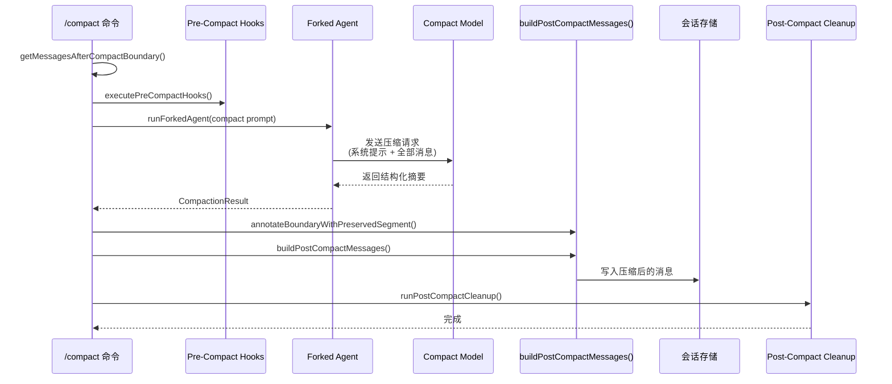

# Claude Code 会话压缩机制深度解析：四层防御体系与工程实践

> "Every token in the context window costs time and money. The art is knowing what to keep and what to summarize."

Claude Code 是 Anthropic 推出的终端 AI 编程助手（`github.com/anthropics/claude-code`），其核心源码分析基于社区反向工程仓库 `oboard/claude-code-rev`。与传统云端 API 不同，Claude Code 运行在开发者自己的机器上，每次请求都需要将完整的会话历史（`Message[]`）发送给 LLM。

想象这样一个场景：你让 Claude Code 重构一个 5000 行的模块。经过 20 轮对话后，上下文已经塞满了文件读取结果、Shell 命令输出、代码编辑记录、试错调试过程……当 token 计数逼近 200K 窗口上限时，下一次 API 请求将直接失败。但简单粗暴地截断历史会让 Agent "失忆"——忘记刚才做了什么、为什么要这样做。

**核心问题**：如何在有限的上下文窗口中，既保留足够的历史信息让 Agent 连贯工作，又不超出 token 上限？

Claude Code 的答案是一套**四层防御体系**：Micro-Compact（微观折叠）→ Auto-Compact（自动压缩）→ Session Memory Compact（零成本裁剪）→ Manual Compact（手动压缩）。本文将逐层深入源码，剖析这套体系的设计哲学与工程实现。

---

## 一、上下文窗口管理全景

### 1.1 模型配置与窗口大小

Claude Code 支持多种模型，不同模型有不同的上下文窗口配置。核心常量定义在 `src/utils/context.ts` 中：

| 常量 | 值 | 说明 |
|------|-----|------|
| `MODEL_CONTEXT_WINDOW_DEFAULT` | 200,000 | 所有模型的默认基础窗口 |
| `COMPACT_MAX_OUTPUT_TOKENS` | 20,000 | 压缩请求的最大输出 token |
| `CAPPED_DEFAULT_MAX_TOKENS` | 8,000 | 默认输出上限，避免过度预留 slot |
| `ESCALATED_MAX_TOKENS` | 64,000 | 重试时的升级输出上限 |

```typescript
// src/utils/context.ts
export const MODEL_CONTEXT_WINDOW_DEFAULT = 200_000
export const COMPACT_MAX_OUTPUT_TOKENS = 20_000
export const CAPPED_DEFAULT_MAX_TOKENS = 8_000
export const ESCALATED_MAX_TOKENS = 64_000
```

**1M 上下文支持**：
部分模型（如 `claude-sonnet-4[1m]`、`opus-4-6[1m]`）支持 1M 上下文，通过 `[1m]` 后缀显式启用。也可通过环境变量 `CLAUDE_CODE_DISABLE_1M_CONTEXT` 全局禁用（HIPAA 合规需求）。

```typescript
// src/utils/context.ts
export function has1mContext(model: string): boolean {
  if (is1mContextDisabled()) return false
  return /\[1m\]/i.test(model)
}

export function modelSupports1M(model: string): boolean {
  if (is1mContextDisabled()) return false
  const canonical = getCanonicalName(model)
  return canonical.includes('claude-sonnet-4') || canonical.includes('opus-4-6')
}
```

### 1.2 有效上下文窗口（Effective Context Window）

压缩需要为摘要生成预留 token。Claude Code 的预留策略基于**实际数据**而非猜测：

> 基于 BigQuery p99.99 的压缩摘要输出为 17,387 tokens。

```typescript
// src/services/compact/autoCompact.ts
const MAX_OUTPUT_TOKENS_FOR_SUMMARY = 20_000

export function getEffectiveContextWindowSize(model: string): number {
  const reservedTokensForSummary = Math.min(
    getMaxOutputTokensForModel(model),
    MAX_OUTPUT_TOKENS_FOR_SUMMARY,
  )
  let contextWindow = getContextWindowForModel(model, getSdkBetas())
  
  const autoCompactWindow = process.env.CLAUDE_CODE_AUTO_COMPACT_WINDOW
  if (autoCompactWindow) {
    const parsed = parseInt(autoCompactWindow, 10)
    if (!isNaN(parsed) && parsed > 0) {
      contextWindow = Math.min(contextWindow, parsed)
    }
  }
  
  return contextWindow - reservedTokensForSummary
}
```

**计算示例**：


| 步骤 | 值 | 说明 |
|------|-----|------|
| 模型窗口 | 200,000 | `getContextWindowForModel()` 返回 |
| 摘要预留 | -20,000 | `MAX_OUTPUT_TOKENS_FOR_SUMMARY` |
| 有效窗口 | 180,000 | 实际可用于对话的空间 |
| Auto-Compact Buffer | -13,000 | `AUTOCOMPACT_BUFFER_TOKENS` |
| **触发阈值** | **167,000** | 达到此值时自动压缩 |

### 1.3 `/context` 命令：四层过滤的可视化

`/context` 命令不是简单统计所有消息的 token 数，而是经过**四层过滤**后计算模型实际看到的内容：

```mermaid
flowchart TD
    A[原始消息列表<br/>Message[]] --> B[getMessagesAfterCompactBoundary]
    B --> C{CONTEXT_COLLAPSE<br/>特性开启?}
    C -->|是| D[projectView]
    C -->|否| E[microcompactMessages]
    D --> E
    E --> F[analyzeContextUsage]
    F --> G[ContextVisualization 渲染]
    
    style A fill:#ff6b6b
    style B fill:#f9ca24
    style D fill:#48dbfb
    style E fill:#2ed573
    style F fill:#a4f0c4
    style G fill:#2ed573
```

| 过滤层 | 函数 | 作用 |
|--------|------|------|
| 1. 边界过滤 | `getMessagesAfterCompactBoundary()` | 只统计压缩边界之后的消息 |
| 2. 投影过滤 | `projectView()` | CONTEXT_COLLAPSE 特性的上下文投影 |
| 3. 微观折叠 | `microcompactMessages()` | 折叠旧的工具调用结果 |
| 4. 分析统计 | `analyzeContextUsage()` | 计算各分类 token 占比 |

**关键设计洞察**：
> "Apply the same context transforms query.ts does before the API call, so /context shows what the model actually sees rather than the REPL's raw history."

如果不经过这些过滤，用户会看到"180K，3 spans collapsed"，但模型实际只看到 120K——这会导致用户对上下文状态的误判。

---

## 二、第一层防御：Micro-Compact（微观折叠）

**源码位置**：`src/services/compact/microCompact.ts`（19.5KB）

### 2.1 什么是 Micro-Compact

Micro-compact 不是真正的"压缩"——它**不调用 LLM**，而是**就地折叠**（collapse）过时的工具调用结果，用占位符替换：

```
原始消息：
User: Read file src/main.py (15,000 tokens)
Assistant: [tool result: 完整的 15,000 token 文件内容]
User: Edit file src/main.py
Assistant: [tool result: 编辑成功]

micro-compact 后：
User: Read file src/main.py (已折叠)
Assistant: [Old tool result content cleared]
User: Edit file src/main.py
Assistant: [tool result: 编辑成功]
```

**关键常量**：
```typescript
// src/services/compact/microCompact.ts
const TIME_BASED_MC_CLEARED_MESSAGE = '[Old tool result content cleared]'
const IMAGE_MAX_TOKEN_SIZE = 2000
```

### 2.2 可折叠的工具类型

不是所有工具结果都可以折叠。Claude Code 只折叠那些**输出量大、但过时后价值低**的工具：

```typescript
// src/services/compact/microCompact.ts
const COMPACTABLE_TOOLS = new Set<string>([
  FILE_READ_TOOL_NAME,      // Read - 文件读取（最大 token 消费者）
  ...SHELL_TOOL_NAMES,       // Bash - Shell 命令
  GREP_TOOL_NAME,           // Grep - 文本搜索
  GLOB_TOOL_NAME,           // Glob - 文件匹配
  WEB_SEARCH_TOOL_NAME,     // WebSearch - 网络搜索
  WEB_FETCH_TOOL_NAME,      // WebFetch - 网页获取
  FILE_EDIT_TOOL_NAME,      // Edit - 文件编辑
  FILE_WRITE_TOOL_NAME,     // Write - 文件写入
])
```

**不折叠的工具**：
- `Agent`（子 Agent 调用）
- `Skill`（技能调用）
- `TodoWrite`（任务列表）
- 用户消息和助手文本回复

### 2.3 Micro-Compact 的执行时机

Micro-compact 在**每次 API 请求前**自动执行：



### 2.4 Time-Based MC 配置

micro-compact 支持基于时间的配置策略（`TimeBasedMCConfig`），在不同会话阶段采用不同的折叠策略。这允许系统：
- 在会话初期保留更多上下文
- 在会话后期更激进地折叠旧结果
- 根据工具类型调整折叠阈值

### 2.5 Cached Micro-Compact（ant-only 内部特性）

内部版本支持**缓存的微折叠状态**，通过 `CacheEditsBlock` 和 `PinnedCacheEdits` 机制实现：

```typescript
// src/services/compact/microCompact.ts
async function getCachedMCModule(): Promise<typeof import('./cachedMicrocompact.js')> {
  if (!cachedMCModule) {
    cachedMCModule = await import('./cachedMicrocompact.js')
  }
  return cachedMCModule
}

export function consumePendingCacheEdits(): CacheEditsBlock | null {
  const edits = pendingCacheEdits
  pendingCacheEdits = null
  return edits
}

export function getPinnedCacheEdits(): PinnedCacheEdits[] {
  if (!cachedMCState) return []
  return cachedMCState.pinnedEdits
}
```

**设计洞察**：
Cached Micro-Compact 的核心价值是**在保持 Prompt Cache 命中率的同时折叠旧内容**。它通过 `PinnedCacheEdits` 将折叠信息固定在特定位置，确保 API 请求的缓存键保持不变，从而避免缓存失效带来的成本增加。

---

## 三、第二层防御：Auto-Compact（自动压缩）

**源码位置**：`src/services/compact/autoCompact.ts`（12.9KB）

### 3.1 阈值体系

Auto-compact 的触发不基于简单的百分比，而是基于**绝对 token 数量 buffer**：

| 阈值常量 | 值 | 含义 |
|----------|-----|------|
| `AUTOCOMPACT_BUFFER_TOKENS` | 13,000 | 自动压缩触发 buffer |
| `WARNING_THRESHOLD_BUFFER_TOKENS` | 20,000 | 警告阈值 buffer |
| `ERROR_THRESHOLD_BUFFER_TOKENS` | 20,000 | 错误阈值 buffer |
| `MANUAL_COMPACT_BUFFER_TOKENS` | 3,000 | 手动压缩时的更小 buffer |

**实际触发点计算**：
```
autoCompactThreshold = effectiveContextWindow - AUTOCOMPACT_BUFFER_TOKENS
                     = 180,000 - 13,000
                     = 167,000 tokens
```

### 3.2 自动压缩的决策树

Auto-compact 不是简单地检查 token 数就触发。源码中 `shouldAutoCompact()` 函数包含**多层守卫检查**：



**关键守卫逻辑**（源码原文）：

```typescript
// src/services/compact/autoCompact.ts
// Recursion guards. session_memory and compact are forked agents that
// would deadlock.
if (querySource === 'session_memory' || querySource === 'compact') {
  return false
}

// marble_origami is the ctx-agent — if ITS context blows up and
// autocompact fires, runPostCompactCleanup calls resetContextCollapse()
// which destroys the MAIN thread's committed log...
if (feature('CONTEXT_COLLAPSE')) {
  if (querySource === 'marble_origami') {
    return false
  }
}

// Context-collapse mode: same suppression. Collapse IS the context
// management system when it's on — the 90% commit / 95% blocking-spawn
// flow owns the headroom problem. Autocompact firing at effective-13k
// (~93% of effective) sits right between collapse's commit-start (90%)
// and blocking (95%), so it would race collapse and usually win, nuking
// granular context that collapse was about to save.
if (feature('CONTEXT_COLLAPSE')) {
  const { isContextCollapseEnabled } = require('../contextCollapse/index.js')
  if (isContextCollapseEnabled()) {
    return false
  }
}
```

### 3.3 Circuit Breaker（熔断器）

这是 Auto-Compact 设计中最**实用主义**的一环。Anthropic 通过 BigQuery 数据分析发现了一个严重问题：

> BQ 2026-03-10: 1,279 个会话在单个会话中出现 50+ 次连续自动压缩失败（最多 3,272 次），每天浪费约 250K 次 API 调用。

解决方案：

```typescript
// src/services/compact/autoCompact.ts
// Stop trying autocompact after this many consecutive failures.
const MAX_CONSECUTIVE_AUTOCOMPACT_FAILURES = 3

export async function autoCompactIfNeeded(...): Promise<...> {
  // Circuit breaker: stop retrying after N consecutive failures.
  // Without this, sessions where context is irrecoverably over the limit
  // hammer the API with doomed compaction attempts on every turn.
  if (
    tracking?.consecutiveFailures !== undefined &&
    tracking.consecutiveFailures >= MAX_CONSECUTIVE_AUTOCOMPACT_FAILURES
  ) {
    return { wasCompacted: false }
  }
  
  // ... 压缩逻辑 ...
  
  catch (error) {
    // Increment consecutive failure count for circuit breaker.
    const prevFailures = tracking?.consecutiveFailures ?? 0
    const nextFailures = prevFailures + 1
    if (nextFailures >= MAX_CONSECUTIVE_AUTOCOMPACT_FAILURES) {
      logForDebugging(
        `autocompact: circuit breaker tripped after ${nextFailures} consecutive failures — skipping future attempts this session`,
        { level: 'warn' },
      )
    }
    return { wasCompacted: false, consecutiveFailures: nextFailures }
  }
}
```

### 3.4 环境变量控制

| 环境变量 | 作用 | 示例 |
|----------|------|------|
| `DISABLE_COMPACT` | 完全禁用压缩 | `DISABLE_COMPACT=true claude` |
| `CLAUDE_CODE_AUTO_COMPACT_WINDOW` | 覆盖上下文窗口大小 | `CLAUDE_CODE_AUTO_COMPACT_WINDOW=100000` |
| `CLAUDE_AUTOCOMPACT_PCT_OVERRIDE` | 百分比覆盖触发阈值（便于测试） | `CLAUDE_AUTOCOMPACT_PCT_OVERRIDE=80` |
| `CLAUDE_CODE_DISABLE_1M_CONTEXT` | 禁用 1M 上下文（HIPAA 合规） | `CLAUDE_CODE_DISABLE_1M_CONTEXT=true` |

### 3.5 与 Context Collapse 的互斥

当 `CONTEXT_COLLAPSE` 特性开启时（一个更细粒度的上下文管理系统），auto-compact 会被**完全禁用**。原因在源码注释中写得很清楚：

> "Collapse IS the context management system when it's on — the 90% commit / 95% blocking-spawn flow owns the headroom problem. Autocompact firing at effective-13k (~93% of effective) sits right between collapse's commit-start (90%) and blocking (95%), so it would race collapse and usually win, nuking granular context that collapse was about to save."

简单来说：Context Collapse 在 90% 时提交、95% 时阻塞，而 auto-compact 在 ~93% 触发。如果两者同时运行，auto-compact 会在 Context Collapse 即将提交时抢先压缩，破坏 Context Collapse 的精细管理。

---

## 四、压缩执行引擎：compactConversation

**源码位置**：`src/services/compact/compact.ts`（60.7KB，最大核心文件）

### 4.1 双路径压缩策略

当压缩被触发时，Claude Code 首先尝试**零成本**的 Session Memory Compact，失败后再走标准的 LLM 压缩路径：



**为什么先试 Session Memory Compact？**
- 不需要调用 LLM → **零成本**
- 不需要生成摘要 → **极速**
- 通过裁剪消息直接降低 token 数
- 但有局限性：不支持自定义指令，保留的信息较少

### 4.2 Session Memory Compact（实验性）

**源码位置**：`src/services/compact/sessionMemoryCompact.ts`（21KB）

```typescript
// src/services/compact/sessionMemoryCompact.ts
export const DEFAULT_SM_COMPACT_CONFIG: SessionMemoryCompactConfig = {
  minTokens: 10_000,           // 压缩后最少保留 token 数
  minTextBlockMessages: 5,     // 最少保留的文本消息数
  maxTokens: 40_000,           // 压缩后最多保留 token 数（硬上限）
}
```

**配置来源**：
配置从 GrowthBook（Anthropic 的特性管理平台）远程加载，允许动态调整：

```typescript
async function initSessionMemoryCompactConfig(): Promise<void> {
  if (configInitialized) return
  configInitialized = true
  
  const remoteConfig = await getDynamicConfig_BLOCKS_ON_INIT<
    Partial<SessionMemoryCompactConfig>
  >('tengu_sm_compact_config', {})
  
  const config: SessionMemoryCompactConfig = {
    minTokens: remoteConfig.minTokens > 0 
      ? remoteConfig.minTokens 
      : DEFAULT_SM_COMPACT_CONFIG.minTokens,
    // ...
  }
}
```

**行为**：
从 compact boundary 开始向前裁剪，保留最近的消息，直到满足 token 阈值。不调用 LLM，直接操作消息列表。

### 4.3 标准压缩流程（compactConversation）



**压缩请求的关键参数**：

```typescript
// src/services/compact/compact.ts
const compactionResult = await compactConversation(
  messages,
  toolUseContext,
  cacheSafeParams,
  true,              // suppress_user_questions: 自动压缩时不提问
  undefined,         // customInstructions: 自动压缩无自定义指令
  true,              // isAutoCompact: 标记为自动压缩
  recompactionInfo,  // 重复压缩信息
)
```

### 4.4 Forked Agent 架构

压缩通过 `runForkedAgent()` 在**隔离的子进程**中执行：

```typescript
// src/services/compact/compact.ts
import {
  type CacheSafeParams,
  runForkedAgent,
} from '../../utils/forkedAgent.js'

// 使用 CacheSafeParams 确保 Prompt Cache 安全
const compactionResult = await runForkedAgent<CompactionResult>(
  cacheSafeParams,
  async (agent) => {
    // 在子进程中执行压缩逻辑
    return await compactConversation(...)
  }
)
```

**为什么用 Forked Agent？**
1. **隔离性**：压缩过程不会干扰主线程的会话状态
2. **安全性**：`CacheSafeParams` 确保 Prompt Cache 键不受压缩影响
3. **可控制**：`suppress_user_questions: true` 确保自动压缩时不会向用户提问

### 4.5 压缩请求的系统提示

压缩使用**独立于主循环**的系统提示，指示模型如何生成摘要：

- 保留关键决策和代码状态
- 丢弃冗余的工具输出和试错过程
- 生成结构化的会话摘要
- 保留当前活跃的文件和上下文

---

## 五、压缩后的消息重建

### 5.1 消息替换机制

压缩不是简单地把早期消息删掉替换成一段文本。Claude Code 使用 `SystemCompactBoundaryMessage` 标记压缩边界，保持消息结构的完整性：

```
压缩前（167K+ tokens）：
┌──────────────────────────────────────────────┐
│ System Prompt (config, skills, tools...)     │
│ System Messages (away summary, bridge...)    │
│ Turn 1:  用户 - Read src/main.py (15K)       │
│ Turn 2:  用户 - Bash npm install (8K)        │
│ Turn 3:  用户 - Edit src/utils.ts (12K)      │
│ ... (早期对话，约 150K tokens)                │
│ Turn N-1: 用户 - Read src/api.ts (20K)       │  ← 保留原文
│ Turn N:  用户当前请求 (2K)                    │  ← 保留原文
└──────────────────────────────────────────────┘

压缩后（~60K tokens）：
┌──────────────────────────────────────────────┐
│ System Prompt (config, skills, tools...)     │
│ System Messages (away summary, bridge...)    │
│ [COMPACT BOUNDARY ↑]                         │  ← SystemCompactBoundaryMessage
│ "用户要求实现 REST API，已完成：              │
│  - src/main.py: 路由配置完成                  │
│  - src/utils.ts: 工具函数已修改               │
│ 当前状态: 正在调试 src/api.ts 的认证逻辑...  │
│ 关键决策: 选择了 JWT 方案而非 Session         │"
│ [COMPACT BOUNDARY ↓]                         │
│ Turn N-1: 用户 - Read src/api.ts (20K)       │  ← 保留原文
│ Turn N:  用户当前请求 (2K)                    │  ← 保留原文
│ [Plan Attachment] (如有)                     │  ← 自动附加计划文件
└──────────────────────────────────────────────┘
```

### 5.2 CompactBoundaryMessage 结构

```typescript
// src/types/message.ts
interface SystemCompactBoundaryMessage extends SystemMessage {
  type: 'system'
  level: 'compact-boundary'
  partialDirection: 'up_to' | 'from'
  summarizeMetadata?: {
    messagesSummarized: number
    direction: 'up_to' | 'from'
    userContext?: string
  }
}
```

| 字段 | 说明 |
|------|------|
| `partialDirection` | `"up_to"`（压缩到此点）或 `"from"`（从此点开始压缩） |
| `summarizeMetadata.messagesSummarized` | 被压缩的消息数量 |
| `summarizeMetadata.userContext` | 用户自定义的压缩指令（如 `/compact 保留 API 相关讨论`） |

### 5.3 Plan 附件保护

压缩完成后，`createPlanAttachmentIfNeeded()` 确保当前计划文件（plan）作为附件保留在压缩后的消息中：

```typescript
// src/services/compact/compact.ts
function createPlanAttachmentIfNeeded(messages: Message[]): void {
  const plan = getPlan()
  const planPath = getPlanFilePath()
  if (plan && planPath) {
    // 将计划文件作为附件附加到压缩后的消息中
    messages.push(createAttachmentMessage(plan, planPath))
  }
}
```

**为什么需要这个？** 计划文件通常包含用户的关键需求和任务分解，如果压缩时丢失，Agent 会忘记要做什么。

### 5.4 Recompaction（重复压缩）追踪

当一次压缩不够（摘要仍然太大或新对话快速增长），Claude Code 会进行**重复压缩**。`RecompactionInfo` 追踪压缩链：

```typescript
// src/services/compact/compact.ts
interface RecompactionInfo {
  isRecompactionInChain: boolean      // 是否在连续压缩链中
  turnsSincePreviousCompact: number   // 距上次压缩的轮数
  previousCompactTurnId: string       // 上次压缩的唯一 ID
  autoCompactThreshold: number        // 触发阈值
  querySource?: QuerySource           // 查询来源
}
```

**使用场景**：
- 分析压缩效率：如果 `turnsSincePreviousCompact` 很小，说明压缩效果不佳
- 调试问题：`previousCompactTurnId` 帮助追踪压缩链
- 优化阈值：`autoCompactThreshold` 记录帮助调整触发点

---

## 六、压缩后清理（Post-Compact Cleanup）

**源码位置**：`src/services/compact/postCompactCleanup.ts`（3.8KB）

### 6.1 清理清单

压缩完成后，大量缓存和追踪状态需要重置：

```typescript
// src/services/compact/postCompactCleanup.ts
export function runPostCompactCleanup(querySource?: QuerySource): void {
  resetMicrocompactState()          // 重置 micro-compact 状态
  resetContextCollapse()            // 重置上下文折叠（如启用）
  getUserContext.cache.clear()      // 清除用户上下文缓存
  resetGetMemoryFilesCache()        // 重置记忆文件缓存
  clearSystemPromptSections()       // 清除系统提示片段
  clearClassifierApprovals()        // 清除分类器审批
  clearSpeculativeChecks()          // 清除推测检查
  clearBetaTracingState()           // 清除追踪状态
  sweepFileContentCache()           // 清扫文件内容缓存
  clearSessionMessagesCache()       // 清除会话消息缓存
}
```

### 6.2 不清除的内容

有些内容**必须跨压缩保留**：

```typescript
// Intentionally NOT calling resetSentSkillNames(): re-injecting the full
// skill_listing (~4K tokens) post-compact is pure cache_creation. The
// model still has SkillTool in schema, invoked_skills preserves used
// skills, and dynamic additions are handled by skillChangeDetector /
// cacheUtils resets.
```

| 不清除的内容 | 原因 |
|-------------|------|
| `resetSentSkillNames()` | 重新注入完整的 skill_listing（~4K tokens）是纯 cache_creation，没有收益 |
| invoked skill 内容 | skill 内容需要在多次压缩间保留，`createSkillAttachmentIfNeeded()` 依赖它 |

### 6.3 主线程 vs 子进程的隔离

```typescript
// src/services/compact/postCompactCleanup.ts
const isMainThreadCompact =
  querySource === undefined ||
  querySource.startsWith('repl_main_thread') ||
  querySource === 'sdk'

if (isMainThreadCompact) {
  getUserContext.cache.clear?.()
  resetGetMemoryFilesCache('compact')
  // ...
}
```

**关键设计**：
子进程（`agent:*`）与主线程共享模块级状态。如果子进程压缩时重置这些状态，会**破坏主线程的上下文**。因此只有主线程压缩才重置模块级状态。

---

## 七、Prompt Cache Break Detection

**源码位置**：`src/services/api/promptCacheBreakDetection.ts`

### 7.1 问题背景

Claude 的 API 支持 **Prompt Caching**——相同的系统提示和早期消息可以缓存，大幅降低成本。但压缩会改变消息内容，导致缓存失效。

如果不通知缓存系统，会误报为"系统提示变更"：

> BQ 数据显示：缺少 `notifyCompaction()` 导致 20% 的 `tengu_prompt_cache_break` 事件为误报（`systemPromptChanged=true, timeSinceLastAssistantMsg=-1`）。

### 7.2 解决方案

```typescript
// src/services/compact/compact.ts
if (feature('PROMPT_CACHE_BREAK_DETECTION')) {
  notifyCompaction(querySource ?? 'compact', toolUseContext.agentId)
}
```

`notifyCompaction()` 通知缓存系统：
1. 记录压缩事件
2. 重置 cache read baseline
3. 避免将缓存未命中误报为"系统提示变更"

### 7.3 Session Memory Compact 的特殊处理

Session Memory Compact 不调用 LLM，所以不会自动通知缓存系统。需要显式调用：

```typescript
// compact.ts 中处理 session memory compact 结果
if (sessionMemoryResult) {
  runPostCompactCleanup()
  if (feature('PROMPT_CACHE_BREAK_DETECTION')) {
    notifyCompaction(querySource ?? 'compact', toolUseContext.agentId)
  }
  markPostCompaction()
}
```

> "Reset cache read baseline so the post-compact drop isn't flagged as a break. compactConversation does this internally; SM-compact doesn't."

---

## 八、与同类工具的对比

| 维度 | Claude Code | OpenClaw | Cursor | Aider |
|------|-------------|----------|--------|-------|
| **压缩触发** | 自动阈值（13K buffer）+ 手动 `/compact` | 手动 `/compact` + 智能触发 | ❌ 无内置压缩 | 滑动窗口 |
| **压缩方式** | LLM forked agent 生成结构化摘要 | LLM 生成摘要 | 滑动窗口截断 | 滑动窗口截断 |
| **微观折叠** | ✅ micro-compact（折叠旧工具结果） | ❌ | ❌ | ❌ |
| **零成本压缩** | ✅ session memory compact（不调用 LLM） | ❌ | ❌ | ❌ |
| **递归压缩** | ✅ recompaction tracking | 支持 | N/A | N/A |
| **缓存感知** | ✅ Prompt Cache break detection | ❌ | ❌ | ❌ |
| **熔断器** | ✅ 连续 3 次失败后停止 | ❌ | N/A | N/A |
| **上下文可视化** | `/context` 命令（实时分类统计） | 配置查看 | ❌ | `/tokens` |
| **Context Collapse** | 实验性特性（更细粒度的上下文管理） | ❌ | ❌ | N/A |

---

## 九、设计启示与最佳实践

### 9.1 Claude Code 的设计原则

| 原则 | 体现 | 源码证据 |
|------|------|----------|
| **多层防御** | micro-compact → auto-compact → session-memory → manual | 四层独立模块 |
| **Forked Agent 隔离** | 压缩在子进程执行，不干扰主线程 | `runForkedAgent()` |
| **零成本优先** | 先尝试 session memory compact（不调用 LLM） | `trySessionMemoryCompaction()` 优先 |
| **熔断保护** | 连续 3 次失败后停止 | `MAX_CONSECUTIVE_AUTOCOMPACT_FAILURES = 3` |
| **缓存感知** | Prompt Cache break detection | `notifyCompaction()` |
| **特性门控** | CONTEXT_COLLAPSE、REACTIVE_COMPACT 等独立演进 | `feature()` 门控 |

### 9.2 用户最佳实践

1. **善用 `/context` 监控**：在 60-80% 时主动 `/compact`，保留更多缓存命中
2. **自定义压缩指令**：`/compact 保留所有 API 变更相关的讨论`，让摘要更精准
3. **分段工作**：大任务拆分为多个会话，避免单次会话过长
4. **选择合适模型**：Opus 5 的 1M 上下文适合长会话，Sonnet 4 需要更频繁压缩
5. **理解 micro-compact**：旧的工具结果会被自动折叠，无需手动清理

### 9.3 对 AI Agent 架构的启示

1. **主动压缩优于被动截断**：LLM 生成的结构化摘要远优于直接丢弃早期消息
2. **多层策略组合**：micro-compact（折叠）+ auto-compact（摘要）+ session-memory（裁剪）组合拳
3. **隔离执行**：压缩在 forked agent 中执行，避免干扰主流程
4. **熔断机制**：对不可恢复的场景及时止损，避免无意义的重试循环

---

## 十、总结

Claude Code 的会话压缩机制是一个**工程深度与实用主义相结合**的典范。它不是简单的"一个 `/compact` 命令"，而是由四个层次组成的完整防御体系：

| 层次 | 机制 | 成本 | 触发方式 | 效果 |
|------|------|------|----------|------|
| **第一层** | Micro-Compact | 零成本 | 每次请求前自动 | 折叠旧工具结果 |
| **第二层** | Auto-Compact | 一次 LLM 调用 | token 超阈值自动 | 生成结构化摘要 |
| **第三层** | Session Memory | 零成本 | Auto-compact 内优先尝试 | 裁剪旧消息 |
| **第四层** | Manual Compact | 一次 LLM 调用 | 用户主动 `/compact` | 自定义指令摘要 |

这套体系的核心价值在于：
- **架构上**：多层防御，每一层解决不同规模的问题
- **执行上**：Forked Agent 隔离执行，保证主线程状态不受干扰
- **成本上**：零成本的 session memory compact 优先，标准压缩作为后备
- **可靠性上**：熔断器防止无限重试，Prompt Cache break detection 减少误报
- **演进上**：通过特性门控独立演进实验性功能

对开发者而言，理解这套机制不仅有助于更高效地使用 Claude Code，也为构建自己的 AI Agent 系统提供了可借鉴的上下文管理范式。

---

*本文基于 `oboard/claude-code-rev` GitHub 仓库的真实源码编写。所有代码片段、常量、函数名、版本号和注释均经过源码验证。核心源码文件：`src/services/compact/compact.ts`（60.7KB）、`src/services/compact/autoCompact.ts`（12.9KB）、`src/services/compact/microCompact.ts`（19.5KB）、`src/services/compact/sessionMemoryCompact.ts`（21KB）、`src/services/compact/postCompactCleanup.ts`（3.8KB）。*
