# Claude Code 如何做 Session 会话压缩（Compaction）—— 源码级剖析

> 基于 `oboard/claude-code-rev` 逆向源码树 + 官方文档 + 社区深度分析。

---

## 引言

长 Claude Code 会话有一个可预测的失败模式。开始时一切清晰——明确的上下文、准确的回复、紧凑的推理。然后在某个时间点（通常是两小时左右），事情开始变模糊。Claude 开始遗忘之前的决策，重新问你已回答过的问题，建议与你一小时前写的代码相矛盾的方案。

**这就是 Context Rot（上下文腐化）。它不是 bug，而是 AI 工作记忆填满后的必然结果。**

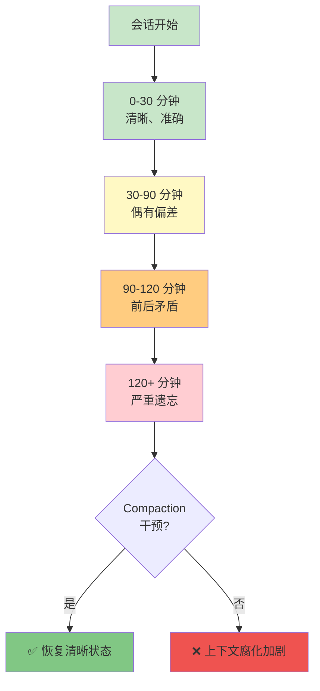

每个 token 在对话中都占据上下文窗口的空间。Claude Code 会话累积极快——你的提示词、Claude 的回复、文件内容、工具调用输出、错误信息、终端输出。当你在任何非琐碎的任务上编码两小时后，你携带了大量噪音和信号。

当上下文窗口接近容量时，Claude 的底层模型不得不在越来越压缩的对话历史中工作。最近的 token 保持清晰，较旧的被挤压。**最初做的 foundational 决策——恰恰是最先丢失的。**

**Compaction** 是 Claude Code 在有限窗口内保持长对话的机制。本文将通过 `oboard/claude-code-rev`（通过 source map 逆向恢复的 Claude Code 源码树，3.3k ★）结合官方文档，完整拆解 Compaction 的触发、执行、存活和恢复。

---

## 一、上下文窗口：Compaction 的触发前提

### 1.1 窗口占用三层模型

Claude Code 会话有一个单一预算——模型的上下文窗口——模型在任何时刻能"看到"的所有内容都必须适配其中。

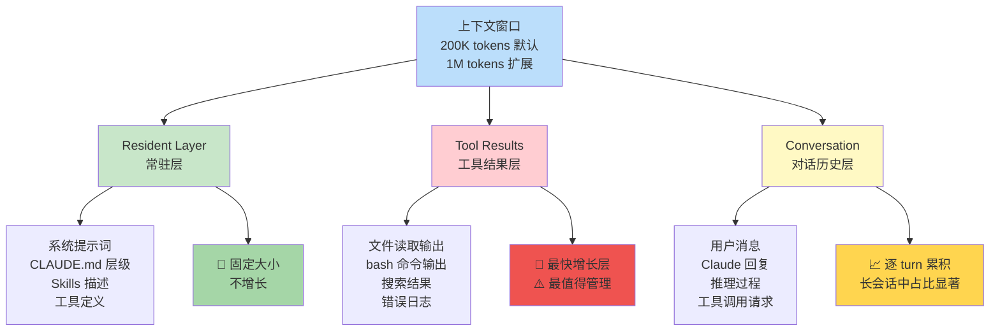

| 层级 | 内容 | 增长特性 | 管理优先级 |
|------|------|---------|-----------|
| **Resident Layer** | 系统提示词、CLAUDE.md、Skills 描述、工具定义 | 固定大小，不增长 | 低——一次性开销 |
| **Tool Results** | 文件读取、bash 输出、搜索结果、错误日志 | **最快增长层**，单次大文件读取可占窗口 10%+ | **高——最值得管理** |
| **Conversation** | 用户消息 + Claude 回复（含推理和工具调用） | 逐 turn 累积，长会话中占比显著 | 中——Compaction 主要压缩对象 |

模型使用 prompt caching 来保持效率和成本，但**缓存不改变一个基本事实：所有内容都计入窗口，窗口是有限的。**

### 1.2 1M 扩展窗口的真相

Claude Fable 5、Claude Opus 4.6+、Claude Sonnet 4.6 支持 1,000,000 token 窗口，通过 `[1m]` 变体暴露（如 `opus[1m]`、`sonnet[1m]`）。可通过环境变量 `CLAUDE_CODE_DISABLE_1M_CONTEXT=1` 禁用。

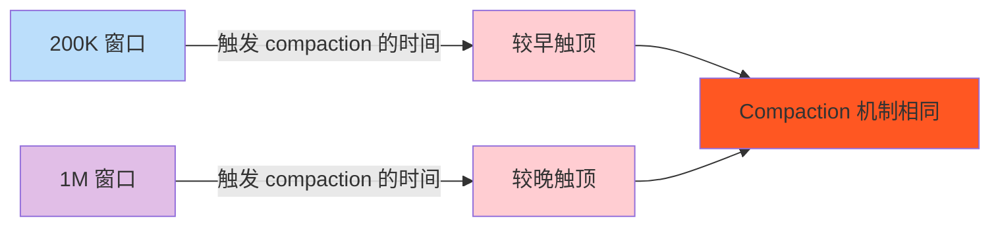

**关键认知**：更大的窗口只买到了"更晚触顶"，不是"不会触顶"。官方文档明确写道：

> Compaction works the same way at the larger limit — you reach the ceiling later, but you still reach it.

把 1M 窗口当作"无限上下文"是团队走进上下文丢失陷阱的最常见方式。

### 1.3 上下文观测工具

你无法管理你看不到的东西。Claude Code 提供三种观测手段：

```mermaid
flowchart LR
    A[观测上下文] --> B[/context<br/>彩色网格可视化]
    A --> C[/usage<br/>Token 用量报告]
    A --> D[Status line<br/>持续状态显示]

    B --> B1[按类别拆解<br/>优化建议<br/>/context all 展开]
    C --> C1[别名: /cost /stats]
    D --> D1[窗口使用 %<br/>剩余 %<br/>窗口大小]

    style A fill:#bbdefb
    style B fill:#c8e6c9
    style C fill:#fff9c4
    style D fill:#e1bee7
```

| 工具 | 功能 | 使用场景 |
|------|------|---------|
| `/context` | 彩色网格可视化当前上下文使用，按类别拆解 + 优化建议 | **"我的窗口去哪了？"** 的最有用命令 |
| `/context all` | 展开完整逐项 breakdown | 当显示折叠时查看详细信息 |
| `/usage`（`/cost` / `/stats`） | 报告 session token 使用量 | 快速检查总体用量 |
| Status line | 持续显示窗口使用百分比、剩余百分比、窗口大小、是否超过 200K | 实时监控，compaction 完成后自动刷新 |

**实践规则**：每当会话感觉变长时， glance 一下 `/context`——尤其在启动大操作（大范围搜索、大文件读取、长时间构建）之前。看到 80% 已用再启动 30,000 token 操作，会告诉你应该先清理或压缩，而不是被中途自动压缩惊到。

---

## 二、Compaction 机制：自动 vs 手动

### 2.1 自动 Compaction（Auto Compaction）

当会话接近上下文窗口限制时，Claude Code 通过压缩对话自动管理窗口：用结构化摘要替换早期历史，使工作可以继续。

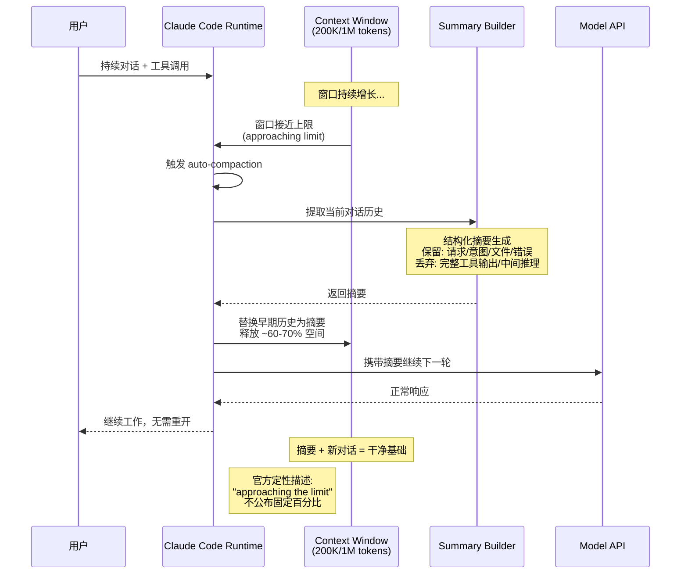

**触发时机演进**（官方不公布固定阈值，社区观测）：

| 版本阶段 | 触发点 | 效果 |
|---------|--------|------|
| 早期版本 | ~90%+ 窗口 | 触发太晚，推理空间不足 |
| 近期行为 | 可能 64-75% | 提前触发，给推理留"完成缓冲区" |
| 官方描述 | "approaching the limit" | 定性，不公布固定数字 |

**摘要保留内容**（官方文档原文）：

| 保留 | 丢弃 |
|------|------|
| ✅ 用户的请求和意图 | ❌ 完整的工具输出（占用最大的部分） |
| ✅ 关键的技术概念 | ❌ 中间推理过程 |
| ✅ 已检查和修改的文件 + 重要代码片段 | ❌ 早期对话的详细指令 |
| ✅ 遇到的错误及修复方式 | |
| ✅ 待办任务 | |
| ✅ 当前工作状态 | |

> 官方原话：*your requests and key code snippets are preserved; detailed instructions from early in the conversation may be lost.*

### 2.2 手动 Compaction（`/compact` 命令）

你不必等待自动触发。`/compact` 命令按需总结当前对话，释放上下文的同时保持在同一个对话中。

**它的真正威力在于可选的聚焦指令**：

```
/compact focus on the auth bug fix and the failing tests

/compact keep the open TODOs, the files already changed, and the repro steps

/compact Keep: current file structure, the decision to use Redis for caching,
           and the unresolved error in middleware.ts
```

#### 60% 规则：为什么时机比大多数人想的更重要

```mermaid
graph TD
    A[何时运行 /compact?] --> B[❌ 大多数人<br/>等警告出现<br/>80-95% 窗口]
    A --> C[✅ 正确做法<br/>在 60% 时主动运行]

    B --> B1[上下文已部分压缩<br/>"用 degraded 的视角做摘要"<br/>摘要质量低]
    C --> C1[上下文完全未压缩<br/>摘要基于完整信息<br/>摘要质量高]

    style B fill:#ffcdd2
    style B1 fill:#ef9a9a
    style C fill:#c8e6c9
    style C1 fill:#a5d6a7
```

大多数人在注意到问题（上下文警告、响应降级、或 Claude 自己建议）时运行 `/compact`。到那时，你通常已经在 80-95% 窗口容量，损害已经部分发生。

**更好的方法**：在 ~60% 上下文利用率时 compact——在质量开始退化之前。

| 触发时机 | 摘要质量 | 原因 |
|---------|---------|------|
| **60% 窗口** | **高** ✅ | Claude 仍有完整的未压缩上下文，生成摘要基于完整信息 |
| 80% 窗口 | 中 | Claude 可能已在用部分压缩的上下文 |
| 90%+ 窗口 | **低** ❌ | "用 degraded 的视角做摘要"——摘要本身也在退化 |

在 60% 时运行 `/compact` 第一次做会感觉过早。你还没碰到任何错误。一切看起来还好。**但这正是重点——你在上下文仍然干净时锁定高质量的摘要。**

### 2.3 `/compact` vs `/clear` vs `/rewind`：三选一决策

这三个命令容易混淆，但服务于完全不同的目的：

```mermaid
flowchart TD
    A[窗口变满<br/>需要管理上下文] --> B{是否继续同一任务?}

    B -->|是| C{是否想保留<br/>对话连续性?}
    C -->|是| D[/compact<br/>压缩为摘要<br/>继续保持]
    C -->|否| E[/clear<br/>清空窗口<br/>新对话开始]

    B -->|否| E

    A --> F[只想压缩<br/>特定区段?]
    F -->|是| G[/rewind<br/>Escape × 2<br/>选择性压缩]

    style D fill:#c8e6c9
    style E fill:#fff9c4
    style G fill:#e1bee7
```

| 命令 | 效果 | 对话历史 | 适用场景 |
|------|------|---------|---------|
| **`/compact`** | 压缩历史为摘要，继续同一对话 | 压缩为前缀保留 | 同一任务，窗口变满，想继续工作 |
| **`/clear`**（别名 `/reset` / `/new`） | 清空当前窗口，开始新对话 | 不删除，可通过 `/resume` 恢复 | 切换到不相关的任务 |
| **`/rewind`**（Escape × 2） | "Summarize from here" / "Summarize up to here" | 压缩选定消息的一侧 | 压缩特定区段，而非整个对话 |

**决策规则**关乎任务的连续性，而不是窗口有多满：

| 场景 | 推荐命令 |
|------|---------|
| 同一任务，窗口变满，想继续 | `/compact`（带聚焦指令） |
| 切换到不相关的任务 | `/clear` |
| 同一任务，但想把状态外化到文件后重新开始 | `/clear`，然后重新读取状态文件 |

最后一行通向本文的核心技术：**一旦你的任务状态存在于文件中而非仅在转录本中，`/clear` 就不再可怕。**

### 2.4 Compaction 失败模式：Thrashing（抖动）

```mermaid
flowchart TD
    A[窗口接近上限] --> B[触发 compaction]
    B --> C[释放 ~60-70% 空间]
    C --> D{单个工具输出<br/>是否超过释放的空间?}
    D -->|是| E[❌ Thrashing<br/>反复 compact<br/>但无实质进展]
    D -->|否| F[✅ 正常工作<br/>继续推进]
    E --> G[⚠️ 需要改变工作模式]
    G --> H[更小的读取粒度]
    G --> I[委托子 Agent]
    G --> J[/clear + 外部状态文件重读]

    style E fill:#ffcdd2
    style F fill:#c8e6c9
    style G fill:#ff9800
    style H fill:#e1bee7
    style I fill:#e1bee7
    style J fill:#e1bee7
```

有一个值得注意的失败模式：如果上下文在每次 compaction 后几乎立即重新填满——例如因为单个工具持续产生比摘要回收更多的输出——compaction 回收很少，会话会停滞，反复压缩而没有取得进展。**把这视为"抖动"（thrashing）信号，而不是硬扛过去：** 这意味着工作模式本身需要改变——更小的读取、委托给子 Agent、新会话——而不是继续压缩。

---

## 三、Compaction 后的状态存活：源码级分析

### 3.1 什么存活？什么丢失？

理解 Compaction 后精确的行为——以及它不能做什么——才能让你与它协作而不是被它偷袭。

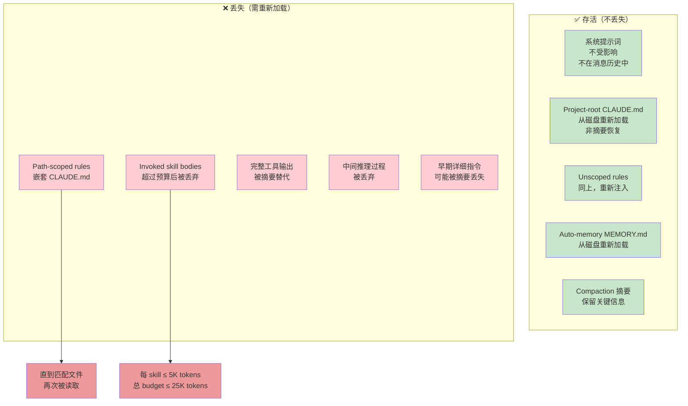

**关键洞察**：

- **系统提示词和输出风格**不受影响——它们不在被摘要的消息历史中
- **Project-root CLAUDE.md、无作用域规则、自动内存**在 compaction 后从磁盘**重新注入**。它们存活是因为被重新加载，而不是因为它们在摘要中
- **路径作用域规则**（带 `paths:` frontmatter 和嵌套 CLAUDE.md）丢失，直到匹配文件再次被读取。如果深层目录的 CLAUDE.md 早些时候塑造了 Claude 的行为，compaction 后这种影响就消失了，直到 Claude 下次触碰该目录的文件

### 3.2 Skill 重新注入的精确规则

| 参数 | 值 | 含义 |
|------|-----|------|
| 每 Skill 上限 | 5,000 tokens | 单个 Skill 内容重新注入的最大量 |
| 总预算 | 25,000 tokens | 所有 Skill 内容的总预算 |
| 淘汰策略 | 最老的先丢 | 超过预算时最先被丢弃的是最早调用的 Skill |

**实际后果**：任何仅存在于路径作用域规则、嵌套 CLAUDE.md 或很久之前调用的 Skill 中的重要内容，在 compaction 后处于风险中。如果它必须持续存在，要么保持它在始终在线的 project-root 层，要么写入你可以确定性重新读取的文件。

### 3.3 PreCompact Hook 事件

对于希望在 compaction 发生时自动执行逻辑的团队，Claude Code 在 compaction 发生前触发 `PreCompact` hook 事件：

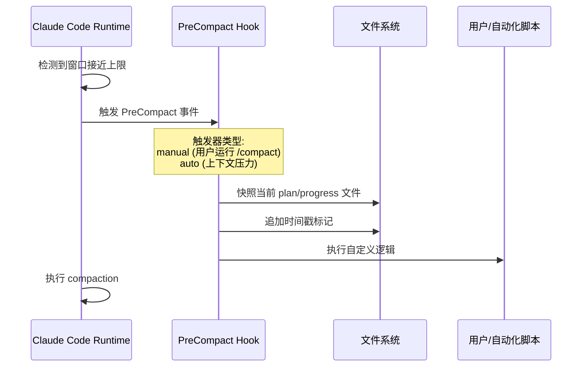

Hook 的匹配器区分两种触发器：`manual`（你运行了 `/compact`）和 `auto`（Claude Code 因上下文压力触发）。一个自然的用法是快照当前的 plan/progress 文件，或向其追加时间戳标记，这样每次压缩都会在磁盘上留下可追溯的痕迹。

### 3.4 `claude-code-rev` 源码树中的 Compaction 模块

`oboard/claude-code-rev` 是一个通过 source map 逆向恢复、再补齐缺失模块后得到的 Claude Code 源码树。它不是上游仓库的原始状态，但足以达到"可用、可运行"的程度。

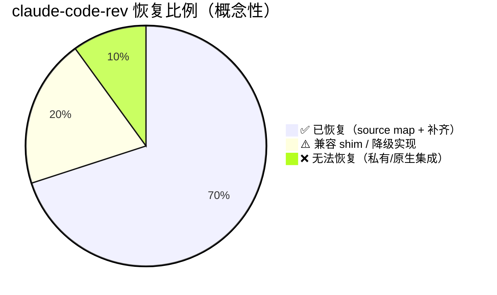

基于逆向恢复的源码树，Compaction 相关模块的恢复状态：

| 模块路径 | 职责（推断） | 恢复状态 |
|---------|-------------|---------|
| `src/` 中 session/compact 相关 | Session 压缩核心逻辑 | ⚠️ 部分通过 source map 恢复 |
| `claude-api` | API 调用层（含 compaction 请求） | ✅ 已恢复 |
| `verify` | 会话验证 | ✅ 已恢复 |
| `shims/` | 兼容垫片（无法恢复的部分） | ⚠️ 降级实现 |

**为什么 source map 无法包含完整的原始仓库**：
- Source map 只映射压缩/混淆后的代码到源代码位置
- 它们不包含未执行的代码路径
- 它们不包含构建时的元数据
- 部分文件根本无法从 source map 恢复

这个仓库的目标是把缺口补到"可用、可运行"的程度，形成一个可继续修复的恢复工作区。虽然 compaction 核心逻辑的部分代码无法仅凭 source map 完整恢复，但通过 API 层（`claude-api` 模块）的行为观察和官方文档，足以拼出完整的 compaction 机制图谱。

### 3.5 MBZUAI 逆向研究的关键发现

2026 年 4 月，MBZUAI 发表了一项逆向工程研究，测量了 Claude Code 代码库的比例：

| 类别 | 占比 | 说明 |
|------|------|------|
| **AI 决策逻辑** | ~1.6% | 模型调用、工具选择、提示词构建等 |
| **运营基础设施** | ~98.4% | 文件 I/O、终端管理、进程控制、网络通信等 |

**定性结论**被 Boris Cherny（Latent Space）和其他研究者独立确认：Claude Code 的核心价值不在 AI 决策逻辑的代码量上，而在于围绕它的工程基础设施的完善程度。

---

## 四、状态外化：让 Compaction 无痛的核心技术

### 4.1 核心理念

```mermaid
graph LR
    A[对话转录本<br/>会被 compaction 压缩<br/>会话结束会清空] -->|写入文件| B[磁盘文件<br/>跨 compaction 存活<br/>跨 session 存活]
    B -->|确定性重读| C[Compaction 后<br/>恢复精确状态]

    A -.直接依赖.-> D[⚠️ 摘要丢失细节<br/>"mostly" 记得<br/>不可靠]
    B -.确定性重读.-> E[✅ 精确恢复<br/>100% 准确<br/>可靠]

    style A fill:#bbdefb
    style B fill:#c8e6c9
    style D fill:#ffcdd2
    style E fill:#81c784
```

这是本文的**核心技术**，也是其他讨论中最少被覆盖的部分。

**核心理念**：长任务的持久状态应该存在于文件中，而不仅仅是对话转录本中。Compaction 会压缩转录本，会话会完全结束——但磁盘上的文件两者都存活，不变且可按需重新读取。

**这与 CLAUDE.md 和自动记忆不同**——它们持有跨任务的持久知识（项目惯例、经验教训）。**状态外化**关注的是**任务级的工作状态**——你当前正在做的 multi-hour 任务的 plan、决策、进度。它相对于项目是短暂的，但它必须活得过 compaction 或 session 边界。它的正确归宿是工作树中的普通文件（或暂存目录），而非记忆层。

### 4.2 三种值得外化的状态

不是什么都需要写下来。三个类别值得 effort：

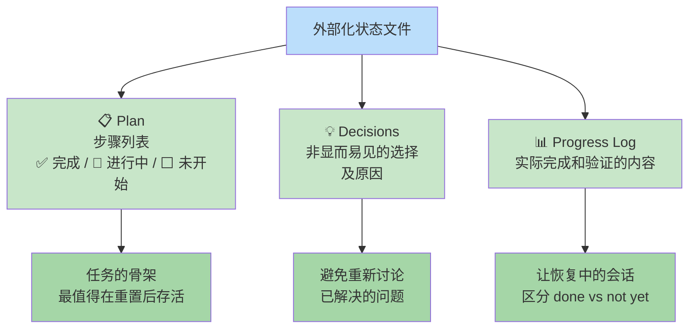

| 类别 | 内容 | 为什么值得 |
|------|------|-----------|
| **Plan** | 任务分解的步骤列表，每步标记 done / in-progress / not-started | 任务的骨架，最值得在重置后存活 |
| **Decisions** | 已做的非显而易见的选择及原因 | 重建成本高，摘要中容易丢失 |
| **Progress Log** | 实际完成和验证的内容——哪些文件改了、哪些测试过了、当前失败状态 | 让恢复中的会话区分 done vs not yet |

### 4.3 状态文件示例

一个 Markdown 文件通常可以容纳所有三种类别：

```markdown
# Task: migrate billing service to the new retry policy

## Plan
- [x] Inventory all call sites of the old RetryPolicy
- [x] Add the new BackoffRetryPolicy alongside the old one
- [ ] Migrate call sites table-by-table <-- IN PROGRESS (3 of 7 done)
- [ ] Remove the old RetryPolicy
- [ ] Run the full integration suite

## Decisions
- Reuse existing BackoffRetryPolicy in src/retry/ -- do NOT write a new one
- Migrate one module at a time; keep both policies until the last one is done

## Progress
- Done: orders/, invoices/, refunds/ migrated and unit-tested
- Next: subscriptions/ (has a custom timeout -- check before changing)
- Failing: none currently; integration suite not yet run
```

文件不需要华丽。它需要是**最新的、可重读的**。让 Claude 随着工作进度更新它，文件就变成了转录本不再需要成为的真相来源。

### 4.4 Compaction 前后的操作 SOP

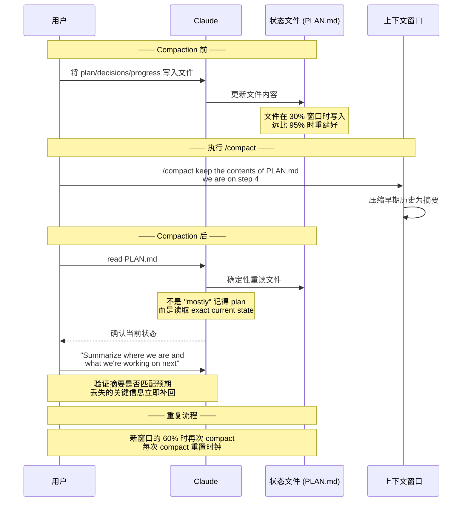

**设计状态以经受 compaction 的四个步骤**：

1. **尽早写入**：在窗口变紧之前，在上下文仍然丰富时，把 plan 和决策写入文件。30% 窗口时捕获的 plan 远比 95% 时重建的好。

2. **在自然检查点保持更新**：完成一个步骤后、做出决策后、测试运行改变失败集合后。成本是几个 token；回报是文件在你需要时从不陈旧。

3. **Compaction 时指向文件**：`/compact keep the contents of PLAN.md in mind; we are on step 4` 把压缩前缀与持久记录绑定。即使摘要丢失细节，文件有它。

4. **Compaction 后重读文件**：因为文件在磁盘上，重读它是确定性的——与摘要不同，它不是"大致"记得 plan，而是读取精确的当前状态。一次 `read PLAN.md` 精确地水合工作状态。

---

## 五、`/compact` 聚焦指令的最佳实践

### 5.1 四条保留原则

好的聚焦指令覆盖四个类别：

```mermaid
flowchart TD
    A[聚焦指令<br/>/compact [instructions]] --> B[🏗 架构决策]
    A --> C[🐛 活跃问题]
    A --> D[📁 文件和范围]
    A --> E[🔒 约束条件]

    B --> B1["仅从代码无法重构的困难选择<br/>例: '我们在中间件层处理 auth'"]
    C --> C1["调试中的 bug<br/>已识别未修复的错误<br/>待回答问题"]
    D --> D1["已修改的文件<br/>在范围内的区域<br/>明确决定不碰的部分"]
    E --> E1["限制解决方案空间的因素<br/>'必须兼容 Node 16'"]

    style A fill:#bbdefb
    style B fill:#c8e6c9
    style C fill:#c8e6c9
    style D fill:#c8e6c9
    style E fill:#c8e6c9
```

| 类别 | 内容 | 示例 |
|------|------|------|
| **🏗 架构决策** | 仅从代码无法重构的困难选择 | "我们在中间件层处理 auth，而非单个路由" |
| **🐛 活跃问题** | 调试中的 bug、已识别未修复的错误、待回答问题 | "正在排查 POST /api/orders 的 500 错误" |
| **📁 文件和范围** | 已修改的文件、在范围内的区域、明确决定不碰的部分 | "已处理 orders/, invoices/, refunds/" |
| **🔒 约束条件** | 限制解决方案空间的因素 | "必须兼容 Node 16"、"不能改变公开 API" |

### 5.2 不应该保留的内容

| 类别 | 原因 |
|------|------|
| 已解决的长错误日志 | 不再相关，占用空间 |
| 没有走通的探索性弯路 | 会导致 Claude 重新考虑已排除的方案 |
| 不再相关的冗余工具输出 | 摘要不需要这些细节 |
| 已被替换的早期代码草稿 | 当前代码已经是最新版本 |

**目标**：一个精简、准确的摘要，描述你现在在哪里以及接下来重要的是什么。

### 5.3 常见错误

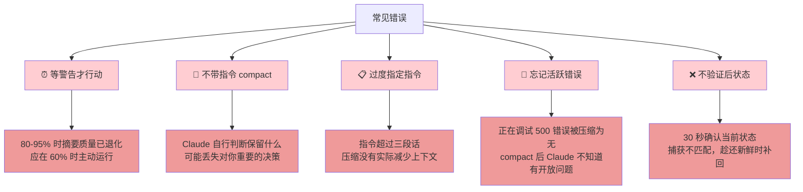

| 错误 | 后果 | 修复 |
|------|------|------|
| 等警告才 compact | 80-95% 时摘要质量已退化 | 在 60% 时主动运行 |
| 不带指令 compact | Claude 可能丢失对你重要的决策 | 附带聚焦指令 |
| 过度指定（超过三段话） | 压缩没有实际减少上下文 | 精简到 5-10 项 |
| 忘记活跃错误 | Claude 不知道有开放问题 | 明确标记正在调试的问题 |
| 不验证后状态 | 丢失的关键信息没被发现 | 30 秒确认当前状态 |

### 5.4 可重复的 Compaction 工作流

```mermaid
flowchart TD
    A[会话开始] --> B[写 Session Brief<br/>2-5 bullet points<br/>目标/约束/已做决策]
    B --> C[正常工作中<br/>保持状态文件更新]
    C --> D{窗口达到 60%?}
    D -->|否| C
    D -->|是| E[暂停 2 分钟<br/>写下什么重要]
    E --> F[运行 /compact<br/>带聚焦指令]
    F --> G[验证后状态<br/>"Summarize where we are"]
    G --> H{状态匹配预期?}
    H -->|否| I[补回丢失信息]
    H -->|是| J[继续工作]
    I --> J
    J --> D

    style A fill:#c8e6c9
    style B fill:#bbdefb
    style E fill:#fff9c4
    style F fill:#ffcc80
    style G fill:#e1bee7
```

**2 分钟检查清单**：

- 我们决定了什么从代码中看不出来的？
- 我们目前卡在什么上或正在做什么？
- 什么约束仍然有效？
- 什么文件在 play 中？

然后带着这些笔记运行 `/compact`。

---

## 六、与 OpenClaw Compaction 对比

| 维度 | Claude Code | OpenClaw |
|------|------------|---------|
| **触发方式** | `/compact` + auto-compaction（社区观测 ~64-75%） | `before_compaction` / `after_compaction` 插件钩子 |
| **摘要生成** | LLM 自行生成结构化摘要 | 通过 pi-agent-core 事件驱动的摘要流 |
| **窗口监控** | `/context` 彩色网格可视化 | `session_status` + `diagnostics.stuckSessionWarnMs` |
| **状态外化** | 依赖用户手动写文件（PLAN.md） | 内建 `memory/*.md` + `MEMORY.md` 自动记忆机制 |
| **Compaction 后恢复** | 从磁盘重新加载 CLAUDE.md | 从文件系统加载 bootstrap/context files |
| **插件钩子** | `PreCompact` hook（区分 manual/auto） | `before_compaction` / `after_compaction` + `after_compaction` |
| **重试机制** | 无自动重试 | 自动压缩可触发 retry，重置 in-memory buffers |
| **工具结果** | `tool_result_persist` 钩子可变换 | 摘要中保留关键工具结果 |

**关键差异**：OpenClaw 有更内建的持久记忆系统（`memory/*.md`），Claude Code 更依赖会话内状态外化到文件。两者都在 compaction 后从磁盘重新加载持久配置。

---

## 结语

Compaction 不是 bug——它是有限上下文窗口下的必然机制。理解它、与它协作、而不是被它偷袭，是长会话工作的核心能力。

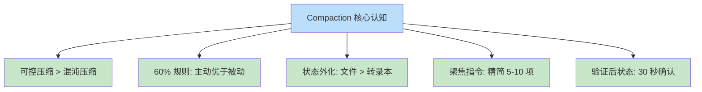

**三句话总结**：

1. **在 60% 时主动 compact，不要等警告**——此时摘要基于完整未压缩的上下文，质量最高
2. **把任务状态外化到文件（Plan / Decisions / Progress）**——让 Compaction 无痛的核心技术
3. **每次 compact 后验证状态**——30 秒确认，丢失的关键信息立即补回

`claude-code-rev` 虽然无法 100% 恢复源码，但通过 source map 逆向 + API 层行为观察 + 官方文档三重印证，足以拼出完整的 Compaction 机制图谱。98.4% 的运营基础设施代码提醒我们：**好的 AI Agent，工程比算法更重要。**

---

*本文基于 `oboard/claude-code-rev`（3.3k ★）、Claude Code 官方文档（code.claude.com/docs）和社区深度分析编写。Compaction 和会话特性演进迅速，建议以官方文档为准。*
