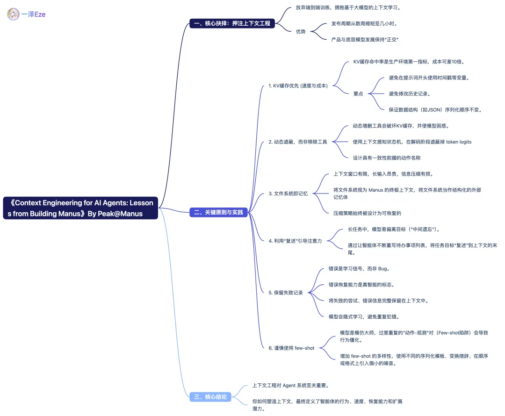

# 总结[1]

# 参考
1. [Manus 内部的 Context 工程经验（精校、高亮要点）](https://mp.weixin.qq.com/s/tBk4OBP0ZY9eaV5l94-D3g)  
+ [Manus 创始人手把手拆解：如何系统性打造 AI Agent 的上下文工程？](https://mp.weixin.qq.com/s/254ZTYWbZpL_dobKjibi3g)  

+ [Context Engineering for AI Agents: Lessons from Building Manus](manus.im/blog/Context-Engineering-for-AI-Agents-Lessons-from-Building-Manus)
 
