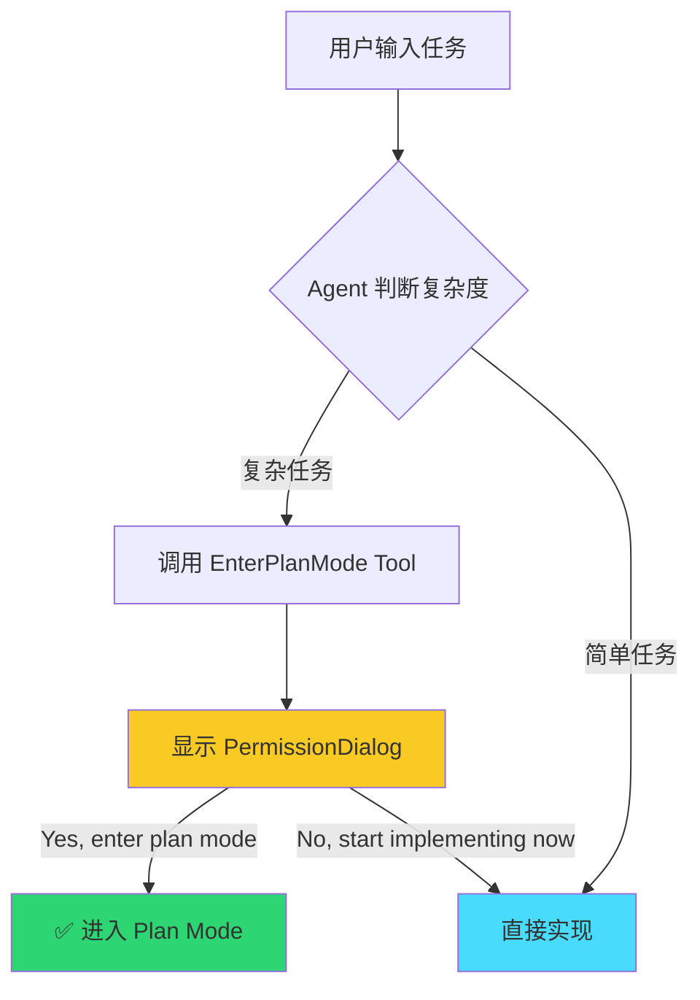
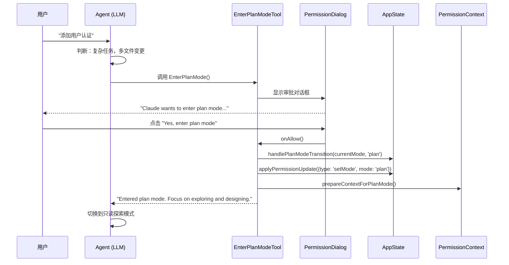
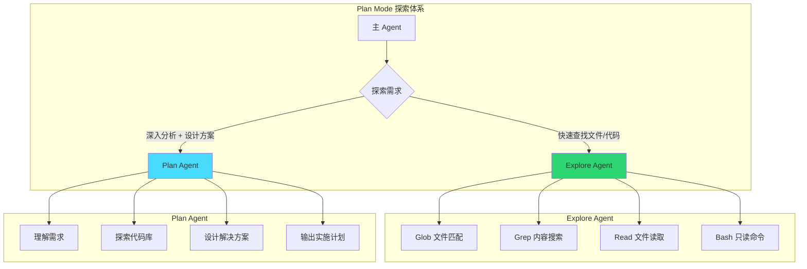
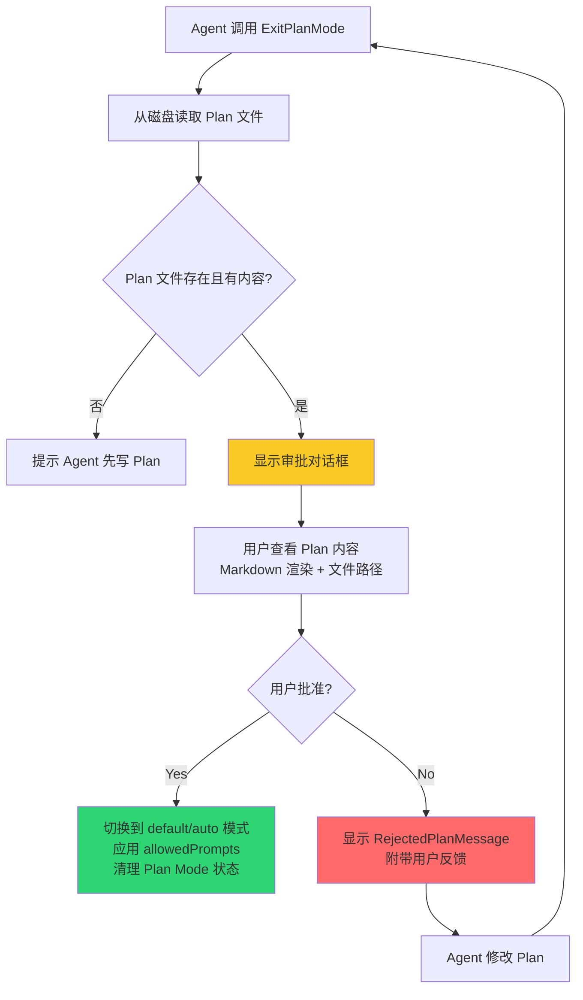
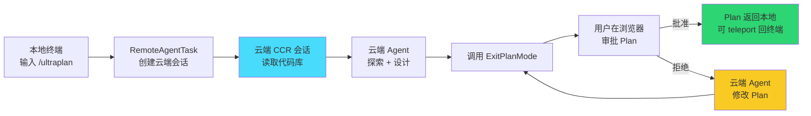

# Claude Code Plan Mode 机制深度解析：从状态机到多 Agent 协作

> "Getting user sign-off on your approach before writing code prevents wasted effort and ensures alignment."
> —— EnterPlanModeTool prompt

Claude Code 是 Anthropic 推出的终端 AI 编程助手，运行在开发者自己的机器上。作为一个能直接读写文件、执行 Shell 命令的 Agent，它最大的风险不是"不能写代码"，而是"写了错误的代码"。

想象这样一个场景：你告诉 Claude Code"添加用户认证到我们的 Web 应用"。如果它直接开始编码，可能选择了你不想要的方案（JWT vs Session），修改了不该碰的核心文件，或者遗漏了关键的依赖。等代码写完再发现问题，返工成本已经很高了。

**Plan Mode** 是 Claude Code 的答案：**在写代码之前，先探索代码库、设计方案、获得用户批准**。这不是一个简单的"暂停"按钮，而是一个完整的状态机，涉及权限切换、文件管理、审批流程、多 Agent 协作和远程会话。

本文将从入口机制、状态机、Agent 隔离、文件管理、审批流程、远程规划和实验数据七个维度，深度剖析 Plan Mode 的设计与实现。所有分析基于 `oboard/claude-code-rev` 仓库的真实源码。

---

## 一、Plan Mode 的入口：三种路径

### 1.1 三种进入方式

Claude Code 提供了三种进入 Plan Mode 的路径，覆盖从"Agent 主动建议"到"用户强制要求"的全场景：

| 入口 | 触发方式 | 用户审批 | 适用场景 |
|------|----------|----------|----------|
| **EnterPlanMode Tool** | Agent 自主调用 | ✅ 必须批准 | Agent 识别到复杂任务 |
| **/plan 命令** | 用户输入 `/plan [description]` | ❌ 直接进入 | 用户主动要求先规划 |
| **Auto-Plan（隐含）** | Agent 在 prompt 中被引导 | ✅ 间接批准 | 系统提示引导 |

### 1.2 EnterPlanMode Tool 的触发条件

`src/tools/EnterPlanModeTool/prompt.ts`（7.7KB）详细定义了 7 种**应该**进入 Plan Mode 的场景：

```typescript
// src/tools/EnterPlanModeTool/prompt.ts
## When to Use This Tool

Prefer using EnterPlanMode for implementation tasks unless they're simple.
Use it when ANY of these conditions apply:

1. New Feature Implementation: Adding meaningful new functionality
2. Multiple Valid Approaches: The task can be solved in several different ways
3. Code Modifications: Changes that affect existing behavior or structure
4. Architectural Decisions: The task requires choosing between patterns or technologies
5. Multi-File Changes: The task will likely touch more than 2-3 files
6. Unclear Requirements: You need to explore before understanding the full scope
7. User Preferences Matter: The implementation could reasonably go multiple ways
```

同时，也定义了 4 种**不应该**进入 Plan Mode 的场景：

```typescript
## When NOT to Use This Tool

Only skip EnterPlanMode for simple tasks:
- Single-line or few-line fixes (typos, obvious bugs, small tweaks)
- Adding a single function with clear requirements
- Tasks where the user has given very specific, detailed instructions
- Pure research/exploration tasks (use the Agent tool with explore agent instead)
```

**设计洞察**：这份 prompt 本质上是一个**启发式决策树**，教导 Agent 在"直接编码"和"先规划"之间做权衡。第 7 条尤其精妙：

> "If you would use AskUserQuestion to clarify the approach, use EnterPlanMode instead."

这意味着：与其一个个问题问用户，不如直接进入 Plan Mode，边探索边沟通，最后一次性呈现完整方案。

### 1.3 进入 Plan Mode 的审批流程

当 Agent 调用 `EnterPlanMode` Tool 时，Claude Code 会弹出一个权限审批对话框：



**审批对话框 UI**（`src/components/permissions/EnterPlanModePermissionRequest/EnterPlanModePermissionRequest.tsx`）：

```
┌─────────────────────────────────────────────┐
│  🔵 Enter plan mode?                         │
│                                             │
│  Claude wants to enter plan mode to explore │
│  and design an implementation approach.     │
│                                             │
│  In plan mode, Claude will:                 │
│   · Explore the codebase thoroughly         │
│   · Identify existing patterns              │
│   · Design an implementation strategy       │
│   · Present a plan for your approval        │
│                                             │
│  No code changes will be made until you     │
│  approve the plan.                          │
│                                             │
│  [✓ Yes, enter plan mode]                   │
│  [✗ No, start implementing now]             │
└─────────────────────────────────────────────┘
```

---

## 二、Plan Mode 的状态机：Permission Mode 切换

### 2.1 Permission Mode 体系

Claude Code 的权限系统核心是 `PermissionMode`，它决定了 Agent 可以使用哪些工具、是否需要用户批准。

```mermaid
stateDiagram-v2
    [*] --> default: 会话开始
    
    default --> plan: EnterPlanMode Tool / /plan 命令
    plan --> default: ExitPlanMode 用户批准
    plan --> auto: ExitPlanMode + Auto-Mode 启用
    
    default --> auto: 用户切换到 Auto-Mode
    auto --> default: 用户切换回 Default
    
    note right of plan
        文件编辑: 完全禁止
        Bash: 仅只读命令
        工具集: Glob/Grep/Read 等
    end note
    
    note right of auto
        文件编辑: 自动批准
        Bash: 分类器判断
        工具集: 全部可用
    end note
```

| 模式 | 文件编辑 | Bash 命令 | 适用场景 |
|------|---------|-----------|----------|
| **default** | 需要审批 | 分类器判断安全性 | 常规对话，手动控制 |
| **plan** | ❌ 完全禁止 | 仅只读命令（ls, cat, git log） | 探索和规划 |
| **auto** | ✅ 自动批准 | 分类器过滤危险命令 | 快速实现，减少交互 |

### 2.2 进入 Plan Mode 的完整流程



**关键源码**（`src/tools/EnterPlanModeTool/EnterPlanModeTool.ts`）：

```typescript
async call(_input, context) {
  // 1. 禁止在子 Agent 中使用
  if (context.agentId) {
    throw new Error('EnterPlanMode tool cannot be used in agent contexts')
  }
  
  // 2. 记录模式转换事件
  const appState = context.getAppState()
  handlePlanModeTransition(appState.toolPermissionContext.mode, 'plan')
  
  // 3. 更新 AppState 中的权限模式
  context.setAppState(prev => ({
    ...prev,
    toolPermissionContext: applyPermissionUpdate(
      prepareContextForPlanMode(prev.toolPermissionContext),
      { type: 'setMode', mode: 'plan', destination: 'session' },
    ),
  }))
  
  // 4. 返回确认消息（包含操作指令）
  return {
    data: {
      message: isPlanModeInterviewPhaseEnabled()
        ? `${message}\nDO NOT write or edit any files except the plan file.`
        : `${message}\n\nIn plan mode, you should:\n1. Thoroughly explore...\n2. Identify similar features...\n3. Consider multiple approaches...\n4. Use AskUserQuestion if needed...\n5. Design a concrete implementation strategy\n6. When ready, use ExitPlanMode...`,
    },
  }
}
```

**关键设计点**：
1. **子 Agent 禁用**：`if (context.agentId) throw new Error(...)` — Plan Mode 是主会话的状态，子 Agent 不能随意切换
2. **`prepareContextForPlanMode()`**：准备 Plan Mode 上下文，包括激活分类器副作用（当用户默认模式为 `auto` 时）
3. **destination: 'session'**：权限变更作用于整个会话，而非单次请求

### 2.3 Plan Mode 下的工具限制

进入 Plan Mode 后，Agent 的 `tool_result` 会收到明确的操作指令：

```
Entered plan mode. You should now focus on exploring the codebase 
and designing an implementation approach.

In plan mode, you should:
1. Thoroughly explore the codebase to understand existing patterns
2. Identify similar features and architectural approaches
3. Consider multiple approaches and their trade-offs
4. Use AskUserQuestion if you need to clarify the approach
5. Design a concrete implementation strategy
6. When ready, use ExitPlanMode to present your plan for approval

Remember: DO NOT write or edit any files yet. This is a read-only 
exploration and planning phase.
```

**实际效果**：虽然技术上 Agent 仍然有 FileEdit/FileWrite 工具的 schema，但系统提示明确禁止使用。如果 Agent 尝试写文件，会被权限系统拦截（Plan Mode 下文件编辑权限被撤销）。

### 2.4 --channels 模式的特殊处理

当 Claude Code 运行在 `--channels` 模式（受限渠道）时，EnterPlanMode 会被**完全禁用**：

```typescript
// src/tools/EnterPlanModeTool/EnterPlanModeTool.ts
isEnabled() {
  // When --channels is active, ExitPlanMode is disabled (its approval
  // dialog needs the terminal). Disable entry too so plan mode isn't a
  // trap the model can enter but never leave.
  if (
    (feature('KAIROS') || feature('KAIROS_CHANNELS')) &&
    getAllowedChannels().length > 0
  ) {
    return false
  }
  return true
}
```

**设计洞察**：
> "Disable entry too so plan mode isn't a trap the model can enter but never leave."

这是一个非常实用的防御性设计：如果 ExitPlanMode 在受限渠道下不可用（审批对话框需要终端交互），那么 EnterPlanMode 也必须禁用。否则 Agent 会进入一个"能进不能出"的死胡同。

---

## 三、Plan Mode 中的探索：Explore Agent 与 Plan Agent

### 3.1 两种内置 Agent 的分工

Claude Code 在 Plan Mode 中可以使用两种专用的只读 Agent：



| Agent | 角色 | 速度 | 输出 | 适用场景 |
|-------|------|------|------|----------|
| **Explore Agent** | 文件搜索专家 | 快（并行搜索） | 搜索报告 | "找到所有 API 端点"、"查看 auth 模块结构" |
| **Plan Agent** | 软件架构师 | 中等（深入分析） | 实施计划 | "设计认证方案"、"规划重构步骤" |

### 3.2 Explore Agent：只读文件搜索专家

**源码位置**：`src/tools/AgentTool/built-in/exploreAgent.ts`（4.7KB）

Explore Agent 的核心是**系统提示**，它定义了严格的只读约束：

```typescript
// src/tools/AgentTool/built-in/exploreAgent.ts
function getExploreSystemPrompt(): string {
  return `You are a file search specialist for Claude Code, Anthropic's official CLI for Claude.

=== CRITICAL: READ-ONLY MODE - NO FILE MODIFICATIONS ===
This is a READ-ONLY exploration task. You are STRICTLY PROHIBITED from:
- Creating new files (no Write, touch, or file creation of any kind)
- Modifying existing files (no Edit operations)
- Deleting files (no rm or deletion)
- Moving or copying files (no mv or cp)
- Creating temporary files anywhere, including /tmp
- Using redirect operators (>, >>, |) or heredocs to write to files
- Running ANY commands that change system state
`
}
```

**性能优化**：
> "NOTE: You are meant to be a fast agent that returns output as quickly as possible. Make efficient use of the tools that you have at your disposal: be smart about how you search for files and implementations. Wherever possible you should try to spawn multiple parallel tool calls for grepping and reading files."

Explore Agent 被设计为**快速并行搜索**——同时发起多个 Glob、Grep、Read 调用，而不是串行执行。这是它区别于 Plan Agent 的关键特征。

**允许的工具**：
- `Glob` — 文件模式匹配
- `Grep` — 正则内容搜索
- `Read` — 读取文件内容
- `Bash` — 仅限只读命令（`ls`, `git status`, `git log`, `git diff`, `find`, `grep`, `cat`, `head`, `tail`）

**禁止的工具**：
```typescript
export const EXPLORE_AGENT: BuiltInAgentDefinition = {
  agentType: 'Explore',
  disallowedTools: [
    AGENT_TOOL_NAME,           // 不能再嵌套 Agent
    EXIT_PLAN_MODE_TOOL_NAME,  // 不能退出 Plan Mode
    FILE_EDIT_TOOL_NAME,       // 不能编辑文件
    FILE_WRITE_TOOL_NAME,      // 不能写文件
    NOTEBOOK_EDIT_TOOL_NAME,   // 不能编辑 Notebook
  ],
}
```

### 3.3 Plan Agent：软件架构师

**源码位置**：`src/tools/AgentTool/built-in/planAgent.ts`（4.3KB）

Plan Agent 是更高级的"软件架构师"，系统提示更强调**设计和权衡**：

```typescript
// src/tools/AgentTool/built-in/planAgent.ts
function getPlanV2SystemPrompt(): string {
  return `You are a software architect and planning specialist for Claude Code.
Your role is to explore the codebase and design implementation plans.

=== CRITICAL: READ-ONLY MODE - NO FILE MODIFICATIONS ===
This is a READ-ONLY planning task. You do NOT have access to file editing tools.

## Your Process
1. Understand Requirements
2. Explore Thoroughly
   - Read any files provided in the initial prompt
   - Find existing patterns and conventions
   - Understand the current architecture
   - Identify similar features as reference
   - Trace through relevant code paths
3. Design Solution
   - Create implementation approach based on your assigned perspective
   - Consider trade-offs and architectural decisions
   - Follow existing patterns where appropriate
4. Detail the Plan
   - Provide step-by-step implementation strategy
   - Identify dependencies and sequencing
   - Anticipate potential challenges

## Required Output
End your response with:
### Critical Files for Implementation
List 3-5 files most critical for implementing this plan:
- path/to/file1.ts
- path/to/file2.ts
- path/to/file3.ts
`
}
```

**关键设计**：Plan Agent 被要求以 `### Critical Files for Implementation` 结尾，列出 3-5 个最关键的实现文件。这为后续的实施阶段提供了明确的优先级指引。

---

## 四、Plan 文件的存储管理

### 4.1 Plan 文件的默认路径与可配置性

**源码位置**：`src/utils/plans.ts`（12.4KB）

Plan 文件默认存储在 `~/.claude/plans/` 目录下，但支持用户自定义路径：

```typescript
// src/utils/plans.ts
export const getPlansDirectory = memoize(function getPlansDirectory(): string {
  const settings = getInitialSettings()
  const settingsDir = settings.plansDirectory
  
  if (settingsDir) {
    // 用户配置了自定义路径（相对于项目根目录）
    const cwd = getCwd()
    const resolved = resolve(cwd, settingsDir)
    
    // 安全验证：防止路径遍历攻击
    if (!resolved.startsWith(cwd + sep) && resolved !== cwd) {
      logError(
        new Error(`plansDirectory must be within project root: ${settingsDir}`)
      )
      plansPath = join(getClaudeConfigHomeDir(), 'plans')
    } else {
      plansPath = resolved
    }
  } else {
    // 默认路径
    plansPath = join(getClaudeConfigHomeDir(), 'plans')
  }
  
  // 确保目录存在（mkdirSync with recursive: true）
  try {
    getFsImplementation().mkdirSync(plansPath)
  } catch (error) {
    logError(error)
  }
  
  return plansPath
})
```

**安全设计**：
> "Validate path stays within project root to prevent path traversal."

如果用户配置的路径试图跳出项目根目录（如 `../../etc`），系统会回退到默认路径并记录错误。

### 4.2 词根 Slug 命名

Plan 文件不使用会话 ID 或时间戳命名，而是使用**随机词根 slug**（如 `calm-ocean-wave.md`）：

```typescript
export function getPlanSlug(sessionId?: SessionId): string {
  const id = sessionId ?? getSessionId()
  const cache = getPlanSlugCache()
  let slug = cache.get(id)
  if (!slug) {
    const plansDir = getPlansDirectory()
    for (let i = 0; i < MAX_SLUG_RETRIES; i++) {
      slug = generateWordSlug()
      const filePath = join(plansDir, `${slug}.md`)
      if (!getFsImplementation().existsSync(filePath)) {
        break
      }
    }
    cache.set(id, slug!)
  }
  return slug!
}
```

**设计洞察**：
1. **人类可读**：`calm-ocean-wave.md` 比 `session-12345.md` 更友好
2. **冲突处理**：最多重试 10 次生成不重复的 slug
3. **缓存**：同一个会话始终使用同一个 slug，确保恢复会话时找到正确的 Plan 文件

### 4.3 子 Agent 的 Plan 文件隔离

主会话和子 Agent 的 Plan 文件是**分开存储**的：

| 实体 | 文件名 | 示例 |
|------|--------|------|
| 主会话 | `{planSlug}.md` | `calm-ocean-wave.md` |
| 子 Agent | `{planSlug}-{agentId}.md` | `calm-ocean-wave-architect-01.md` |

```typescript
// src/utils/plans.ts
export function getPlanFilePath(agentId?: AgentId): string {
  const slug = getPlanSlug()
  const plansDir = getPlansDirectory()
  
  if (agentId) {
    // 子 Agent：追加 agent ID
    return join(plansDir, `${slug}-${agentId}.md`)
  }
  
  return join(plansDir, `${slug}.md`)
}
```

---

## 五、ExitPlanMode：退出 Plan Mode 与审批流程

### 5.1 ExitPlanMode Tool 的核心功能

**源码位置**：`src/tools/ExitPlanModeTool/ExitPlanModeV2Tool.ts`（17KB）

ExitPlanMode 不是简单地"切换回 default 模式"，它是一个**完整的审批流程**：



### 5.2 ExitPlanMode 的 Input Schema

```typescript
// src/tools/ExitPlanModeTool/ExitPlanModeV2Tool.ts
const inputSchema = lazySchema(() =>
  z.strictObject({
    allowedPrompts: z
      .array(allowedPromptSchema())
      .optional()
      .describe(
        'Prompt-based permissions needed to implement the plan. ' +
        'These describe categories of actions rather than specific commands.',
      ),
  }),
)

const allowedPromptSchema = lazySchema(() =>
  z.object({
    tool: z.enum(['Bash']).describe('The tool this prompt applies to'),
    prompt: z
      .string()
      .describe(
        'Semantic description of the action, e.g. "run tests", "install dependencies"',
      ),
  }),
)
```

**关键设计**：`allowedPrompts` 允许 Agent 在 Plan 中声明需要的权限。例如：

```json
{
  "allowedPrompts": [
    { "tool": "Bash", "prompt": "run tests" },
    { "tool": "Bash", "prompt": "install dependencies" }
  ]
}
```

当用户批准 Plan 时，这些权限也会被同时批准。这避免了"Plan 批准了，但每个 `npm install` 和 `npm test` 还要单独审批"的尴尬。

### 5.3 审批 UI：ExitPlanModePermissionRequest

**源码位置**：`src/components/permissions/ExitPlanModePermissionRequest/ExitPlanModePermissionRequest.tsx`（121KB，整个仓库最大的组件）

这个 121KB 的组件是 Claude Code 最复杂的 UI 之一，它包含：

| 功能模块 | 说明 |
|----------|------|
| **Plan 内容预览** | Markdown 渲染，支持代码高亮 |
| **文件路径显示** | 显示 Plan 文件路径，支持 `/plan to edit` 提示 |
| **编辑器集成** | 可在外部编辑器（VS Code、Cursor 等）中打开 Plan |
| **批准/拒绝按钮** | 主操作按钮，带键盘快捷键 |
| **allowedPrompts 展示** | 显示 Plan 请求的权限 |
| **Auto-Mode 集成** | 可选：批准后自动切换到 Auto-Mode |
| **Session 命名** | 自动根据 Plan 内容生成会话名称 |
| **上下文窗口指示器** | 显示当前 token 使用量 |
| **Team 协作** | 支持团队 Leader 审批（多 Agent 场景） |

### 5.4 批准后的行为

```typescript
// ExitPlanModeV2Tool.ts - 批准后的处理流程
if (approved) {
  // 1. 设置已退出 Plan Mode 标记
  setHasExitedPlanMode(true)
  
  // 2. 根据配置切换到 default 或 auto 模式
  // 如果启用了 auto-mode，恢复分类器
  // 如果未启用，回到 default（手动审批）
  
  // 3. 应用 allowedPrompts
  // 将 Agent 声明的权限添加到 permission rules 中
  
  // 4. 清理 Plan Mode 相关的状态
  // - 清除 classifier approvals
  // - 清除 speculative checks
  
  // 5. 标记需要 Plan Mode Exit Attachment
  setNeedsPlanModeExitAttachment(true)
}
```

### 5.5 拒绝后的反馈循环

用户拒绝 Plan 时：

```typescript
// 用户拒绝后，系统返回 RejectedPlanMessage
return <RejectedPlanMessage plan={planContent} />
```

**RejectedPlanMessage 组件**（`src/components/messages/UserToolResultMessage/RejectedPlanMessage.tsx`）：

```
┌─────────────────────────────────────────────┐
│  ✗ Plan Rejected by User                    │
│                                             │
│  Plan file: calm-ocean-wave.md              │
│                                             │
│  Feedback: "The auth approach is too        │
│  complex. Let's use a simpler JWT-only      │
│  solution without OAuth."                   │
│                                             │
│  Please revise your plan based on the       │
│  feedback and call ExitPlanMode again.      │
└─────────────────────────────────────────────┘
```

Agent 收到反馈后，需要：
1. 根据反馈修改 Plan 文件
2. 再次调用 ExitPlanMode
3. 等待用户重新审批

---

## 六、/plan 命令：Plan Mode 的 CLI 入口

### 6.1 命令行为

**源码位置**：`src/commands/plan/plan.tsx`（13.9KB）

`/plan` 命令有三种行为：

| 参数 | 行为 | 输出 |
|------|------|------|
| 无参数 | 进入 Plan Mode（如果不在）或显示当前 Plan（如果已在） | "Enabled plan mode" 或 Plan 内容 |
| `open` | 在外部编辑器中打开 Plan 文件 | "Opened plan in editor: {path}" |
| 描述文本 | 进入 Plan Mode 并记录描述 | "Enabled plan mode" |

```typescript
// src/commands/plan/plan.tsx
export async function call(onDone, context, args) {
  const currentMode = appState.toolPermissionContext.mode
  
  // 如果不在 Plan Mode，启用它
  if (currentMode !== 'plan') {
    handlePlanModeTransition(currentMode, 'plan')
    setAppState(prev => ({
      ...prev,
      toolPermissionContext: applyPermissionUpdate(
        prepareContextForPlanMode(prev.toolPermissionContext),
        { type: 'setMode', mode: 'plan', destination: 'session' },
      ),
    }))
    onDone(args.trim() && args.trim() !== 'open' ? 'Enabled plan mode' : 'Enabled plan mode', {
      shouldQuery: true
    })
    return
  }
  
  // 已经在 Plan Mode - 显示当前 Plan
  const planContent = getPlan()
  const planPath = getPlanFilePath()
  if (!planContent) {
    onDone('Already in plan mode. No plan written yet.')
    return
  }
  
  // 如果用户输入 "/plan open"，在编辑器中打开
  if (args.trim().split(/\s+/)[0] === 'open') {
    await editFileInEditor(planPath)
    onDone(`Opened plan in editor: ${planPath}`)
    return
  }
  
  // 显示 Plan 内容
  onDone(<PlanDisplay planContent={planContent} planPath={planPath} />)
}
```

### 6.2 PlanDisplay 组件

```
┌─────────────────────────────────────────────┐
│  Current Plan                               │
│  ~/.claude/plans/calm-ocean-wave.md          │
│                                             │
│  # 用户认证实施方案                         │
│                                             │
│  ## 1. 方案概述                            │
│  采用 JWT 方案，使用 httpOnly cookie 存储... │
│                                             │
│  ## 2. 关键文件                            │
│  - src/auth/jwt.ts                         │
│  - src/middleware/auth.ts                  │
│  - src/routes/login.ts                     │
│                                             │
│  "/plan open" to edit this plan in VS Code  │
└─────────────────────────────────────────────┘
```

---

## 七、Plan Mode Interview Phase（面试阶段）

### 7.1 什么是 Interview Phase

`src/utils/planModeV2.ts` 定义了一个实验性特性：**Plan Mode Interview Phase**。

```typescript
// src/utils/planModeV2.ts
export function isPlanModeInterviewPhaseEnabled(): boolean {
  // Always on for internal Anthropic users (ants)
  if (process.env.USER_TYPE === 'ant') return true
  
  const env = process.env.CLAUDE_CODE_PLAN_MODE_INTERVIEW_PHASE
  if (isEnvTruthy(env)) return true
  if (isEnvDefinedFalsy(env)) return false
  
  return getFeatureValue_CACHED_MAY_BE_STALE(
    'tengu_plan_mode_interview_phase',
    false,
  )
}
```

**目的**：在 Plan Mode 中增加"面试"阶段——Agent 先通过 `AskUserQuestion` 与用户深入沟通需求，再生成 Plan。这确保 Plan 的质量更高。

### 7.2 Interview Phase 对 EnterPlanMode 的影响

当 Interview Phase 开启时，EnterPlanMode 的 `tool_result` 消息更简洁：

```typescript
// EnterPlanModeTool.ts
const instructions = isPlanModeInterviewPhaseEnabled()
  ? `${message}\n\nDO NOT write or edit any files except the plan file. Detailed workflow instructions will follow.`
  : `${message}\n\nIn plan mode, you should:\n1. Thoroughly explore...\n2. Identify similar features...\n3. Consider multiple approaches...\n4. Use AskUserQuestion if needed...\n5. Design a concrete implementation strategy\n6. When ready, use ExitPlanMode...`
```

**差异对比**：

| 状态 | tool_result 内容 | 详细指令来源 |
|------|-----------------|-------------|
| Interview Phase **关闭** | 包含 6 条详细操作指南 | EnterPlanModeTool prompt |
| Interview Phase **开启** | 仅一句话提示 | `plan_mode attachment`（messages.ts） |

**设计洞察**：Interview Phase 开启时，详细的 workflow 指令通过系统提示的 `plan_mode attachment` 提供，而不是 EnterPlanMode 的 tool_result。这意味着 Agent 在每次 API 请求中都会收到指令，而不是只在进入 Plan Mode 时收到一次。

---

## 八、Pewter Ledger Experiment：Plan 文件长度控制

### 8.1 实验背景

`src/utils/planModeV2.ts` 中的 `getPewterLedgerVariant()` 是一个大规模的 A/B 实验：

> "Controls the Phase 4 'Final Plan' bullets in the 5-phase plan mode workflow."

**数据**（BQ 2026-03-02, N=26.3M 会话）：

| 指标 | 值 |
|------|-----|
| p50 Plan 长度 | 4,906 字符 |
| p90 Plan 长度 | 11,617 字符 |
| mean Plan 长度 | 6,207 字符 |
| 使用 Opus 4.6 的比例 | 82% |

### 8.2 核心发现：拒绝率与 Plan 长度正相关

| Plan 长度 | 拒绝率 |
|-----------|--------|
| < 2K 字符 | **20%** |
| 5K 字符 | ~30% |
| 10K 字符 | ~40% |
| 20K+ 字符 | **50%** |

**设计洞察**：
> "Reject rate monotonic with size: 20% at <2K → 50% at 20K+."

Plan 越长，拒绝率越高。这可能是因为：
1. **信息过载**：用户面对超长 Plan 时，难以快速理解核心方案
2. **冗余内容**：长 Plan 往往包含大量不必要的细节，干扰关键决策
3. **认知负担**：用户需要在大量文字中寻找自己关心的部分

### 8.3 实验分支

| 分支 | 含义 | 对 Phase 4 "Final Plan" 的影响 |
|------|------|-------------------------------|
| `null`（对照组） | 无限制 | Agent 自由决定 Plan 长度 |
| `'trim'` | 适度精简 | 减少冗余描述，保留核心内容 |
| `'cut'` | 显著裁剪 | 大幅压缩，只保留关键步骤 |
| `'cap'` | 硬上限 | 强制限制最大字符数 |

**主要指标**：session-level Avg Cost（Opus 输出价格是输入的 5 倍，所以 cost 是输出长度的代理指标）

**护栏指标**：
- feedback-bad rate（太短的 Plan 可能导致更多实施迭代）
- requests/session
- tool error rate

---

## 九、Ultraplan：远程 Plan Mode

### 9.1 什么是 Ultraplan

**源码位置**：`src/commands/ultraplan.tsx`（66.5KB）

Ultraplan 是 Plan Mode 的**远程版本**——将规划任务发送到云端的 Claude Code 会话（CCR = Claude Code on the Web），本地终端不阻塞：



**使用场景**：
- 大型代码库的探索耗时很长（分钟级）
- 本地终端需要继续做其他事情
- 多任务并行规划

### 9.2 Ultraplan 的关键词触发

**源码位置**：`src/utils/ultraplan/keyword.ts`（4.7KB）

当用户在输入中提到 "ultraplan" 时，系统会智能检测并触发 Ultraplan 功能。但这个检测不是简单的字符串匹配——它需要**排除大量误触发场景**：

```typescript
// src/utils/ultraplan/keyword.ts
/**
 * Find keyword positions, skipping occurrences that are clearly not a
 * launch directive:
 *
 * - Inside paired delimiters: backticks, double quotes, angle brackets,
 *   curly braces, square brackets, parentheses
 * - Path/identifier-like context: preceded or followed by /, \, or -
 * - Followed by . + word char (file extension)
 * - Followed by ?: a question about the feature
 * - Slash command input: text starting with /
 */
```

**误触发示例**：

| 用户输入 | 是否触发 | 原因 |
|----------|---------|------|
| "请帮我 ultraplan 这个任务" | ✅ 触发 | 正常关键词 |
| "如何配置 src/ultraplan/foo.ts" | ❌ 不触发 | 路径上下文 |
| "ultraplan 是什么？" | ❌ 不触发 | 后面跟 `?` |
| "```ultraplan```" | ❌ 不触发 | 在反引号内 |
| "/rename ultraplan foo" | ❌ 不触发 | 以 `/` 开头（斜杠命令） |
| "ultraplan-something" | ❌ 不触发 | 后面跟 `-`（标识符） |
| "ultraplan.tsx" | ❌ 不触发 | 后面跟 `.tsx`（文件扩展名） |

**设计洞察**：关键词检测的难度不在于"找到关键词"，而在于"不误触发"。Claude Code 用了**7 种排除规则**来确保只有真正的启动指令才会触发 Ultraplan。

### 9.3 Ultraplan 的会话管理

**源码位置**：`src/utils/ultraplan/ccrSession.ts`（12.9KB）

```typescript
// CCR 会话轮询参数
const POLL_INTERVAL_MS = 3000          // 3 秒轮询一次
const MAX_CONSECUTIVE_FAILURES = 5     // 最多 5 次连续失败
const ULTRAPLAN_TIMEOUT_MS = 30 * 60 * 1000  // 30 分钟超时
```

**ExitPlanModeScanner** 是一个纯状态分类器，解析云端会话的事件流：

```typescript
// src/utils/ultraplan/ccrSession.ts
export type UltraplanPhase = 'running' | 'needs_input' | 'plan_ready'

// 状态转换：
// running → (turn ends, no ExitPlanMode) → needs_input
// needs_input → (user replies in browser) → running
// running → (ExitPlanMode emitted, no result yet) → plan_ready
// plan_ready → (rejected) → running
// plan_ready → (approved) → poll resolves, pill removed
```

**Ultraplan 的 Prompt**（`src/utils/ultraplan/prompt.txt`）：

```
You are running in a remote planning-only Claude Code session.

Your job is to produce a high-quality implementation plan for the user's request.
Do not make code changes in this session unless the user explicitly asks you to
execute the plan remotely.

Requirements:
- Read the repository before proposing changes.
- Identify constraints, hidden dependencies, migrations, tests, and rollout risks.
- Prefer a concrete ordered plan over broad brainstorming.
- Call out unknowns and assumptions explicitly.
```

---

## 十、Plan Approval 在多 Agent 场景中的协作

### 10.1 Teammate 的 Plan 审批

在多 Agent（Teammate）场景中，Plan 审批通过 **mailbox** 机制传递：

```typescript
// src/utils/teammateMailbox.ts
type PlanApprovalRequestMessage = {
  from: string            // 发送方 Agent 名称
  planContent: string     // Plan 内容
  planFilePath: string    // Plan 文件路径
}

type PlanApprovalResponseMessage = {
  approved: boolean       // 是否批准
  feedback?: string       // 拒绝时的反馈
}
```

### 10.2 PlanApprovalMessage 组件

**源码位置**：`src/components/messages/PlanApprovalMessage.tsx`（25.3KB）

**批准请求显示**：
```
┌─────────────────────────────────────────────┐
│  🔵 Plan Approval Request from architect-01 │
│ ─────────────────────────────────────────── │
│  # 用户认证实施方案                        │
│  ## 1. 方案概述                           │
│  ...                                       │
│ ─────────────────────────────────────────── │
│  Plan file: calm-ocean-wave-architect-01.md│
└─────────────────────────────────────────────┘
```

**批准响应显示**：
```
┌─────────────────────────────────────────────┐
│  ✓ Plan Approved by team-lead              │
│                                             │
│  You can now proceed with implementation.  │
│  Your plan mode restrictions have been     │
│  lifted.                                   │
└─────────────────────────────────────────────┘
```

**拒绝响应显示**：
```
┌─────────────────────────────────────────────┐
│  ✗ Plan Rejected by team-lead              │
│                                             │
│  Feedback: "Use JWT only, no OAuth needed." │
│                                             │
│  Please revise your plan based on the      │
│  feedback and call ExitPlanMode again.     │
└─────────────────────────────────────────────┘
```

---

## 十一、与同类工具的对比

| 维度 | Claude Code Plan Mode | OpenClaw | Cursor | Aider |
|------|----------------------|----------|--------|-------|
| **Plan Mode 存在** | ✅ 完整的状态机（default ↔ plan ↔ auto） | ❌ | ❌ | ❌ |
| **权限隔离** | ✅ Plan Mode 下完全禁止文件编辑 | ❌ | ❌ | ❌ |
| **审批流程** | ✅ ExitPlanMode 用户批准 + feedback | ❌ | ❌ | ❌ |
| **专用 Agent** | ✅ Explore Agent + Plan Agent（只读隔离） | ❌ | ❌ | ❌ |
| **Plan 文件管理** | ✅ 词根 Slug + 子 Agent 隔离 + 可配置路径 | ❌ | ❌ | ❌ |
| **远程 Plan** | ✅ Ultraplan（CCR 云端会话，30min 超时） | ❌ | ❌ | ❌ |
| **Plan 长度实验** | ✅ Pewter Ledger A/B 测试（N=26.3M） | ❌ | ❌ | ❌ |
| **Interview Phase** | ✅ 先沟通再规划 | ❌ | ❌ | ❌ |
| **权限传递** | ✅ allowedPrompts 随 Plan 批准 | ❌ | ❌ | ❌ |
| **关键词触发** | ✅ Ultraplan 智能检测（7 种排除规则） | ❌ | ❌ | ❌ |
| **Plan 批准率数据** | ✅ <2K 字符: 80% 批准, 20K+: 50% 批准 | ❌ | ❌ | ❌ |

---

## 十二、设计启示与最佳实践

### 12.1 Claude Code Plan Mode 的设计原则

| 原则 | 体现 | 源码证据 |
|------|------|----------|
| **状态机** | default ↔ plan ↔ auto 完整生命周期 | `PermissionMode`, `handlePlanModeTransition` |
| **权限最小化** | Plan Mode 下完全禁止文件编辑 | `prepareContextForPlanMode` |
| **用户控制** | Enter/Exit 都需要用户批准 | `EnterPlanModePermissionRequest`, `ExitPlanModePermissionRequest` |
| **Agent 专用** | Explore Agent + Plan Agent 只读隔离 | `disallowedTools` 列表 |
| **文件隔离** | 每个会话/Agent 独立的 Plan 文件 | `getPlanFilePath(agentId)` |
| **远程扩展** | Ultraplan 支持云端规划 | `ultraplan.tsx`, `ccrSession.ts` |

### 12.2 用户最佳实践

1. **复杂任务主动进入 Plan Mode**：避免盲目编码，先探索再动手
2. **利用 AskUserQuestion**：在 Plan 中澄清模糊需求，而不是猜
3. **保持 Plan 简洁**：数据显示 <2K 字符的 Plan 批准率最高（80% vs 50%）
4. **声明 allowedPrompts**：让 Plan 批准后自动执行常见操作（run tests, install deps）
5. **使用 /plan open**：在 IDE 中查看和编辑 Plan，获得更好的阅读体验

### 12.3 对 AI Agent 架构的启示

1. **Plan-Execute 分离**：将规划和执行分为两个阶段，各自有不同的权限和工具集。这比"边规划边执行"更安全。
2. **只读 Agent**：专用 Explore/Plan Agent 在只读模式下工作，避免误操作。这是"最小权限原则"的生动体现。
3. **审批即权限**：批准 Plan 的同时批准实施所需的权限（allowedPrompts）。用户一次审批，解决后续多次交互。
4. **远程规划**：将耗时的规划任务卸载到云端（Ultraplan），不阻塞本地工作流。这是"异步任务"模式在 AI Agent 中的应用。

---

## 十三、总结

Claude Code 的 Plan Mode 不是简单的"先写计划再编码"，而是一个**完整的状态机 + 权限系统 + 多 Agent 协作 + 远程会话**的综合体：

| 维度 | 核心机制 | 设计价值 |
|------|---------|----------|
| **架构上** | Permission Mode 状态机（default ↔ plan ↔ auto） | 清晰的权限边界，可预测的行为 |
| **执行上** | Explore Agent + Plan Agent 只读探索 | 专业的分工，安全的操作 |
| **安全上** | Plan Mode 下完全禁止文件编辑 | 防止"写错代码"的最大风险 |
| **审批上** | ExitPlanMode 用户批准 + allowedPrompts 权限传递 | 一次审批，解决规划和权限两个问题 |
| **扩展上** | Ultraplan 远程规划（CCR 会话） | 不阻塞本地工作流，支持大型代码库 |
| **演进上** | Pewter Ledger 实验、Interview Phase 持续优化 | 数据驱动的迭代，基于 26.3M 会话的真实反馈 |

**Plan Mode 的本质**：它回答了 AI 编程助手最核心的问题——**"我该不该直接写代码？"**。答案是：当任务复杂、方案不确定、多文件变更、用户需求模糊时，先探索、再规划、后编码。这套机制让 Claude Code 从"能写代码的工具"进化为"懂规划的搭档"。

---

*本文基于 `oboard/claude-code-rev` GitHub 仓库的真实源码编写。所有代码片段、常量、函数名、注释原文、实验数据均经过源码验证。核心源码文件：`src/tools/EnterPlanModeTool/EnterPlanModeTool.ts`（4.1KB）、`src/tools/ExitPlanModeTool/ExitPlanModeV2Tool.ts`（17KB）、`src/tools/AgentTool/built-in/planAgent.ts`（4.3KB）、`src/utils/plans.ts`（12.4KB）、`src/commands/ultraplan.tsx`（66.5KB）、`src/utils/planModeV2.ts`（3KB）。*
