# Claude Code Plan Mode 是如何做 Plan 的 —— 源码级剖析

> 基于 `oboard/claude-code-rev` 逆向源码树 + `Windy3f3f3f3f/how-claude-code-works` 源码分析 + 官方文档。

---

## 引言

想象这个场景：你让 Claude Code "重构整个认证系统"。它毫不迟疑地开始修改文件 —— 改了 12 个文件，删了 3 个函数，引入了一个你从未想要的 JWT 库。你唯一的办法是 `git checkout .` 重新开始。

**这是没有 Plan Mode 的世界。**

Claude Code 的 Plan Mode 解决了一个根本性问题：**对于复杂任务，先让模型探索，再让模型规划，最后只在用户明确批准后才行动。** 它通过权限降级（禁用所有写操作），强制模型进入"只读探索 + 输出计划"的工作流，直到用户明确批准计划并恢复写权限。

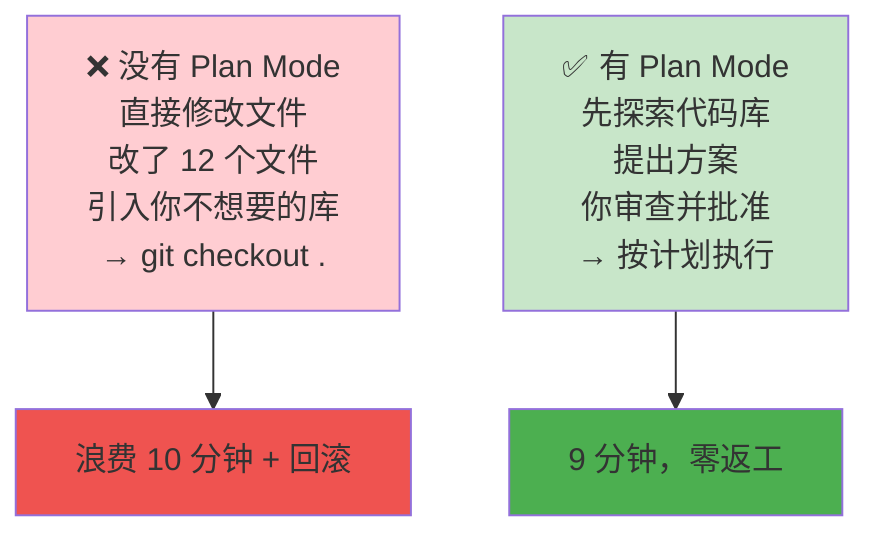

**核心设计原则**：Think before you act —— Plan Mode 是 Claude Code 中模型**主动降级自身权限**以换取用户信任的唯一机制。

本文将从逆向源码的视角，完整拆解 Plan Mode 的进入、探索、规划、审批、退出全链路。

---

## 一、Plan Mode 的本质：一个可降级的权限状态

### 1.1 Permission Context 状态机

Claude Code 的权限系统是一个状态机，Plan Mode 是其中一个可进入、可退出的状态。

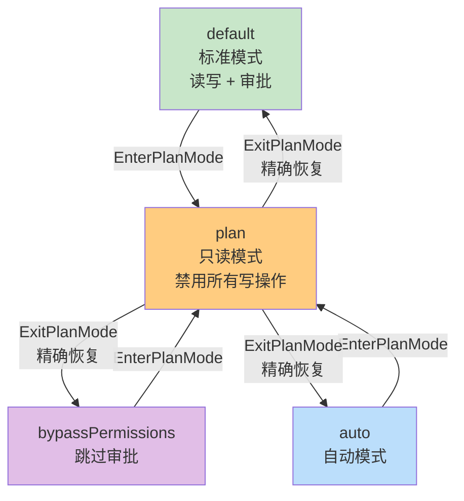

**Plan Mode（`plan`）的核心行为**：

| 操作 | 允许？ |
|------|--------|
| 读取文件 | ✅ |
| 搜索代码 | ✅ |
| Grep | ✅ |
| 修改文件 | ❌ |
| 执行命令 | ❌ |
| 写入文件 | ❌ |

**嵌套插入层（nestable insertion layer）**：无论从 `default` / `auto` / `bypassPermissions` 哪种模式进入，退出时都精确恢复到进入前的状态。源码实现的关键是保存原始模式（`prePlanMode`），退出时精确还原：

```
save prePlanMode = currentMode
setMode: 'plan'
...
restore: setMode(prePlanMode)
```

这个对称性保证了 Plan Mode 是一个**可嵌套的插入层**——无论你在什么模式下进入 Plan Mode，退出后都能无缝回到之前的状态。

### 1.2 两条进入路径，收敛到同一个状态转换函数

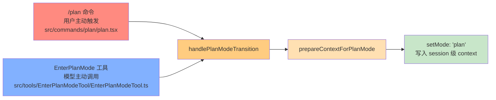

**路径一：用户主动触发（`/plan` 命令）**

源码位于 `src/commands/plan/plan.tsx:64-121`：

```typescript
const currentMode = appState.toolPermissionContext.mode
if (currentMode !== 'plan') {
  handlePlanModeTransition(currentMode, 'plan')
  setAppState(prev => ({
    ...prev,
    toolPermissionContext: applyPermissionUpdate(
      prepareContextForPlanMode(prev.toolPermissionContext),
      { type: 'setMode', mode: 'plan', destination: 'session' },
    ),
  }))
}
```

如果命令附带描述（如 `/plan refactor the auth system`），描述同时作为用户消息提交，触发完整查询循环——模型在 plan 模式下收到这个消息，开始探索。

**路径二：模型主动调用（`EnterPlanMode` 工具）**

源码位于 `src/tools/EnterPlanModeTool/EnterPlanModeTool.ts:77-101`：

```typescript
async call(_input, context) {
  // 子 Agent 不能进入 plan mode —— plan 是用户级决策
  if (context.agentId) {
    throw new Error('EnterPlanMode tool cannot be used in agent contexts')
  }

  const appState = context.getAppState()
  handlePlanModeTransition(appState.toolPermissionContext.mode, 'plan')

  context.setAppState(prev => ({
    ...prev,
    toolPermissionContext: applyPermissionUpdate(
      prepareContextForPlanMode(prev.toolPermissionContext),
      { type: 'setMode', mode: 'plan', destination: 'session' },
    ),
  }))

  return {
    data: { message: 'Entered plan mode. You should now focus on exploring...' },
  }
}
```

**关键约束**：注意 `context.agentId` 检查 —— **子 Agent 不能进入 Plan Mode**。原因直接：Plan Mode 需要用户交互（审批计划），而子 Agent 在后台运行，没有直接用户交互能力。如果子 Agent 被允许进入 Plan Mode，它将永远卡在等待审批的状态。

### 1.3 模型何时知道该进入 Plan Mode？

答案是**工具提示词（tool prompt）**。Claude Code 通过精心构造的 Prompt 引导模型的判断。

**EnterPlanMode 工具的 Prompt**（`src/tools/EnterPlanModeTool/prompt.ts:16-99`）列出了 7 个条件：

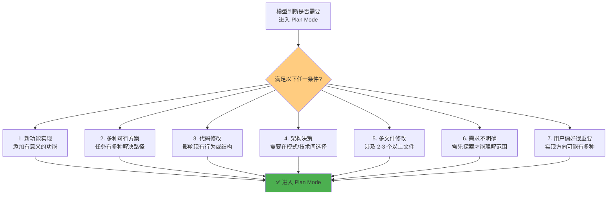

| # | 条件 | 示例 |
|---|------|------|
| 1 | 新功能实现 | 添加有意义的功能 |
| 2 | 多种可行方案 | 任务有多种解决路径 |
| 3 | 代码修改 | 影响现有行为或结构 |
| 4 | 架构决策 | 需要在模式或技术间选择 |
| 5 | 多文件修改 | 涉及 2-3 个以上文件 |
| 6 | 需求不明确 | 需要先探索才能理解范围 |
| 7 | 用户偏好很重要 | 实现方向可能有多种合理选择 |

**内外部用户的差异**：对于 Anthropic 内部用户，Prompt 更保守——只有在"真正的架构模糊性"时才建议进入 Plan Mode，避免过度规划拖慢开发速度。这反映了一个实际观察：内部用户通常更熟悉代码库，不需要那么多"先规划再行动"的保护。

### 1.4 进入路径的可视化决策流

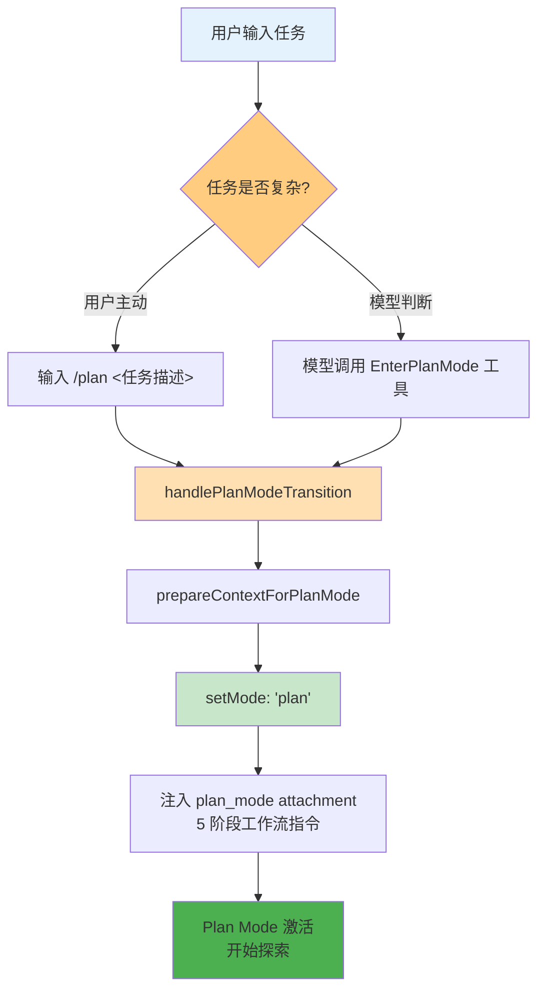

---

## 二、Plan Mode 的两种工作流：5 阶段 vs 迭代循环

Claude Code 实际上有**两种完全不同的 Plan Mode 工作流**，通过特性门控（feature gates）切换。

### 2.1 V1 工作流：严格的 5 阶段模型

这是大多数用户看到的模式（`src/utils/messages.ts:3207-3297`）。注入的系统消息将整个规划过程分为 5 个严格阶段：

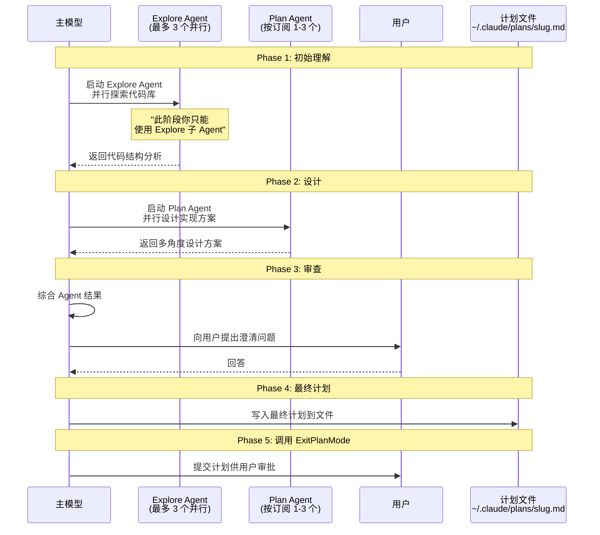

**各阶段详解**：

| 阶段 | 动作 | 限制 |
|------|------|------|
| **Phase 1: 初始理解** | 启动 Explore Agent 探索代码库 | "此阶段你只能使用 Explore 子 Agent" |
| **Phase 2: 设计** | 启动 Plan Agent 设计方案 | 可并行启动多个 Agent 从不同角度设计 |
| **Phase 3: 审查** | 综合 Agent 结果，向用户提问 | - |
| **Phase 4: 最终计划** | 将最终计划写入计划文件 | - |
| **Phase 5: 调用 ExitPlanMode** | 提交计划供用户审批 | - |

**Agent 数量的秘密**（`src/utils/planModeV2.ts:5-29`）：

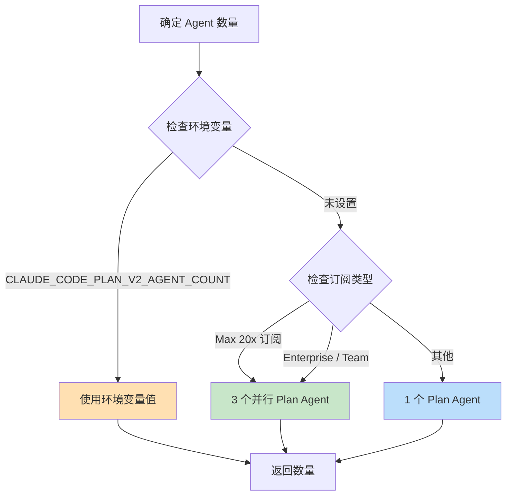

- **Phase 1 Explore Agent**：固定最多 **3 个**，与订阅等级无关（`getPlanModeV2ExploreAgentCount()` 无条件返回 3，只能通过 `CLAUDE_CODE_PLAN_V2_EXPLORE_AGENT_COUNT` 环境变量覆盖）
- **Phase 2 Plan Agent**：数量取决于订阅等级
  - Max 20x 订阅 + 默认 Claude Max 20x 限流层：**3 个并行**
  - Enterprise / Team：**3 个**
  - 其他：**1 个**

### 2.2 V2 工作流：迭代循环（Interview Phase）

这是一个更灵活的替代方案（`src/utils/messages.ts:3323-3383`），由 `isPlanModeInterviewPhaseEnabled()` 控制。

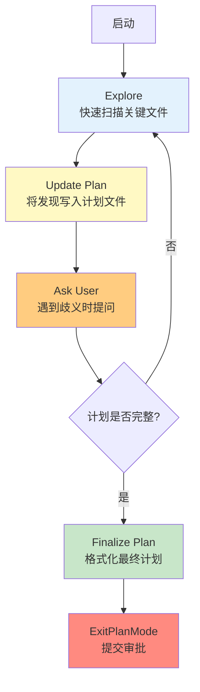

**关键区别**：没有严格阶段——是一个**持续循环**：

```
Loop:
  1. Explore — 用只读工具读取代码
  2. Update the plan file — 每次发现立即写入计划文件
  3. Ask the user — 遇到歧义时提问
  → 回到 1，直到计划完成
```

**Prompt 差异决定了行为风格**：

| 模式 | Prompt 风格 | 行为特征 |
|------|-----------|---------|
| **5 阶段模式** | "并行启动最多 3 个 Explore Agent" | 鼓励充分探索，然后综合 |
| **迭代模式** | "先快速扫描几个关键文件...然后写一个骨架计划，问用户第一轮问题。**不要在和用户互动前做详尽探索**" | 鼓励快速交互，渐进深入 |

### 2.3 两种工作流对比

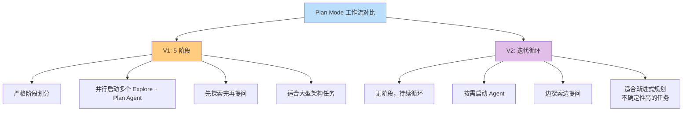

| 维度 | V1（5 阶段） | V2（迭代） |
|------|------------|-----------|
| 阶段划分 | 严格 5 阶段 | 无阶段，持续循环 |
| Agent 使用 | 并行启动多个 Explore + Plan | 按需启动 |
| 交互模式 | 先探索完再提问 | 边探索边提问 |
| 适用场景 | 大型架构任务 | 渐进式规划、不确定性高的任务 |
| 代码特征 | "并行启动最多 3 个 Explore Agent" | "先快速扫描...不要做详尽探索" |

---

## 三、子 Agent 协同：Plan Mode 的并行探索引擎

### 3.1 三种内置子 Agent

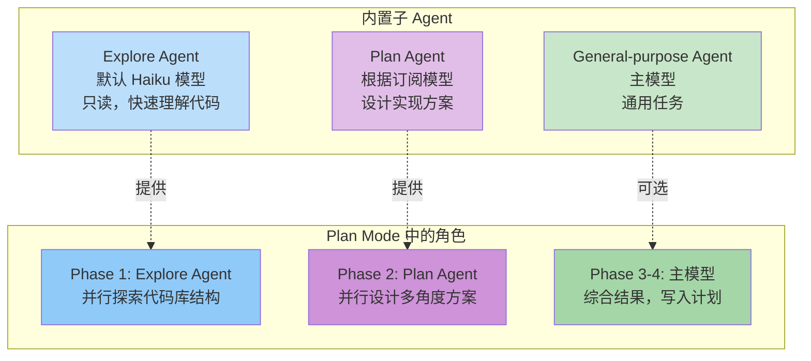

| Agent | 默认模型 | 权限 | 在 Plan Mode 中的角色 |
|-------|---------|------|---------------------|
| **Explore** | Haiku | 只读 | Phase 1：快速理解代码库结构 |
| **Plan** | 根据订阅 | 只读 | Phase 2：设计实现方案 |
| **General-purpose** | 主模型 | 读写 | Plan Mode 外：实际执行 |

**关键设计洞察**（Boris Cherny）：

> 人类审查门在 **Plan 和 Execute 之间**，不是 Explore 和 Plan 之间。探索是便宜的——让 Agent 自由读取。计划是分析的——让 Agent 设计方案。但在让任何 Agent 修改文件之前，你想看到计划并批准它。

**环境变量控制**：

| 环境变量 | 作用 |
|---------|------|
| `CLAUDE_CODE_PLAN_V2_EXPLORE_AGENT_COUNT` | 覆盖 Explore Agent 数量 |
| `CLAUDE_AGENT_SDK_DISABLE_BUILTIN_AGENTS=1` | 禁用所有内置 Agent |
| `CLAUDE_CODE_DISABLE_EXPLORE_PLAN_AGENTS=1` | 禁用 Explore/Plan Agent |

### 3.2 并行 Agent 的成本考量

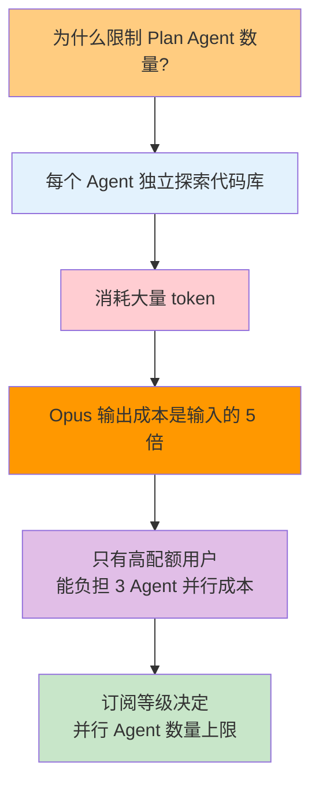

**实际原因**：Plan Agent 消耗大量 token（每个 Agent 独立探索代码库），只有高配额用户能负担 3 个 Agent 并行的成本。

**Anthropic 的务实选择**：对普通用户只开放 1 个 Plan Agent，对 Max/Enterprise/Team 用户开放 3 个。这不是技术限制，而是**成本控制策略**。

---

## 四、计划文件：存储、格式与 A/B 实验

### 4.1 计划文件存储

```
~/.claude/plans/bold-eagle.md          ← 主会话的计划
~/.claude/plans/bold-eagle-agent-7.md  ← 子 Agent 7 的计划
```

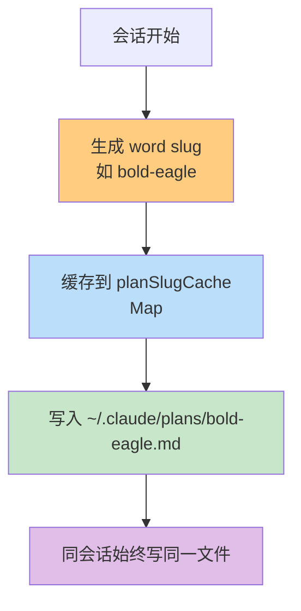

**为什么用 word slug（如 `bold-eagle`）而不是 UUID？**

| 方案 | 可读性 | 可编辑性 | 记忆性 |
|------|--------|---------|--------|
| `bold-eagle.md` | ✅ 高 | ✅ 用户可手动打开编辑 | ✅ 容易识别和记忆 |
| `a3f7b2c1-4d5e-6f78.md` | ❌ 低 | ❌ 不友好 | ❌ 无法记忆 |

**Slug 缓存**：按会话缓存（`planSlugCache: Map<SessionId, string>`），同会话始终写同一文件。文件名冲突时最多重试 10 次（`MAX_SLUG_RETRIES = 10`）。

**Fork 时的关键细节**：Fork 会话时（`copyPlanForFork()`），必须生成新的 slug。如果复用原 slug，原始和 Fork 会话会写同一个文件——导致互相覆盖。

### 4.2 计划文件 A/B 实验（tengu_pewter_ledger）

这是 Anthropic 正在进行的一个 A/B 实验（`src/utils/messages.ts:3156-3205`），有四个变体：

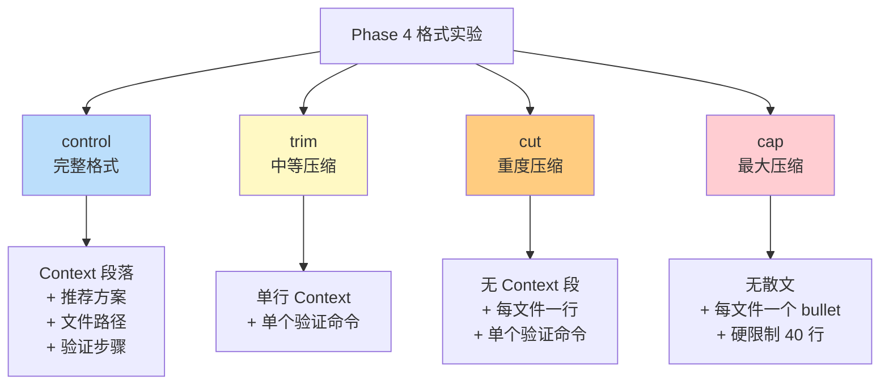

| 变体 | 关键差异 | 目标 |
|------|---------|------|
| **control** | Context + 推荐方案 + 文件路径 + 验证步骤 | 基线 |
| **trim** | 单行 Context + 单个验证命令 | 中等压缩 |
| **cut** | 无 Context 段 + 每文件一行 + 单个验证命令 | 重度压缩 |
| **cap** | 无散文 + 每文件一个 bullet + **硬限制 40 行** | 最大压缩 |

**实验动机**（生产数据揭示的真相）：

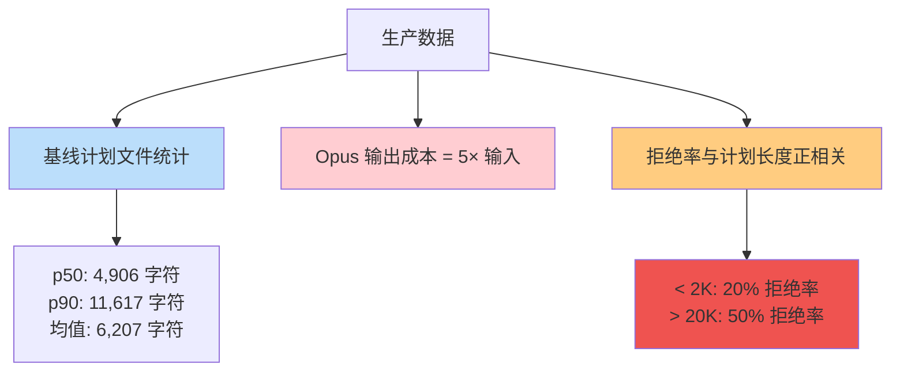

**结论**：计划越长，用户越不满意。

- 基线（control）计划文件：p50 = 4,906 字符，p90 = 11,617 字符，均值 = 6,207 字符
- Opus 输出成本是输入的 **5 倍**，过长计划文件直接推高成本
- **拒绝率与计划长度正相关**：<2K 的 20% 拒绝率，>20K 的 50% 拒绝率

### 4.3 计划文件恢复：5 层恢复策略

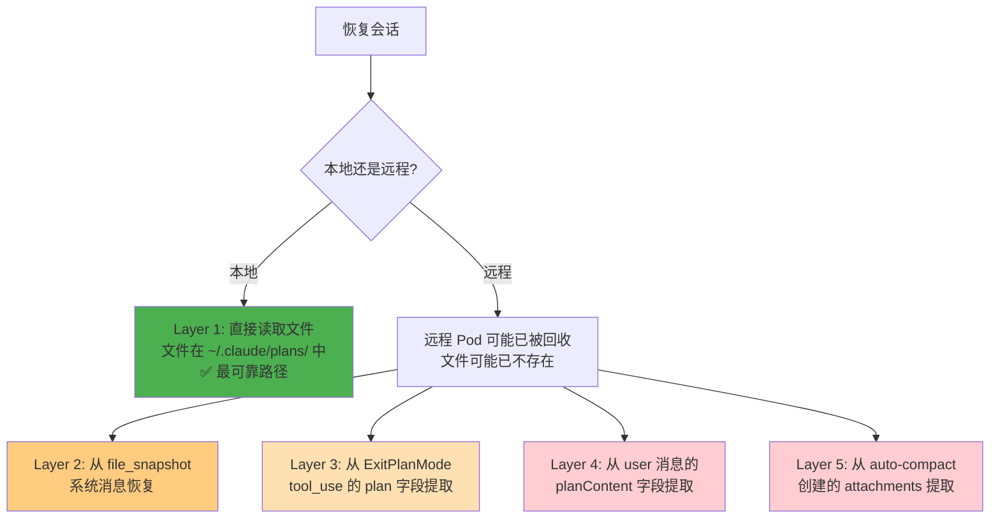

**为什么需要 5 层恢复？**

- **本地用户**：计划文件安全存储在 `~/.claude/plans/` 中，恢复直接
- **远程用户（CCR）**：Pod 可能随时被回收，文件可能已不存在
- 所以系统必须从转录本的各个位置尝试恢复

**持久化通道**：系统只在特定时刻调用 `persistFileSnapshotIfRemote()`：
- `normalizeToolInput()` 处理 ExitPlanMode 工具时（`src/utils/api.ts:578` 的 `EXIT_PLAN_MODE_V2_TOOL_NAME` 分支）
- `ExitPlanMode.call()` 写入用户编辑后的计划时（`ExitPlanModeV2Tool.ts:260`）

**不是每次 `normalizeToolInput()` 都写**——只在 ExitPlanMode 相关的路径中写。将计划内容作为 `file_snapshot` 系统消息写入转录本——这是远程会话**唯一可靠的持久化通道**。

---

## 五、Progressive Reminder：Plan Mode 的节流提醒机制

### 5.1 为什么不每轮都注入完整指令？

这是一个精心设计的答案，涉及两个问题：

1. **Token 浪费**：每轮重复完整指令消耗大量 token
2. **指令疲劳**：过于频繁的重复反而会导致模型对指令产生"疲劳"——**过度频繁的重复实际上削弱了指令的有效性**

### 5.2 节流策略

```mermaid
gantt
    title Plan Mode 提醒注入节奏
    dateFormat X
    axisFormat Turn %N

    section Turn 1
    完整指令 (full)     :milestone, 0, 0
    section Turn 2-4
    无注入              :active, 1, 3
    section Turn 5
    简短提醒 (sparse)    :milestone, 4, 0
    section Turn 6-9
    无注入              :active, 5, 4
    section Turn 10
    简短提醒            :milestone, 9, 0
    section Turn 11-24
    无注入/稀疏交替       :active, 10, 14
    section Turn 25
    完整指令            :milestone, 24, 0
```

源码实现于 `src/utils/attachments.ts:1189-1242`：

| Turn | 注入内容 | 原因 |
|------|---------|------|
| **Turn 1** | 完整指令（full） | 模型首次进入，需要完整上下文建立规则认知 |
| **Turns 2-4** | 无 | 节省 token，模型短期记忆应还记得 |
| **Turn 5** | 简短提醒（sparse） | 防止模型"忘记"在 Plan Mode 中 |
| **Turns 6-9** | 无 | 继续节省 |
| **Turn 10** | 简短提醒 | 保持提醒频率 |
| **每 25 个 Turn** | 完整指令 | 长会话的完整上下文刷新 |

**配置常量**（`src/utils/attachments.ts:259-262`）：

```typescript
export const PLAN_MODE_ATTACHMENT_CONFIG = {
  TURNS_BETWEEN_ATTACHMENTS: 5,      // 每 5 turn 注入一次
  FULL_REMINDER_EVERY_N_ATTACHMENTS: 5,  // 每 5 次注入中有 1 次是完整指令
}
```

**计算**：完整指令约每 25 turn 出现一次（5 × 5），其余使用超短稀疏提醒（~300 字符）维持模型对当前模式的感知。

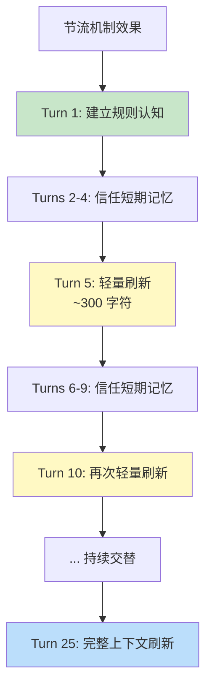

### 5.3 Attachments 系统

Plan Mode 的指令不是通过系统提示词注入的，而是通过 Claude Code 的 **Attachment System** 在每次对话轮次中注入。

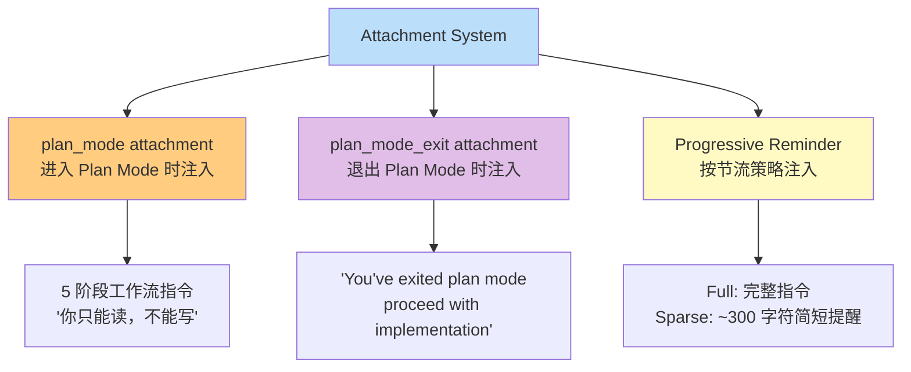

**关键洞察**：指令不是每轮完整注入——那会浪费太多 token。Plan Mode 系统消息本质上是模型的行为护栏（"你只能读，不能写"），但节流策略确保了指令的有效性和经济性。

---

## 六、ExitPlanMode：退出与审批的复杂性

### 6.1 退出流程全貌

退出是 Plan Mode 中最复杂的部分，因为它必须同时处理**权限恢复、用户审批、计划同步、多执行上下文**。

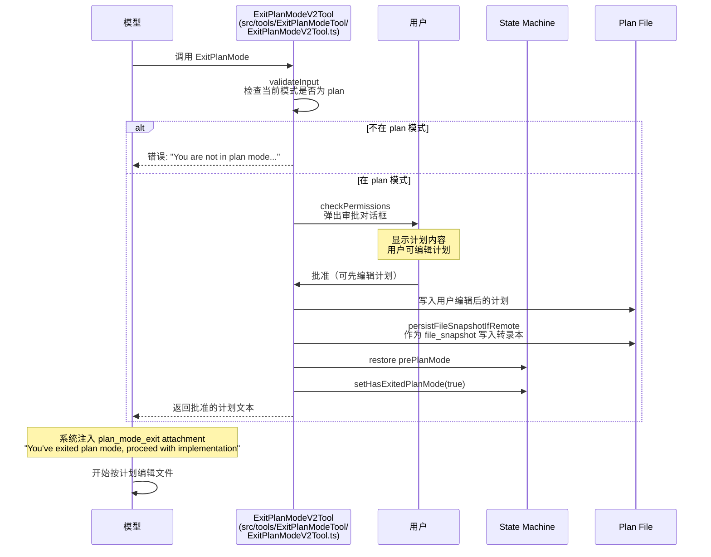

### 6.2 模型为什么会"忘记"已退出 Plan Mode？

`ExitPlanModeV2Tool` 的第一个检查（`src/tools/ExitPlanModeTool/ExitPlanModeV2Tool.ts:195-219`）：

```typescript
async validateInput(_input, { getAppState, options }) {
  if (isTeammate()) {
    return { result: true }
  }
  const mode = getAppState().toolPermissionContext.mode
  if (mode !== 'plan') {
    logEvent('tengu_exit_plan_mode_called_outside_plan', { ... })
    return {
      result: false,
      message: 'You are not in plan mode. This tool is only for exiting plan mode...',
      errorCode: 1,
    }
  }
  return { result: true }
}
```

**为什么需要这个检查？** 因为模型有时会"忘记"它已经退出了 Plan Mode，再次调用 ExitPlanMode。这种"健忘症"有三个主要原因：

```mermaid
flowchart TD
    A[模型"忘记"已退出<br/>Plan Mode] --> B[原因 1: 上下文压缩]
    A --> C[原因 2: 延迟工具列表误导]
    A --> D[原因 3: 模式状态缺乏显式标记]

    B --> B1[之前的 ExitPlanMode<br/>成功消息被压缩丢弃<br/>模型没有"已退出"的证据]

    C --> C1[模型仍然在工具列表中<br/>看到 ExitPlanMode 可用<br/>容易误以为还在 Plan Mode]

    D --> D1[当前模式信息主要通过<br/>系统附件传递<br/>如果因节流未注入<br/>模型可能混淆状态]

    style B fill:#ffcdd2
    style C fill:#ffcc80
    style D fill:#e1bee7
```

| 原因 | 机制 |
|------|------|
| **上下文压缩（Compaction）** | 之前的 ExitPlanMode 成功消息可能被压缩丢弃，模型没有"已退出"的证据 |
| **延迟工具列表误导** | 模型仍然在工具列表中看到 ExitPlanMode 可用，容易误以为还在 Plan Mode |
| **模式状态缺乏显式标记** | 当前模式信息主要通过系统附件传递，如果因节流未注入附件，模型可能混淆状态 |

**这个检查防止了状态因重复退出而损坏。**

### 6.3 计划同步：编辑后的计划如何回传

```mermaid
flowchart TD
    A[用户审批] --> B[用户在对话框中编辑计划]
    B --> C[ExitPlanModeV2Tool.ts:260<br/>写入用户编辑后的计划]
    C --> D[persistFileSnapshotIfRemote]
    D --> E[作为 file_snapshot<br/>系统消息写入转录本]
    E --> F[返回批准的计划文本给模型]
    F --> G[模型按计划执行]

    style A fill:#e3f2fd
    style C fill:#bbdefb
    style E fill:#c8e6c9
    style F fill:#ffcc80
    style G fill:#4caf50
```

**远程会话的唯一可靠持久化通道**：`persistFileSnapshotIfRemote()` 将计划内容作为 `file_snapshot` 系统消息写入转录本。这不是每次 `normalizeToolInput()` 都写——只在 ExitPlanMode 相关路径中写。

---

## 七、Plan Mode 与 Compaction 的交互

```mermaid
flowchart TD
    A[Compaction 发生时] --> B{Plan Mode 活跃?}

    B -->|是| C[计划文件已在磁盘上<br/>~/.claude/plans/*.md]
    C --> D[Compaction 压缩转录本<br/>但计划文件不受影响]
    D --> E[模型可能"忘记"计划内容]
    E --> F[✅ 可以通过重新读取<br/>计划文件恢复精确状态]

    B -->|否| G[Compaction 压缩转录本<br/>早期对话历史被摘要替代]
    G --> H[⚠️ Plan Mode 相关的<br/>早期附件可能被丢弃]

    style C fill:#4caf50
    style F fill:#4caf50
    style E fill:#ffcc80
    style H fill:#ffcdd2
```

**关键洞察**：计划文件（`~/.claude/plans/*.md`）是**磁盘上的持久化存储**，不受 Compaction 影响。这就是为什么 5 层恢复策略中，Layer 1（直接读取文件）是最可靠的路径。

---

## 八、与 OpenClaw 的对比

```mermaid
graph TD
    subgraph "Claude Code"
        A1["/plan 命令<br/>EnterPlanMode 工具"]
        A2["permissionMode: 'plan'<br/>只读权限降级"]
        A3["Explore/Plan 子 Agent 并行<br/>最多 3×3"]
        A4["~/.claude/plans/slug.md<br/>计划文件存储"]
        A5["Progressive Reminder<br/>节流注入"]
        A6["ExitPlanMode +<br/>用户审批对话框"]
        A7["5 层恢复策略"]
        A8["tengu_pewter_ledger<br/>4 种格式变体"]
    end

    subgraph "OpenClaw"
        B1["无对应 Plan Mode"]
        B2["Agent Skill Allowlist<br/>控制可见工具"]
        B3["sessions_spawn<br/>子 Agent"]
        B4["用户手动写文件<br/>PLAN.md"]
        B5["无，依赖用户指令"]
        B6["无内置审批流程"]
        B7["从文件系统加载<br/>bootstrap/context files"]
        B8["无"]
    end

    A1 -.对比.-> B1
    A2 -.对比.-> B2
    A3 -.对比.-> B3
    A4 -.对比.-> B4
    A5 -.对比.-> B5
    A6 -.对比.-> B6
    A7 -.对比.-> B7
    A8 -.对比.-> B8

    style A1 fill:#ff8a80
    style A2 fill:#82b1ff
    style A3 fill:#ce93d8
    style A4 fill:#90caf9
    style A5 fill:#fff9c4
    style A6 fill:#ffcc80
    style A7 fill:#c8e6c9
    style A8 fill:#ffe0b2
    style B1 fill:#ffcdd2
    style B2 fill:#bbdefb
    style B3 fill:#e1bee7
    style B4 fill:#e3f2fd
    style B5 fill:#fff9c4
    style B6 fill:#ffe0b2
    style B7 fill:#c8e6c9
    style B8 fill:#f5f5f5
```

| 维度 | Claude Code Plan Mode | OpenClaw |
|------|----------------------|---------|
| **进入机制** | `/plan` 命令 + `EnterPlanMode` 工具 | 无对应 Plan Mode |
| **权限降级** | `permissionMode: 'plan'`（只读） | Agent Skill Allowlist 控制可见工具 |
| **并行探索** | Explore/Plan 子 Agent 并行（最多 3×3） | `sessions_spawn` 子 Agent |
| **计划存储** | `~/.claude/plans/slug.md` | 用户手动写文件（PLAN.md） |
| **提醒机制** | Progressive Reminder（节流注入） | 无，依赖用户指令 |
| **审批流程** | ExitPlanMode 工具 + 用户审批对话框 | 无内置审批流程 |
| **状态恢复** | 5 层恢复策略 | 从文件系统加载 bootstrap/context files |
| **A/B 实验** | tengu_pewter_ledger（4 种格式变体） | 无 |

---

## 结语

Plan Mode 的核心创新可以用一句话概括：**让模型主动降级自身权限**——不是强制限制，而是引导模型自愿进入只读模式，在用户批准后才恢复写权限。

```mermaid
flowchart TD
    A[Plan Mode 核心认知] --> B[人类审查门在 Plan 和 Execute 之间]
    A --> C[节流提醒解决 token 浪费和指令疲劳]
    A --> D[计划越长，用户越不满意]
    A --> E[子 Agent 不能进入 Plan Mode]
    A --> F[5 层恢复策略保证远程会话可靠性]

    style A fill:#bbdefb
    style B fill:#c8e6c9
    style C fill:#c8e6c9
    style D fill:#c8e6c9
    style E fill:#c8e6c9
    style F fill:#c8e6c9
```

**五条关键洞察**：

1. **人类审查门在 Plan 和 Execute 之间**，不是 Explore 和 Plan 之间——探索是便宜的，计划是分析的，但修改文件前必须让人类看到计划
2. **节流提醒机制**（Progressive Reminder）解决了长会话中的 token 浪费和指令疲劳问题——完整指令每 25 turn 才注入一次
3. **A/B 实验数据揭示的真相**：计划越长，用户越不满意——<2K 的 20% 拒绝率 vs >20K 的 50% 拒绝率，简洁的计划优于详尽的计划
4. **子 Agent 不能进入 Plan Mode**——这是硬约束，因为子 Agent 没有用户交互能力
5. **98.4% 的工程基础设施**（MBZUAI 研究）提醒我们：好的 AI Agent，工程架构比算法更重要——Plan Mode 的价值不在 AI 决策逻辑的代码量上，而在于围绕它的权限管理、状态机、持久化和恢复机制的完善程度

---

*本文基于 `oboard/claude-code-rev`（source map 逆向恢复）、`Windy3f3f3f3f/how-claude-code-works` 源码分析和 Claude Code 官方文档编写。Plan Mode 和子 Agent 特性演进迅速，建议以官方文档为准。*
