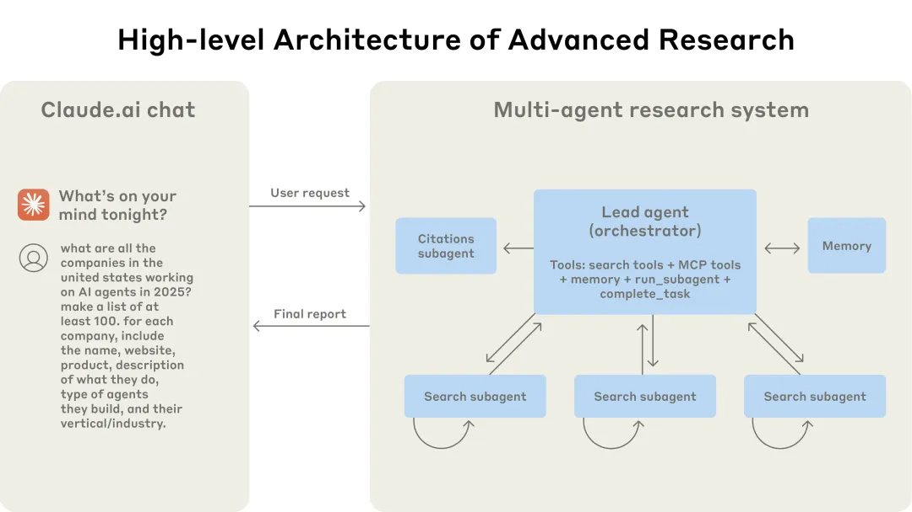

# **“Research”功能架构概览[1]**

# **Prompt engineering and evaluations for research agents[1]**

在开发过程中，他们总结了8个多智能体系统的设计原则：

1. **像智能体一样思考**
    
    用模拟和可视化工具观察智能体决策，及时发现和修正失败模式，理解提示词对行为的影响。
    
2. **教会主控智能体如何分工**
    
    主智能体需为每个子智能体分配清晰目标、输出格式、工具指引和任务边界，避免重复或遗漏。
    
3. **根据任务复杂度分配资源**
    
    在提示词中嵌入“规模规则”：简单任务用少量智能体和工具调用，复杂任务用更多资源，防止资源浪费或过度投入。
    
4. **工具设计与选择至关重要**
    
    工具接口要像人机界面一样清晰，描述明确，避免误用。智能体需先评估所有可用工具，匹配用户意图选择最合适的工具。
    
5. **让智能体自我改进**
    
    利用大模型自身能力优化提示词和工具描述，通过“工具测试智能体”不断发现和修正工具使用中的问题。
    
6. **先广后深**
    
    搜索策略应先用宽泛查询探索全局，再逐步聚焦细节，避免一开始就陷入死胡同。
    
7. **引导思考过程**
    
    通过“扩展思考模式”让智能体显式规划、评估和调整策略，提升适应性和推理能力。
    
8. **并行工具调用极大提升效率**
    
    主智能体和子智能体都应并行调用工具，显著缩短研究时间，提升覆盖面和深度。
    

以及评测与工程化的6条实践经验：

- **结果导向评测**：关注最终结果是否正确，而非过程是否完全按预设执行。
- **LLM 自动评测结合人工检查**：用大模型自动打分，人工补充发现边界问题，快速迭代优化。
- **状态管理与错误恢复**：智能体需持久化状态，优雅处理错误，不能简单重启。
- **灰度部署与升级**：采用渐进式部署，避免影响正在运行的智能体。
- **长对话上下文管理**：用摘要、外部记忆等机制防止上下文溢出。
- **子智能体直接产出结构化结果**：如代码、报告等，减少信息损失和 Token 消耗。

Cookbook提示示例：https://github.com/anthropics/anthropic-cookbook/tree/main/patterns/agents/prompts

# **智能体的有效评估**

todo

# **生产可靠性与工程挑战**

todo

# 参考

1. [Anthropic谈如何构建生产级多智能体系统](https://mp.weixin.qq.com/s/SCyon1FctJauDKMtvu3wXQ)

[How we built our multi-agent research system](https://www.anthropic.com/engineering/built-multi-agent-research-system) 原文

1xx. [**[LangGraph] gemini 开源全栈 deep research 及 Anthropic multi-agent research system 导读**](https://www.notion.so/LangGraph-gemini-deep-research-Anthropic-multi-agent-research-system-220bfe211084804d919cdb1cfd7a3f5f?pvs=21) 
     [https://github.com/chunhuizhang/prompts_for_academic/blob/main/deepresearch/multi-agent research system.ipynb](https://github.com/chunhuizhang/prompts_for_academic/blob/main/deepresearch/multi-agent%20research%20system.ipynb)

1xx. [一文读懂 Claude Research：多智能体系统如何重塑复杂任务处理？](https://mp.weixin.qq.com/s/yN69MPb6y35GFzJA6D-33Q)