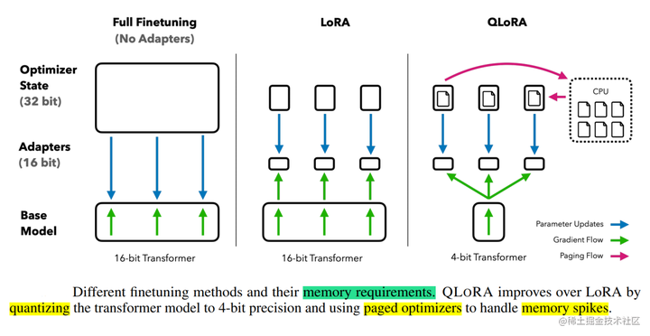
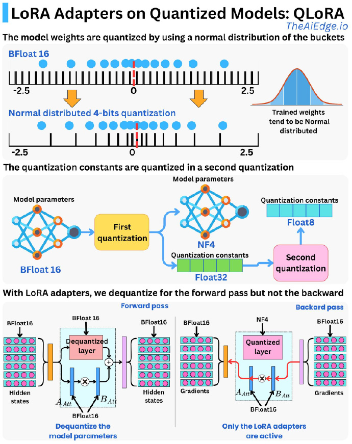

<p></p>
<!-- more -->


<aside>
💡

- QAT
    - 4 bit NormalFloat(NF4) 量化
    - 双量化

</aside>

# 技术原理 [1]

使用一种新颖的高精度技术将预训练模型量化为 4 bit，然后添加一小组可学习的低秩适配器权重，这些权重通过量化权重的反向传播梯度进行微调。  
QLoRA提出了两种技术实现高保真 4 bit微调——4 bit NormalFloat(NF4) 量化和双量化。  

- 4bit NormalFloat（NF4）：对于正态分布权重而言，一种信息理论上最优的新数据类型，该数据类型对正态分布数据产生比 4 bit整数和 4bit 浮点数更好的实证结果。
- 双量化：对第一次量化后的那些常量再进行一次量化，减少存储空间。
- 分页优化器: 使用此功能为优化器状态（Optimizer）分配分页内存，然后在 GPU 内存不足时将其自动卸载到 CPU 内存，并在优化器更新步骤需要时将其加载回 GPU 内存。



实验证明，无论是使用16bit、8bit还是4bit的适配器方法，都能够复制16bit全参数微调的基准性能。这说明，尽管量化过程中会存在性能损失，但通过适配器微调，完全可以恢复这些性能。

# 总结

QLoRA [189] quantizes the weights of LLMs into 4-bit and subsequently employs LoRA [224] in BF16 for each 4-bit weight matrix to fine-tune the quantized model. QLoRA allows for the efficient fine-tuning of a 65B parameter LLM on one GPU with only 30GB of memory.

# 老刘

QLoRA通过结合NF4量化（一种考虑权重分布的4位量化）、双重量化（进一步压缩量化常数）和LoRA（只训练少量适配器参数）来实现高效微调。其核心优势在于，它显著降低了存储模型权重所需的内存，并且在反向传播（梯度计算和参数更新）期间，冻结的基础模型权重保持低精度（NF4）状态，从而大幅减少了训练过程中的显存占用，使得在有限的硬件资源（如单个GPU）上微调非常大的模型成为可能。



# 实战 [10]

### **QLoRA 微调[**llama3**]**

基于 4/8 比特 Bitsandbytes/HQQ/EETQ 量化进行指令监督微调[**推荐**]

```
llamafactory-cli train examples/train_qlora/llama3_lora_sft_otfq.yaml
```

基于 4/8 比特 GPTQ 量化进行指令监督微调

```
llamafactory-cli train examples/train_qlora/llama3_lora_sft_gptq.yaml
```

基于 4 比特 AWQ 量化进行指令监督微调

```
llamafactory-cli train examples/train_qlora/llama3_lora_sft_awq.yaml
```

<aside>
💡

**LoRA和QLoRA  能在量化过的模型上微调**

</aside>

### **QLoRA 微调[LLaMA-65B]**  [11]

# 参数

1. [大模型参数高效微调技术原理综述（五）-LoRA、AdaLoRA、QLoRA](https://zhuanlan.zhihu.com/p/636215898)  

1xx. [[大模型微调技术] LoRA、QLoRA、QA-LoRA 原理笔记](https://zhuanlan.zhihu.com/p/671089942)  
1xx. [大模型实操 | LoRA、QLoRA微调大模型实战技巧分享，含常见QA解答！](https://cloud.tencent.com/developer/article/2375230)  

### 实战

10. [LLaMA-Factory examples](https://github.com/hiyouga/LLaMA-Factory/blob/main/examples/README_zh.md)  
11. [高效微调技术QLoRA实战，基于LLaMA-65B微调仅需48G显存，真香](https://zhuanlan.zhihu.com/p/636644164)   
   
    先是训练llama-7b, 再是训练llama-65b.    [qlora](https://github.com/www6v/llm-action/tree/main/llm-train/qlora) git  
    

1xx. [4bits_training](https://github.com/zyds/transformers-code/tree/master/04-Kbit%20Training/27-4bits_training)  
[【手把手带你实战HuggingFace Transformers-低精度训练篇】4bit量化与QLoRA模型训练](https://www.bilibili.com/video/BV1DQ4y1t7e8/) v 原理+实战  
