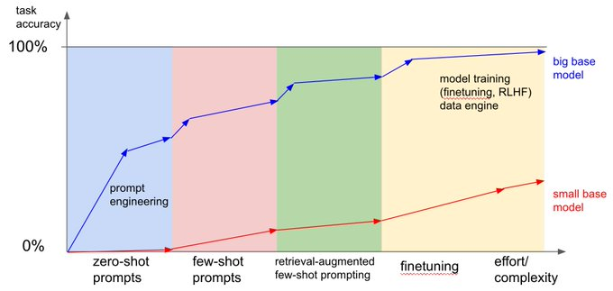

<!-- more -->

# 何时进行微调[1]

语言模型（LLM）可以通过至少两种方式学习新知识：权重更新（例如预训练或微调）或提示（例如检索增强生成，RAG）。模型的权重就像长期记忆，而提示就像短期记忆。这个OpenAI Cookbook给出了一个有用的比喻：当你对模型进行微调时，就像是在离考试还有一周的时候准备复习。当你通过提示（例如检索）向提示中插入知识时，就像是在有开放笔记的考试中。

基于这一点，**不建议使用微调来教授LLM新的知识或事实回忆**；OpenAI的John Schulman在一次讲话中指出，微调可能会**增加虚构**。微调**更适合教授专门的任务**，但应与提示或RAG相对比。正如这里所讨论的，对于具有丰富示例和/或缺乏上下文学习能力的LLM来说，微调对于定义明确的任务可能是有帮助的。这篇Anyscale博客很好地总结了这些观点：**微调是为形式而非事实**[3]。

# what [4]
这是一个很好的问题。我大致将微调类比为人的专业知识：
- **用文字描述一个任务 ~= 零样本提示**
- **给出解决任务的示例 ~= 少样本提示**
- **允许人们练习任务 ~= 微调**

考虑到这个比喻，令人惊奇的是我们有了可以仅通过提示就能在许多任务上达到高水平准确性的模型，但我也预计达到顶级性能可能需要微调，特别是在具有明确定义的具体任务的应用中，在这些任务中我们可以收集大量数据并在其上进行“练习”。

这可能是一个需要牢记的**粗略图景**。**小型模型**无法进行上下文学习，并且从提示工程中受益甚少，但根据任务的难度，**仍然有可能将它们微调为表现良好的专家**。

需要注意的是，所有这些都还是非常新颖的。

# Common use cases[2]
微调可以改善结果的一些常见**用例**包括：

- **设定风格、语气、格式或其他定性因素**
- **提高生成所需输出的可靠性**
- **纠正无法按照复杂提示要求执行的问题**
- 以特定方式处理许多边缘情况
- **执行难以用提示清晰表达的新技能或任务**

从较高层面来看，这些情况下微调更容易实现“**展示而非告诉**”的效果。在接下来的部分中，我们将探讨如何为微调设置数据以及各种示例，这些示例中微调改善了基线模型的性能。

# 参考
1. [Using LangSmith to Support Fine-tuning](https://blog.langchain.dev/using-langsmith-to-support-fine-tuning-of-open-source-llms/)
     [colab](https://colab.research.google.com/drive/1tpywvzwOS74YndNXhI8NUaEfPeqOc7ub?usp=sharing&ref=blog.langchain.dev)   LANGCHAIN_API_KEY
  
2. [Fine-tuning](https://platform.openai.com/docs/guides/fine-tuning)  openai *** 

3. [Fine tuning is for form, not facts](https://www.anyscale.com/blog/fine-tuning-is-for-form-not-facts) ***

4. [Andrej Karpathy twitter](https://twitter.com/karpathy/status/1655994367033884672) 
