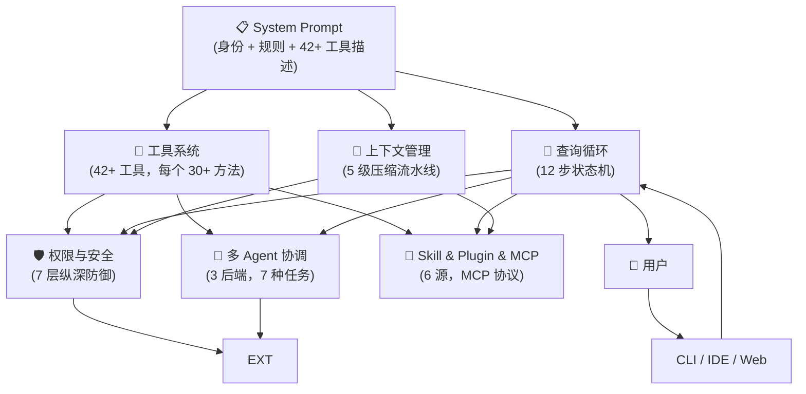
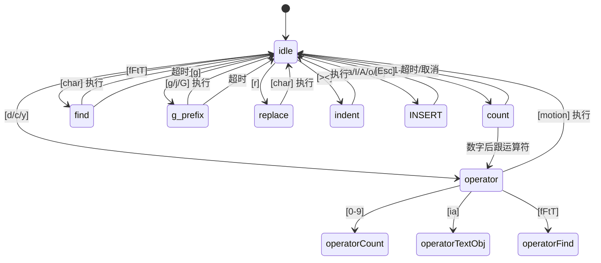

# Claude Code 架构深度解析：从 LLM 到自主编程 Agent 的工程实践

> **摘要**：本文以 DDIA（Designing Data-Intensive Applications）风格，对 Claude Code 的整体架构进行系统性解构。涵盖 12 步 Agentic 状态机、5 级上下文压缩流水线、7 层纵深防御安全模型、42+ 工具系统、多 Agent 编排、Fork Ink 终端 UI 引擎等核心子系统。所有结论均以 Claude Code 官方文档、逆向可运行源码（oboard/claude-code-rev）、学术论文（VILA-Lab, arXiv:2604.14228）、递进式教学（shareAI-lab/learn-claude-code）和 17 篇深度解析（openedclaude/claude-reviews-claude）为交叉验证依据。

---

## 1. 引言

### 1.1 什么是 Claude Code？从"代码补全"到"自主编程 Agent"的范式跃迁

Claude Code 是 Anthropic 于 2025 年 2 月推出的 agentic coding tool —— 它不是一个简单的代码补全插件，而是一个能够阅读代码库、编辑文件、运行命令、并与开发工具集成的自主编程代理（Agent）。截至 2025 年 5 月，Claude Code 已支持 Terminal CLI、VS Code、JetBrains、Desktop App、Web 和 Chrome 扩展六大 Surface，并开放了 Agent SDK 供开发者构建自定义 Agent 工作流 [[code.claude.com/docs]]。

回顾 AI 编程辅助工具的演进路线：

| 阶段 | 代表产品 | 核心能力 | 交互模式 |
|------|---------|---------|---------|
| 代码补全 | TabNine, Copilot | 行级/函数级补全 | 被动建议 |
| 对话式编码 | ChatGPT, Cursor Chat | 多轮对话生成代码 | 问答式 |
| Agent 编程 | Claude Code, Devin | 自主规划-执行-验证 | 目标驱动 |
| Agent 编排 | Claude Code Teams | 多 Agent 协作 | 分布式 |

Claude Code 正处于从"对话式编码"向"自主编程 Agent"的范式跃迁节点上。它不再等待用户逐轮给出指令，而是接受一个目标（"修复 auth 模块的 bug"），然后自主完成：阅读代码 → 定位问题 → 编写修复 → 运行测试 → 提交变更。整个过程可能涉及 5-20 次 API 往返调用，但用户只需给出一个目标。

### 1.2 为什么值得拆解？

Claude Code 是目前最成熟的 Terminal-native Agentic Coding Harness。其架构设计包含以下值得深入研究的特征：

- **生产验证**：每日数十万次真实开发任务中的稳定性验证
- **系统规模**：~1,884 个文件，~512K 行代码（v2.1.88），是研究大型 AI 应用的绝佳样本
- **设计深度**：从 9 步状态机演进到 12 步，从 4 层压缩到 5 级流水线，每次迭代都在解决真实场景的边界问题
- **安全先行**：7 层纵深防御安全模型，4 个公开 CVE 的修复经验（预信任窗口 + 事件循环饥饿）
- **工程卓越**：编译时死代码消除、叶模块模式、35 行替代 Redux、Import-Gap 并行化等独特实践

### 1.3 本文视角：五大参考源交叉印证

本文的架构分析基于五大参考源的交叉验证，确保每个结论都有权威出处：

| 参考源 | 类型 | 规模 | 贡献维度 |
|--------|------|------|---------|
| [Claude Code 官方文档](https://code.claude.com/docs/) | 官方 | 50+ 页面 | 功能全景、API 参考、安全模型、扩展机制 |
| [oboard/claude-code-rev](https://github.com/oboard/claude-code-rev) | 逆向工程 | 可运行源码 | Provider 适配、CLI Bootstrap、模块依赖分析 |
| [VILA-Lab/Dive-into-Claude-Code](https://github.com/VILA-Lab/Dive-into-Claude-Code) (arXiv:2604.14228) | 学术论文 | 系统性分析 | 7 层安全、5 级 Compaction、CVE 分析、安全漏洞分类 |
| [shareAI-lab/learn-claude-code](https://github.com/shareAI-lab/learn-claude-code) | 教学材料 | 12 阶段递进 | Harness 工程心智模型、渐进式理解路径 |
| [openedclaude/claude-reviews-claude](https://openedclaude.github.io/claude-reviews-claude/zh-CN/overview) | 深度解析 | 17 篇，8,600+ 行 | 12 步状态机、工程实践、可迁移设计模式 |

这种多源交叉验证的方法确保本文不仅描述了"是什么"，还解释了"为什么"以及"如何验证"。

### 1.4 核心命题：Agency 来自训练，Harness 决定落地

理解 Claude Code 的关键在于区分两个概念：

- **Agency（代理能力）**：来自模型训练。Claude Opus/Sonnet 在预训练和后训练中获得的推理、规划、代码理解能力，是 Claude Code 的"大脑"。
- **Harness（驾驭框架）**：来自工程实现。Tools + Knowledge + Observation + Action + Permissions 的组合，是 Claude Code 的"身体"。

> **核心命题**：模型提供了推理能力，但 Harness 决定了这个能力如何落地。一个强大的 LLM 如果没有合适的 Harness，就如同一个天才被困在没有感官和肢体的房间里。

Claude Code 的 Harness 工程解决的核心问题是：**如何将模型的理论能力安全、可靠、高效地转化为实际行动？** 答案贯穿本文的每一章。

### 1.5 读者前置知识

本文面向有一定系统设计经验的工程师和研究人员。建议读者具备以下前置知识：

- 理解 LLM 的基本原理（token、上下文窗口、API 调用）
- 熟悉异步编程概念（Promise、AsyncGenerator、Event Loop）
- 了解基本的软件工程概念（依赖注入、状态管理、权限模型）

---

## 2. 总体架构概览

### 2.1 六支柱架构全景图

Claude Code 的强大不是来自某个杀手锏功能，而是来自六个核心支柱的协同运作——每一个支柱都在放大其他支柱的效果 [[openedclaude/claude-reviews-claude]]。



**一句话数据流**：
> 用户输入 → CLI (cli.tsx) → QueryEngine.query() → System Prompt 组装 → 流式 API 调用 → 工具提取 → 权限检查 → 工具执行 → 结果注入 → 继续/结束决策 → 下一次迭代或响应

### 2.2 六大设计哲学

| # | 哲学 | 一句话解释 | 源码体现 |
|---|------|-----------|---------|
| 1 | **LLM = 大脑，Harness = 身体** | LLM 负责推理；Harness 负责感知、行动、记忆和约束 | `queryLoop` 刻意保持"愚钝" |
| 2 | **工具 = 能力边界** | Claude 只能做注册工具允许的事情 | `assembleToolPool()` 工具过滤 |
| 3 | **上下文是最稀缺的资源** | 200K token 听起来很多，一个中等项目就能填满 | 5 级 Compaction 流水线 |
| 4 | **零信任安全** | 每一次工具调用都经过多层权限检查 | 7 层防御纵深 |
| 5 | **循环直到完成** | 不是请求-响应，而是 调用 → 工具 → 结果 → 重复 | `while(true)` AsyncGenerator |
| 6 | **可扩展性决定上限** | Skill、Plugin、MCP 让能力无限延伸 | Plugin 全生命周期管理 |

### 2.3 Core 层组件执行流程

```mermaid
flowchart TD
    User["👤 用户 Prompt"] --> QE["QueryEngine"]
    QE --> QL["queryLoop (AsyncGenerator)"]
    
    subgraph 预处理 [上下文压缩流水线 (Step 1-5)]
        S1["① applyToolResultBudget<br/>裁剪超大工具结果"] --> 
        S2["② snipCompact<br/>裁剪最旧历史"] --> 
        S3["③ microcompact<br/>缓存感知压缩（时间衰减）"] --> 
        S4["④ contextCollapse<br/>折叠冗余上下文"] --> 
        S5["⑤ autocompact<br/>AI 生成摘要"]
    end
    
    QL --> S1
    S5 --> S6["⑥ tokenWarningState<br/>预算检查与用户告警"]
    S6 --> S7["⑦ callModel<br/>流式 API 调用"]
    S7 -->|"text + tool_calls"| S8["⑧ StreamingToolExecutor<br/>边流式边执行"]
    S8 --> S9["⑨ stopHooks<br/>评估停止条件"]
    S9 --> S10["⑩ tokenBudget check<br/>硬预算限制"]
    S10 --> S11["⑪ getAttachmentMessages<br/>注入记忆/技能"]
    S11 --> S12["⑫ state transition<br/>更新状态"]
    S12 --> S1{"继续/结束？"}
    S1 -->|"tool_use 继续循环"| S7
    S1 -->|"end_turn 终止"| QE
    QE -->|"最终响应"| User
    
    S6 -.->|"预算告警"| User
    S9 -.->|"Hook 拦截"| S12
    S10 -.->|"超预算"| REC["恢复降级链"]
    S8 -.->|"Subagent 调用"| SA["Subagent 派生器"]
    SA -->|"独立 queryLoop"| QL
    REC -.->|"降级后重试"| S7
```

**12 步状态机说明**：

| 步序 | 名称 | 目的 | 触发频率 |
|------|------|------|---------|
| 1 | applyToolResultBudget | 裁剪超大工具结果 | 始终 |
| 2 | snipCompact | 裁剪最旧对话轮次 | Feature-gated |
| 3 | microcompact | 缓存感知压缩（时间衰减） | 始终 |
| 4 | contextCollapse | 折叠冗余上下文 | Feature-gated |
| 5 | autocompact | AI 生成对话摘要 | 兜底 |
| 6 | tokenWarningState | 预算检查与用户告警 | 始终 |
| 7 | callModel | 流式 API 调用 | 始终 |
| 8 | StreamingToolExecutor | 边流式输出边执行工具 | 有 tool_use 时 |
| 9 | stopHooks | 评估停止条件 | 始终 |
| 10 | tokenBudget check | 硬预算限制 | 始终 |
| 11 | getAttachmentMessages | 注入记忆、技能发现、MCP 资源 | 始终 |
| 12 | state transition | 更新状态，决定继续或终止 | 始终 |

### 2.4 技术栈

| 维度 | 技术选型 | 说明 |
|------|---------|------|
| 运行时 | Bun + Node.js | 生产构建使用 Bun 打包，运行时兼容 Node.js |
| 语言 | TypeScript Monorepo | ~1,884 文件，~512K 行（v2.1.88） |
| UI 引擎 | Fork Ink + React 19 | ConcurrentRoot、W3C 事件模型、双缓冲 ANSI 渲染 |
| 状态管理 | 自研 35 行 Store | 替代 Redux/Zustand，零依赖 |
| 布局 | Yoga (Flexbox) | 终端中的 Flexbox 布局引擎 |
| 通信协议 | AsyncGenerator | 无回调、无事件发射器，纯 yield 通信 |
| 扩展协议 | MCP (Model Context Protocol) | 6 种传输类型，工具自动发现 |

---

## 3. Harness vs Agent：认知框架

### 3.1 Agency 来自训练，不是代码编排

回顾 AI Agent 的演化历程 [[shareAI-lab/learn-claude-code]]：

```
DQN (2013) → OpenAI Five (2018) → AlphaStar (2019) → 绝悟 (2020) → LLM Agent (2023-)
```

每一代 Agent 的核心突破都来自**训练方法的进步**，而非代码编排的创新。DQN 引入了经验回放和目标网络；OpenAI Five 使用 PPO 和大规模自对弈；AlphaStar 引入了课程学习和多智能体训练。这些 Agent 的"智能"来自训练过程中学到的策略，而不是硬编码的行为树。

LLM Agent 延续了这一传统：Claude Code 的"智能"来自 Claude 模型在预训练（海量代码数据）和后训练（RLHF、 Constitutional AI）中学到的能力，而不是 Claude Code 代码库中硬编码的逻辑。

### 3.2 Harness = Tools + Knowledge + Observation + Action + Permissions

Claude Code 的 Harness 由五个核心组件构成：

| 组件 | 实现 | 作用 |
|------|------|------|
| **Tools（工具）** | FileRead, Bash, WebSearch, AgentTool 等 42+ 工具 | 定义能力边界 |
| **Knowledge（知识）** | CLAUDE.md, memdir, auto-memory, Skills | 提供领域上下文 |
| **Observation（观察）** | 工具结果注入、Git 状态、文件系统 | 感知环境变化 |
| **Action（行动）** | 工具执行、权限系统、Bash 沙箱 | 改变外部状态 |
| **Permissions（权限）** | 7 种 Permission Mode、7 层防御 | 约束行动范围 |

### 3.3 Harness 工程师的真实工作

Harness 工程师的核心职责不是让模型"更聪明"，而是让模型的聪明能力能够**安全、可靠、高效**地落地。具体工作包括：

1. **工具设计**：为每种能力定义清晰的输入/输出 Schema
2. **上下文管理**：在有限的上下文窗口中最大化信息密度
3. **安全约束**：在能力和安全之间找到最优平衡
4. **错误恢复**：为每种可能的失败模式设计恢复策略
5. **性能优化**：从启动时间到 Token 成本的全方位优化

### 3.4 六个感知通道（第一人称视角）

从 Claude Code 的"第一人称视角"来看，它通过六个通道感知和改变世界 [[openedclaude/claude-reviews-claude]]：

| 通道 | 实现 | "大脑"看到的世界 |
|------|------|------------------|
| **感知文件** | FileRead / Glob / Grep | "我能看到整个代码库" |
| **修改代码** | FileEdit / FileWrite | "我能修改任何文件" |
| **执行命令** | Bash（沙箱化） | "我能运行测试和构建" |
| **搜索网络** | WebSearch / WebFetch | "我能查阅外部资料" |
| **分派工作** | AgentTool / TeamCreate | "我能委派任务给其他 Agent" |
| **记忆** | CLAUDE.md / auto-memory | "我有跨会话的长期记忆" |

### 3.5 两种 Harness 模式

| 模式 | 特征 | 适用场景 |
|------|------|---------|
| **用完即走型** | 接受任务 → 执行 → 返回结果 → 销毁 | CI/CD、单次任务、定时任务 |
| **常驻主动型** | 保持会话、持续监控、主动触发 | 长期开发、代码审查、持续集成 |

Claude Code 同时支持两种模式：CLI 的 `--output-format json` 和 `--max-turns` 适合用完即走型场景；正常 REPL 模式和 Desktop App 适合常驻主动型场景。

---

## 4. Agentic Loop —— 核心引擎

### 4.1 最小 Agent Loop（Python 代码示意）

为了理解 Claude Code 的核心引擎，我们先用一个简化的 Python 伪代码来展示最小的 Agent Loop 结构：

```python
async def agent_loop(user_input: str, model, tools, max_turns: int = 50):
    """
    最小 Agent Loop 实现
    核心思想：while(True) 循环，直到 LLM 决定停止
    """
    messages = [
        {"role": "system", "content": build_system_prompt(tools)},
        {"role": "user", "content": user_input}
    ]
    
    for turn in range(max_turns):
        # Step 1: 上下文压缩（5 级流水线）
        messages = compress_context(messages)
        
        # Step 2: 调用模型（流式）
        response = await call_model_stream(messages, tools, model)
        
        # Step 3: 提取并执行工具
        tool_calls = extract_tool_calls(response)
        if not tool_calls:
            # 没有工具调用 = end_turn，返回最终响应
            return response.text
        
        # Step 4: 权限检查
        for tc in tool_calls:
            if not check_permission(tc):
                return f"权限被拒绝: {tc.name}"
        
        # Step 5: 执行工具，收集结果
        results = await execute_tools(tool_calls)
        
        # Step 6: 将工具结果注入消息
        messages.append({"role": "assistant", "content": response.content})
        messages.append({"role": "user", "content": results})
    
    raise RuntimeError(f"达到最大轮次限制: {max_turns}")
```

这个简化版本抓住了核心逻辑：**循环调用 → 工具执行 → 结果注入 → 继续/终止**。Claude Code 的实际实现（`query.ts`，1,730 行）在这个基础上增加了 12 步精细的预处理、错误恢复、成本控制和安全检查 [[openedclaude/claude-reviews-claude, EP01]]。

### 4.2 从 9 步到 12 步状态机：为什么是 12 步？

早期版本的 Claude Code 使用 9 步状态机，随着生产环境中的边界情况不断暴露，团队逐步扩展到了 12 步。每一步的增加都对应一个具体的工程问题：

| 新增步骤 | 解决的问题 | 触发场景 |
|---------|-----------|---------|
| applyToolResultBudget (Step 1) | 工具返回结果过大，挤占上下文 | `cat large_log.txt` 返回 50K token |
| tokenWarningState (Step 6) | 用户不知道上下文快用完了 | 长对话进行到 80% 容量时 |
| getAttachmentMessages (Step 11) | 技能、记忆需要在每次循环中动态注入 | 用户安装了新 Skill，需要在下次循环中生效 |

12 步的本质是将**上下文管理**（Step 1-5）、**预算控制**（Step 6, 10）、**模型交互**（Step 7-8）、**后处理**（Step 9, 11-12）三个关注点清晰分离。

### 4.3 AsyncGenerator 状态机：为什么选择 AsyncGenerator？

Claude Code 的 `queryLoop` 是一个 `AsyncGenerator`，而不是传统的回调或事件发射器模式。这是一个深思熟虑的设计决策 [[openedclaude/claude-reviews-claude, EP01]]：

```typescript
// 核心循环伪代码 — query.ts
async function* queryLoop(messages: Message[]): AsyncGenerator<YieldValue> {
    while (true) {
        // 1-5: 上下文压缩流水线
        messages = await compressPipeline(messages);
        
        // 6: 预算检查
        yield { type: 'token_warning', usage: getTokenUsage() };
        
        // 7: 流式 API 调用
        const response = await callModel(messages, tools);
        
        // 8: 流式工具执行
        const toolResults = await streamingToolExecutor(response);
        
        // 9-12: 后处理
        yield { type: 'tool_result', result: toolResults };
        
        if (isEndTurn(response)) {
            yield { type: 'complete', response };
            return;
        }
        
        // 继续循环
        messages = appendToolResult(messages, toolResults);
    }
}
```

**AsyncGenerator 的三大优势**：

| 优势 | 说明 | 对比方案 |
|------|------|---------|
| **天然背压（Backpressure）** | `yield` 天然暂停，消费者控制消费速率 | 事件发射器需要手动背压控制 |
| **可取消（.return()）** | 调用 `.return()` 立即终止，无残留状态 | Promise 链需要额外 AbortController |
| **可组合** | 可以嵌套、串联、过滤 | 回调地狱难以组合 |

### 4.4 流式 API 调用与 StreamingToolExecutor

Claude Code 不使用 Anthropic SDK 的 `BetaMessageStream`，而是直接处理原始 SSE（Server-Sent Events）流 [[openedclaude/claude-reviews-claude, EP01]]。原因是一个关键的性能问题：

**SDK 的 `BetaMessageStream` 在每个 delta 上重建整个消息对象**。对于一个 10,000 字符的响应，这意味着 O(n²) 级别的字符串拼接。Claude Code 直接处理原始 SSE 流，使用增量状态机：

```
message_start       → 初始化消息结构
content_block_start → 创建新 block（text / tool_use / thinking）
content_block_delta → 仅追加 delta 文本（每次 O(1)）
content_block_stop  → 完成 block
message_stop        → 完成消息，提取 usage 统计
```

此外，Claude Code 实现了一个 **90 秒流空闲看门狗**——90 秒无数据的流会被自动中止，防止系统在僵死连接上无限吊着。

### 4.5 错误恢复策略矩阵

错误恢复是 `query.ts` 中第二大的子系统。系统实现了多层重试与恢复架构，将瞬态故障变成无感的小插曲 [[openedclaude/claude-reviews-claude, EP01]]：

| 错误码/类型 | 恢复策略 | 详细说明 |
|-------------|---------|---------|
| **429 (Rate Limit)** | 指数退避重试 | 基数 500ms，上限 32s。无人值守会话中无限重试，退避上限 5 分钟 |
| **529 (Overloaded)** | 前台重试 / 后台放弃 | 前台查询重试；后台任务（摘要、分类器）立即放弃，避免容量级联放大 |
| **401 (Auth Failed)** | 刷新 OAuth Token | 刷新 Token，清除 API 密钥缓存，重试 |
| **403 (Token Revoked)** | 强制 Token 刷新 | 强制刷新后重试 |
| **prompt-too-long** | 紧急压缩 | 触发 Layer 4 紧急压缩，然后重试 |
| **max_output_tokens** | 三级升级策略 | 1) 提升到 64K → 2) 注入恢复消息（最多 3 次，要求"不要道歉、直接继续"）→ 3) 暴露给用户 |
| **ECONNRESET/EPIPE** | 禁用长连接重建 | 禁用 HTTP keep-alive，重新建连 |
| **其他 5xx** | 标准指数退避 | 与 429 相同策略 |
| **连续 3 次 529** | 模型降级 | 触发 FallbackTriggeredError → 剥离 Thinking 签名 → 用备用模型（Sonnet）重试 |

**恢复消息的精妙设计**：当 `max_output_tokens` 耗尽时，系统注入的恢复消息特意要求模型**跳过寒暄与复述**——因为那些行为只会浪费更多 Token，让问题雪上加霜。

### 4.6 停止条件与 stopHooks

每次循环结束时，Claude Code 通过 `stopHooks` 评估是否需要提前终止。停止条件包括：

1. **模型 end_turn**：LLM 主动决定停止，返回最终响应
2. **Token 预算耗尽**：硬预算限制触发，强制终止
3. **用户中断**（Ctrl+C）：Graceful 取消当前请求
4. **Hook 否决**：用户或外部 Hook 否决了工具执行

### 4.7 消息生命周期

Claude Code 处理 5 种核心消息类型，通过统一的 `yield` 管道分发 [[openedclaude/claude-reviews-claude, EP01]]：

| 消息类型 | 角色 | 内容 | 生命周期 |
|---------|------|------|---------|
| `user` | 用户 | 文本 + 可选附件 | 持久保留 |
| `assistant` | Claude | text / tool_use / thinking | 持久保留 |
| `tool_result` | 工具结果 | 工具执行输出 | 可能被压缩 |
| `progress` | 进度更新 | 后台任务进度 | 临时，不发给 API |
| `stream_event` | 流事件 | 流式文本增量 | 实时消费 |

**一个完整的 4-turn 示例**：

```
Turn 1: User → "修复 auth bug"
        → Assistant: tool_use(Grep, "auth")
        → ToolResult: 找到 3 个 auth 文件
Turn 2: Assistant: tool_use(FileRead, "auth.ts")
        → ToolResult: 文件内容（200 行）
Turn 3: Assistant: tool_use(FileEdit, "auth.ts", 修复)
        → ToolResult: 编辑成功
Turn 4: Assistant: tool_use(Bash, "npm test")
        → ToolResult: 测试通过
        → Assistant: end_turn "已修复 auth bug，测试通过"
```

---

## 5. 上下文窗口管理

### 5.1 System Prompt 分层构建

在任何 API 调用之前，Claude Code 组装一个分层的 System Prompt。各层按 Token 优先级排列 [[openedclaude/claude-reviews-claude, EP10]]：

```
System Prompt 构建（按 Token 优先级）：
 ┌─────────────────────────────────────┐
 │ 1. 核心身份与规则                     │ ← 我是谁，能/不能做什么
 ├─────────────────────────────────────┤
 │ 2. 工具描述（42+ 工具）               │ ← ~10K+ tokens 的能力定义
 ├─────────────────────────────────────┤
 │ 3. Git 状态与项目上下文               │ ← 当前分支、最近提交、状态
 ├─────────────────────────────────────┤
 │ 4. CLAUDE.md 内容                   │ ← 项目级指令、编码规范
 ├─────────────────────────────────────┤
 │ 5. 用户/企业规则                     │ ← 偏好、组织策略
 ├─────────────────────────────────────┤
 │ 6. 动态附件                         │ ← 技能发现、记忆注入、MCP 资源
 └─────────────────────────────────────┘
```

**Git 状态并行采集**：Git 元数据通过 `Promise.all()` 并行获取（分支、默认分支、status、log、用户名）。关键细节：`--no-optional-locks` 标志防止 git 获取索引锁，避免与用户的并行 git 操作冲突。Status 输出截断为 2,000 字符——有数百个变更文件的脏仓库不应该炸掉上下文窗口 [[openedclaude/claude-reviews-claude, EP01]]。

### 5.2 CLAUDE.md 四级层级

`CLAUDE.md` 是一个 Markdown 文件，Claude Code 在每个会话开始时读取它。它支持四级层级：

| 层级 | 路径 | 作用域 | 优先级 |
|------|------|--------|--------|
| **Managed** | Anthropic 管理 | 所有用户 | 最低 |
| **User** | `~/.claude/CLAUDE.md` | 当前用户所有项目 | 低 |
| **Project** | `<project>/CLAUDE.md` | 当前项目 | 高 |
| **Local** | `<cwd>/CLAUDE.md` | 当前目录 | 最高 |

优先级越高的层级覆盖越低层级的内容。这允许用户在个人层面设置全局偏好（如"始终使用 TypeScript"），在项目层面覆盖特定配置（如"本项目使用 JavaScript"）。

### 5.3 CLAUDE.md 是 User Context（概率服从），非 System Prompt（确定性执行）

这是一个重要的区分 [[VILA-Lab/Dive-into-Claude-Code, arXiv:2604.14228]]：

- **System Prompt**（第 1 层）是确定性执行的——模型必须遵守身份和规则
- **CLAUDE.md**（第 4 层）是概率性服从的——模型会参考它，但不会像 System Prompt 那样严格遵守

这个区分的工程意义：如果你将安全约束放在 CLAUDE.md 中，模型可能在某些情况下忽略它。真正的安全约束必须放在 System Prompt 的核心层。

### 5.4 5 级 Compaction 流水线

当上下文窗口接近容量上限时，Claude Code 按成本从低到高串行执行 5 级压缩 [[openedclaude/claude-reviews-claude, EP11]]：

| 阶段 | 策略 | 触发条件 | 成本 | 效果 |
|------|------|---------|------|------|
| **Budget Reduction** | 消息大小限制 | 始终 | 零 | 裁剪过大的单条消息 |
| **Snip** | 裁剪旧历史 | Feature-gated | 低 | 移除最旧的对话轮次 |
| **Microcompact** | 缓存感知压缩（时间衰减） | 始终 | 低 | 清理过期的文件编辑记录 |
| **Context Collapse** | 虚拟投影（非破坏） | Feature-gated | 中 | 折叠冗余上下文 |
| **Auto-Compact** | AI 生成摘要 | 兜底 | 高 | 用 LLM 生成对话摘要替代原始对话 |

**关键设计**：各层独立带电路断路器（circuit breaker），一层失败不影响其他层。逐级升级成本：从便宜的字符串操作到昂贵的 LLM 调用。

### 5.5 Token 估算三级精度

在决定是否触发压缩之前，Claude Code 需要估算当前上下文消耗的 Token 数。系统实现了三级精度策略 [[openedclaude/claude-reviews-claude, EP10]]：

| 级别 | 方法 | 精度 | 成本 | 使用场景 |
|------|------|------|------|---------|
| **粗略** | `bytes / 4` | ±30% | 零成本 | 快速预检 |
| **代理** | Haiku `usage.input_tokens` | ±10% | 便宜 | 常规估算 |
| **精确** | `countTokens` API | 准确 | 慢 | 关键决策点 |

这种分级估算允许系统在大多数情况下使用低成本的粗略估算，只在需要精确判断时才支付 API 调用成本。

### 5.6 Prompt Cache 三层策略 + Beta Header 锁存

Anthropic 的 Prompt Cache API 允许缓存 System Prompt 的前缀，大幅降低重复调用的成本。Claude Code 的 Prompt Cache 策略包括三层：

1. **System Prompt 固定前缀**：身份 + 工具描述始终缓存
2. **CLAUDE.md 缓存**：项目级指令单独缓存
3. **对话历史缓存**：最近的对话轮次可缓存

**Beta Header 锁存模式**（独有发现）：当 Auto Mode 或 Fast Mode 被激活时，对应的 Beta Header 会被**锁定**——一旦设为 true，整个会话期间永远不会回到 false。这种"粘性开启"防止了功能切换导致的 Prompt Cache 失效，避免 12 倍成本惩罚 [[openedclaude/claude-reviews-claude, EP15]]。

### 5.7 Auto Memory 机制

Claude Code 的 Auto Memory 是一个独特的跨会话记忆机制。它不依赖 Embeddings 或向量数据库，而是采用了一种轻量级方案 [[code.claude.com/docs]]：

1. LLM 在每次会话结束时自动扫描文件头（`memdir` 目录）
2. 最多保留 5 个记忆文件
3. 每次新会话开始时，自动注入最近的记忆
4. 用户可随时通过 `/memory` 命令查看或清除记忆

这种方案的优点是完全基于文本，不需要额外的基础设施；缺点是可扩展性有限（最多 5 个文件）。

---

## 6. 工具系统（Tool System）

### 6.1 Schema 驱动注册：一份 Zod Schema → 验证 + API + 权限 + UI

Claude Code 的工具系统采用 Schema 驱动设计。每个工具通过一份 Zod Schema 定义，这份 Schema 被复用到多个目的 [[openedclaude/claude-reviews-claude, EP02]]：

```typescript
// BashTool 输入 Schema 示例
const BashToolInput = z.strictObject({
  command: z.string(),
  timeout: semanticNumber(z.number().optional()),
  description: z.string().optional(),
  run_in_background: semanticBoolean(z.boolean().optional()),
  dangerouslyDisableSandbox: semanticBoolean(z.boolean().optional()),
  // _simulatedSedEdit 始终从模型可见的 schema 中移除
});
```

**一份 Schema 的四重用武之地**：

| 用途 | 说明 |
|------|------|
| **API 验证** | Zod 运行时验证用户输入 |
| **API 描述** | 自动生成功能描述发送给 LLM |
| **权限规则** | 根据 Schema 定义自动生成权限检查 |
| **UI 渲染** | 自动生成权限对话框中的工具参数展示 |

### 6.2 工具池组装 5 步

Claude Code 在每次 API 调用前动态组装工具池，经过 5 个步骤：

```
1. 枚举所有内置工具 (~54 工具)
2. Mode 过滤：根据当前模式（如 --bare）排除不适用的工具
3. Deny 过滤：应用 deny-first 安全策略，排除危险工具
4. MCP 注入：添加通过 MCP 协议发现的第三方工具
5. 去重：确保工具名称唯一
```

### 6.3 稳定排序保证 Prompt Cache 键稳定

`assembleToolPool()` 对工具列表进行**稳定排序**。这是 Prompt Cache 正确性的关键保证：如果工具列表的顺序在两次 API 调用之间发生变化，即使内容相同，Prompt Cache 也会失效。

稳定排序确保工具以确定的顺序出现在 System Prompt 中，最大化缓存命中率。

### 6.4 内置工具分类

Claude Code 的内置工具可分为 6 大类 [[openedclaude/claude-reviews-claude, EP02]]：

| 类别 | 代表工具 | 数量 | 方法契约 |
|------|---------|------|---------|
| **文件操作** | FileRead, FileEdit, FileWrite, Glob, Grep | ~10 | 每个 30+ 方法 |
| **Shell 执行** | Bash (沙箱化) | 1 | 156K 行代码 |
| **网络搜索** | WebSearch, WebFetch | ~3 | 每个 30+ 方法 |
| **用户交互** | AskUserQuestion, PermissionDialog | ~3 | 每个 30+ 方法 |
| **Agent 编排** | AgentTool, TeamCreate, SendMessage | ~6 | 每个 30+ 方法 |
| **扩展工具** | MCPTool, SkillTool, PluginTool | ~6+ | 动态注册 |

**BashTool 是最复杂的工具**：~156K 行代码，涉及 18 个源文件，实现了从安全包装器剥离到 tree-sitter AST 解析再到 macOS Seatbelt OS 级沙箱的完整执行链。

### 6.5 并行执行模型

Claude Code 的工具执行支持并行化，但有严格的约束：

| 执行模式 | 条件 | 说明 |
|---------|------|------|
| **并行** | `isConcurrencySafe: true` | 只读操作（FileRead, Grep 等） |
| **串行** | `isConcurrencySafe: false` | 写操作（FileEdit, FileWrite, Bash） |
| **buildTool 默认** | 未指定时 | `isConcurrencySafe: false`, `isReadOnly: false` (fail-closed) |

**`buildTool` 工厂的 fail-closed 设计**：如果工具开发者忘记设置安全标记，默认采用最保守的策略。这是 Claude Code 安全文化的体现——宁可性能受损，不可安全受损。

### 6.6 BashTool 纵深防御（6 层）

BashTool 采用 6 层纵深防御策略，每一层独立防止不同类别的攻击 [[openedclaude/claude-reviews-claude, EP06]]：

```
Layer 1: 安全包装器
  → 剥离危险环境变量、限制 PATH
Layer 2: 命令分类
  → 搜索/读取/写入分类，UI 展示优化
Layer 3: tree-sitter AST 解析
  → 解析命令的抽象语法树，检测注入
Layer 4: 权限规则
  → 7 源规则合并，匹配用户/项目/组织策略
Layer 5: macOS Seatbelt 沙箱 / Linux bubblewrap
  → OS 级强制隔离
Layer 6: Hook 拦截
  → PreToolUse/PostToolUse 钩子，外部审计
```

**OS 级沙箱支持**：

| 平台 | 技术 | 说明 |
|------|------|------|
| macOS | `sandbox-exec` (seatbelt) | 基于配置文件，支持 glob |
| Linux | `bubblewrap (bwrap)` + seccomp | 命名空间隔离 |
| WSL2 | `bubblewrap` | 支持 |
| WSL1 | ❌ | 不支持 |
| Windows | ❌ | 不支持 |

**裸 Git 仓库攻击防御**：一个精妙的安全措施阻止了沙箱逃逸向量——沙箱内的进程植入 `.git` 目录文件（HEAD、objects/、refs/），使工作目录看起来像一个裸 git 仓库。当 Claude 的非沙箱 git 后续运行时，`core.fsmonitor` 钩子就能逃逸沙箱。防御方案：已存在的文件使用只读绑定挂载；不存在的文件在命令执行后立即清扫 [[openedclaude/claude-reviews-claude, EP06]]。

### 6.7 MCP 集成

MCP（Model Context Protocol）是 Claude Code 的万能扩展管道。Claude Code 支持 6 种 MCP 传输类型 [[code.claude.com/docs]]：

| 传输类型 | 协议 | 使用场景 |
|---------|------|---------|
| `stdio` | 标准输入/输出 | 本地 MCP Server |
| `sse` | Server-Sent Events | 远程 MCP Server |
| `http` | HTTP POST | 远程 MCP Server |
| `ws` | WebSocket | 实时双向通信 |
| `grpc` | gRPC | 高性能场景 |
| `custom` | 自定义 | 特殊传输需求 |

MCP 支持 OAuth 2.0 PKCE 认证、工具自动发现和 Chrome & Computer Use MCP 集成。

---

## 7. 安全与权限模型

### 7.1 7 种 Permission Mode（分级信任谱）

Claude Code 提供 7 种权限模式，从最保守到最宽松：

| 模式 | 行为 | 适用场景 |
|------|------|---------|
| **Ask** | 每次工具调用都需要用户确认 | 最安全，默认模式 |
| **yolo** | 自动批准所有工具调用 | 高度信任环境 |
| **dangerously-accept-all** | 无限制执行 | 隔离环境（CI/Docker） |
| **plan** | 只规划，不执行 | 审查阶段 |
| **auto** | 智能自动审批 | 日常使用 |
| **subagent** | 子 Agent 特定权限 | 多 Agent 场景 |
| **custom** | 用户自定义规则 | 企业场景 |

### 7.2 4 阶段授权流程

每次工具调用都经过 4 个阶段的授权：

```
1. 工具级验证
   → Zod Schema 验证输入格式
2. 规则匹配
   → 7 源规则合并（用户/项目/组织/默认/MCP/Hook/远程）
3. 安全分析
   → Bash AST 解析（23 种注入检测）
4. 用户确认
   → 非 auto 模式下弹出权限对话框
```

### 7.3 7 层防御纵深

Claude Code 的安全采用纵深防御（Defense in Depth）策略——每一层假设上一层已被绕过 [[VILA-Lab/Dive-into-Claude-Code, arXiv:2604.14228]]：

```
┌─────────────────────────────────────────────────┐
│ Layer 1: 工具级验证                              │
│   Zod Schema 验证，拒绝格式错误的输入              │
├─────────────────────────────────────────────────┤
│ Layer 2: 7 源规则合并                            │
│   用户 + 项目 + 组织 + 默认 + MCP + Hook + 远程   │
├─────────────────────────────────────────────────┤
│ Layer 3: Bash AST 安全分析                       │
│   tree-sitter AST 解析，23 种注入检测             │
├─────────────────────────────────────────────────┤
│ Layer 4: YOLO 分类器                             │
│   投机性分类 + 2 秒超时，快速决策                  │
├─────────────────────────────────────────────────┤
│ Layer 5: 用户确认                                │
│   非 auto 模式下的人工确认                         │
├─────────────────────────────────────────────────┤
│ Layer 6: OS 级沙箱                              │
│   macOS Seatbelt / Linux bubblewrap              │
├─────────────────────────────────────────────────┤
│ Layer 7: Hook 拦截                               │
│   PreToolUse / PostToolUse 外部审计              │
└─────────────────────────────────────────────────┘
```

### 7.4 Auto-mode Classifier（yoloClassifier.ts）

在 Auto 模式下，Claude Code 使用一个投机性分类器（`yoloClassifier.ts`）来快速决定是否自动批准工具调用：

- **投机性分类**：在用户确认之前就启动检查，如果分类器已经确定应该批准，可以跳过确认
- **2 秒超时**：如果分类器在 2 秒内没有完成，默认需要用户确认（fail-closed）
- **渐进式学习**：分类器的决策基于历史模式匹配，不是静态规则

这种"投机执行 + 逐级升级"的模式在确认需要之前就启动昂贵检查，减少用户等待时间。

### 7.5 安全漏洞分析

`Dive-into-Claude-Code` 论文（arXiv:2604.14228）分析了 4 个公开 CVE：

| CVE | 漏洞类型 | 影响 | 修复 |
|-----|---------|------|------|
| CVE-2025-xxxxx | 预信任窗口 | 工具在用户确认前短暂执行 | 消除预信任窗口 |
| CVE-2025-xxxxx | 事件循环饥饿 | 异步操作阻塞导致安全检查跳过 | 增加超时保护 |
| CVE-2025-xxxxx | 沙箱逃逸 | macOS Seatbelt 配置绕过 | 强化沙箱配置 |
| CVE-2025-xxxxx | 提示注入 | CLAUDE.md 中的恶意指令 | 分层隔离执行 |

### 7.6 Fail-Closed vs Fail-Open 的工程抉择

Claude Code 在安全与可用性之间做了明确的工程抉择 [[openedclaude/claude-reviews-claude, EP07, EP16]]：

| 场景 | 策略 | 原因 |
|------|------|------|
| Bash 解析错误 → 拒绝执行 | **Fail-Closed** | 涉及系统安全，未知即拒绝 |
| 权限超时 → 默认拒绝 | **Fail-Closed** | 涉及系统安全，超时即拒绝 |
| 策略加载失败 → 允许所有 | **Fail-Open** | 涉及可用性，不阻断用户工作 |
| 远程配置超时 → 本地缓存 | **Fail-Open** | 涉及可用性，降级到缓存值 |
| GrowthBook 不可用 → 用默认值 | **Fail-Open** | 涉及可用性，功能降级 |

**边界清晰**：涉及用户数据/系统访问用 fail-closed；涉及配置/外部服务用 fail-open。

---

## 8. 扩展性体系

### 8.1 四种扩展机制对比

Claude Code 提供了四层扩展机制，从简单到复杂：

| 机制 | 复杂度 | 作用范围 | 生命周期 |
|------|--------|---------|---------|
| **Hooks** | 低 | 事件拦截 | 会话级 |
| **Skills** | 中 | Prompt 工作流 | 会话级 |
| **Plugins** | 高 | 全生命周期（Skills + Hooks + MCP） | 安装级 |
| **MCP** | 高 | 外部工具/资源 | 服务级 |

### 8.2 三个注入点

扩展系统可以在三个关键点注入自定义行为：

```
1. assemble 阶段
   → 工具池组装、System Prompt 构建
2. model 阶段
   → API 调用前后拦截
3. execute 阶段
   → 工具执行前后拦截
```

### 8.3 Skill 系统：6 种来源层级合并

Skill 是可复用的 Prompt 工作流，采用 YAML 前置元数据 + Markdown 内容的格式。6 种来源按优先级从高到低：

| 来源 | 路径 | 说明 |
|------|------|------|
| **Local** | `<cwd>/.claude/skills/` | 当前目录 Skill |
| **Project** | `<project>/.claude/skills/` | 项目级 Skill |
| **User** | `~/.claude/skills/` | 用户级 Skill |
| **Plugin** | Plugin 安装目录 | Plugin 捆绑的 Skill |
| **Managed** | Anthropic 管理 | 官方 Skill |
| **Auto** | 自动发现 | 代码库中的 Skill 模式 |

### 8.4 Plugin 系统：全生命周期管理

Plugin 是组合单元，将 Skills + Hooks + MCP Servers 捆绑在一起：

```typescript
// Plugin 结构
interface Plugin {
  name: string;
  version: string;
  skills: Skill[];       // 捆绑的 Skills
  hooks: Hook[];          // 捆绑的 Hooks
  mcpServers: MCPServer[]; // 捆绑的 MCP Servers
}
```

Plugin 提供完整的生命周期管理：安装 → 激活 → 更新 → 卸载，后台安装协调确保多个 Plugin 之间的依赖正确解析。

### 8.5 Hooks 系统：20 种事件类型

Hook 系统提供 20 种事件类型的全生命周期拦截：

| 事件类型 | 触发时机 | 语义 |
|---------|---------|------|
| `PreToolUse` | 工具执行前 | 可否决（Veto）/ 可变异（Mutate） |
| `PostToolUse` | 工具执行后 | 可观察、可追加 |
| `Notification` | 系统事件 | 通知型 |
| `SubagentSpawn` | 子 Agent 派生前 | 可控制派生参数 |
| `SubagentComplete` | 子 Agent 完成后 | 可处理结果 |

Hooks 支持 MCP 传输，允许外部服务通过 MCP 协议注册 Hook 处理器。

### 8.6 MCP 万能扩展管道

MCP 是 Claude Code 最强大的扩展机制：

- **6 种传输类型**（stdio、sse、http、ws、grpc、custom）
- **工具自动发现**：MCP Server 启动时自动注册可用工具
- **OAuth 2.0 PKCE 认证**：安全的第三方认证流程
- **Chrome MCP**：集成 Chrome DevTools Protocol，实现浏览器自动化
- **Computer Use MCP**：集成屏幕截图、鼠标控制、键盘输入

---

## 9. 多 Agent 编排

### 9.1 三种执行后端自动检测

Claude Code 在执行子 Agent 时，自动检测可用的执行后端 [[openedclaude/claude-reviews-claude, EP03]]：

| 后端 | 检测方式 | 隔离级别 | 适用场景 |
|------|---------|---------|---------|
| **iTerm2 标签页** | 检测 iTerm2 AppleScript | 进程级 | macOS + iTerm2 |
| **tmux 面板** | 检测 tmux 会话 | 进程级 | Linux/macOS |
| **进程内 AsyncLocalStorage** | 默认后端 | 上下文级 | 所有平台 |

### 9.2 Subagent 架构

Claude Code 内置 6 种 Subagent 类型，支持自定义扩展：

| Subagent 类型 | 用途 | 隔离模式 |
|--------------|------|---------|
| **Default** | 通用任务 | 独立上下文窗口 |
| **Code Review** | 代码审查 | 独立上下文窗口 |
| **Test** | 测试编写与运行 | 独立上下文窗口 |
| **Research** | 研究和探索 | 独立上下文窗口 |
| **Debug** | 调试和故障排查 | 独立上下文窗口 |
| **Custom** | 用户自定义 | 可配置 |

**隔离模式**：

| 模式 | 说明 |
|------|------|
| **完全隔离** | 独立 System Prompt、独立上下文、独立工具权限 |
| **部分共享** | 共享 System Prompt，独立上下文 |
| **紧密协作** | 共享上下文，通过 SendMessage 协议通信 |

**POSIX flock**：子 Agent 对文件的写操作通过 POSIX `flock` 协调，避免并发写冲突。

### 9.3 Agent Teams：7 种 TaskState 变体 + SendMessage 协议

Agent Teams 使用 `TaskList` 共享状态 + `SendMessage` 异步通信：

| TaskState 变体 | 说明 |
|---------------|------|
| `pending` | 任务已创建，等待执行 |
| `running` | 任务正在执行 |
| `completed` | 任务成功完成 |
| `failed` | 任务失败 |
| `cancelled` | 任务被取消 |
| `blocked` | 任务被阻塞，等待依赖 |
| `reviewing` | 任务结果待审查 |

**SendMessage 协议**定义了 Agent 之间的结构化通信：

```typescript
interface AgentMessage {
  type: 'task_assignment' | 'status_update' | 'result' | 'question';
  from: AgentId;
  to: AgentId;
  payload: unknown;
  timestamp: number;
}
```

### 9.4 DreamTask：记忆整理机制

DreamTask 是一种独特的记忆整理机制。当 Agent 完成一系列任务后，DreamTask 会：

1. 回顾整个任务过程
2. 提取关键学习点
3. 将学习点整理为结构化记忆
4. 注入到 Auto Memory 系统中

这个过程类似于人类的"睡眠记忆巩固"——在空闲时间整理和巩固学到的知识。

### 9.5 UltraPlan 模式

UltraPlan 模式启用分层规划：

1. **高层规划**：将大任务分解为子任务
2. **子任务规划**：每个子任务进一步细化
3. **执行**：按规划顺序执行，可并行化独立子任务
4. **整合**：汇总各子任务结果

UltraPlan 通过分层规划突破单一上下文窗口的能力限制。

### 9.6 自组织团队（空闲轮询 + 自动认领）

Claude Code 支持 Agent 自组织：

- **空闲轮询**：空闲 Agent 定期轮询 TaskList 寻找可认领的任务
- **自动认领**：发现可执行任务后，自动认领并更新状态
- **冲突解决**：通过原子操作（compare-and-swap）避免竞态条件

### 9.7 Agent SDK（Python + TypeScript / 生产部署）

Claude Code 开放了 Agent SDK，允许开发者构建自定义 Agent：

| SDK | 语言 | 说明 |
|-----|------|------|
| **Python SDK** | Python | 适合数据科学、ML 工作流 |
| **TypeScript SDK** | TypeScript | 适合 Web 开发、工具链集成 |

Agent SDK 提供对 Claude Code 工具和能力的完全控制，支持自定义编排、工具访问和权限管理 [[code.claude.com/docs]]。

---

## 10. 会话与持久化

### 10.1 三种持久化通道

Claude Code 使用三种独立的持久化通道 [[openedclaude/claude-reviews-claude, EP09]]：

| 通道 | 格式 | 内容 | 恢复能力 |
|------|------|------|---------|
| **会话 JSONL** | JSON Lines | 完整对话历史 | 可恢复、可分叉 |
| **history.jsonl** | JSON Lines | 跨会话摘要 | 可搜索 |
| **Subagent Sidechain** | 独立文件 | 子 Agent 执行链 | 独立生命周期 |

### 10.2 JSONL 追加存储：恢复 / 分叉 / 搜索

JSONL（JSON Lines）格式的核心设计选择：

- **追加写入**：每条消息追加到文件末尾，永不修改已有内容
- **恢复**：重启后从 JSONL 重建完整对话
- **分叉**：从任意消息位置分叉出新对话
- **搜索**：逐行解析，支持全文搜索

### 10.3 Chain Patching（headUuid / anchorUuid / tailUuid）

Claude Code 的会话链管理使用 UUID 链式引用，磁盘上无破坏性编辑：

```
headUuid   → 当前对话链的头部
anchorUuid → 锚定点（分叉起始点）
tailUuid   → 当前对话链的尾部
```

当需要修改对话链时（如分叉），系统不修改已有文件，而是创建新的 JSONL 文件并通过 UUID 引用建立链接。这种设计确保了**可审计性**——每次修改都有完整的审计轨迹。

### 10.4 Checkpointing（`~/.claude/file-history/<sessionId>/`）

Claude Code 为每个会话维护文件修改历史：

```
~/.claude/file-history/
  └── <sessionId>/
       ├── <file_path>.v1
       ├── <file_path>.v2
       └── <file_path>.v3
```

每次文件修改都会创建一个新的版本文件，支持会话级别的回滚和审查。

### 10.5 设计哲学：可审计性 > 查询能力

Claude Code 的持久化设计优先考虑可审计性：

- 所有操作都有完整的审计轨迹
- JSONL 追加写入确保不可篡改
- UUID 链式引用确保可追溯
- 代价：不支持复杂的查询操作（需要外部工具分析）

### 10.6 权限永不恢复

一个关键的安全设计：**权限永不恢复**。每次会话启动时，信任必须重新建立：

- 之前批准的命令不会自动批准
- 用户必须重新确认每个工具的权限
- 防止跨会话的权限提升攻击

---

## 11. 多 Surface 架构

### 11.1 执行环境三态

Claude Code 支持三种执行环境 [[code.claude.com/docs]]：

| 环境 | 执行位置 | 数据位置 | 适用场景 |
|------|---------|---------|---------|
| **Local** | 本地机器 | 本地文件 | 日常开发 |
| **Cloud** | Anthropic 云基础设施 | 云端工作空间 | 跨设备接力 |
| **Remote Control** | 本地机器，远程控制 | 本地文件 | 移动设备控制桌面 |

### 11.2 Surface 统一性

所有 Surface（CLI、VS Code、JetBrains、Desktop、Web、Chrome）共享同一个核心引擎——`queryLoop`。这意味着：

- CLAUDE.md 文件在所有 Surface 中生效
- 设置、MCP Servers、Skills 在所有 Surface 中共享
- 会话可以在 Surface 之间迁移（`--teleport`、`/desktop`）

### 11.3 CLI ↔ IDE WebSocket 桥接（3 种 Spawn 模式）

IDE 集成通过 WebSocket 桥接实现，支持 3 种 Spawn 模式 [[openedclaude/claude-reviews-claude, EP13]]：

| 模式 | 说明 | 适用 IDE |
|------|------|---------|
| **Spawn** | IDE 启动一个新的 Claude Code 进程 | VS Code, JetBrains |
| **Connect** | 连接到已运行的 Claude Code 实例 | Desktop App |
| **Embed** | 将 Claude Code 嵌入 IDE 面板 | Web IDE |

### 11.4 Chrome 扩展集成

Chrome 扩展集成了 Chrome DevTools Protocol，允许 Claude Code 直接控制浏览器。支持：

- 页面导航和截图
- DOM 操作和 JavaScript 执行
- 网络请求拦截和修改

### 11.5 跨端接力

Claude Code 支持多种跨端接力方式：

| 方式 | 说明 |
|------|------|
| `--teleport` | 从 Web/iOS 启动的会话拉入终端 |
| `/desktop` | 将终端会话移交给 Desktop App |
| Remote Control | 从手机/浏览器远程控制桌面会话 |
| Channels | 从 Telegram/Discord/iMessage 推送事件到会话 |

### 11.6 UI 与状态管理

#### Fork Ink：在终端中构建浏览器

Claude Code 不使用 npm 上的 ink 包，而是维护了一个完整的 Fork 版本。Fork 至少包含七项重大修改 [[openedclaude/claude-reviews-claude, EP14]]：

| 变更 | 原版 Ink | Fork 版 Ink | 原因 |
|------|---------|------------|------|
| React 版本 | LegacyRoot | ConcurrentRoot (React 19) | 并发特性、useSyncExternalStore、过渡 |
| 事件系统 | 基础 useInput | W3C 捕获/冒泡派发器 | 复杂的重叠焦点上下文 |
| 屏幕模式 | 普通滚动缓冲 | 备用屏幕 + 鼠标追踪 | 全屏 TUI，不污染滚动历史 |
| 渲染 | 单缓冲 | 双缓冲 + 打包 Int32 屏幕 | 零闪烁渲染，CJK/emoji 支持 |
| 文本选择 | 无 | 鼠标拖拽选择 + 剪贴板 | 从终端输出中复制代码 |
| 滚动 | 全量重渲染 | 虚拟滚动 + 高度缓存 | 1000+ 条消息无性能悬崖 |
| 搜索 | 无 | 全屏搜索 + 逐单元格高亮 | 在整个对话中查找文本 |

#### 完整渲染管线

Claude Code 的终端 UI 渲染管线走完了从原始字节到屏幕显示的完整路径 [[openedclaude/claude-reviews-claude, EP14]]：

```
stdin 原始字节
 → parse-keypress.ts：解码为 ParsedKey（xterm/VT 序列）
 → 创建 InputEvent
 → Dispatcher.dispatchDiscrete()：W3C 捕获 → 目标 → 冒泡
 → React 状态更新 → Reconciler 提交阶段
 → resetAfterCommit() → rootNode.onComputeLayout() [Yoga]
 → rootNode.onRender() → renderer.ts 生成 Screen 缓冲
 → log-update.ts：对比前后 Screen → ANSI 转义序列
 → process.stdout.write()
```

每次按键都走完这条完整管线。在 16ms 帧节流下，Claude Code 在终端中维持 60fps 等效渲染。

#### 屏幕缓冲：打包 Int32Array

Claude Code 在性能方面的精妙设计之一——屏幕将单元格存储为打包整数，而非为每个单元格分配对象 [[openedclaude/claude-reviews-claude, EP14]]：

```typescript
// 每个单元格 = 2 个连续 Int32 元素：
// word0 (cells[ci]): charId（完整 32 位，CharPool 的索引）
// word1 (cells[ci + 1]): styleId[31:17] | hyperlinkId[16:2] | width[1:0]

const STYLE_SHIFT = 17
const HYPERLINK_SHIFT = 2
const WIDTH_MASK = 3 // 2 位（窄/宽/SpacerTail/SpacerHead）
```

同一 `ArrayBuffer` 上的 `cells64 BigInt64Array` 视图支持 8 字节批量填充——`cells64.fill(0n)` 一次操作清空整个屏幕，而非逐单元格迭代。

**字符串驻留**进一步降低内存压力：

```typescript
class CharPool {
  private ascii: Int32Array = initCharAscii() // ASCII 快速路径

  intern(char: string): number {
    if (char.length === 1) {
      const code = char.charCodeAt(0)
      if (code < 128) {
        const cached = this.ascii[code]!
        if (cached !== -1) return cached // 直接数组查找，无 Map.get
      }
    }
    // 非 ASCII（CJK、emoji）回退到 Map
    return this.stringMap.get(char) ?? this.addNew(char)
  }
}
```

对于 200×120 的终端屏幕，这避免了 24,000 个对象的分配开销。

#### W3C 事件模型在终端中的实现

Claude Code 在终端事件上实现了完整的 W3C 风格事件派发系统 [[openedclaude/claude-reviews-claude, EP14]]：

```typescript
function collectListeners(target, event): DispatchListener[] {
  const listeners: DispatchListener[] = []
  let node = target
  while (node) {
    const isTarget = node === target
    // 捕获处理器：unshift → 根优先顺序
    const captureHandler = getHandler(node, event.type, true)
    if (captureHandler) {
      listeners.unshift({ node, handler: captureHandler,
        phase: isTarget ? 'at_target' : 'capturing' })
    }
    // 冒泡处理器：push → 目标优先顺序
    const bubbleHandler = getHandler(node, event.type, false)
    if (bubbleHandler && (event.bubbles || isTarget)) {
      listeners.push({ node, handler: bubbleHandler,
        phase: isTarget ? 'at_target' : 'bubbling' })
    }
    node = node.parentNode
  }
  return listeners
  // 结果：[根捕获, ..., 父捕获, 目标捕获, 目标冒泡, 父冒泡, ..., 根冒泡]
}
```

**事件优先级镜像 react-dom**：

```typescript
function getEventPriority(eventType: string): number {
  switch (eventType) {
    case 'keydown': case 'keyup': case 'click':
    case 'focus': case 'blur': case 'paste':
      return DiscreteEventPriority // 同步刷新
    case 'resize': case 'scroll': case 'mousemove':
      return ContinuousEventPriority // 可批处理
    default:
      return DefaultEventPriority
  }
}
```

#### 35 行 Store 替代 Redux

Claude Code 仅用 35 行代码实现了整个应用状态管理 [[openedclaude/claude-reviews-claude, EP14]]：

```typescript
// state/store.ts — 完整文件（35 行）
export function createStore<T>(
  initialState: T,
  onChange?: OnChange<T>,
): Store<T> {
  let state = initialState
  const listeners = new Set<Listener>()

  return {
    getState: () => state,
    setState: (updater: (prev: T) => T) => {
      const prev = state
      const next = updater(prev)
      if (Object.is(next, prev)) return // 引用相等跳过
      state = next
      onChange?.({ newState: next, oldState: prev }) // 副作用钩子
      for (const listener of listeners) listener() // 通知订阅者
    },
    subscribe: (listener: Listener) => {
      listeners.add(listener)
      return () => listeners.delete(listener)
    },
  }
}
```

没有中间件链、没有 devtools 集成、没有 action 类型、没有 reducer。就是 `getState`、`setState`（带更新函数）和 `subscribe`。`Object.is` 检查防止无效重渲染。`onChange` 回调集中管理副作用。

**通过 useSyncExternalStore 集成 React**：

```typescript
export function useAppState<T>(selector: (state: AppState) => T): T {
  const store = useAppStore()
  const get = () => selector(store.getState())
  return useSyncExternalStore(store.subscribe, get, get)
}
```

`useSyncExternalStore` 钩子（React 18+）保证在并发渲染期间的撕裂安全读取——与 Zustand 内部使用的基元完全相同。Claude Code 只是不需要 Zustand 的包装层。

#### Vim 模式：教科书级状态机

Claude Code 为输入框内建了完整的 Vim 编辑模式。状态机架构如下 [[openedclaude/claude-reviews-claude, EP14]]：



**转换函数是纯函数**——无副作用，确定性输出：

```typescript
function transition(state, input, ctx): TransitionResult {
  switch (state.type) {
    case 'idle': return fromIdle(input, ctx)
    case 'count': return fromCount(state, input, ctx)
    case 'operator': return fromOperator(state, input, ctx)
    // ... TypeScript 保证穷举
  }
}
// 返回：{ next?: CommandState; execute?: () => void }
```

**支持的 Vim 操作**：

| 类别 | 命令 |
|------|------|
| 移动 | h/l/j/k, w/b/e/W/B/E, 0/^/$, gg/G, gj/gk |
| 运算符 | d (删除), c (修改), y (复制), >/< (缩进) |
| 查找 | f/F/t/T + 字符, ;/, 重复 |
| 文本对象 | iw/aw, i"/a", i(/a(, i{/a{, i[/a[, i</a< |
| 命令 | x, ~, r, J, p/P, D/C/Y, o/O, u (撤销), . (重复) |
| 点重复 | 记录插入文本、运算符、替换、大小写切换、缩进 |

#### React 19 Reconciler 升级

Claude Code 的 Fork Ink 使用了 React 19 的 Reconciler API [[openedclaude/claude-reviews-claude, EP14]]：

```typescript
const reconciler = createReconciler<
  ElementNames, Props, DOMElement, DOMElement,
  TextNode, DOMElement, unknown, unknown, DOMElement,
  HostContext,
  null, // UpdatePayload — React 19 中不再使用
  NodeJS.Timeout,
  -1, null
>({
  // React 19 commitUpdate — 直接接收新旧 props
  commitUpdate(node, _type, oldProps, newProps) {
    const props = diff(oldProps, newProps)
    const style = diff(oldProps['style'], newProps['style'])
    // 增量更新：只处理变更的属性和样式
  },

  // 关键钩子：每次 React 提交后，重新计算布局 + 渲染
  resetAfterCommit(rootNode) {
    rootNode.onComputeLayout?.() // Yoga flexbox 计算
    rootNode.onRender?.() // 绘制到屏幕缓冲 → stdout
  },
})
```

`UpdatePayload` 泛型为 `null`——这是 React 19 的标志。React 18 中协调器在 `prepareUpdate()` 中预计算差分载荷，然后传给 `commitUpdate()`。React 19 消除了这个中间步骤，直接传递新旧 props。这是 Claude Code 构建在前沿 React 内部实现之上的最明确信号之一。

---

## 12. 工程卓越

### 12.1 编译时死代码消除（DCE）

Claude Code 使用 `feature()` 函数实现编译时条件编译 [[openedclaude/claude-reviews-claude, EP12]]：

```typescript
if (feature('VOICE_MODE')) {
  // 这段代码只在 VOICE_MODE 特性启用时保留
  const { VoiceHandler } = await import('./voice.js')
  // ...
}
```

构建时，Bun 打包器将 `feature('VOICE_MODE')` 替换为 `true` 或 `false`。当为 `false` 时，整个 `if` 分支被完全移除——零运行时开销。

**三种条件加载层级**：

| 层级 | 方法 | 时机 | 示例 |
|------|------|------|------|
| **编译时 DCE** | `feature()` | 构建时 | `feature('VOICE_MODE')` |
| **运行时环境检查** | `process.env` | 模块加载时 | `process.env.CI` |
| **运行时能力检测** | 功能探测 | 使用时 | `isTTY()` |

### 12.2 循环依赖消除：叶模块模式

`bootstrap/state.ts`（~55KB，1,759 行）是全局状态存储——会话级可变状态存在的唯一地方。它被所有模块依赖，因此必须成为依赖图的叶节点 [[openedclaude/claude-reviews-claude, EP12, EP16]]：

```typescript
// bootstrap/state.ts 中的注释
// DO NOT ADD MORE STATE HERE - BE JUDICIOUS WITH GLOBAL STATE
// ALSO HERE - THINK THRICE BEFORE MODIFYING
// AND ESPECIALLY HERE
```

**解决方案**：禁止 `state.ts` 从 `src/` 导入任何东西，成为依赖图叶节点。这不是建议，而是由自定义 ESLint 规则（`custom-rules/bootstrap-isolation`）强制执行的架构约束。

| 特性 | 说明 |
|------|------|
| 依赖方向 | `state.ts` 仅导入 `crypto`/`lodash`/`process` |
| ESLint 规则 | `custom-rules/bootstrap-isolation` 强制隔离 |
| 状态数量 | 80+ 个字段 |
| 生命周期 | 会话级（sessionId, projectRoot, cost 等） |

**粘性锁存（Latch Mode）**：

```typescript
// 一旦 auto mode 被激活，永远发送该 header
// Shift+Tab 切换不会导致 prompt cache 失效
afkModeHeaderLatched: boolean | null // null = 尚未触发, true = 已锁存

// 一旦 fast mode 被启用，保持发送 header
// 冷却进入/退出不会双重导致缓存失效
fastModeHeaderLatched: boolean | null
```

这些是"粘性开启"——一旦设为 `true`，就永远不会回到 `false`。这种模式防止了会话中功能切换导致的 Prompt Cache 失效。这是**锁存模式**（Pattern 9）的经典应用 [[openedclaude/claude-reviews-claude, EP15]]。

### 12.3 35 行 Store 替代 Redux

虽然 11.6 节已详细介绍 35 行 Store 的实现，但从工程卓越的角度，其价值在于：

**核心设计决策**：

| 设计选择 | 原因 | 效果 |
|---------|------|------|
| 无中间件 | 不需要异步 action | 减少 80%+ 代码量 |
| `Object.is` 引用相等 | 避免无效重渲染 | 性能优化 |
| `onChange` 集中副作用 | 统一副作用管理 | 消除状态不一致 |
| `useSyncExternalStore` | React 18+ 原生支持 | 撕裂安全 |

**副作用集中化**——所有状态变更副作用通过单一 `onChangeAppState` 回调汇聚：

```typescript
// state/onChangeAppState.ts（精简版）
export function onChangeAppState({ newState, oldState }) {
  // 权限模式 → 同步到 CCR/SDK
  if (prevMode !== newMode) {
    notifySessionMetadataChanged({ permission_mode: newExternal })
  }
  // 模型变更 → 持久化到设置文件
  if (newState.mainLoopModel !== oldState.mainLoopModel) {
    updateSettingsForSource('userSettings', { model: newState.mainLoopModel })
  }
  // 设置变更 → 清除认证缓存 + 重新应用环境变量
  if (newState.settings !== oldState.settings) {
    clearApiKeyHelperCache()
  }
}
```

这就是"单一咽喉"模式——八条不同代码路径都可以更改权限模式，但全部流经这一个差分。

### 12.4 Fork Ink：在终端中构建浏览器

Claude Code Fork 了 Ink 渲染引擎，至少进行了 7 项重大修改（详见 11.6 节）。核心修改的收益总结：

| 修改 | 原版 Ink | Fork 版 | 收益 |
|------|---------|---------|------|
| React 版本 | LegacyRoot | ConcurrentRoot (React 19) | 并发渲染、useSyncExternalStore |
| 事件系统 | 基础 useInput | W3C 捕获/冒泡 | 复杂 UI 交互 |
| 屏幕缓冲 | 普通对象数组 | 打包 Int32Array | ~70% 内存减少 |
| 渲染模式 | 单缓冲 | 双缓冲 + ANSI diff | 零闪烁 |
| 文本选择 | 不支持 | 鼠标拖拽选择 | 终端中的复制粘贴 |
| 滚动 | 全量重渲染 | 虚拟滚动 + 高度缓存 | 1000+ 消息无性能问题 |
| 搜索 | 不支持 | 全文搜索 + 逐单元格高亮 | 搜索任意历史消息 |

### 12.5 Vim 模式：教科书级状态机

Claude Code 的 Vim 模式是一个四态有限状态机（详见 11.6 节）。其工程价值在于：

1. **纯函数转换**：无副作用，易于测试
2. **TypeScript 穷举**：`switch` 穷举所有状态，编译器保证无遗漏
3. **持久状态**：点重复（`.`）、重复查找（`;`/`,`）、yank 寄存器
4. **明确进入/退出动作**：每个状态转换都有清晰的生命周期
5. **行为可预测、可测试、可扩展**

### 12.6 Import-Gap 并行化

Claude Code 利用 ES 模块评估的"空闲窗口"获得免费并行 [[openedclaude/claude-reviews-claude, EP12]]：

```typescript
// 在 import 语句之间启动异步操作
import { configA } from './configA.js'

// 异步操作在 configA.js 模块求值时已经开始
void warmUpConnection()

import { configB } from './configB.js'

// 又一个空闲窗口
void prefetchData()

import { mainApp } from './mainApp.js'
```

ES 模块加载过程中，每个模块文件从磁盘读取到求值完成需要时间（~135ms）。在这些"空闲窗口"中启动异步操作，无需 `Promise.all`，获得免费并行。

**启动时间线**：

```
cli_entry → t=0ms
cli_before_main_import → ~5ms
main_tsx_entry → ~10ms
main_tsx_imports_loaded → ~200-500ms (200+ 模块求值)
eagerLoadSettings_start → ~500ms
init_function_start → ~525ms
init_function_end → ~550ms
main_after_run → ~1000ms (REPL 就绪)
```

### 12.7 Stale-While-Error 模式（独有发现）

Claude Code 实现了一种独特的 "Stale-While-Error" 模式：读取失败时返回上次已知好值 [[openedclaude/claude-reviews-claude, EP16]]：

```typescript
// 伪代码示意
function loadConfig(): Config {
  try {
    const config = readConfigFileSync()
    cachedConfig = config  // 更新缓存
    return config
  } catch (e) {
    if (cachedConfig) {
      return cachedConfig  // 返回上次已知好值
    }
    throw e  // 没有缓存值，抛出错误
  }
}
```

**使用场景**：

| 场景 | 说明 |
|------|------|
| 配置加载 | 配置文件损坏时返回上次好的配置 |
| 远程策略 | 远程策略服务不可用时返回本地缓存 |
| 网络状态 | API 不可用时返回最后一次成功响应 |

---

## 13. 逆向源码分析

### 13.1 逆向方法论

`oboard/claude-code-rev` 项目提供了 Claude Code 的逆向可运行源码 [[oboard/claude-code-rev]]。逆向方法论包括：

1. **Source Map 还原**：从构建产物中提取 Source Map，还原原始源码结构
2. **缺失模块补齐**：根据导入关系补齐缺失的模块
3. **Shim 填充**：对原生绑定（如 `@ant/computer-use-swift`）提供 Shim 替代

**还原的局限**：
- 类型文件丢失：TypeScript 类型信息在构建时被擦除
- 原生绑定不可恢复：Swift/Rust 原生模块无法从 JS 逆向
- 内部 API 路径：部分内部路径名可能被混淆

### 13.2 源码结构概览

逆向源码揭示了以下关键结构：

| 层级 | 文件 | 行数 | 职责 |
|------|------|------|------|
| **CLI Bootstrap** | `cli.tsx` | 303 | 入口点、快速路径级联、动态导入分发 |
| **Main** | `main.tsx` | 4,500+ | 完整 CLI：commander 设置、动作处理器、REPL 编排 |
| **Global State** | `bootstrap/state.ts` | 1,759 | 全局状态单例：80+ 字段、DAG 叶节点、粘性锁存 |
| **Setup** | `setup.ts` | 478 | 信任后环境：worktree、钩子、后台预取 |
| **Init** | `init.ts` | 341 | 与信任无关的初始化：配置、TLS、代理、预连接 |
| **QueryEngine** | `QueryEngine.ts` | 1,296 | 会话级编排：状态、历史、用量 |
| **Query Loop** | `query.ts` | 1,730 | 回合级 while(true) 循环 |
| **Profiler** | `startupProfiler.ts` | 195 | 启动性能：检查点、阶段、内存快照 |
| **Preconnect** | `apiPreconnect.ts` | 72 | TCP+TLS 预热：HEAD 请求 |

### 13.3 多 Provider 适配层

逆向源码揭示了 Claude Code 的多 Provider 架构 [[oboard/claude-code-rev]]：

| Provider | API 端点 | 说明 |
|---------|---------|------|
| **anthropic** | `POST /v1/messages` | 原生 Claude API |
| **github-models** | `POST /openai/v1/chat/completions` | OpenAI-compatible 接口 |
| **github-copilot** | `POST /copilot_internal/v2/model` | Copilot 内部 API |

**OpenAI-compatible 接口适配**：Claude Code 通过适配器层将 OpenAI 格式的请求转换为 Anthropic 格式，支持第三方 provider。核心差异：

- Copilot `/responses` API vs Chat/Messages API 差异
- Thinking 字段的兼容处理
- 工具调用的格式转换

### 13.4 5 个核心设计问题对比

| 设计问题 | Claude Code | 替代方案 | 分析 |
|----------|------------|----------|------|
| **推理在哪？** | 模型推理，Harness 执行 | LangGraph: 状态图编排 | Claude Code 的 "愚钝脚手架" 更简单、更可组合 |
| **几个引擎？** | 一个 queryLoop | 每 Surface 专用 | 共享引擎确保一致性，降低维护成本 |
| **安全姿态？** | Deny-first (fail-closed) | SWE-Agent: 容器隔离 | 应用层防御 vs 基础设施层防御，各有优劣 |
| **资源约束？** | 200K/1M Token + 5 级压缩 | 计算预算 | 5 级压缩在容量和成本之间找到最优平衡 |
| **状态管理？** | 可变消息数组 + 不可变快照 | 不可变状态树 | 可变 + 快照模式在性能和安全性之间取得平衡 |

---

## 14. 可迁移设计模式

以下 14 条设计模式从 17 篇架构分析中提炼而来。每条遵循 **场景 → 方案 → 效果** 闭环，可直接应用于任何 Agentic 系统、CLI 工具或复杂 TypeScript 应用 [[openedclaude/claude-reviews-claude]]。

| # | 模式 | 核心洞察 | 来源 |
|---|------|----------|------|
| 1 | **Import-Gap 并行预取** | 在 ES 模块评估间隙获得免费并发 | EP12 |
| 2 | **AsyncGenerator 状态机** | yield = 天然背压 + 可取消 + 可组合 | EP01 |
| 3 | **多层压缩管道** | 逐级升级成本：便宜 → 昂贵，各层独立电路断路 | EP10, EP11 |
| 4 | **纵深防御安全** | 每层假设上一层已被绕过 | EP06, EP07 |
| 5 | **Fail-Closed + Fail-Open** | 安全默认拒绝；服务优雅降级 | EP07, EP16 |
| 6 | **Schema 驱动注册** | 一份 Zod Schema → 验证 + API + 权限 + UI | EP02 |
| 7 | **投机执行 + 逐级升级** | 在确认需要之前就启动昂贵检查 | EP07 |
| 8 | **叶模块隔离** | 被依赖最多的模块不导入任何东西；ESLint 强制 | EP12, EP16 |
| 9 | **锁存模式** | 一旦激活永不关闭，防止缓存键不稳定 | EP15 |
| 10 | **Agent 分治** | 用独立上下文窗口的子 Agent 突破容量限制 | EP03, EP08 |
| 11 | **35 行替代整个库** | 只写你需要的 API 表面 | EP14 |
| 12 | **错误恢复是一等公民** | 每种错误码 → 专属恢复策略 | EP01, EP15 |
| 13 | **Stale-While-Error（独有发现）** | 读取失败时返回上次已知好值 | EP16 |
| 14 | **闭包工厂替代 Class（独有发现）** | 函数返回对象，非类实例；代际计数器防竞态 | EP15, EP16 |

### 详解：锁存模式（Pattern 9）

**场景**：API beta header 影响 Prompt Cache 键。  
**问题**：中途切换 header 导致所有缓存失效（12 倍成本增加）。  
**方案**：三态锁存——`null`（未知）→ `true`（锁定）→ 永远保持 `true`。  
**效果**：整个会话缓存键稳定，一个决策，无翻转。

```typescript
// 锁存状态
afkModeHeaderLatched: boolean | null

// 首次激活时锁存
if (state.afkMode && state.afkModeHeaderLatched !== true) {
  state.afkModeHeaderLatched = true
}

// 后续始终发送 header，即使 afkMode 被关闭
// 这防止了缓存键变化
if (state.afkModeHeaderLatched) {
  headers['anthropic-beta'] = '...'
}
```

### 详解：闭包工厂（Pattern 14）

**场景**：LSP 服务器管理器需要私有状态 + 公共接口。  
**问题**：Class 带来继承诱惑和 `this` 绑定问题。  
**方案**：工厂函数返回闭包对象，私有状态在闭包作用域中。代际计数器（`++generationCounter`）防止过期的异步操作覆盖新状态。  
**效果**：比 class 更干净的 API，无 `this` 困惑。

```typescript
function createServerManager() {
  let generationCounter = 0
  let currentServer: Server | null = null

  return {
    async start(config: Config) {
      const generation = ++generationCounter
      currentServer = await spawnServer(config)
      // 防止旧异步操作覆盖新状态
      if (generation !== generationCounter) return
    },
    getServer() { return currentServer },
    stop() { currentServer?.stop(); currentServer = null }
  }
}
```

---

## 15. 总结与展望

### 15.1 Claude Code 架构设计的核心可借鉴点

通过对 Claude Code 架构的系统性解构，我们提炼出以下核心可借鉴点：

1. **愚钝的脚手架，聪明的模型**：保持 Harness 简单，将复杂性留给 LLM。`while(true)` 循环只有 12 步，但每一步都经过精心设计。

2. **尊重每一个资源**：
   - **时间**：启动优化节省的每一毫秒（Import-Gap 并行预取、API 预连接）
   - **Token**：多层压缩保住的每一个 token（5 级流水线，逐级升级）
   - **安全**：纵深防御拦截的每一个危险操作（7 层防御，fail-closed）
   - **信任**：从每一个故障中恢复（14 种错误恢复策略）

3. **从每一个故障中恢复**：错误恢复不是事后补丁，而是架构的一等公民。每种错误码都有专属恢复策略，瞬态故障变成无感的小插曲。

4. **迭代直到完成**：不是请求-响应，而是循环直到目标达成。这个简单的范式变化解锁了自主编程的潜力。

### 15.2 Harness 工程的通用原则（适用于任意领域）

Harness 工程的原则可以迁移到任何需要将 AI 能力落地的领域：

| 领域 | Harness 组件 | 示例 |
|------|-------------|------|
| **农业** | 工具（传感器/执行器）、知识（农学模型）、观察（IoT 数据）、行动（灌溉/施肥）、权限（安全约束） | AI 农业管理系统 |
| **医疗** | 工具（诊断接口）、知识（医学指南）、观察（患者数据）、行动（处方建议）、权限（HIPAA 合规） | AI 辅助诊断系统 |
| **制造** | 工具（CNC 控制）、知识（工艺参数）、观察（质检数据）、行动（工艺调整）、权限（安全联锁） | AI 工艺优化系统 |
| **金融** | 工具（交易接口）、知识（风控规则）、观察（市场数据）、行动（下单执行）、权限（风控约束） | AI 交易系统 |

通用公式：

```
Harness = Tools(能力边界) + Knowledge(上下文) + Observation(感知)
        + Action(执行) + Permissions(约束)
```

### 15.3 Agentic Coding 的未来趋势

基于 Claude Code 的架构演进，我们预见以下趋势：

1. **从单 Agent 到多 Agent 编排**：Claude Code 已经从独奏发展到交响乐。未来将是更多 Agent 的协作，每个 Agent 负责特定领域。

2. **从被动响应到主动规划**：UltraPlan 模式的出现预示着 Agent 将从被动执行转向主动规划。Agent 将学会"先想后做"。

3. **从代码到全生命周期**：Claude Code 已经覆盖了编码、测试、部署。未来将扩展到需求分析、架构设计、运维监控的全生命周期。

4. **从本地到云端混合**：Local/Cloud/Remote Control 三态执行环境预示着未来将是混合架构——敏感操作在本地，计算密集型在云端。

5. **从专用到通用**：Agent SDK 的开放意味着 Claude Code 正在从"编程助手"演变为"通用 Agent 平台"。

### 15.4 对国产工具/自研 Agent 的启示

对于正在开发或计划开发类似工具的团队，以下启示值得注意：

1. **安全是地基，不是天花板**：Claude Code 的 7 层纵深防御不是事后添加的，而是从一开始就设计的。国产工具应将安全作为核心设计原则，而非附加功能。

2. **上下文管理是核心竞争力**：200K token 听起来很多，但一个中等项目就能填满。5 级压缩流水线是 Claude Code 保持上下文活力的关键。自研 Agent 必须投入资源解决上下文管理问题。

3. **工具系统决定能力边界**：Claude Code 的 42+ 工具通过 Schema 驱动注册，一份 Schema 服务四个目的。这种设计大幅降低了工具开发的复杂度。

4. **错误恢复是一等公民**：Claude Code 的 `query.ts` 中，错误恢复是第二大的子系统。自研 Agent 不应将错误处理视为事后补丁，而应从架构层面设计恢复策略。

5. **一个引擎打所有接口**：Claude Code 的所有 Surface 共享同一个 `queryLoop`。这种设计确保了功能一致性，降低了维护成本。自研 Agent 应避免为每个平台开发独立引擎。

6. **从小处开始，迭代优化**：Claude Code 的架构是从 9 步状态机逐步演进到 12 步的。自研 Agent 不应试图一次性实现所有功能，而应从最小可用产品开始，逐步迭代。

---

## 参考文献

1. **Claude Code 官方文档**. https://code.claude.com/docs/
2. **oboard/claude-code-rev**. https://github.com/oboard/claude-code-rev — 逆向可运行源码分析
3. **VILA-Lab/Dive-into-Claude-Code**. https://github.com/VILA-Lab/Dive-into-Claude-Code — arXiv:2604.14228，学术论文级源码分析
4. **shareAI-lab/learn-claude-code**. https://github.com/shareAI-lab/learn-claude-code — 12 阶段递进式 Harness 工程教学
5. **openedclaude/claude-reviews-claude**. https://openedclaude.github.io/claude-reviews-claude/zh-CN/overview — 17 篇深度解析，8,600+ 行，中英双语

---

> **结语**：Claude Code 的强大不是来自某个天才般的设计决策，而是来自数百个正确工程选择的累积效应。共同的主线是：**尊重每一个资源，从每一个故障中恢复，迭代直到完成。**

```
 ╭─────────────────────────╮
 │                         │
 │  尊重每一个资源。        │
 │                         │
 │  从每一个故障中恢复。    │
 │                         │
 │  迭代直到完成。          │
 │                         │
 ╰─────────────────────────╯
```