# OpenClaw 核心特性解析：从源码看设计哲学

> **作者：** 大风  
> **日期：** 2026-08-02  
> **系列：** AI 基础设施源码解析  
> **关键词：** OpenClaw · Gateway-first · ChannelPlugin · Session Routing · Heartbeat · Skills · Self-Modification · Pi SDK

---

## 一、OpenClaw 是什么：从聊天机器人到自主 Agent Runtime

### 1.1 一句话定义

> OpenClaw 是一个 **Gateway-first 的 Agent Runtime**，通过本地网关将 AI Agent 与 20+ 通讯通道连接，让 AI 主动替你工作。

### 1.2 发展历程

| 时间 | 里程碑 | Stars |
|------|--------|-------|
| 2025年底 | Peter Steinberger 创建项目 | — |
| 2026.1 | 上线 GitHub，两天突破10万 Stars | 100k |
| 2026.4 | 超越 React，成为 GitHub Stars 增长最快项目 | 370k+ |
| 2026.7 | 120万+ Agents 运行中 | 385k+ |

### 1.3 与 Pi 的关系

- **Pi（pi-mono）** 是底层"大脑"（Agent Loop / 工具调用 / 推理），嵌入 OpenClaw 作为 SDK
- **OpenClaw** 是"身体"（Gateway / 通道 / 调度 / 记忆 / 技能）
- 源码关系：`src/agents/agent-runner.ts` 嵌入 Pi SDK，`src/gateway/server.ts` 是控制平面

> 🖼 **配图 1：Pi 与 OpenClaw 源码关系图**

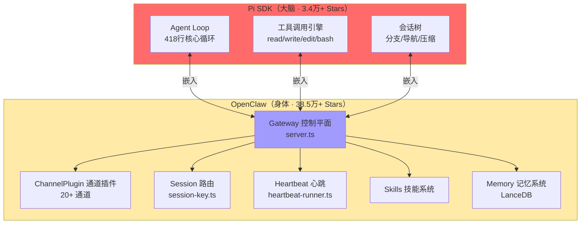

---

## 二、核心特性总览：八大支柱

```
┌────────────────────────────────────────────────────────────┐
│              OpenClaw 八大核心特性                            │
├──────────┬──────────┬──────────┬──────────┬────────────────┤
│ ① Gateway │ ② 通道   │ ③ Session │ ④ Agent  │ ⑤ 工具系统    │
│ 网关      │ 插件     │ 路由      │ 运行时    │ 与沙箱         │
├──────────┼──────────┼──────────┼──────────┼────────────────┤
│ ⑥ Skills │ ⑦ Memory │ ⑧ 心跳与  │          │                │
│ 技能系统  │ 记忆系统 │ 定时调度  │          │                │
└──────────┴──────────┴──────────┴──────────┴────────────────┘
```

### 八大特性与源码映射

| 特性 | 核心源码 | 一句话描述 |
|------|----------|-----------|
| **Gateway-first** | `src/gateway/server.ts` | 单进程 WebSocket 网关，所有通道的统一入口 |
| **ChannelPlugin** | `src/channels/` | 可选适配器模式，20+ 通道即插即用 |
| **Session 路由** | `src/routing/session-key.ts` | 六级路由解析，JSONL 文件存储，无数据库 |
| **Agent 运行时** | `src/agents/agent-runner.ts` | 嵌入 Pi SDK，可写文件实现自修改 |
| **工具系统** | `src/agents/tools/` | 内置工具矩阵 + 沙箱隔离 |
| **Skills** | `src/` + workspace/skills/ | Agent 自建技能，按需加载 |
| **Memory** | `memory/` + LanceDB | 分层记忆 + 语义搜索 + 记忆刷新 |
| **心跳/调度** | `src/infra/heartbeat-runner.ts` | 自主唤醒，HEARTBEAT_OK 静默协议 |

> 🖼 **配图 2：OpenClaw 八大特性关系全景图**

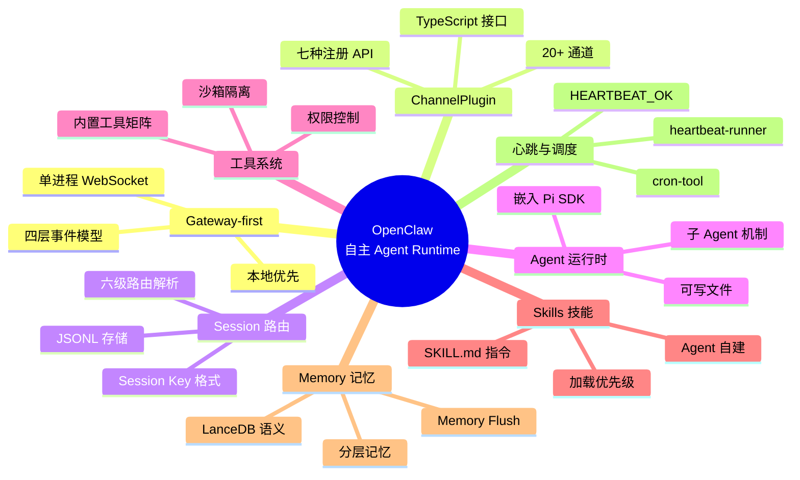

---

## 三、特性一：Gateway-first 架构 —— 中央控制平面

### 3.1 Gateway 是什么

- 单进程守护，默认 `ws://127.0.0.1:18789`（仅 loopback，安全设计）
- 基于 `ws` WebSocket 库，Node.js 22+ 运行时
- **源码入口：** `src/gateway/server.ts`

### 3.2 为什么 Gateway-first 是 OpenClaw 的核心创新

> 大多数 Agent 框架从"大脑"开始（LLM + Tools），OpenClaw 从"神经系统"开始。

| 框架 | 起点 | 输出 | 持久性 |
|------|------|------|--------|
| LangChain | LLM Wrapper | 文本 | 无状态 |
| AutoGen | 多Agent对话 | 文本 | 无持久 |
| CrewAI | 任务编排 | 文本 | 任务级 |
| **OpenClaw** | **Gateway 控制平面** | **持久 Agent 实体** | **持久存在** |

### 3.3 Gateway 四层事件模型

Gateway 通过 WebSocket 发射四类事件，客户端按需订阅：

| 事件类型 | 说明 | 触发场景 |
|----------|------|----------|
| **agent** | Agent 状态变化 | Agent 启动/停止/错误 |
| **chat** | 聊天消息收发 | 收到消息/发送回复 |
| **presence** | 设备在线/离线状态 | 设备连接/断开 |
| **health** | 系统健康检查 | 心跳/资源监控 |

> 🖼 **配图 3：Gateway 四层事件模型图**

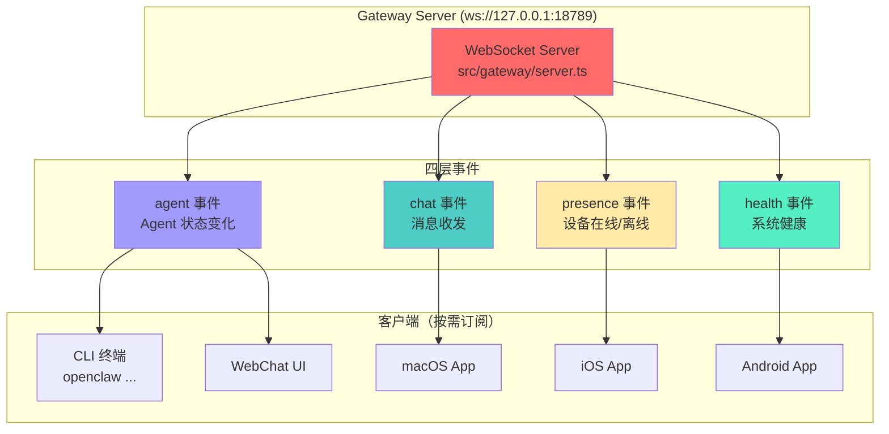

### 3.4 源码目录结构

```
openclaw/
├── src/
│   ├── gateway/                    # Gateway 控制平面
│   │   ├── server.ts               # WebSocket 服务器入口
│   │   └── ...
│   ├── agents/                     # Agent 运行时
│   │   ├── agent-runner.ts         # Agent 运行器（嵌入 Pi SDK）
│   │   ├── tools/                  # 工具注册
│   │   │   └── cron-tool.ts        # Cron 定时任务工具
│   │   └── ...
│   ├── routing/                    # Session 路由
│   │   └── session-key.ts          # Session Key 生成与解析
│   ├── channels/                   # 通道插件
│   ├── infra/                      # 基础设施
│   │   └── heartbeat-runner.ts     # 心跳轮询
│   └── ...
├── docs/                           # 文档
└── package.json
```

> 🖼 **配图 4：OpenClaw 源码模块依赖关系图**

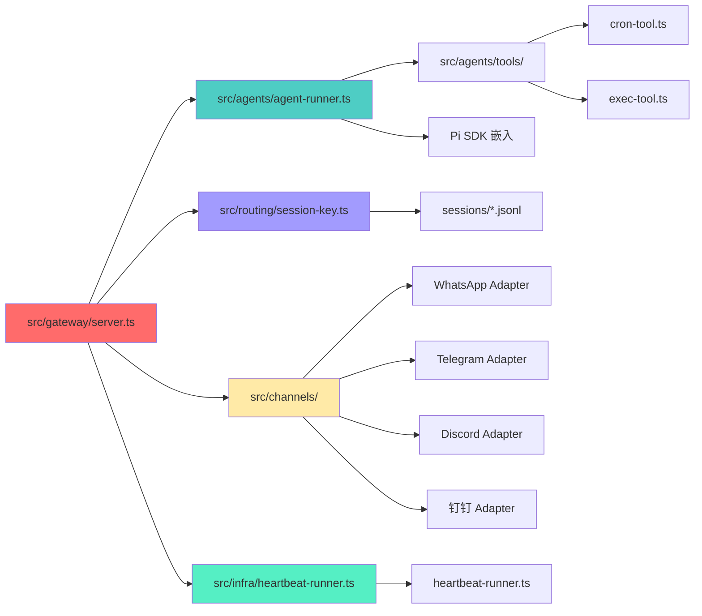

---

## 四、特性二：ChannelPlugin 通道插件系统

### 4.1 ChannelPlugin 接口设计

OpenClaw 的通道插件接口是**最干净的抽象之一**。所有适配器都是可选的——你只需要实现你需要的：

```typescript
type ChannelPlugin = {
  id: ChannelId;                        // 通道唯一标识
  meta: ChannelMeta;                    // 通道元信息
  capabilities: ChannelCapabilities;    // 能力声明
  
  config: ChannelConfigAdapter;         // 账户解析（必需）
  security?: ChannelSecurityAdapter;    // DM 策略 / 白名单
  outbound?: ChannelOutboundAdapter;    // 发消息
  gateway?: ChannelGatewayAdapter;      // 连接生命周期
  streaming?: ChannelStreamingAdapter;  // 流式响应
  threading?: ChannelThreadingAdapter;  // 线程上下文
  groups?: ChannelGroupAdapter;         // 群策略
  directory?: ChannelDirectoryAdapter;  // 联系人查找
  // ... 8+ 更多可选适配器
};
```

> 🖼 **配图 5：ChannelPlugin 接口与适配器关系图**

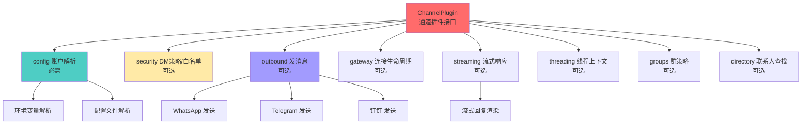

### 4.2 20+ 通道一览

| 通道类型 | 平台 | 实现适配器 |
|----------|------|-----------|
| **即时通讯** | WhatsApp / Telegram / Signal | outbound + security + streaming |
| **企业通讯** | Slack / Discord / Mattermost | threading + groups + directory |
| **苹果生态** | iMessage | outbound + gateway |
| **社交平台** | Matrix / Nostr / IRC / Line | 基础适配器 |
| **国内平台** | 钉钉 / 飞书 | outbound + threading |

> 🖼 **配图 6：多通道接入全景图**

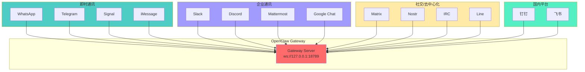

### 4.3 七种注册 API

七种注册方法，支撑 OpenClaw 从"AI 聊天机器人"进化为"AI 操作系统"：

```
registerChannel        → 接入新的通讯平台
registerTool           → 注入新的 Agent 工具
registerHook           → 注册消息/事件钩子
registerService        → 注册后台服务
registerGatewayMethod  → 扩展 Gateway 方法
registerCli            → 注册 CLI 命令
registerProvider       → 注册新的 LLM Provider
```

---

## 五、特性三：Session 路由 —— 身份跟随，上下文隔离

### 5.1 Session Key 格式

**源码：** `src/routing/session-key.ts`

```
agent:<agent-id>:<key-variant>
```

| 会话类型 | Session Key 示例 | 说明 |
|----------|------------------|------|
| DM（统一） | `agent:main:main` | 跨通道身份跟随，同一用户无论用哪个通道都进入同一会话 |
| 按用户 DM | `agent:main:telegram:123456` | 每个用户独立会话 |
| 群聊隔离 | `agent:main:discord:group:789` | 群上下文隔离，不同群聊互不干扰 |
| 子 Agent | `agent:coder:subagent:uuid` | 子会话独立，与父会话隔离 |

### 5.2 六级路由解析链

```
1. Peer ID        → 最精确（具体某个人的手机号/ID）
2. Guild ID       → Discord 服务器级别
3. Team ID        → Slack 工作区级别
4. Channel ID     → 具体频道/频道
5. Account ID     → 平台账户级别
6. Fallback Agent → 兜底（全局默认 Agent）
```

> 🖼 **配图 7：Session 六级路由决策树**

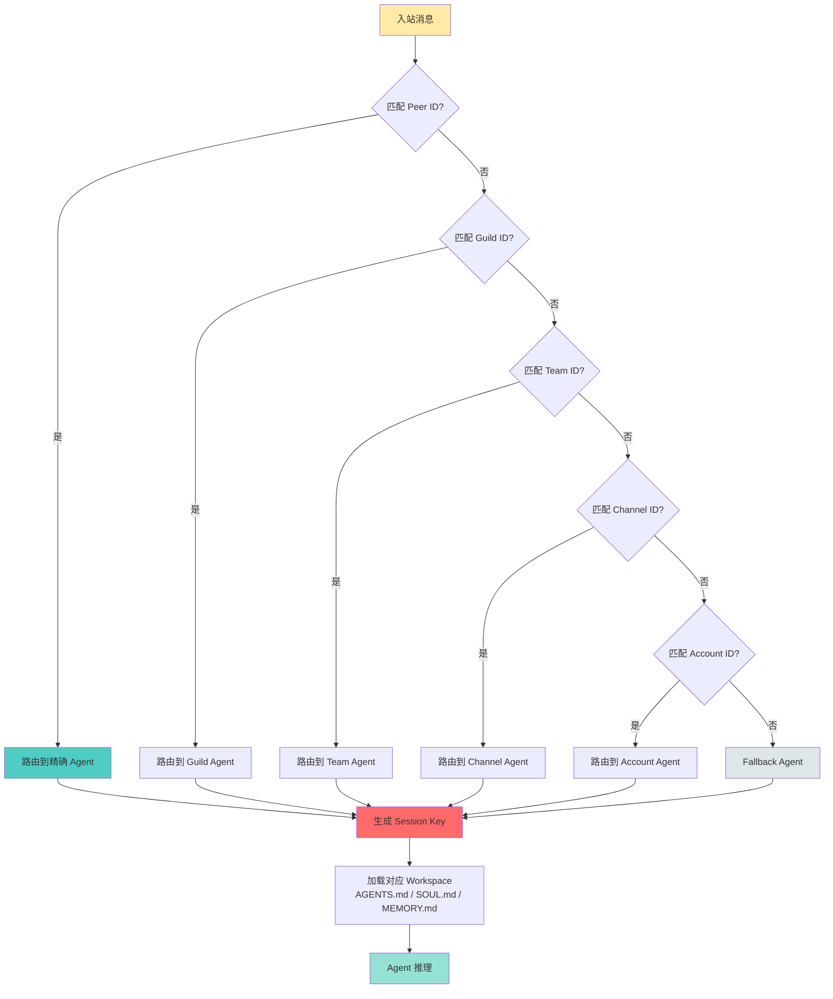

### 5.3 Session 存储：纯 JSONL 文件

无数据库、无 ORM，就是文件：

```
~/.openclaw/agents/<agentId>/sessions/
├── sessions.json          # session keys → metadata 索引
└── <SessionId>.jsonl      # 完整对话记录，每行一个 JSON 对象
```

> 🖼 **配图 8：Session 存储结构图**

```mermaid
graph TB
    Root[~/.openclaw/agents/main/]
    
    Root --> SessionsDir[sessions/]
    Root --> AgentDir[agent/]
    
    SessionsDir --> Index[sessions.json<br/>Session Key → Metadata 索引]
    SessionsDir --> S1[abc123.jsonl<br/>Telegram DM 对话]
    SessionsDir --> S2[def456.jsonl<br/>WhatsApp 群聊]
    SessionsDir --> S3[ghi789.jsonl<br/>Discord 频道]
    
    AgentDir --> SQLite[openclaw-agent.sqlite<br/>Session Store 元数据]
    
    S1 --> L1[{role: "user", content: "..."}]
    S1 --> L2[{role: "assistant", content: "..."}]
    S1 --> L3[{tool_call: {...}}]
    S1 --> L4[{tool_result: {...}}]
    
    style SessionsDir fill:#4ECDC4
    style Index fill:#FF6B6B
    style S1 fill:#FFEAA7
    style AgentDir fill:#A29BFE
```

### 5.4 跨通道身份跟随

这是 OpenClaw 最优雅的设计之一。同一个用户，无论通过 WhatsApp、Telegram 还是 Discord 联系 Agent，都进入同一个会话：

```
用户 "15921375071"
  ├─ 通过 WhatsApp 发消息 → agent:main:main → 同一会话
  ├─ 通过 Telegram 发消息 → agent:main:main → 同一会话
  └─ 通过 Discord 发消息 → agent:main:main → 同一会话
```

> 🖼 **配图 9：跨通道身份跟随图**

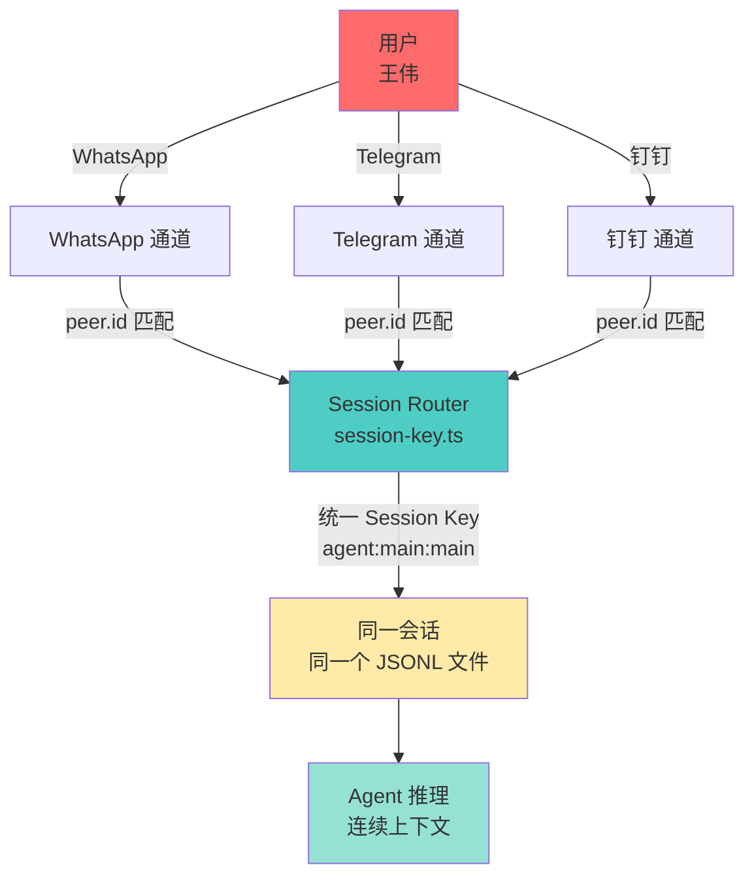

---

## 六、特性四：Agent 运行时 —— 嵌入 Pi SDK 的自修改能力

### 6.1 Agent Runner

**源码：** `src/agents/agent-runner.ts`

Agent Runner 是 Gateway 与 Pi SDK 之间的桥梁：

| 职责 | 说明 |
|------|------|
| 嵌入 Pi SDK | 作为 Agent 推理引擎 |
| 工具注册 | read/write/edit/bash/exec/browser/cron/... |
| 生命周期 | 启动/暂停/恢复/错误处理 |
| 子 Agent 管理 | sessions_spawn / sessions_yield |

> 🖼 **配图 10：Agent Runner 与 Pi SDK 集成图**

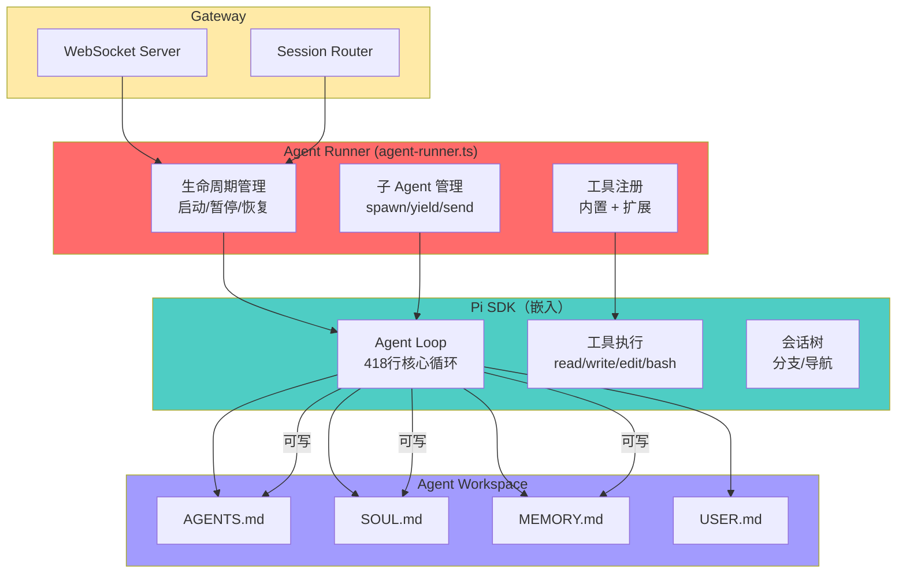

### 6.2 可写文件：Agent 的"人格操作系统"

OpenClaw 没有隐藏 superprompt，而是通过**可编辑的 Markdown 文件**定义 Agent 人格：

| 文件 | 用途 | Agent 可写？ |
|------|------|-------------|
| **AGENTS.md** | 操作指令 + 工作空间规则 | ✅ |
| **SOUL.md** | 人格、边界、语调 | ✅ |
| **IDENTITY.md** | Agent 名称、风格、emoji | ✅ |
| **USER.md** | 用户画像 + 偏好称呼 | ✅ |
| **MEMORY.md** | 跨会话持久知识 | ✅ |
| **TOOLS.md** | 用户维护的工具笔记 | ✅ |
| **HEARTBEAT.md** | 环境任务清单 | ✅ |
| **BOOTSTRAP.md** | 一次性首次运行仪式 | ✅（读完即删） |

> **关键设计：** Agent 不仅能读这些文件，还能**写**这些文件。这是自修改能力的核心——Agent 通过学习更新自己的灵魂、记忆和操作指南。

### 6.3 子 Agent 机制

| 工具 | 功能 | 源码位置 |
|------|------|----------|
| `sessions_spawn` | 创建子 Agent 会话 | `src/agents/tools/` |
| `sessions_send` | 跨 Agent 发消息 | `src/agents/tools/` |
| `sessions_list` | 列出活跃会话 | `src/agents/tools/` |
| `sessions_yield` | 等待子 Agent 完成 | `src/agents/tools/` |
| `subagents` | 查看子 Agent 状态 | `src/agents/tools/` |
| `sessions_history` | 获取会话历史 | `src/agents/tools/` |

> 🖼 **配图 11：子 Agent 生命周期图**

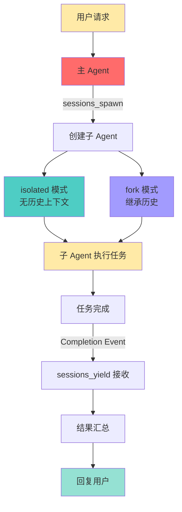

---

## 七、特性五：工具系统与沙箱

### 7.1 内置工具矩阵

**源码：** `src/agents/tools/`

| 工具类别 | 工具 | 源码文件 | 说明 |
|----------|------|----------|------|
| **文件操作** | read / write / edit | `src/agents/tools/` | 精确文件读写编辑 |
| **命令执行** | exec / process | `src/agents/tools/exec-tool.ts` | 后台/交互式命令 |
| **浏览器** | browser | Chromium 自动化 | 网页操作/截图 |
| **搜索** | web_search / web_fetch | `src/agents/tools/` | 网络搜索与抓取 |
| **定时任务** | cron | `src/agents/tools/cron-tool.ts` | 提醒/定时执行 |
| **记忆** | memory_get / memory_search | LanceDB 向量检索 | 语义搜索记忆 |
| **会话管理** | sessions_spawn/send/list | `src/agents/tools/` | 子Agent通信 |
| **状态** | session_status | `src/agents/tools/` | 模型/用量/时间 |
| **系统** | gateway | Gateway 重启/配置 | 控制平面操作 |

> 🖼 **配图 12：工具系统分类架构图**

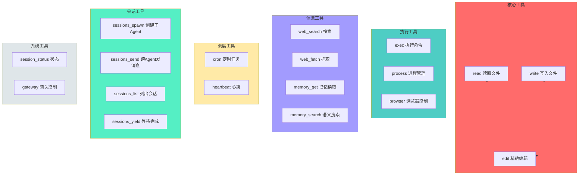

### 7.2 沙箱安全机制

| 模式 | 权限 | 说明 |
|------|------|------|
| **main** | 完全权限 | 主 Agent，可读写所有文件 |
| **non-main** | 受限权限 | 子 Agent，受限文件访问和工具调用 |

### 7.3 权限控制

| 配置项 | 默认值 | 说明 |
|--------|--------|------|
| `maxSpawnDepth` | 1 | 最大嵌套深度（0=不允许，1=主子，2=主子孙） |
| `maxChildrenPerAgent` | 10 | 单个 Agent 子 Agent 上限 |
| `toolsAllow` | null | 工具白名单（null=不限制） |
| `sandbox` | inherit | 沙箱策略（inherit 继承 / require 强制） |

---

## 八、特性六：Skills 技能系统

### 8.1 Skills 是什么

技能是可复用的能力模块，以文件夹 + SKILL.md 形式存在：

```
~/.openclaw/workspace/skills/<skill>/
├── SKILL.md          # 技能描述 + 指令
└── ...               # 代码/配置
```

### 8.2 技能加载优先级

```
workspace/skills/<skill>/SKILL.md      （工作区技能，最高优先级）
    ↓
~/.openclaw/skills/<skill>/SKILL.md    （全局技能）
    ↓
plugin-skills/<skill>/SKILL.md         （插件自带技能）
```

### 8.3 技能发现流程

```
用户请求 → 扫描可用技能 → 匹配 SKILL.md 描述 → 读取技能指令 → 按技能执行
```

> 🖼 **配图 13：Skills 匹配与加载流程图**

```mermaid
sequenceDiagram
    participant User as 用户
    participant Agent as Agent
    participant Scanner as 技能扫描器
    participant Loader as 技能加载器
    local
    
    User->>Agent: 请求（如"搜索这个"）
    Agent->>Scanner: 扫描可用技能
    Scanner->>Scanner: 匹配 SKILL.md 描述
    Scanner-->>Agent: 找到匹配技能：web-tools-guide
    Agent->>Loader: 读取 SKILL.md
    Loader->>Loader: 解析技能指令
    Loader-->>Agent: 技能指令注入上下文
    Agent->>Agent: 按技能指令执行
    Agent-->>User: 返回结果
    
    style Scanner fill:#4ECDC4
    style Loader fill:#A29BFE
```

### 8.4 Agent 自建技能

**关键特性：** Agent 可以创建新技能——创建一个带 SKILL.md 的文件夹，然后立即使用它。这是 OpenClaw 自进化能力的体现。

```
用户请求："记住以后写文章都用 Markdown 格式"
  → Agent 创建 skills/writing-style/SKILL.md
  → 写入指令："所有文章输出必须是 Markdown 格式"
  → 下次写文章时自动加载该技能
```

> 🖼 **配图 14：Agent 自建技能流程图**

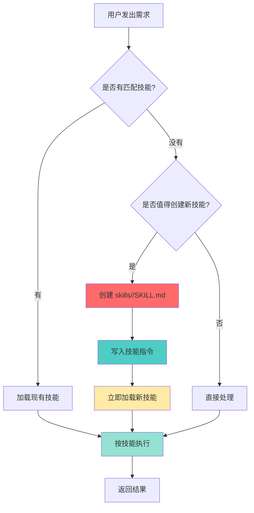

### 8.5 内置技能一览

| 技能 | 用途 | 优先级 |
|------|------|--------|
| **web-tools-guide** | 搜索/抓取策略指南 | 最高（调用 web 工具前必读） |
| **agent-browser** | 浏览器自动化 | 高 |
| **github** | GitHub CLI 交互 | 高 |
| **memory-hygiene** | 记忆清理优化 | 中 |
| **canvas** | 画布展示 | 中 |
| **weather** | 天气查询 | 低 |
| **skillhub-preference** | 技能发现偏好 | 高 |
| **dingtalk-channel-rules** | 钉钉会话输出规则 | 会话级 |

---

## 九、特性七：Memory 记忆系统

### 9.1 记忆分层

| 层级 | 文件/存储 | 说明 | 更新频率 |
|------|-----------|------|----------|
| **长期记忆** | MEMORY.md | 策展式，定期从日志中提炼 | 每几天 |
| **日志** | `memory/YYYY-MM-DD.md` | 每日事件原始记录 | 每天 |
| **向量检索** | LanceDB | 语义搜索，跨文件检索 | 实时 |

> 🖼 **配图 15：记忆分层架构图**

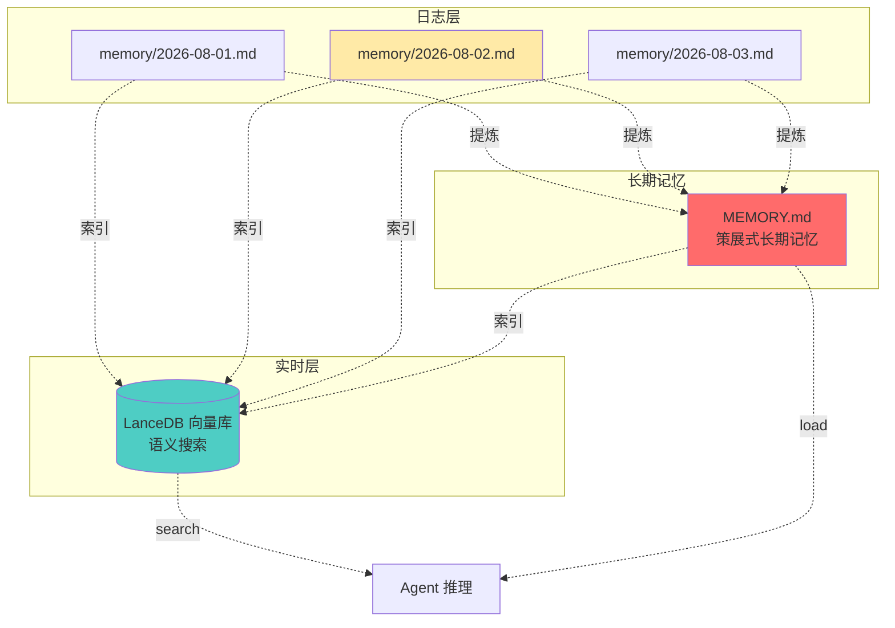

### 9.2 语义搜索

- 基于 LanceDB 向量检索
- `memory_search` 工具：跨文件语义搜索
- 自动 recall 相关记忆到上下文

### 9.3 记忆刷新（Memory Flush）

在压缩运行前，系统触发特殊 Turn：Agent 将重要笔记写入 MEMORY.md。

> "在我忘记之前，把重要的东西保存下来。"

> 🖼 **配图 16：Memory Flush 时序图**

```mermaid
sequenceDiagram
    participant Sys as 系统
    participant Flush as Memory Flush Turn
    participant Agent as Agent
    participant Mem as MEMORY.md
    
    Sys->>Flush: 触发 Memory Flush
    Flush->>Agent: "在我忘记之前，把重要的东西保存下来"
    Agent->>Agent: 回顾近期对话/决策/笔记
    Agent->>Agent: 提炼值得长期保留的内容
    Agent->>Mem: 写入/更新 MEMORY.md
    Mem-->>Agent: 写入完成
    Agent-->>Flush: Flush 完成
    Flush-->>Sys: 准备压缩
    
    style Sys fill:#FFEAA7
    style Flush fill:#FF6B6B
    style Mem fill:#4ECDC4
```

---

## 十、特性八：心跳机制与定时调度

### 10.1 Heartbeat 心跳机制

**源码：** `src/infra/heartbeat-runner.ts`

```
heartbeat-runner.ts
  → 每 30 分钟触发
  → 读取 HEARTBEAT.md（用户可编辑的任务列表）
  → 检查活跃时段配置
  → 如果有任务且在活跃时段内：
    → 唤醒 Agent
    → Agent 处理待办任务
    → 标记完成
    → 重新休眠
```

> 🖼 **配图 17：Heartbeat 心跳轮询流程图**

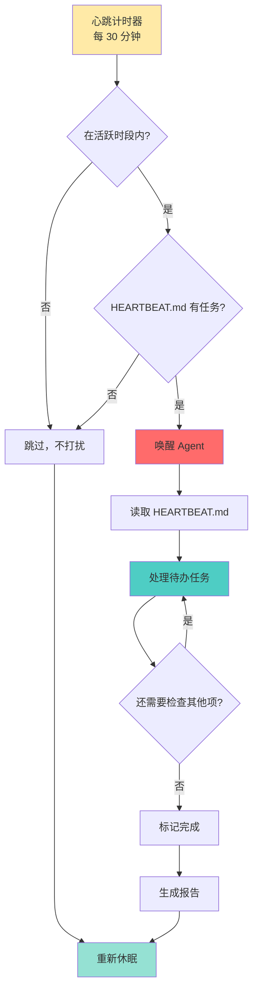

### 10.2 HEARTBEAT_OK 协议

如果 Agent 发现无事可做，回复 `HEARTBEAT_OK`，系统自动抑制通知。

> **哲学：** 只在有事要说时才打扰你。

### 10.3 Cron 定时调度

**源码：** `src/agents/tools/cron-tool.ts`

Agent 可以**创建自己的未来唤醒**：

| 调度类型 | schedule 结构 | 说明 |
|----------|--------------|------|
| **at** | `{ "kind": "at", "at": "ISO-8601" }` | 一次性定时触发 |
| **every** | `{ "kind": "every", "everyMs": 3600000 }` | 周期性间隔触发 |
| **cron** | `{ "kind": "cron", "expr": "0 9 * * *", "tz": "Asia/Shanghai" }` | Cron 表达式（支持时区） |

| Payload 类型 | 结构 | 说明 |
|--------------|------|------|
| **systemEvent** | `{ "kind": "systemEvent", "text": "..." }` | 注入事件到队列 |
| **agentTurn** | `{ "kind": "agentTurn", "message": "..." }` | 触发完整 Agent 运行 |

> 🖼 **配图 18：Cron 定时调度架构图**

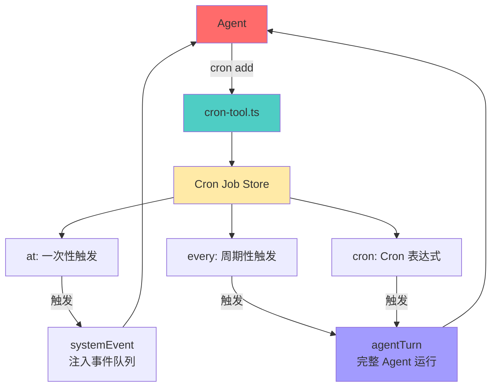

> **关键设计：** 调度不是外部系统，而是 Agent 可调用的工具。Agent 自己决定"4小时后应该再检查一次"。

### 10.4 Heartbeat vs Cron 选择策略

| 场景 | 推荐方式 | 原因 |
|------|----------|------|
| 多检查项批量处理 | Heartbeat | 可一次轮询多项 |
| 精确时间调度（9:00 AM） | Cron | 精确到分钟 |
| 需要会话上下文 | Heartbeat | 有主会话上下文 |
| 独立任务 | Cron（isolated） | 独立会话，不污染主上下文 |
| 一次性提醒 | Cron（at） | 触发一次即删除 |
| 周期性检查 | Heartbeat / Cron every | 两者皆可 |

> 🖼 **配图 19：Heartbeat vs Cron 决策图**

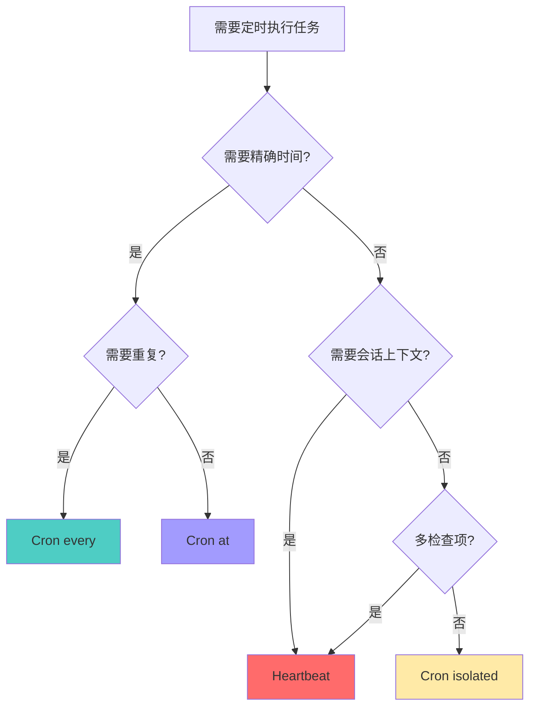

---

## 十一、端到端消息流：完整数据流解析

### 11.1 消息处理全链路

> 🖼 **配图 20：端到端消息流全链路时序图**

```mermaid
sequenceDiagram
    participant User as 用户
    participant Channel as 通道<br/>WhatsApp/Telegram/钉钉
    participant Gateway as Gateway<br/>server.ts
    participant Router as Session Router<br/>session-key.ts
    participant Runner as Agent Runner<br/>agent-runner.ts
    participant Pi as Pi SDK<br/>Agent Loop
    participant Tools as 工具系统<br/>exec/browser/cron
    participant Mem as 记忆系统<br/>MEMORY.md/LanceDB
    participant Workspace as Workspace<br/>AGENTS.md/SOUL.md
    
    User->>Channel: 发送消息
    Channel->>Gateway: 入站消息
    Gateway->>Gateway: 认证鉴权
    Gateway->>Router: Session 路由
    Router->>Router: 六级解析 → 生成 Session Key
    
    Router->>Runner: 路由到对应 Agent
    Runner->>Workspace: 加载 AGENTS.md / SOUL.md
    Runner->>Mem: 加载 MEMORY.md
    Runner->>Mem: memory_search 召回相关记忆
    
    Runner->>Pi: 上下文组装完成，开始推理
    
    loop Agent Loop
        Pi->>Pi: LLM 推理
        Pi->>Pi{有工具调用?}
        Pi->>Tools: 是 → 执行工具
        Tools-->>Pi: 工具结果
        Pi->>Pi: 追加结果，继续推理
    end
    
    Pi->>Pi: 无工具调用 → 生成最终回复
    Pi-->>Runner: 推理完成
    Runner->>Gateway: 回复
    Gateway->>Channel: 出站消息
    Channel->>User: 用户收到回复
```

### 11.2 设备感知与 Presence

- Gateway 为新设备分配 device ID，需要审批
- 非本地连接需要 challenge 签名认证
- 审批后分配 per-device token
- health 事件让系统知道哪些设备在线

> 🖼 **配图 21：设备认证与 Presence 流程图**

```mermaid
graph TD
    NewDevice[新设备连接] --> Local{本地连接?}
    
    Local -->|是| Approved[自动批准<br/>localhost]
    Local -->|否| Challenge[发送 challenge 签名]
    
    Challenge --> UserApprove[用户审批]
    UserApprove --> GenToken[生成 per-device token]
    GenToken --> Connected[设备已连接]
    
    Connected --> EmitPresence[发射 presence 事件]
    Approved --> EmitPresence
    
    EmitPresence --> Gateway{Gateway 记录}
    Gateway --> Health[health 事件监控]
    
    style NewDevice fill:#FFEAA7
    style Approved fill:#95E1D3
    style Challenge fill:#FF6B6B
    style Connected fill:#4ECDC4
```

---

## 十二、总结：OpenClaw 的设计哲学

### 12.1 核心设计原则

| 原则 | 源码体现 | 设计意图 |
|------|----------|----------|
| **Gateway-first** | `src/gateway/server.ts` 是单一控制平面 | 从"神经系统"开始，而非"大脑" |
| **本地优先** | `ws://127.0.0.1`，所有数据本地处理 | 用户完全掌控数据 |
| **主动工作** | `heartbeat-runner.ts` + `cron-tool.ts` | AI 主动替你工作，不等你提问 |
| **极简核心** | 核心简单，通过 Plugin/Skills 扩展 | 不预设，按需扩展 |
| **完全隔离** | Session Key 隔离，独立 JSONL 文件 | Agent 互不干扰 |
| **自修改** | Agent 可写 AGENTS.md / SOUL.md / Skills | 自进化能力 |
| **文件即数据库** | JSONL 文件存储，无 ORM | 简单、可审计、可版本控制 |
| **开源开放** | MIT 许可，385k+ Stars | 社区驱动 |

> 🖼 **配图 22：OpenClaw 设计哲学全景图**

```mermaid
mindmap
  root((OpenClaw<br/>设计哲学))
    Gateway-first
      从神经系统开始
      单进程控制平面
      WebSocket 四层事件
    本地优先
      ws://127.0.0.1
      JSONL 文件存储
      用户完全掌控
    主动工作
      heartbeat-runner
      cron-tool
      HEARTBEAT_OK
    极简核心
      Plugin 扩展
      Skills 技能
      按需加载
    完全隔离
      Session Key
      独立 Workspace
      独立 JSONL
    自修改
      可写 AGENTS.md
      可写 SOUL.md
      自建 Skills
    文件即数据库
      无 ORM
      可审计
      可版本控制
```

### 12.2 与主流 Agent 框架的本质差异

> 大多数框架从"大脑"开始，OpenClaw 从"神经系统"开始。

> 🖼 **配图 23：OpenClaw vs 传统 Agent 框架对比表**

| 维度 | OpenClaw | LangChain | AutoGen | CrewAI |
|------|----------|-----------|---------|--------|
| **起点** | Gateway 控制平面 | LLM Wrapper | 多Agent对话 | 任务编排 |
| **持久性** | 持久 Agent 实体 | 无状态 | 无持久 | 任务级 |
| **通道接入** | 20+ 原生通道 | 需自行接入 | 需自行接入 | 需自行接入 |
| **记忆系统** | 分层 + 向量 + 自刷新 | 需自行实现 | 需自行实现 | 需自行实现 |
| **主动工作** | 心跳 + 定时 | 无 | 无 | 无 |
| **自修改** | Agent 可写自己的文件 | 无 | 无 | 无 |
| **安全** | 本地 loopback + 沙箱 | 取决于实现 | 取决于实现 | 取决于实现 |
| **Stars** | 385k+ | 95k+ | 40k+ | 25k+ |

### 12.3 OpenClaw 一句话总结

OpenClaw 不是一个"聊天机器人框架"，而是一个**自主 Agent Runtime**——它让 AI 不再被动等待指令，而是通过心跳、定时、记忆、技能等机制，成为一个真正能主动替你工作的数字助手。

---

## 附录

### A. 关键源码文件速查

| 文件 | 职责 | 核心功能 |
|------|------|----------|
| `src/gateway/server.ts` | Gateway WebSocket 服务器 | 四层事件发射 |
| `src/agents/agent-runner.ts` | Agent 运行器 | 嵌入 Pi SDK / 工具注册 |
| `src/routing/session-key.ts` | Session Key 生成与解析 | 六级路由 |
| `src/infra/heartbeat-runner.ts` | 心跳轮询 | 30分钟周期触发 |
| `src/agents/tools/cron-tool.ts` | Cron 定时任务 | 创建/管理定时任务 |
| `src/channels/` | 通道插件目录 | 20+ 通道适配器 |
| `src/agents/tools/` | 工具注册目录 | 内置工具实现 |

### B. 术语表

| 术语 | 说明 |
|------|------|
| **Gateway** | OpenClaw 核心控制平面，单进程 WebSocket 服务器 |
| **ChannelPlugin** | 通道插件接口，支持 20+ 通讯平台 |
| **Session Key** | `agent:<id>:<variant>` 格式，标识一个会话 |
| **Agent Runner** | 嵌入 Pi SDK 的 Agent 运行器 |
| **Pi SDK** | 嵌入 OpenClaw 的 Agent Loop 推理引擎 |
| **HEARTBEAT_OK** | 心跳静默协议，无事可做时不打扰用户 |
| **Memory Flush** | 压缩前触发 Agent 将重要内容写入 MEMORY.md |
| **Skills** | 可复用的能力模块，Agent 可自建 |
| **LanceDB** | 向量数据库，用于语义搜索记忆 |

### C. 参考链接

- OpenClaw 官方文档：https://docs.openclaw.ai
- OpenClaw GitHub 源码：https://github.com/openclaw/openclaw
- Pi (pi-mono) GitHub 源码：https://github.com/earendil-works/pi
- Peter Steinberger (Creator)：https://github.com/steipete

---

_全文完。_
