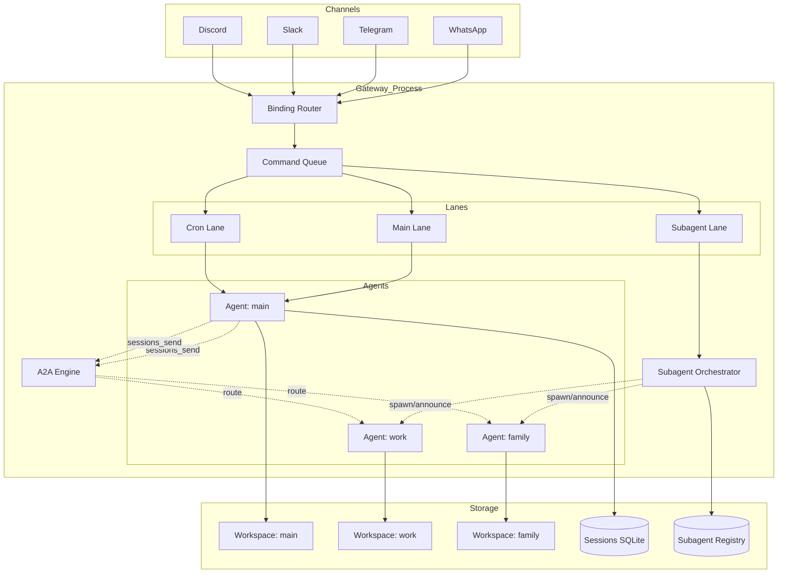
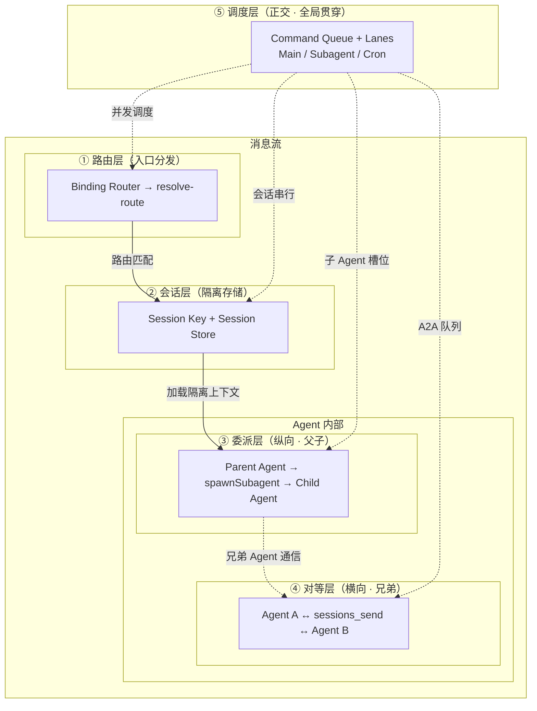
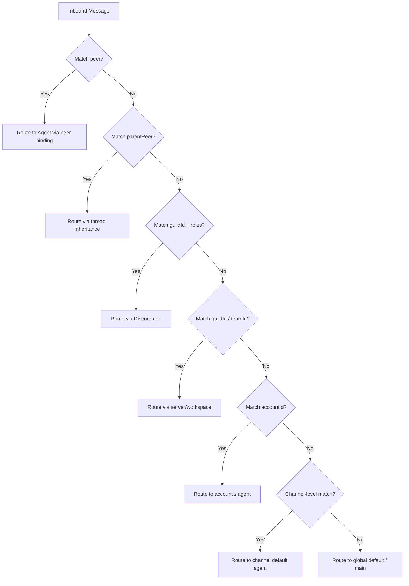
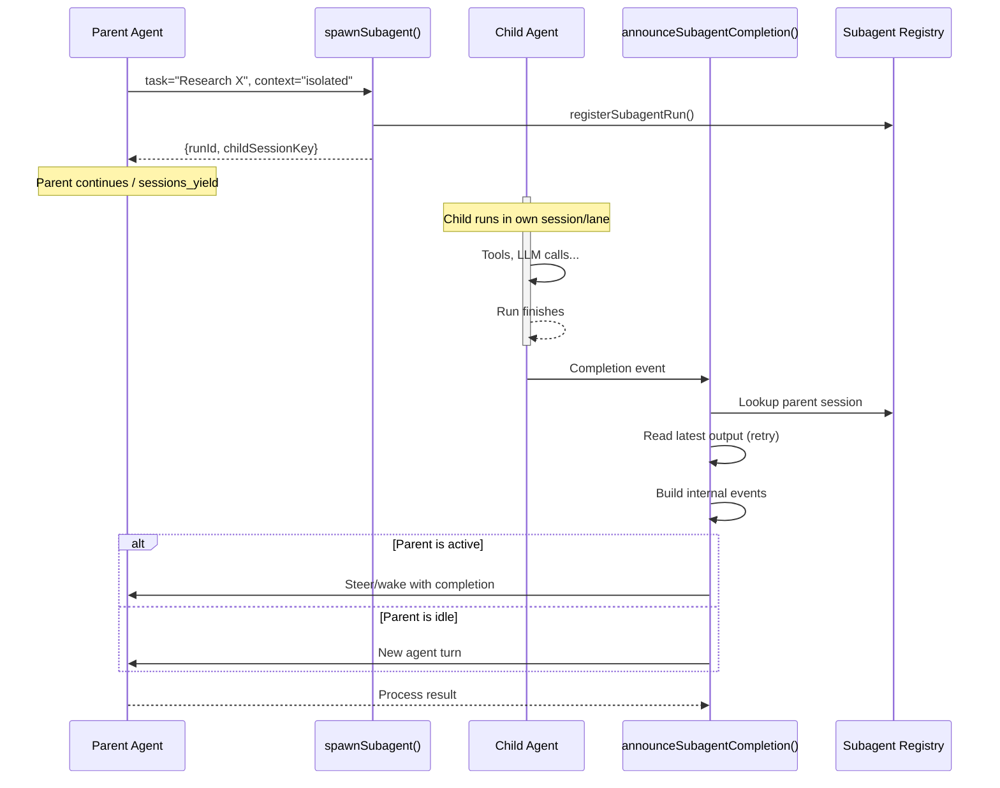
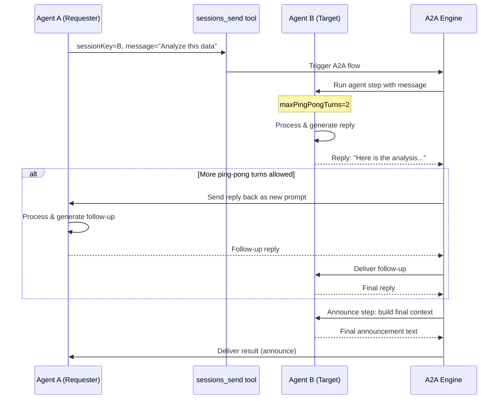

# OpenClaw 多 Agent 交互：原理、源码实现与应用配置

> OpenClaw 是一个超大规模开源个人 AI 助手项目（GitHub ⭐372K+），支持在一个 Gateway 进程中运行多个完全隔离的 Agent，并通过 Binding 路由、Session 通信、Sub-Agent 委派、Agent-to-Agent 对话等多层机制实现灵活的 Agent 间交互。本文从源码层面深度拆解其设计原理、核心实现与配置模式。

---

## 一、引言

> "The greatest value of a picture is when it forces us to notice what we never expected to see." — John Tukey

在 AI Agent 的发展轨迹中，我们经历了一个有趣的钟摆运动：从早期的单一体 Agent（"一个大脑做所有事"），到后来的多 Agent 协作（"一群大脑分工合作"），再到如今对**隔离与协作平衡**的重新审视。

### 1.1 为什么需要多 Agent 交互

单一 Agent 模式在实践中暴露出三个核心问题：

**上下文污染**：当一个 Agent 同时服务于家庭群聊和工作群聊时，家庭群的对话历史可能泄露到工作场景中，或者工作相关的敏感信息被意外带入家庭对话。这不是概率问题——LLM 的上下文窗口是一个线性序列，所有历史消息平等地参与注意力计算，没有任何内置的隔离边界。

**角色混淆**：同一个 Agent 在面对不同受众时，需要切换语气、知识深度、工具权限。一个用于编程助手的 Agent 被要求写菜谱时，其系统提示中的专业术语和代码执行权限反而成为干扰。这类似于操作系统中 root 用户和普通用户的区别——权限混用是安全漏洞的温床。

**能力边界**：不同任务对模型能力的需求差异巨大。代码审查需要强推理能力（Opus/Claude Sonnet 级别），而日常闲聊只需要快速响应（Haiku/GPT-4o-mini 级别）。用同一模型处理所有任务，要么过度消耗 token，要么在关键任务上力不从心。

### 1.2 OpenClaw 的多 Agent 哲学

OpenClaw 给出了一个清晰的答案：**隔离优先，显式交互**。

这与 Unix 哲学中的"做一件事，做好"（Do One Thing and Do It Well）不谋而合。每个 Agent 是一个完整的、自洽的单元——独立的 workspace、独立的 session 历史、独立的模型配置、独立的工具集。Agent 之间默认**不共享任何状态**，交互必须通过**显式机制**（`sessions_spawn`、`sessions_send`）完成。

这种设计选择背后是一种深层的架构判断：**隔离是默认的安全态，协作是需要审计的特权操作**。这与微服务架构中的"默认拒绝，显式授权"原则如出一辙。

### 1.3 本文结构

本文将从外到内、从宏观到微观，逐层拆解 OpenClaw 的多 Agent 机制：

```
外部消息 → ①路由层 → ②会话层 → ③委派层/④对等层
                    ↕
              ⑤调度层（正交贯穿）
```

- **路由层**：消息如何找到正确的 Agent
- **会话层**：Agent 隔离的本质
- **委派层**：父 Agent 如何创建和管理子 Agent
- **对等层**：Agent 之间如何双向通信
- **调度层**：并发控制与资源管理（贯穿所有层）

每层都有对应的源码文件、配置模式和最佳实践。最后，我们将通过四个典型场景的完整配置，展示如何将这些机制组合成生产级方案。

---

## 二、多 Agent 架构全景

### 2.1 系统架构图

OpenClaw 的架构可以用三层模型来理解：



**架构图详解：**

上图展示了 OpenClaw 在一个单进程 Gateway 中运行多个 Agent 的完整架构，可分为三个层次：

**1. 接入层（Channels）**

WhatsApp、Telegram、Slack、Discord 等外部消息通道统一接入 Gateway。关键设计决策是：**通道不直接与 Agent 对话**。所有消息必须先经过 Binding Router 进行路由分发。这类似于 Nginx 的反向代理——客户端不知道也不关心请求最终由哪个后端服务处理。

这种解耦带来了两个好处：
- **透明路由**：用户发送消息时不需要指定目标 Agent，系统根据配置自动匹配
- **灵活扩展**：新增通道（如 Signal、Matrix）或新增 Agent 都不需要修改对方

**2. 核心处理层（Gateway Process）**

这是 OpenClaw 的"中枢神经系统"，包含五个核心组件：

| 组件 | 职责 | 类比 |
|------|------|------|
| **Binding Router** | 根据配置将消息匹配到目标 Agent | 邮局分拣机 |
| **Command Queue + Lanes** | 按优先级和类型调度消息执行 | 机场跑道调度 |
| **Subagent Orchestrator** | 创建/管理子 Agent，处理完成回调 | 项目经理 |
| **A2A Engine** | Agent 间双向通信（sessions_send + ping-pong） | 内部通讯系统 |
| **Agents** | 每个 Agent 是独立的"大脑"，有自己的模型、工具、记忆 | 部门员工 |

**Binding Router** 根据 `bindings` 配置（channel、peer、guildId、accountId 等维度）将消息匹配到目标 Agent，实现"最精确匹配优先"的路由策略。

**Command Queue + Lanes** 确保同一 Session 的消息串行执行（避免并发导致的上下文竞争），但不同 Agent 的消息可以并行处理。这类似于数据库中的行级锁——同一行的写操作必须串行，但不同行可以并发。

**Subagent Orchestrator** 负责 `spawnSubagent()` 创建子 Agent、管理注册表、处理完成后的 Announce 回调。子 Agent 是一次性任务执行者（"帮我调研 X 并返回结果"），完成后自动通知父 Agent。

**A2A Engine** 处理 Agent 间的双向通信。与 Subagent 的"一次性"不同，A2A 支持持续的对话式交互——Agent A 发消息给 Agent B，Agent B 回复，Agent A 再回复，最多 N 轮（由 `maxPingPongTurns` 控制）。

**3. 存储层（Storage）**

| 存储 | 内容 | 隔离级别 |
|------|------|----------|
| **Workspace** | 每个 Agent 的独立文件目录，代码执行和文件读写都在此目录内 | 物理隔离（不同目录） |
| **Sessions SQLite** | 会话历史、配置覆盖（modelOverride、authProfileOverride） | 逻辑隔离（session key 前缀） |
| **Subagent Registry** | 子 Agent 的创建时间、父 session、运行状态、完成结果 | 全局共享，按 runId 索引 |

**关键数据流：**

```
外部消息 → Channels → Binding Router → Command Queue → Lane → Agent
Agent spawn 子 Agent → Subagent Orchestrator → Registry → Announce 回调父 Agent
Agent A 通过 sessions_send → A2A Engine → Agent B → 可选 ping-pong → Announce 回 A
```

这三条数据流覆盖了 OpenClaw 中所有 Agent 间交互的模式。

### 2.2 一个 Agent = 一个完整的"大脑"

理解 OpenClaw 多 Agent 机制的关键，在于理解**一个 Agent 到底是什么**。

在 OpenClaw 的源码中（`src/agents/agent-scope.ts`），一个 Agent 不是一个简单的"模型实例"，而是一个**完整的作用域（scope）**，包含以下维度：

| 维度 | 含义 | 隔离效果 |
|------|------|----------|
| `workspace` | 文件系统的独立工作目录 | 文件操作互不干扰 |
| `agentDir` | Agent 的专属配置目录 | 配置互不影响 |
| `sessionStore` | 会话历史的存储位置 | 记忆互不泄露 |
| `authProfiles` | 认证凭据（API keys、OAuth tokens） | 安全边界 |
| `skills` | 技能/工作流定义 | 能力差异化 |
| `tools` | 可调用的工具集 | 操作权限隔离 |
| `model` | 使用的 LLM 模型和参数 | 成本/能力差异化 |

源码入口 `resolveSessionAgentIds()` 函数从 session key 解析 agentId 的完整链路：

```typescript
// src/agents/agent-scope.ts
function resolveSessionAgentIds(sessionKey: string): {
  agentId: string;
  requestKey: string;
  mainKey: string;
} {
  // sessionKey 格式: "agent:<agentId>:<requestKey>:<mainKey>"
  // 例如: "agent:work:telegram:+1234567890:abc123"
  const parts = sessionKey.split(":");
  const agentId = parts[1];      // "work"
  const requestKey = parts[2];   // "telegram"
  const mainKey = parts.slice(3).join(":"); // "+1234567890:abc123"
  return { agentId, requestKey, mainKey };
}
```

这意味着，**session key 是 Agent 身份的唯一标识**。所有后续的配置解析、存储路由、权限检查都基于这个 agentId。

### 2.3 单 Agent vs 多 Agent 模式

OpenClaw 默认运行在单 Agent 模式：

```yaml
# 默认配置（隐式）
# 等价于:
agents:
  list:
    - id: "main"
```

此时所有消息都由 `agentId = "main"` 的 Agent 处理，session key 格式为 `agent:main:<mainKey>`。

当配置多个 Agent 时：

```yaml
agents:
  list:
    - id: "main"
      model: "anthropic/claude-sonnet-4"
      workspace: "~/openclaw-workspace"
    - id: "work"
      model: "anthropic/claude-opus-4"
      workspace: "~/work-workspace"
      sandbox: { mode: "all" }
    - id: "family"
      model: "anthropic/claude-haiku"
      workspace: "~/family-workspace"
```

源码中，`resolveDefaultAgentId()` 和 `listAgentIds()` 构成了一个 fallback 链：

```
1. 如果 bindings 中指定了 agentId → 使用指定的 agentId
2. 如果 agents.list 只有一个 Agent → 使用那个 Agent
3. 否则 → 使用 "main"（如果存在）或第一个 Agent
```

这个 fallback 链确保了两件事：
- **向后兼容**：没有多 Agent 配置时，行为与旧版本完全一致
- **安全降级**：即使配置错误，也不会让消息"无处可去"

### 2.4 多 Agent 交互的五个层次

OpenClaw 的多 Agent 交互不是单一机制，而是**五个层次**的组合：



**各层次解读：**

| 层次 | 机制 | 交互方向 | 类比 |
|------|------|----------|------|
| ① **路由层** | Binding + resolve-route | Channel → Agent（单向） | 前台接待员 |
| ② **会话层** | Session key + 隔离存储 | Agent 内部（自洽） | 个人办公室 |
| ③ **委派层** | sessions_spawn + subagent | 父 Agent → 子 Agent（单向 + announce 回调） | 经理分配任务给下属 |
| ④ **对等层** | sessions_send + A2A flow | Agent ↔ Agent（双向 ping-pong） | 同事间讨论 |
| ⑤ **调度层** | Command queue + lanes | 全局并发控制（正交） | 交通信号灯 |

**关键设计洞察：**

1. **路由层和会话层是基础**：没有它们，Agent 间交互无从谈起。它们确保"消息找到正确的 Agent"且"Agent 只看到自己的历史"。

2. **委派层和对等层是交互的核心**：委派层用于"上级给下级派活"（父子关系），对等层用于"同事间协作"（平等关系）。

3. **调度层是正交的**：它不定义"谁和谁交互"，而是定义"交互的顺序和并发度"。无论使用哪种交互模式，调度层都在后台工作。

4. **层次之间是依赖关系，不是替代关系**：委派层和对等层都依赖于路由层和会话层。调度层则为所有层提供并发控制。

这种分层设计与 TCP/IP 协议栈有异曲同工之妙——每一层解决一个特定问题，层与层之间通过明确定义的接口通信。

---

## 三、路由层：消息如何找到正确的 Agent

> "Any sufficiently advanced routing logic is indistinguishable from a postal sorting machine." — 改编自 Clarke 第三定律

### 3.1 Binding 配置模型

Binding 是 OpenClaw 路由系统的核心抽象。它的本质是一张**匹配规则表**，将外部消息的特征映射到目标 Agent：

```yaml
bindings:
  # 精确匹配 peer（特定用户）
  - agentId: "family"
    match:
      peer: "+15551234567"

  # 匹配频道 + 群组
  - agentId: "work"
    match:
      channel: "telegram"
      guildId: "-1001234567890"

  # 匹配频道级别（所有 Telegram 消息默认路由）
  - agentId: "main"
    match:
      channel: "telegram"

  # 全局默认（兜底）
  - agentId: "main"
    match: {}
```

`match` 字段支持以下维度的组合：

| 维度 | 含义 | 示例 |
|------|------|------|
| `channel` | 消息来源平台 | `"telegram"`、`"whatsapp"`、`"discord"` |
| `accountId` | 特定账号 | 多账号场景下区分不同 Bot 账号 |
| `peer` | 发送者 ID | 个人用户 ID、群聊 ID |
| `guildId` | Discord/Slack 服务器 ID | 区分不同 workspace |
| `teamId` | Slack Team ID | 多团队场景 |
| `roles` | Discord 角色 | 按角色路由到不同 Agent |

**关键设计决策**：`match` 字段使用 **AND 语义**——所有指定的条件必须同时满足。这意味着：

```yaml
# 这条规则匹配：来自 Telegram + 特定群组的消息
- agentId: "work"
  match:
    channel: "telegram"
    guildId: "-1001234567890"

# 这条规则匹配：来自 Discord + 特定角色的消息
- agentId: "admin"
  match:
    channel: "discord"
    roles: ["admin", "moderator"]
```

### 3.2 路由优先级链

当多条 Binding 规则都可能匹配时，OpenClaw 采用**最精确匹配优先**（Most-Specific-Wins）策略。源码中（`src/routing/resolve-route.ts`）实现了一个七层优先级链：



**优先级从高到低：**

| 优先级 | 匹配维度 | 精确度 | 典型场景 |
|--------|----------|--------|----------|
| 1 | `peer` | 最高 | 特定用户专属 Agent |
| 2 | `parentPeer` | 极高 | Thread 继承父会话的 Agent |
| 3 | `guildId + roles` | 很高 | Discord 按角色路由 |
| 4 | `guildId / teamId` | 高 | 特定群组/服务器专属 Agent |
| 5 | `accountId` | 中 | 多账号场景 |
| 6 | `channel` | 低 | 频道默认 Agent |
| 7 | 全局默认 | 最低 | 兜底 Agent |

**Tie-breaking 规则**：当两条规则精确度相同时，OpenClaw 使用配置中的**声明顺序**（先声明优先）作为决胜条件。这与 CSS 的选择器优先级规则类似——当特异性相同时，后声明的覆盖先声明的，但 OpenClaw 选择了相反的策略（先声明优先），理由是**配置的显式性越高，越应该优先匹配**。

### 3.3 Session Key 的生成与解析

Session Key 是 OpenClaw 中**最核心的身份标识**。它的格式设计直接决定了多 Agent 的隔离粒度：

```
agent:<agentId>:<requestKey>:<mainKey>
```

各字段含义：

| 字段 | 示例 | 含义 |
|------|------|------|
| `agentId` | `"work"` | 目标 Agent 的 ID |
| `requestKey` | `"telegram"` | 请求来源的通道标识 |
| `mainKey` | `"+15551234567:abc123"` | 主会话标识（用户 + 会话 ID） |

源码解析（`src/routing/session-key.ts`）：

```typescript
// parseAgentSessionKey: 从 session key 中提取 agentId
function parseAgentSessionKey(key: string): {
  agentId: string;
  requestKey: string;
  mainKey: string;
} | null {
  if (!key.startsWith("agent:")) return null;
  const parts = key.split(":");
  // parts: ["agent", "work", "telegram", "+1555...", "abc123"]
  return {
    agentId: parts[1],
    requestKey: parts[2],
    mainKey: parts.slice(3).join(":"),
  };
}
```

**DM Collapse 机制**：当用户在 DM（私聊）中首次与某个 Agent 对话时，OpenClaw 会将该 DM 会话"折叠"（collapse）到 Agent 的 main session 中。这意味着同一个用户在不同通道的 DM 可能共享同一个会话上下文——这是一个需要谨慎对待的设计，因为它可能导致跨通道的上下文泄露。

---

## 四、会话层：Agent 隔离的本质

> "The essence of isolation is not separation, but controlled communication." — 改编自分布式系统理论

### 4.1 Session 存储模型

每个 Agent 的会话数据存储在独立的目录结构中：

```
~/.openclaw/agents/<agentId>/sessions/
├── telegram/
│   └── <sessionId>.jsonl    # 会话历史（JSON Lines 格式）
├── whatsapp/
│   └── <sessionId>.jsonl
└── sessions.db              # SQLite 数据库（元数据）
```

Session Entry 的数据结构包含丰富的覆盖配置：

```typescript
interface SessionEntry {
  key: string;                    // session key
  agentId: string;                // 所属 Agent
  providerOverride?: string;      // 覆盖默认 provider
  modelOverride?: string;         // 覆盖默认 model
  authProfileOverride?: string;   // 覆盖默认认证配置
  workspaceOverride?: string;     // 覆盖默认 workspace
  createdAt: Date;
  lastActiveAt: Date;
}
```

这种设计允许在**会话级别**临时覆盖 Agent 的默认配置。例如：

```yaml
# 场景：某个 Telegram 会话临时切换到更强的模型
# 用户发送 /model opus 后，该会话的 modelOverride 被设置为 "anthropic/claude-opus-4"
# 其他会话仍然使用 Agent 默认的 "anthropic/claude-sonnet-4"
```

### 4.2 会话隔离的安全边界

OpenClaw 的隔离是**软隔离**（soft isolation），而非硬沙箱（hard sandbox）。理解这一区别至关重要：

**Workspace 隔离 ≠ 硬沙箱**

```yaml
# 配置示例
agents:
  - id: "work"
    workspace: "~/work-workspace"
    sandbox:
      mode: "all"        # 对所有操作启用沙箱
  - id: "main"
    workspace: "~/openclaw-workspace"
    sandbox:
      mode: "off"        # 不启用沙箱
```

`sandbox.mode` 的三种模式：

| 模式 | 含义 | 适用场景 |
|------|------|----------|
| `off` | 不启用沙箱，Agent 可以访问整个文件系统 | 开发/测试环境 |
| `non-main` | 仅对非 main Agent 启用沙箱 | 生产环境（推荐） |
| `all` | 对所有 Agent 启用沙箱 | 高安全要求场景 |

源码中（`sandbox-agent-config.ts` + `sandbox-tool-policy.ts`）的隔离实现：

```
1. 文件操作限制：Agent 只能在其 workspace 目录下读写文件
2. 工具策略：可以配置哪些工具对哪些 Agent 可见
3. 命令沙箱：通过 Docker/容器限制系统调用
```

**安全边界分析**：

| 威胁模型 | 是否防护 | 说明 |
|----------|----------|------|
| Agent A 读取 Agent B 的文件 | ✅（当 workspace 不同时） | 文件系统级隔离 |
| Agent A 查看 Agent B 的会话历史 | ✅ | Session key 前缀隔离 |
| Agent A 使用 Agent B 的 API Key | ✅ | authProfile 隔离 |
| Agent A 执行恶意系统命令 | ⚠️（取决于 sandbox 模式） | 需要容器级沙箱 |
| Agent A 耗尽系统资源 | ⚠️（取决于 Lane 配置） | 需要 maxConcurrent 限制 |

### 4.3 跨 Agent 记忆搜索（QMD 机制）

在默认隔离策略下，Agent A 无法访问 Agent B 的记忆。但某些场景需要跨 Agent 的知识共享——例如 family Agent 需要知道 work Agent 记住的"家人生日"信息。

OpenClaw 通过 `memorySearch.qmd.extraCollections` 提供了**受控的跨 Agent 记忆搜索**：

```yaml
memorySearch:
  qmd:
    extraCollections:
      - name: "family_shared"
        path: "~/.openclaw/shared/family.qmd"
      - name: "work_shared"
        path: "~/.openclaw/shared/work.qmd"
```

**何时应该跨 Agent 搜索记忆？**
- ✅ 共享的事实性知识（地址、日期、偏好）
- ✅ 跨领域的通用知识（菜谱、旅行攻略）

**何时不应该？**
- ❌ 敏感信息（密码、财务数据）
- ❌ 上下文化的信息（"上次开会讨论的 X"）
- ❌ Agent 特有的技能/工作流

这与数据库设计中的"规范化 vs 反规范化"权衡类似——适度的冗余换来隔离性，但需要手动同步共享数据。

---

## 五、委派层：Sub-Agent 机制

> "Delegation is not about giving up control; it's about multiplying capability." — 改编自管理学格言

### 5.1 Sub-Agent 的两种模式

OpenClaw 提供了两种创建子 Agent 的方式，对应不同的使用场景：

| 模式 | 触发方式 | 生命周期 | 适用场景 |
|------|----------|----------|----------|
| **Run 模式** | `/subagents spawn` | 一次性：完成任务后自动销毁 | "帮我调研 X 并返回结果" |
| **Session 模式** | `sessions_spawn` + `thread: true` | 持久：子 Agent 有独立会话，可多次交互 | "创建一个专门处理邮件的 Agent" |

**Run 模式**是最常用的方式。父 Agent 派发一个任务，子 Agent 在隔离环境中执行，完成后通过 Announce 机制将结果回传给父 Agent。

**Session 模式**更像创建了一个"长期雇员"——它有自己独立的会话历史，可以持续接收新任务并与父 Agent 交互。

### 5.2 源码拆解：subagent-spawn.ts

`SpawnSubagentParams` 参数结构揭示了子 Agent 创建的所有可配置维度：

```typescript
interface SpawnSubagentParams {
  task: string;              // 任务描述
  context?: "isolated" | "fork";  // 上下文模式
  model?: string;            // 模型覆盖
  timeout?: number;          // 超时时间
  label?: string;            // 子 Agent 标签
  thread?: boolean;          // 是否持久会话
}
```

**上下文模式对比**：

| 模式 | 行为 | 优点 | 缺点 |
|------|------|------|------|
| `isolated` | 子 Agent 从零开始，不继承父 Agent 的任何上下文 | 完全隔离，无上下文污染 | 需要完整描述任务背景 |
| `fork` | 子 Agent 继承父 Agent 的部分会话历史 | 任务描述更简洁 | 可能泄露不相关的上下文 |

**模型继承链**：

```
1. 显式 override（SpawnSubagentParams.model）
2. agents.defaults.subagents.model
3. 父 Agent 的 model
4. 全局默认 model
```

这种继承链确保了子 Agent 始终有一个可用的模型配置，同时允许在不同粒度上覆盖。

### 5.3 完成通知机制：subagent-announce.ts

子 Agent 完成后的通知流程是 OpenClaw 中最复杂的机制之一：



**Announce 的完整生命周期**：

1. **子 Agent 完成**：子 Agent 的 run 结束（正常完成或超时/错误）
2. **查找父会话**：通过 Registry 查找父 Agent 的 session key
3. **读取输出**：获取子 Agent 的最后一次响应文本（带重试机制）
4. **构建内部事件**：将结果包装为内部消息格式
5. **steer/wake**：
   - 如果父 Agent 正在 active run → 通过 steer 机制注入结果
   - 如果父 Agent 空闲 → 触发新的 agent turn
6. **投递到请求者频道**：最终结果发送到用户可见的通道

**`SILENT_REPLY_TOKEN` 机制**：当子 Agent 的输出包含 `SILENT_REPLY_TOKEN` 标记时，Announce 机制会跳过通知——这用于"后台静默执行"的场景。

**粘滞取消意图（Sticky Cancel Intent）**：如果用户在子 Agent 运行期间发送了取消指令，该意图会被持久化。即使 Gateway 重启，取消操作仍然有效。这是通过文件系统持久化实现的，而非内存状态。

### 5.4 嵌套深度与并发控制

OpenClaw 通过两个参数控制子 Agent 的规模：

| 参数 | 默认值 | 含义 |
|------|--------|------|
| `maxSpawnDepth` | 2 | 最大嵌套深度（父→子→孙） |
| `maxConcurrent` | 5 | 同时运行的子 Agent 最大数量 |

`maxSpawnDepth = 2` 意味着：
```
Parent Agent (depth 0)
  └── Child Agent (depth 1)
        └── Grandchild Agent (depth 2)  ← 最深
              └── ❌ 不能再 spawn（超过 maxSpawnDepth）
```

这个限制防止了**无限递归 spawn**——想象一个 Agent 被要求"创建一个 Agent 来创建一个 Agent..."的场景。没有深度限制，这可能导致资源耗尽。

源码中（`subagent-registry.ts` + `subagent-depth.ts`）的深度追踪机制：

```typescript
// 每次 spawn 时，检查当前深度
function canSpawnSubagent(currentDepth: number, maxDepth: number): boolean {
  return currentDepth < maxDepth;
}

// 注册子 Agent 运行
function registerSubagentRun(params: {
  parentSessionKey: string;
  childSessionKey: string;
  depth: number;
}): SubagentRun {
  const run = {
    id: crypto.randomUUID(),
    parentSessionKey: params.parentSessionKey,
    childSessionKey: params.childSessionKey,
    depth: params.depth,
    status: "running",
    createdAt: new Date(),
  };
  registry.set(run.id, run);
  return run;
}
```

---

## 六、对等层：Agent-to-Agent 通信

> "Communication is the oil of the organizational machine." — 改编自 Charles Handy

### 6.1 sessions_send 工具

`sessions_send` 是 Agent 间对等通信的核心工具。与 `spawnSubagent` 的"派任务-等结果"模式不同，`sessions_send` 支持**双向、持续**的对话式交互。

工具定义（`src/agents/tools/sessions-send-tool.ts`）：

```typescript
interface SessionsSendParams {
  sessionKey?: string;     // 目标会话的 key
  agentId?: string;        // 目标 Agent 的 ID
  message: string;         // 要发送的消息
  timeoutSeconds?: number; // 等待回复的超时时间
}
```

`sessionKey` 和 `agentId` 二选一：
- 指定 `sessionKey`：精确发送到某个特定会话
- 指定 `agentId`：发送到该 Agent 的默认会话

**可见性策略**（`tools.sessions.visibility`）：

| 模式 | Agent 能否看到其他 Agent 的 sessions？ | 适用场景 |
|------|---------------------------------------|----------|
| `self` | 只能看到自己的 session | 默认推荐 |
| `all` | 可以看到所有 session | 调试/管理 |
| `none` | 看不到任何 session（但仍可通过 agentId 发送） | 高安全 |

### 6.2 A2A Flow（Agent-to-Agent 对话流）

`sessions_send` 最强大的特性是 **Ping-Pong 对话流**。当 Agent A 发送消息给 Agent B 后，Agent B 的回复可以被自动回传给 Agent A，Agent A 再回复 Agent B——如此交替，最多 N 轮。



**Ping-Pong 机制详解**：

1. **`maxPingPongTurns` 控制对话轮数**：默认值为 2，防止无限对话消耗资源
2. **`buildAgentToAgentReplyContext()` 构建对话上下文**：每次轮换时，系统会为当前发言的 Agent 构建一个特殊的上下文，包含对话历史和角色信息
3. **角色轮换**：requester ↔ target 交替发言，每一轮都是一次完整的 Agent 推理过程

**终止条件**（三个条件满足任一即终止）：

| 条件 | 说明 |
|------|------|
| `isReplySkip()` | 回复内容为空或为特殊 skip 标记 |
| `isNonDeliverableSessionsReply()` | 回复为不可投递的系统消息 |
| 达到 `maxPingPongTurns` | 对话轮数达到上限 |

### 6.3 安全门控

A2A 通信默认**关闭**，必须显式开启并配置白名单：

```yaml
tools:
  agentToAgent:
    enabled: true
    allow:
      - from: "main"
        to: "work"
      - from: "main"
        to: "family"
      # 注意：work → family 未被允许
```

**默认值的安全考虑**：

| 参数 | 默认值 | 安全考虑 |
|------|--------|----------|
| `enabled` | `false` | 默认不允许 Agent 间通信 |
| `allow` | `[]` | 即使 enabled，也需要显式白名单 |
| `maxPingPongTurns` | 2 | 防止无限递归对话消耗资源 |

这个安全门控防止了**Agent 间的意外对话循环**——如果 Agent A 可以无条件地与 Agent B 通信，而 Agent B 也可以无条件地与 Agent A 通信，那么一条消息可能触发无限循环的对话。

### 6.4 Announce 投递

Ping-Pong 对话结束后，最终结果通过 Announce 机制投递给请求者：

```typescript
// buildAgentToAgentAnnounceContext 构建最终公告
const announceContext = buildAgentToAgentAnnounceContext({
  requesterSessionKey: params.requesterSessionKey,
  requesterChannel: params.requesterChannel,
  targetSessionKey: params.displayKey,
  targetChannel,
  originalMessage: params.message,
  roundOneReply: primaryReply,
  latestReply,
});
```

**幂等性保障**：每次 Announce 投递使用 `crypto.randomUUID()` 生成 `idempotencyKey`，确保同一结果不会被重复投递。这与 HTTP API 中的幂等键设计完全一致。

投递流程：
```
A2A Engine → buildAgentToAgentAnnounceContext() → callGateway("send") → 目标频道
```

---

## 七、调度层：Command Queue 与 Lanes

> "Concurrency is not parallelism. Concurrency is about dealing with lots of things at once. Parallelism is about doing lots of things at once." — Rob Pike

### 7.1 Lane 模型

Lane 是 OpenClaw 中**并发调度的基本单元**。可以把 Lane 想象成机场的跑道——同一时刻，一条跑道上只能有一架飞机起降，但不同跑道可以并行操作。

源码入口（`src/agents/lanes.ts`）定义了以下 Lane 类型：

| Lane 类型 | 格式 | 含义 | 并发度 |
|-----------|------|------|--------|
| `main` | `main:<mainKey>` | 主会话 lane | 同 session 串行 |
| `subagent` | `subagent:<parentSessionKey>` | 子 Agent lane | 受 maxConcurrent 限制 |
| `cron` | `cron` | 定时任务 lane | 受 cron.maxConcurrentRuns 限制 |
| `cron-nested` | `cron-nested:<cronKey>` | 嵌套定时任务 lane | 独立槽位 |
| `nested:<sessionKey>` | `nested:<key>` | 嵌套会话 lane | 独立串行 |

`resolveNestedAgentLaneForSession()` 和 `resolveCronAgentLane()` 的语义：

```typescript
// 根据 session key 解析对应的 lane
function resolveNestedAgentLaneForSession(sessionKey: string): string {
  if (isSubagentSessionKey(sessionKey)) {
    return `subagent:${getParentSessionKey(sessionKey)}`;
  }
  if (isCronSessionKey(sessionKey)) {
    return `cron-nested:${getCronKey(sessionKey)}`;
  }
  return `main:${extractMainKey(sessionKey)}`;
}
```

**Lane 的关键设计原则**：

1. **同 session 串行**：同一个 session 的所有操作必须在同一个 lane 中串行执行，确保上下文一致性
2. **跨 session 并行**：不同 session 可以在不同 lane 中并行执行
3. **Lane 隔离**：subagent lane 和 cron lane 有独立的并发配额，互不影响

### 7.2 Queue 模式

当消息到达时，如果目标 Lane 正在忙，OpenClaw 根据 **Queue 模式** 决定如何处理：

| 模式 | 行为 | 适用场景 |
|------|------|----------|
| `steer` | 注入 active runtime，中断当前操作并处理新消息 | 默认推荐，适合交互式对话 |
| `followup` | 排队等待，等当前操作完成后处理 | 批量任务处理 |
| `collect` | 合并为一次 followup，多条消息合并为一条 | 群聊场景，避免刷屏 |
| `interrupt` | 强制中断当前 run，丢弃未完成的输出 | 紧急场景 |

源码中的 `run-wait.ts` 与 `waitForAgentRun()` 实现了队列的等待和唤醒机制：

```
消息到达 → 检查 lane 状态
  ├── Lane 空闲 → 立即执行
  ├── Lane 忙 + steer → 注入新消息到当前 run
  ├── Lane 忙 + followup → 加入队列等待
  ├── Lane 忙 + collect → 合并到已有队列项
  └── Lane 忙 + interrupt → 终止当前 run，执行新消息
```

### 7.3 并发控制

OpenClaw 在三个层级控制并发度：

| 层级 | 参数 | 默认值 | 作用范围 |
|------|------|--------|----------|
| Agent 级 | `agents.defaults.maxConcurrent` | 1 | 单个 Agent 的最大并发 run 数 |
| Subagent 级 | `subagents.maxConcurrent` | 5 | 全局子 Agent 并发数 |
| Cron 级 | `cron.maxConcurrentRuns` | 3 | 全局定时任务并发数 |

**Session-level 串行保证**：同一 session 在任何时刻只有一个 active run。这是通过 Lane 机制保证的——同一个 session key 映射到同一个 lane，而 lane 内部是串行执行的。

**并发控制的现实意义**：

想象一个场景：用户在家庭群中连续发送了 10 条消息。如果没有并发控制，Agent 可能同时启动 10 个 run，每个 run 都在读取和写入同一个会话历史，导致数据竞争和上下文混乱。通过 session-level 串行保证，这 10 条消息会被依次处理（steer 模式下注入到同一个 run，followup 模式下排队处理）。

### 7.4 Specialist Lanes 模式

在多 Agent 架构中，每个 Agent 天然就是一个 **Specialist Lane**——它有自己专注的领域、独立的资源和明确的职责边界。

```
Agent: main    → Lane: main:main     → 职责：通用任务
Agent: work    → Lane: main:work     → 职责：工作相关
Agent: family  → Lane: main:family   → 职责：家庭相关
```

这种模式的三阶段推进：

1. **Contract 阶段**：定义每个 Agent 的职责边界和接口（通过 bindings 和 tools 配置）
2. **Queue Tuning 阶段**：调整每个 Agent 的 Queue 模式（steer vs followup vs collect）
3. **Coordinator 阶段**：引入一个 Coordinator Agent 负责请求分解和结果汇聚

这与微服务架构中的"服务网格"概念类似——每个服务（Agent）独立部署和运行，但通过明确定义的接口（sessions_send / spawnSubagent）进行协作。

---

## 八、配置实战

理论需要落地。本节通过四个典型场景，展示如何将前面介绍的机制组合成生产级方案。

### 8.1 场景 1：家庭群 + 工作群隔离 + Agent 间协作

**需求**：
- 家庭群和工作群使用不同 Agent，互不干扰
- 家庭 Agent 使用便宜的 Haiku 模型
- 工作 Agent 使用强推理的 Opus 模型，且启用沙箱
- 两个 Agent 可以共享日历信息

**完整配置**：

```yaml
agents:
  list:
    - id: "main"
      model: "anthropic/claude-sonnet-4"
      workspace: "~/openclaw-workspace"

    - id: "family"
      model: "anthropic/claude-haiku"
      workspace: "~/family-workspace"
      skills:
        - "calendar-reader"
        - "recipe-finder"

    - id: "work"
      model: "anthropic/claude-opus-4"
      workspace: "~/work-workspace"
      sandbox:
        mode: "all"
      skills:
        - "code-review"
        - "email-drafter"

bindings:
  # 家庭群 → family Agent
  - agentId: "family"
    match:
      channel: "telegram"
      guildId: "-100family_group_id"

  # 工作群 → work Agent
  - agentId: "work"
    match:
      channel: "telegram"
      guildId: "-100work_group_id"

  # 工作 Slack → work Agent
  - agentId: "work"
    match:
      channel: "slack"
      teamId: "T0WORKTEAM"

  # 个人 DM → main Agent
  - agentId: "main"
    match:
      channel: "telegram"

# Agent 间共享日历
memorySearch:
  qmd:
    extraCollections:
      - name: "shared_calendar"
        path: "~/.openclaw/shared/calendar.qmd"

# 允许 family 和 work 互相通信（可选）
tools:
  agentToAgent:
    enabled: true
    allow:
      - from: "family"
        to: "work"
      - from: "work"
        to: "family"
```

**交互流程**：
```
家人在家庭群发消息 → Telegram → Binding 匹配 guildId → family Agent
同事在工作群发消息 → Slack → Binding 匹配 teamId → work Agent
family Agent 需要查工作日程 → sessions_send → work Agent → 返回日历信息
```

### 8.2 场景 2：Coordinator + Workers 编排模式

**需求**：
- 一个 Coordinator Agent 接收用户请求并分解任务
- 多个 Worker Agent 并行执行子任务
- 结果汇聚后返回给用户

**完整配置**：

```yaml
agents:
  list:
    - id: "coordinator"
      model: "anthropic/claude-opus-4"
      workspace: "~/coordinator-workspace"
      skills:
        - "task-decomposer"

    - id: "researcher"
      model: "anthropic/claude-sonnet-4"
      workspace: "~/researcher-workspace"
      skills:
        - "web-search"
        - "paper-reader"

    - id: "coder"
      model: "anthropic/claude-sonnet-4"
      workspace: "~/coder-workspace"
      skills:
        - "python-dev"
        - "data-analysis"

    - id: "writer"
      model: "anthropic/claude-sonnet-4"
      workspace: "~/writer-workspace"
      skills:
        - "technical-writing"
        - "document-formatting"

# 所有消息默认路由到 Coordinator
bindings:
  - agentId: "coordinator"
    match:
      channel: "telegram"

# Coordinator 可以 spawn 其他 Agent 作为子任务执行者
subagents:
  maxConcurrent: 10
  maxSpawnDepth: 1  # Coordinator → Worker，不再嵌套
```

**Coordinator 的工作流程**（由 task-decomposer skill 驱动）：

```
用户: "帮我调研 OpenClaw 的多 Agent 机制，写一篇文章，并生成代码示例"

Coordinator Agent:
  1. 分解任务:
     - 调研: spawn researcher → "调研 OpenClaw 源码中的多 Agent 机制"
     - 编码: spawn coder → "编写多 Agent 配置示例代码"
     - 写作: (等前两个完成后) spawn writer → "整合调研和代码，写文章"

  2. 并行执行:
     ├── researcher (并发) → 返回调研结果
     └── coder (并发) → 返回代码示例

  3. 结果汇聚:
     └── writer (顺序) → 接收调研+代码 → 生成最终文章

  4. Announce → 用户收到最终文章
```

**源码对应的调用链**：
```
coordinator.spawnSubagent({ task: "调研...", agentId: "researcher" })
  → spawnSubagent() → Subagent Orchestrator → Lane: subagent:coordinator
  → researcher 在隔离 session 中执行 → 完成
  → announceSubagentCompletion() → 回调 coordinator

coordinator.spawnSubagent({ task: "编码...", agentId: "coder" })
  → 同上...

coordinator 等待两个子 Agent 完成 → spawnSubagent({ task: "写作...", agentId: "writer" })
  → writer 接收前两个的结果 → 生成文章
  → announce → 用户
```

### 8.3 场景 3：多频道 + 多模型 + 按需路由

**需求**：
- WhatsApp 使用快模型（Sonnet），注重响应速度
- Telegram 使用强模型（Opus），注重推理质量
- 特定用户的 DM 绑定到专属 Agent

```yaml
agents:
  list:
    - id: "fast"
      model: "anthropic/claude-sonnet-4"
      workspace: "~/fast-workspace"

    - id: "smart"
      model: "anthropic/claude-opus-4"
      workspace: "~/smart-workspace"

    - id: "vip"
      model: "anthropic/claude-opus-4"
      workspace: "~/vip-workspace"
      skills:
        - "personal-assistant"

bindings:
  # VIP 用户 → 专属 Agent（最高优先级）
  - agentId: "vip"
    match:
      peer: "+1555VIPNUMBER"

  # WhatsApp → 快模型
  - agentId: "fast"
    match:
      channel: "whatsapp"

  # Telegram → 强模型
  - agentId: "smart"
    match:
      channel: "telegram"

  # 兜底
  - agentId: "fast"
    match: {}
```

**路由优先级分析**：
```
VIP 用户从 WhatsApp 发消息:
  1. 检查 peer 匹配 → ✅ 匹配 "vip" Agent → 使用 Opus + personal-assistant skill
  （即使 WhatsApp 默认路由到 "fast"，peer 匹配优先级更高）

普通用户从 WhatsApp 发消息:
  1. 检查 peer 匹配 → ❌ 无匹配
  2. 检查 channel 匹配 → ✅ 匹配 "fast" Agent → 使用 Sonnet

普通用户从 Telegram 发消息:
  1. 检查 peer 匹配 → ❌ 无匹配
  2. 检查 channel 匹配 → ✅ 匹配 "smart" Agent → 使用 Opus
```

### 8.4 场景 4：定时工作流 + 多 Agent 协作

**需求**：
- 每天早上 8 点，cron 触发 Data Agent 收集数据
- Data Agent 通过 `sessions_send` 将数据交给 Analysis Agent 分析
- Analysis Agent 通过 announce 投递最终报告到 Telegram 群

```yaml
agents:
  list:
    - id: "data-collector"
      model: "anthropic/claude-haiku"
      workspace: "~/data-workspace"
      skills:
        - "api-fetcher"
        - "data-cleaner"

    - id: "data-analyst"
      model: "anthropic/claude-sonnet-4"
      workspace: "~/analyst-workspace"
      skills:
        - "data-analyzer"
        - "report-generator"

cron:
  - schedule: "0 8 * * *"  # 每天 8:00
    agentId: "data-collector"
    prompt: "收集昨天的销售数据，清洗后通过 sessions_send 发给 data-analyst"
    maxConcurrentRuns: 1

tools:
  agentToAgent:
    enabled: true
    allow:
      - from: "data-collector"
        to: "data-analyst"
```

**Data Agent 的 cron prompt 示例**：
```
你是一个数据收集 Agent。请执行以下步骤：
1. 调用 sales-api 获取昨天的销售数据
2. 清洗数据：去除空值、修正格式
3. 使用 sessions_send 将清洗后的数据发送给 data-analyst Agent
   message: "以下是昨天的销售数据，请生成分析报告：\n\n{data}"
4. 等待 data-analyst 的回复
5. 将分析报告转发到 Telegram 家庭群
```

**完整执行流程**：
```
08:00 → Cron 触发 → data-collector Agent 启动
      → data-collector 调用 API → 清洗数据
      → sessions_send → data-analyst Agent
      → A2A Ping-Pong (1 轮)
      → data-analyst 生成报告
      → Announce → Telegram 群收到报告
```

---

## 九、源码关键文件索引

本节提供 OpenClaw 多 Agent 机制核心源码文件的速查表。基于 v1.x 源码结构，文件路径均相对于项目根目录。

| 文件路径 | 职责 | 关键函数/类型 |
|----------|------|---------------|
| `src/agents/agent-scope.ts` | Agent 配置解析，从 session key 到 agentId 的映射 | `resolveSessionAgentIds()`, `listAgentIds()`, `resolveDefaultAgentId()` |
| `src/agents/agent-scope-config.ts` | Agent 磁盘布局，路径解析逻辑 | `resolveAgentDir()`, `resolveWorkspacePath()` |
| `src/agents/lanes.ts` | Lane 模型，并发调度基本单元 | `resolveNestedAgentLaneForSession()`, `resolveCronAgentLane()` |
| `src/agents/subagent-spawn.ts` | Sub-Agent 创建，参数解析与会话分配 | `spawnSubagent()`, `SpawnSubagentParams`, `forkSessionFromParent()` |
| `src/agents/subagent-announce.ts` | 子 Agent 完成通知，steer/wake 机制 | `announceSubagentCompletion()`, `SILENT_REPLY_TOKEN` |
| `src/agents/subagent-registry.ts` | 子 Agent 生命周期管理，深度追踪 | `registerSubagentRun()`, `lookupSubagentRun()`, `canSpawnSubagent()` |
| `src/agents/subagent-depth.ts` | 递归深度追踪 | `getSpawnDepth()`, `checkMaxSpawnDepth()` |
| `src/agents/tools/sessions-send-tool.ts` | A2A 发送工具定义 | `createSessionsSendTool()`, `SessionsSendParams` |
| `src/agents/tools/sessions-send-tool.a2a.ts` | A2A 对话流引擎（Ping-Pong 机制） | `runSessionsSendA2AFlow()`, `buildAgentToAgentReplyContext()` |
| `src/agents/tools/sessions-send-helpers.ts` | A2A 辅助函数 | `buildAgentToAgentAnnounceContext()`, `isReplySkip()`, `isAnnounceSkip()` |
| `src/agents/tools/sessions-helpers.ts` | Session 可见性策略 | `createSessionVisibilityGuard()`, `resolveVisibleSessionReference()` |
| `src/agents/run-wait.ts` | Agent 运行等待，队列机制 | `waitForAgentRun()`, `readLatestAssistantReplySnapshot()` |
| `src/agents/agent-step.ts` | 单步 Agent 执行 | `runAgentStep()` |
| `src/routing/resolve-route.ts` | 路由决策，Binding 匹配 | `resolveRoute()`, `matchBinding()` |
| `src/routing/session-key.ts` | Session Key 格式与解析 | `parseAgentSessionKey()`, `resolveAgentIdFromSessionKey()`, `toAgentStoreSessionKey()` |
| `src/routing/bindings.ts` | Binding 配置模型 | `resolveBindingMatch()` |
| `src/bindings/records.ts` | 绑定记录持久化 | `createConversationBindingRecord()` |
| `src/sandbox/sandbox-agent-config.ts` | 沙箱 Agent 配置 | `resolveSandboxMode()` |
| `src/sandbox/sandbox-tool-policy.ts` | 沙箱工具策略 | `resolveToolPolicy()` |
| `src/gateway/call.ts` | Gateway 内部通信 | `callGateway()` |

**源码阅读建议路径**：

```
1. agent-scope.ts     → 理解 Agent 是什么
2. session-key.ts     → 理解身份标识
3. resolve-route.ts   → 理解消息路由
4. lanes.ts           → 理解并发调度
5. subagent-spawn.ts  → 理解子 Agent 创建
6. subagent-announce.ts → 理解完成通知
7. sessions-send-tool.ts + a2a.ts → 理解 Agent 间通信
```

---

## 十、总结与展望

### 10.1 核心设计原则回顾

纵观全文，OpenClaw 多 Agent 架构可以归结为三个核心原则：

**1. 隔离优先（Isolation First）**

每个 Agent 是一个完整的、自洽的单元——独立的 workspace、独立的 session 历史、独立的模型配置、独立的工具集。默认情况下，Agent 之间不共享任何状态。这与微服务架构中的"独立部署、独立运维"理念一致。

**2. 显式交互（Explicit Interaction）**

Agent 之间的所有交互都必须通过显式机制（`spawnSubagent`、`sessions_send`）完成，不存在隐式的状态共享或上下文泄露。这与操作系统中进程间通信（IPC）的设计哲学如出一辙——进程默认隔离，通信需要系统调用。

**3. 分层调度（Layered Scheduling）**

从路由分发到会话隔离，从子 Agent 委派到对等通信，每一层解决一个特定问题，层与层之间通过明确定义的接口通信。调度层（Lane + Queue）正交地贯穿所有层，提供统一的并发控制。这与 TCP/IP 协议栈的分层设计异曲同工。

### 10.2 与 Hermes Agent 的多 Agent 对比

OpenClaw 和 Hermes Agent 都支持多 Agent 机制，但设计理念有所不同：

| 维度 | OpenClaw | Hermes Agent |
|------|----------|-------------|
| **隔离粒度** | Agent 级（workspace + session + model） | Agent 级（类似） |
| **路由方式** | Binding 配置（声明式 YAML） | 内置路由（配置驱动） |
| **子 Agent** | spawnSubagent（run/session 两种模式） | delegate_task（goal/context 模式） |
| **Agent 间通信** | sessions_send + A2A ping-pong | send_message + cronjob |
| **并发控制** | Lane + Queue + maxConcurrent | session 串行 + cron 调度 |
| **安全模型** | sandbox + visibility + allowlist | profile 隔离 + 跨 profile guard |
| **调度** | Command Queue + Lanes + steer/followup | Cron 定时任务 + 后台进程 |

两者的共同点是都选择了"隔离优先、显式交互"的架构。不同点在于 OpenClaw 更侧重于**实时消息路由和会话隔离**（适合聊天机器人场景），而 Hermes Agent 更侧重于**任务委派和定时调度**（适合自动化工作流）。

### 10.3 未来趋势

**更智能的 Lane 编排**：当前的 Lane 调度是静态配置的（声明式 YAML）。未来可能引入动态 Lane 分配——根据负载自动调整并发度，或在检测到 Agent 间频繁通信时自动建立专用 Lane。

**跨 Agent 记忆共享**：当前的跨 Agent 记忆搜索是手动的（extraCollections 配置）。未来可能实现自动化的知识蒸馏——Agent 定期将重要记忆同步到共享知识库，供其他 Agent 按需检索。

**动态路由优化**：当前的 Binding 路由是静态配置的。未来可能引入学习式路由——根据历史交互模式自动调整路由规则，或将用户请求自动路由到最合适的 Agent。

### 10.4 最佳实践清单

基于全文分析，以下是 OpenClaw 多 Agent 配置的最佳实践：

| # | 实践 | 理由 |
|---|------|------|
| 1 | **每个 Agent 一个 workspace** | 文件系统隔离是最基本的安全边界 |
| 2 | **启用 sandbox mode = "non-main"** | 生产环境中保护 main Agent 不受非预期操作影响 |
| 3 | **Binding 规则从精确到宽泛排列** | 利用最精确匹配优先策略，避免宽泛规则覆盖精确规则 |
| 4 | **设置合理的 maxSpawnDepth** | 防止无限递归 spawn，默认值 2 适用于大多数场景 |
| 5 | **A2A 通信默认关闭，显式白名单** | 防止意外对话循环，遵循最小权限原则 |
| 6 | **使用 steer 模式用于交互式对话** | 确保用户消息被及时处理，而不是排队等待 |
| 7 | **使用 collect 模式用于群聊** | 避免多条消息触发多个独立 run，导致刷屏 |
| 8 | **定期清理不活跃的 session** | 避免 session 历史无限增长，影响性能和 token 消耗 |
| 9 | **为关键 Agent 配置 model override** | 在特定会话中临时切换到更强/更便宜的模型 |
| 10 | **使用 shared QMD collections 管理共享知识** | 在保持 Agent 隔离的同时，实现可控的知识共享 |

---

*本文基于 OpenClaw v1.x 源码编写。源码结构和 API 可能随版本更新而变化，建议阅读时参考最新源码。*

*如果你从本文中学到了一件事，那应该是：多 Agent 架构的精髓不在于"如何连接"，而在于"如何隔离"。隔离是协作的前提，显式是隐式的解药。*
