# OpenClaw 多 Agent 交互：原理、源码实现与应用配置

> **作者：** 大风  
> **日期：** 2026-08-02  
> **系列：** OpenClaw 深度解析系列  
> **源码版本：** OpenClaw v2026.5.27  
> **GitHub：** <https://github.com/openclaw/openclaw>  
> **官方文档：** <https://docs.openclaw.ai>

---

## 一、引言

### 1.1 单 Agent 的三大瓶颈

无论你用的是 Claude Opus、GPT-4o 还是 Qwen3-Max，单 Agent 架构始终面临三个硬性天花板。这三个瓶颈不取决于模型能力，而是由架构本身决定的。

#### 上下文天花板（Context Window Ceiling）

即使底层模型支持 200K token 的上下文窗口，当你的任务需要同时"记住"以下内容时，仍然会溢出：

- 数十万行代码库的结构
- 数百页的技术文档
- 实时抓取的网络数据
- 之前的决策和中间状态

**结果：** 关键信息被截断，模型开始"遗忘"，输出质量急剧下降。

#### 认知过载（Cognitive Overload）

学术研究中称之为**注意力稀释效应（Attention Dilution Effect）**——当单个 Agent 需要在不同领域之间反复切换时，输出质量随任务链增长而系统性下降。

举个真实场景的例子：

> 你让一个 Agent 同时完成：法律合规审查 → 财务报表分析 → 代码安全审计 → 市场趋势预测。  
> 第一项任务的输出质量可能是 90 分，到第四项时可能只剩 60 分。

这不是模型变笨了，而是**单一思维链在跨域切换中产生了信息丢失**。

#### 串行延迟（Sequential Latency）

单 Agent 只能按顺序执行子任务：

```
任务A (5min) → 任务B (5min) → 任务C (5min) → 任务D (5min) = 总计 20 分钟
```

而 4 个独立子任务如果并行执行：

```
任务A ↘
任务B → 汇总 (2min) = 总计 ~7 分钟（含协调开销）
任务C ↗
任务D ↗
```

**加速比约 2.8x**——这在实时性敏感的场景中是决定性的差异。

| 瓶颈 | 核心表现 | 量化影响 |
|------|----------|----------|
| **上下文天花板** | 记忆溢出导致关键信息丢失 | 200K token 仍不够用 |
| **认知过载** | 跨域切换导致输出质量下降 | 先做任务 90 分 → 后做任务 60 分 |
| **串行延迟** | 独立子任务无法并行 | 4 个子任务 20 分钟 vs 7 分钟 |

### 1.2 为什么需要多 Agent 协作

多 Agent 架构本质上是通过**分布式记忆 + 专业分工 + 并行执行**来解决上述三个瓶颈：

| 策略 | 解决的瓶颈 | 原理 |
|------|-----------|------|
| **分布式记忆** | 上下文天花板 | 每个子 Agent 只维护自己职责范围内的上下文 |
| **专业分工** | 认知过载 | 不同领域由不同 Agent 处理，不需要跨域切换 |
| **并行加速** | 串行延迟 | 独立子任务并行执行，大幅降低端到端延迟 |
| **混合模型** | 成本控制 | 路由决策用轻量模型，深度推理用高级模型 |

**什么时候需要启用多 Agent？** 满足以下 2 条以上即值得考虑：

- ✅ 任务可分解为相对独立的子任务（依赖越少，加速越明显）
- ✅ 需要不同领域的专业知识（一个 Agent 无法覆盖全部领域）
- ✅ 对成本敏感（混合模型策略可降低 30-50% 的 token 成本）
- ✅ 对可靠性要求高（多 Agent 天然支持冗余和容错）

> **配图 1：单 Agent vs 多 Agent 对比示意图**
>
> Excalidraw 手绘风格对比图，描述如下：
>
> **左侧（单 Agent 场景）：**
> ```
>     ┌─────────────────────┐
>     │   🤖 Single Agent    │
>     │                     │
>     │   📚 Context: 128K  │  ← 警告图标 ⚠️
>     │   📝 Task Queue:    │
>     │     □ 代码审查       │
>     │     □ 文档撰写       │  ← 排队等待
>     │     □ 数据分析       │
>     │     □ 部署运维       │
>     │                     │
>     │   ⏱️ ETA: 20 min    │
>     └─────────────────────┘
> ```
>
> **右侧（多 Agent 场景）：**
> ```
>     ┌──────────┐  ┌──────────┐  ┌──────────┐  ┌──────────┐
>     │ 🤖 Agent │  │ 🤖 Agent │  │ 🤖 Agent │  │ 🤖 Agent │
>     │  代码审查  │  │ 文档撰写  │  │ 数据分析  │  │ 部署运维  │
>     │ Context OK│  │ Context OK│  │ Context OK│  │ Context OK│
>     └────┬─────┘  └────┬─────┘  └────┬─────┘  └────┬─────┘
>          │              │              │              │
>          └──────────────┴──────────────┴──────────────┘
>                              ↓
>                        📊 结果汇总
>                         ⏱️ ETA: ~7 min
> ```

### 1.3 本文结构

本文将从**原理 → 源码 → 配置实战**三个层次，完整解析 OpenClaw 的多 Agent 交互架构：

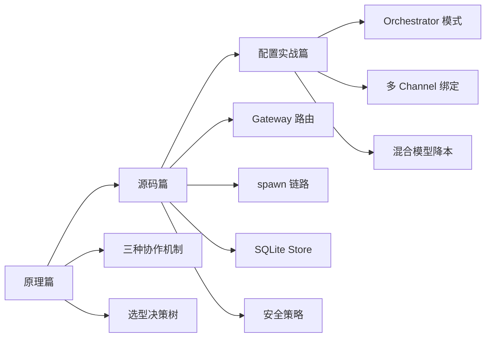
```mermaid
graph LR
    A[原理篇] --> B[源码篇]
    B --> C[配置实战篇]
    
    A --> A1[三种协作机制]
    A --> A2[选型决策树]
    
    B --> B1[Gateway 路由]
    B --> B2[spawn 链路]
    B --> B3[SQLite Store]
    B --> B4[安全策略]
    
    C --> C1[Orchestrator 模式]
    C --> C2[多 Channel 绑定]
    C --> C3[混合模型降本]
```

---

## 二、OpenClaw 多 Agent 架构总览

### 2.1 Agent 核心概念

在深入三种协作机制之前，先明确 OpenClaw 中 **Agent** 的核心组件。理解这些概念是后续所有配置和源码分析的基础。

> **配图 2：Agent 核心组件关系图**

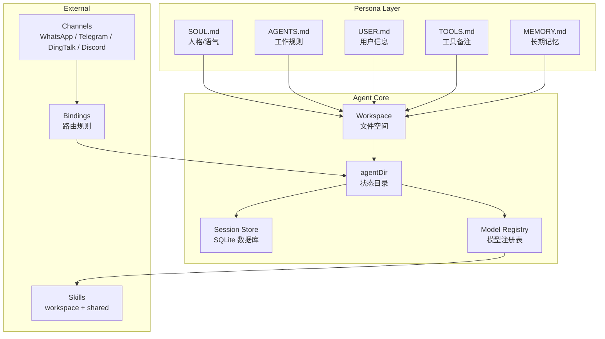
```mermaid
graph TB
    subgraph Agent Core
        WS[Workspace<br/>文件空间]
        AD[agentDir<br/>状态目录]
        SS[Session Store<br/>SQLite 数据库]
        MR[Model Registry<br/>模型注册表]
    end
    
    subgraph Persona Layer
        SOUL[SOUL.md<br/>人格/语气]
        AGENTS[AGENTS.md<br/>工作规则]
        USER[USER.md<br/>用户信息]
        TOOLS[TOOLS.md<br/>工具备注]
        MEMORY[MEMORY.md<br/>长期记忆]
    end
    
    subgraph External
        CH[Channels<br/>WhatsApp / Telegram / DingTalk / Discord]
        BD[Bindings<br/>路由规则]
        SK[Skills<br/>workspace + shared]
    end
    
    SOUL --> WS
    AGENTS --> WS
    USER --> WS
    TOOLS --> WS
    MEMORY --> WS
    
    WS --> AD
    AD --> SS
    AD --> MR
    
    CH --> BD
    BD --> AD
    MR --> SK
```

每个 Agent 拥有以下**独立资源**：

| 概念 | 说明 | 默认路径 | 可否跨 Agent 复用 |
|------|------|----------|-------------------|
| **Workspace** | Agent 的文件空间，包含所有 persona 文件和自定义规则 | `~/.openclaw/workspace` 或 `agents.entries.*.workspace` | ❌ 建议独立 |
| **agentDir** | 状态目录，包含认证信息、模型注册表、SQLite 会话库 | `~/.openclaw/agents/<agentId>/agent` | ❌ **绝对不可复用** |
| **Session Store** | 基于 SQLite 的会话历史和路由状态 | `openclaw-agent.sqlite`（位于 agentDir 内） | ❌ 自动隔离 |
| **Skills** | 从 workspace 和共享根目录加载的技能文件 | `~/.openclaw/skills` + workspace skills | ⚠️ 可通过 allowlist 控制 |
| **Model Registry** | 每个 Agent 绑定的 provider 和模型配置 | 存储在 agentDir 的 SQLite 中 | ❌ 独立管理 |

> ⚠️ **关键警告**：Agent 之间**绝不复用 agentDir**。如果复用，会导致 OAuth refresh token 和会话状态冲突，引发难以排查的认证问题。

### 2.2 三种协作机制定位

OpenClaw 提供了**三个层级**的多 Agent 协作机制，从简单到复杂，覆盖从轻量委派到分布式协作的完整场景谱。

| 机制 | 关系模型 | 通信方向 | 上下文隔离 | 部署范围 | 复杂度 |
|------|----------|----------|-----------|----------|--------|
| **SubAgent** | 一对多（父子） | 单向：父 → 子 → 父 | 各自独立 | 单 Gateway | ⭐ |
| **Agent Teams** | 多对多（团队） | 多向：成员间互通信 | 共享内存 | 单 Gateway | ⭐⭐ |
| **AgentToAgent** | 跨实例 | 结构化协议 | 跨网络传输 | 多 Gateway | ⭐⭐⭐ |

#### SubAgent（子代理）

- **一句话定义**：父 Agent 把子任务委派给子 Agent，子 Agent 完成后把结果回传给父 Agent
- **适用场景**：流水线式任务委派（Code Review、内容生产、数据处理管道）
- **核心工具**：`sessions_spawn`、`sessions_yield`、`subagents list`

#### Agent Teams（团队协作）

- **一句话定义**：多个 Agent 组成团队，通过共享内存和消息队列实时协作
- **适用场景**：需要多角色协调的复杂任务（市场调研、跨领域项目）
- **核心特性**：三种协调模式（Orchestrator / Peer-to-Peer / Hierarchical）

#### AgentToAgent（跨实例通信）

- **一句话定义**：不同 OpenClaw Gateway 实例上的 Agent 通过结构化协议跨网络通信
- **适用场景**：跨服务器、跨组织的分布式协作
- **核心特性**：加密传输、消息序列化、远程 Agent 发现

### 2.3 选型原则：能解决问题的最简机制

OpenClaw 的设计哲学是**显式优于隐式，简单优于复杂**。选择多 Agent 协作机制时，遵循以下决策树：

> **配图 3：多 Agent 选型决策树**

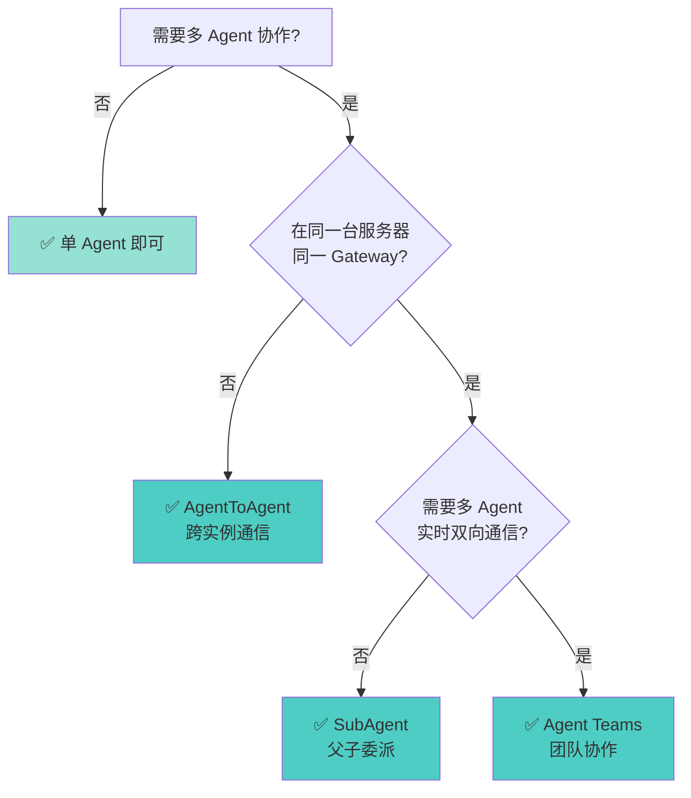
```mermaid
graph TD
    A[需要多 Agent 协作?] -->|否| B[✅ 单 Agent 即可]
    A -->|是| C{在同一台服务器<br/>同一 Gateway?}
    C -->|否| D[✅ AgentToAgent<br/>跨实例通信]
    C -->|是| E{需要多 Agent<br/>实时双向通信?}
    E -->|否| F[✅ SubAgent<br/>父子委派]
    E -->|是| G[✅ Agent Teams<br/>团队协作]
    
    style D fill:#4ECDC4
    style F fill:#4ECDC4
    style G fill:#4ECDC4
    style B fill:#95E1D3
```

**实战经验法则：**

1. **能用 SubAgent 解决的，不要上 Agent Teams** — SubAgent 配置简单、调试方便、结果可追溯
2. **能在单 Gateway 内解决的，不要上 AgentToAgent** — 跨实例引入网络延迟和复杂性
3. **先跑通 SubAgent，再考虑 Team** — 大多数场景的瓶颈不在协作机制，而在任务分解质量

### 2.4 架构全景图

> **配图 4：OpenClaw 多 Agent 架构全景图**

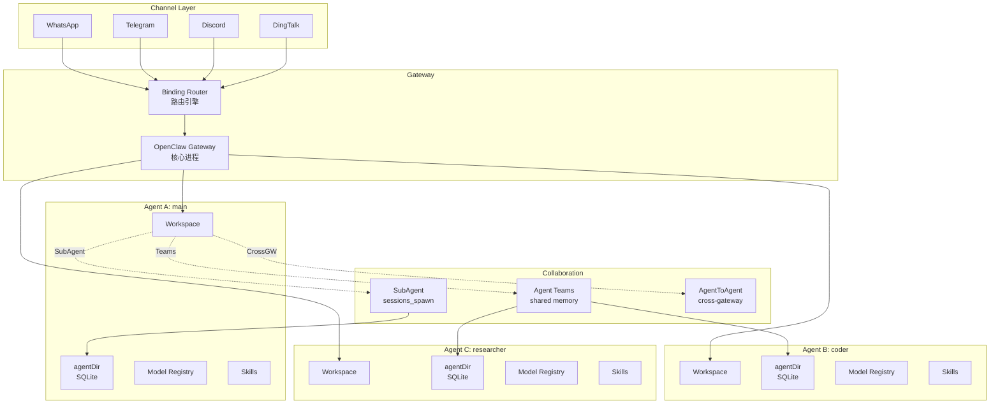
```mermaid
graph TB
    subgraph Channel Layer
        WA[WhatsApp]
        TG[Telegram]
        DS[Discord]
        DT[DingTalk]
    end
    
    subgraph Gateway
        RT[Binding Router<br/>路由引擎]
        GW[OpenClaw Gateway<br/>核心进程]
    end
    
    subgraph Agent A: main
        WS_A[Workspace]
        AD_A[agentDir<br/>SQLite]
        MR_A[Model Registry]
        SK_A[Skills]
    end
    
    subgraph Agent B: coder
        WS_B[Workspace]
        AD_B[agentDir<br/>SQLite]
        MR_B[Model Registry]
        SK_B[Skills]
    end
    
    subgraph Agent C: researcher
        WS_C[Workspace]
        AD_C[agentDir<br/>SQLite]
        MR_C[Model Registry]
        SK_C[Skills]
    end
    
    subgraph Collaboration
        SA[SubAgent<br/>sessions_spawn]
        AT[Agent Teams<br/>shared memory]
        AA[AgentToAgent<br/>cross-gateway]
    end
    
    WA --> RT
    TG --> RT
    DS --> RT
    DT --> RT
    RT --> GW
    GW --> WS_A
    GW --> WS_B
    GW --> WS_C
    
    WS_A -.SubAgent.-> SA
    WS_A -.Teams.-> AT
    WS_A -.CrossGW.-> AA
    
    SA --> AD_A
    AT --> AD_B
    AT --> AD_C
```

---

## 三、机制一：SubAgent — 父子委派架构

SubAgent 是 OpenClaw 多 Agent 系统中最基础、最常用的机制。它的核心概念非常直观：**父 Agent 在执行过程中，把特定子任务委派给一个或多个子 Agent 处理，子 Agent 完成后将结果返回给父 Agent，父 Agent 继续工作流**。

### 3.1 SubAgent 工作流程与生命周期

SubAgent 的完整生命周期包含四个阶段：

> **配图 5：SubAgent 生命周期时序图**

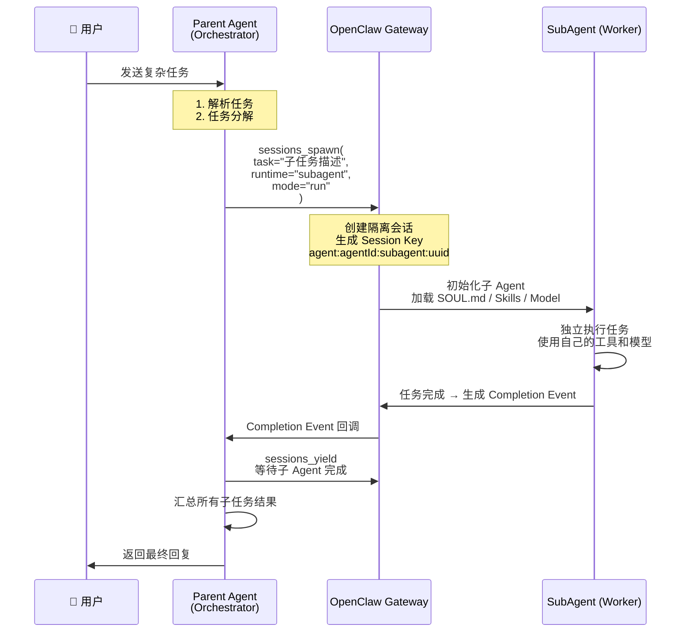
```mermaid
sequenceDiagram
    participant User as 👤 用户
    participant Parent as Parent Agent<br/>(Orchestrator)
    participant Gateway as OpenClaw Gateway
    participant Sub as SubAgent (Worker)
    
    User->>Parent: 发送复杂任务
    Note over Parent: 1. 解析任务<br/>2. 任务分解
    Parent->>Gateway: sessions_spawn(<br/>  task="子任务描述",<br/>  runtime="subagent",<br/>  mode="run"<br/>)
    Note over Gateway: 创建隔离会话<br/>生成 Session Key<br/>agent:agentId:subagent:uuid
    Gateway->>Sub: 初始化子 Agent<br/>加载 SOUL.md / Skills / Model
    Sub->>Sub: 独立执行任务<br/>使用自己的工具和模型
    Sub->>Gateway: 任务完成 → 生成 Completion Event
    Gateway->>Parent: Completion Event 回调
    Parent->>Gateway: sessions_yield<br/>等待子 Agent 完成
    Parent->>Parent: 汇总所有子任务结果
    Parent->>User: 返回最终回复
```

**详细拆解：**

| 阶段 | 做什么 | 关键动作 |
|------|--------|----------|
| **1. 任务委派** | 父 Agent 决定把子任务交给谁 | 调用 `sessions_spawn`，传入 task、model、context 等参数 |
| **2. 子 Agent 初始化** | Gateway 创建隔离会话 | 生成唯一 Session Key，加载该 Agent 的 workspace、skills、model |
| **3. 独立执行** | 子 Agent 在自己上下文中工作 | 使用自己的工具集和模型完成指定任务，不干扰父 Agent |
| **4. 结果回传** | 子 Agent 完成后通知父 Agent | 生成 Completion Event → 父 Agent 通过 `sessions_yield` 接收 |

### 3.2 `sessions_spawn` 工具详解

`sessions_spawn` 是 SubAgent 的核心工具。以下是完整的参数说明：

| 参数 | 类型 | 必填 | 默认值 | 说明 |
|------|------|------|--------|------|
| `task` | string | ✅ | — | 子任务描述（**最重要的参数**，子 Agent 看到的指令） |
| `runtime` | enum | ✅ | `"subagent"` | 固定为 `"subagent"` |
| `agentId` | string | ❌ | 同父 Agent | 指定子 Agent 的 ID |
| `context` | enum | ❌ | `"isolated"` | `"isolated"`（干净子会话）或 `"fork"`（继承父会话 transcript） |
| `model` | string | ❌ | 继承父 Agent | 为子 Agent 指定特定模型 |
| `mode` | enum | ❌ | 交互模式 | `"run"` 表示后台一次性任务 |
| `label` | string | ❌ | — | 稳定别名，方便后续 `sessions_send` 定位 |
| `taskName` | string | ❌ | — | 稳定别名，方便后续 targeting（小写字母/数字/下划线，以字母开头） |
| `sandbox` | enum | ❌ | `"inherit"` | `"inherit"`（继承父策略）或 `"require"`（强制沙箱） |
| `cleanup` | enum | ❌ | `"keep"` | `"delete"`（完成后删除会话）或 `"keep"` |
| `runTimeoutSeconds` | number | ❌ | 无超时 | 子 Agent 运行超时时间（秒） |
| `lightContext` | boolean | ❌ | false | 轻量引导上下文，减少 token 消耗 |

**实战示例：并行 Code Review**

```javascript
// 并行 spawn 3 个子 Agent
sessions_spawn({
    task: "审查以下代码的安全性，重点关注 SQL 注入、XSS、CSRF 和敏感信息泄露",
    runtime: "subagent",
    agentId: "security-reviewer",
    model: "anthropic/claude-sonnet-4-6",
    label: "security-review",
    mode: "run"
});

sessions_spawn({
    task: "检查代码风格和命名规范，参考 Google Style Guide",
    runtime: "subagent",
    agentId: "style-checker",
    model: "openai/gpt-4o-mini",
    label: "style-check",
    mode: "run"
});

sessions_spawn({
    task: "分析代码性能瓶颈，关注时间复杂度和内存使用",
    runtime: "subagent",
    agentId: "perf-analyzer",
    model: "anthropic/claude-sonnet-4-6",
    label: "perf-analysis",
    mode: "run"
});

// 等待所有子 Agent 完成
sessions_yield({ message: "等待三个子 Agent 完成代码审查" });
```

> 💡 **最佳实践**：并行 spawn 多个子 Agent 后，立即调用 `sessions_yield`，让 Gateway 自动等待所有子 Agent 的完成事件。不要轮询 `subagents list`。

### 3.3 Session Key 层级体系

OpenClaw 的 Session Key 有明确的层级结构，这决定了 Agent 之间的嵌套深度和隔离边界。

> **配图 6：Session Key 层级树状图**

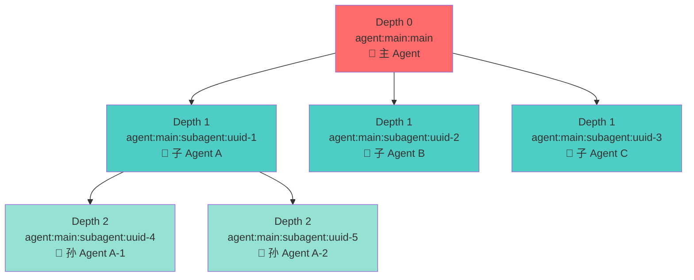
```mermaid
graph TD
    D0["Depth 0<br/>agent:main:main<br/>👑 主 Agent"]
    D1A["Depth 1<br/>agent:main:subagent:uuid-1<br/>👷 子 Agent A"]
    D1B["Depth 1<br/>agent:main:subagent:uuid-2<br/>👷 子 Agent B"]
    D1C["Depth 1<br/>agent:main:subagent:uuid-3<br/>👷 子 Agent C"]
    D2A["Depth 2<br/>agent:main:subagent:uuid-4<br/>🔧 孙 Agent A-1"]
    D2B["Depth 2<br/>agent:main:subagent:uuid-5<br/>🔧 孙 Agent A-2"]
    
    D0 --> D1A
    D0 --> D1B
    D0 --> D1C
    D1A --> D2A
    D1A --> D2B
    
    style D0 fill:#FF6B6B
    style D1A fill:#4ECDC4
    style D1B fill:#4ECDC4
    style D1C fill:#4ECDC4
    style D2A fill:#95E1D3
    style D2B fill:#95E1D3
```

| 深度 | Session Key 格式 | 说明 | 可否 spawn 子 Agent |
|------|-----------------|------|---------------------|
| **Depth 0** | `agent:<agentId>:<mainKey>` | 主 Agent | ✅ 始终可以 |
| **Depth 1** | `agent:<agentId>:subagent:<uuid>` | 子 Agent | ✅ 需 `maxSpawnDepth ≥ 2` |
| **Depth 2** | `agent:<agentId>:subagent:<uuid>` | 孙 Agent（Worker） | ❌ 默认到达上限 |

**关键配置：`maxSpawnDepth`**

```json
{
  "agents": {
    "defaults": {
      "runtime": {
        "maxSpawnDepth": 2
      }
    }
  }
}
```

- `maxSpawnDepth: 0` → 不允许 spawn 任何子 Agent
- `maxSpawnDepth: 1`（默认）→ 主 Agent 可 spawn 子 Agent，子 Agent 不能再 spawn
- `maxSpawnDepth: 2` → 启用嵌套，子 Agent 可 spawn 孙 Agent

> ⚠️ **不要将 `maxSpawnDepth` 设得过高**。嵌套深度增加会导致调试难度指数级上升，且容易造成 Session Key 冲突。

### 3.4 `context` 模式对比：isolated vs fork

`sessions_spawn` 的 `context` 参数决定了子 Agent 是否继承父会话的历史对话。

| 模式 | 上下文内容 | 适用场景 | Token 开销 |
|------|-----------|----------|-----------|
| **isolated**（默认） | 干净的子会话，不携带父会话 transcript | 独立子任务（代码审查、数据清洗） | **低**（仅 task 描述） |
| **fork** | 继承当前会话的完整 transcript | 子任务需要了解对话历史才能完成 | **高**（完整对话历史） |

> **配图 7：isolated vs fork 模式对比图**
>
> ```
> ┌─────────────────────────────────────────────────────────────┐
> │                    context: "isolated"                      │
> │                                                             │
> │  Parent Agent ──task: "审查这段代码"──▶ SubAgent            │
> │                              (空状态启动)                    │
> │                                                             │
> │  Token 消耗: ~100 tokens (task 描述)                        │
> └─────────────────────────────────────────────────────────────┘
>
> ┌─────────────────────────────────────────────────────────────┐
> │                      context: "fork"                        │
> │                                                             │
> │  Parent Agent ──task + 完整对话历史──▶ SubAgent             │
> │                        (携带完整上下文)                      │
> │                                                             │
> │  Token 消耗: ~10K-50K tokens (完整 transcript)              │
> └─────────────────────────────────────────────────────────────┘
> ```

**实战建议：**
- **99% 的场景用 `isolated`** — 子任务通常不需要完整的对话历史
- **只有在子 Agent 需要了解用户之前的对话上下文时才用 `fork`** — 比如"继续上次讨论的那个方案"
- `fork` 的 token 开销可能很高，谨慎使用

### 3.5 典型应用场景：Code Review 流水线

> **配图 8：Code Review 流水线架构图**

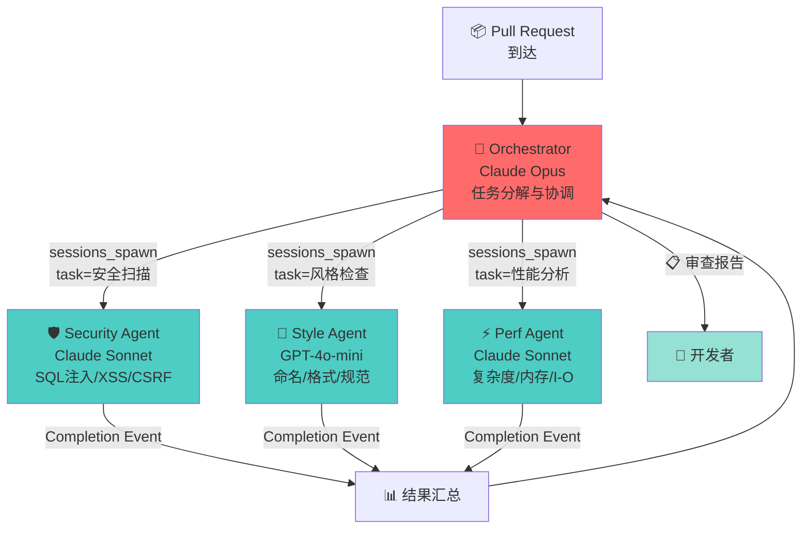
```mermaid
graph TB
    PR[📦 Pull Request<br/>到达] --> ORCH[🤖 Orchestrator<br/>Claude Opus<br/>任务分解与协调]
    
    ORCH -->|"sessions_spawn<br/>task=安全扫描"| SEC[🛡️ Security Agent<br/>Claude Sonnet<br/>SQL注入/XSS/CSRF]
    ORCH -->|"sessions_spawn<br/>task=风格检查"| STYLE[📝 Style Agent<br/>GPT-4o-mini<br/>命名/格式/规范]
    ORCH -->|"sessions_spawn<br/>task=性能分析"| PERF[⚡ Perf Agent<br/>Claude Sonnet<br/>复杂度/内存/I-O]
    
    SEC -->|"Completion Event"| MERGE[📊 结果汇总]
    STYLE -->|"Completion Event"| MERGE
    PERF -->|"Completion Event"| MERGE
    
    MERGE --> ORCH
    ORCH -->|"📋 审查报告"| DEV[👤 开发者]
    
    style ORCH fill:#FF6B6B
    style SEC fill:#4ECDC4
    style STYLE fill:#4ECDC4
    style PERF fill:#4ECDC4
    style DEV fill:#95E1D3
```

**工作流解析：**

1. **Orchestrator** 收到 PR 变更文件列表
2. **并行 spawn** 三个子 Agent，各自使用最适合的模型
3. 三个子 Agent **独立执行**，互不干扰
4. 各自完成后发送 **Completion Event** 回 Orchestrator
5. Orchestrator **汇总审查报告**，输出给开发者

**预期效果：**

| 指标 | 单 Agent 串行 | 多 Agent 并行 |
|------|--------------|--------------|
| 总耗时 | ~15 分钟 | ~5-6 分钟 |
| 上下文占用 | 128K+（全部历史） | 每个 Agent < 10K |
| 审查质量 | 后半段下降 | 每个 Agent 全程高质量 |
| 模型成本 | 全用 Opus = $8/次 | Sonnet + mini = $2.5/次 |

### 3.6 SubAgent 相关 CLI 命令

```bash
# 查看所有已配置的 Agent
openclaw agents list

# 添加新 Agent
openclaw agents add security-reviewer --model claude-sonnet-4-6

# 查看 Agent 绑定状态
openclaw agents list --bindings

# 查看 Gateway 日志（追踪 Agent 执行情况）
openclaw logs --follow
```

**对话内命令（Slash Commands）：**

```
/subagents spawn        # 手动 spawn 子 Agent
/subagents list         # 查看当前活跃的子 Agent
/subagents cancel <id>  # 取消运行中的子 Agent
/status                 # 查看当前会话状态（模型、token 用量、时间）
```

---

## 四、机制二：Agent Teams — 团队协作

当任务复杂度超过了"父子委派"的能力范围——需要多个 Agent 之间实时通信、共享状态、动态调整任务分配时，就该 **Agent Teams** 出场了。

### 4.1 与 SubAgent 的本质差异

SubAgent 是**单向委托**（我说你做，做完汇报），Agent Teams 是**多向协作**（大家讨论怎么一起把事做好）。

| 维度 | SubAgent | Agent Teams |
|------|----------|-------------|
| 通信方向 | 单向（父 → 子 → 父） | 多向（成员间互通信） |
| 上下文 | 各自独立 | 支持共享内存 |
| 角色灵活性 | 配置时固定 | 支持动态角色切换 |
| 协调机制 | 单一父 Agent 控制 | 三种模式可选 |
| 适合场景 | 流水线任务 | 需要讨论与协商的复杂任务 |

> **配图 9：SubAgent vs Agent Teams 通信流向对比**

```mermaid
sequenceDiagram
    rect rgb(200, 230, 255)
        Note over P,C1: SubAgent — 单向通信
        P->>C1: delegate(task="安全扫描")
        P->>C2: delegate(task="风格检查")
        C1->>C1: 独立执行
        C2->>C2: 独立执行
        C1-->>P: 返回结果
        C2-->>P: 返回结果
        Note over P,C2: 子 Agent 之间无法通信
    end
    
    rect rgb(230, 255, 200)
        Note over A,B,C: Agent Teams — 多向通信
        A->>B: 共享搜索数据
        B->>C: 请求分析
        C->>A: 反馈分析结果
        A->>C: 调整任务优先级
        B->>C: 补充数据
        C->>B: 确认数据格式
        Note over A,C: 成员间自由通信
    end
```

### 4.2 三种协调模式

Agent Teams 支持三种协调模式，适用于不同类型的团队任务：

> **配图 10：三种协调模式对比图**

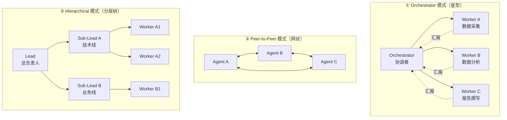
```mermaid
graph TD
    subgraph "① Orchestrator 模式（星型）"
        O[Orchestrator<br/>协调者] --> W1[Worker A<br/>数据采集]
        O --> W2[Worker B<br/>数据分析]
        O --> W3[Worker C<br/>报告撰写]
        W1 -.汇报.-> O
        W2 -.汇报.-> O
        W3 -.汇报.-> O
    end
    
    subgraph "② Peer-to-Peer 模式（网状）"
        P2A[Agent A] <--> P2B[Agent B]
        P2B <--> P2PC[Agent C]
        P2A <--> P2PC
    end
    
    subgraph "③ Hierarchical 模式（分层树）"
        H1[Lead<br/>总负责人] --> H2A[Sub-Lead A<br/>技术线]
        H1 --> H2B[Sub-Lead B<br/>业务线]
        H2A --> H3A[Worker A1]
        H2A --> H3B[Worker A2]
        H2B --> H3C[Worker B1]
    end
```

| 模式 | 拓扑 | 适用场景 | 优势 | 劣势 |
|------|------|----------|------|------|
| **Orchestrator** | 星型辐射 | 任务可明确分解、有明确负责人 | 结构简单、容易调试、权责清晰 | 协调者是单点故障瓶颈 |
| **Peer-to-Peer** | 网状互连 | 任务需要成员间频繁协商 | 无中心瓶颈、灵活性高 | 容易产生混乱、调试困难 |
| **Hierarchical** | 分层树 | 大型项目、多层管理结构 | 可扩展性强、职责分层 | 层级过深时通信延迟高 |

### 4.3 Agent Teams 配置结构

```json
{
  "agent_teams": {
    "research-team": {
      "description": "市场调研分析团队",
      "coordination": "orchestrator",
      "orchestrator": "research-lead",
      "shared_memory": {
        "enabled": true,
        "max_size": "50MB",
        "persistence": "session"
      },
      "members": {
        "research-lead": {
          "role": "团队负责人：任务分解、进度跟踪、最终报告整合",
          "model": { "primary": "claude-opus-4-6" },
          "skills": ["task-planning", "report-generation"],
          "can_delegate": true
        },
        "web-scout": {
          "role": "网络侦察员：搜索和收集公开信息",
          "model": { "primary": "gpt-4o" },
          "skills": ["web-search", "web-scrape"],
          "can_delegate": false
        },
        "analyst": {
          "role": "数据分析师：数据清洗、统计分析、趋势识别",
          "model": { "primary": "claude-sonnet-4-6" },
          "skills": ["data-analysis", "chart-generation"],
          "can_delegate": false
        },
        "writer": {
          "role": "报告撰写者：将分析结果转化为结构化报告",
          "model": { "primary": "claude-sonnet-4-6" },
          "skills": ["content-writing", "formatting"],
          "can_delegate": false
        }
      },
      "workflow": {
        "max_rounds": 10,
        "timeout": 600,
        "early_stop": {
          "condition": "orchestrator_decision",
          "min_rounds": 2
        }
      }
    }
  }
}
```

**关键配置参数：**

| 参数 | 说明 |
|------|------|
| `coordination` | 协调模式：`orchestrator` / `peer` / `hierarchical` |
| `orchestrator` | Orchestrator 模式下指定协调者 Agent 的 ID |
| `shared_memory.enabled` | 是否启用共享内存 |
| `shared_memory.max_size` | 共享内存上限（防止无限增长） |
| `shared_memory.persistence` | 持久化策略：`session`（会话级）/ `permanent`（永久） |
| `members.*.can_delegate` | 该成员是否可以进一步委派任务 |
| `workflow.max_rounds` | 最大协作轮数（防止死循环） |
| `workflow.early_stop` | 提前终止条件 |

### 4.4 共享内存与状态同步

Agent Teams 通过 `shared_memory` 实现成员间的状态共享。这是与 SubAgent 最本质的区别。

> **配图 11：Agent Teams 共享内存架构图**

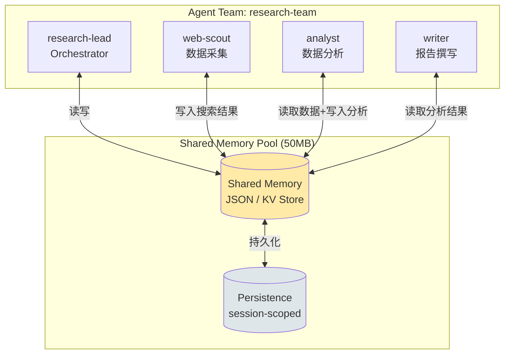
```mermaid
graph TB
    subgraph "Agent Team: research-team"
        L[research-lead<br/>Orchestrator]
        W[web-scout<br/>数据采集]
        A[analyst<br/>数据分析]
        WR[writer<br/>报告撰写]
    end
    
    subgraph "Shared Memory Pool (50MB)"
        SM[(Shared Memory<br/>JSON / KV Store)]
        PERS[(Persistence<br/>session-scoped)]
    end
    
    L <-->|读写| SM
    W <-->|写入搜索结果| SM
    A <-->|读取数据+写入分析| SM
    WR <-->|读取分析结果| SM
    SM <-->|持久化| PERS
    
    style SM fill:#FFEAA7
    style PERS fill:#DFE6E9
```

**共享内存使用示例（概念层面）：**

```
Round 1:
  web-scout -> 写入搜索结果到 Shared Memory: { "query": "AI Agent 市场", "results": [...] }
  
Round 2:
  analyst -> 从 Shared Memory 读取搜索结果 -> 写入分析结果: { "trends": [...], "market_size": ... }
  
Round 3:
  writer -> 从 Shared Memory 读取分析结果 -> 生成报告草稿
  
Round 4:
  research-lead -> 审查报告 -> 决定是否需要补充数据（决定是否继续下一轮）
```

---

## 五、机制三：AgentToAgent — 跨实例通信

### 5.1 跨 Gateway 分布式协作场景

当 Agent 分布在**不同的服务器**或**不同的 OpenClaw Gateway 实例**上时，SubAgent 和 Agent Teams 都无法跨实例工作。此时需要 AgentToAgent 协议。

典型场景：

| 场景 | 说明 |
|------|------|
| **跨服务器协作** | 数据中心 A 的 Agent 调用数据中心 B 的 Agent |
| **跨组织协作** | 不同组织的 Agent 通过安全协议协作 |
| **混合云架构** | 本地 Agent + 云端 Agent 协同工作 |
| **边缘计算** | 边缘设备上的轻量 Agent 与云端强推理 Agent 协作 |

### 5.2 AgentToAgent 协议设计

> **配图 12：跨实例分布式协作拓扑图**

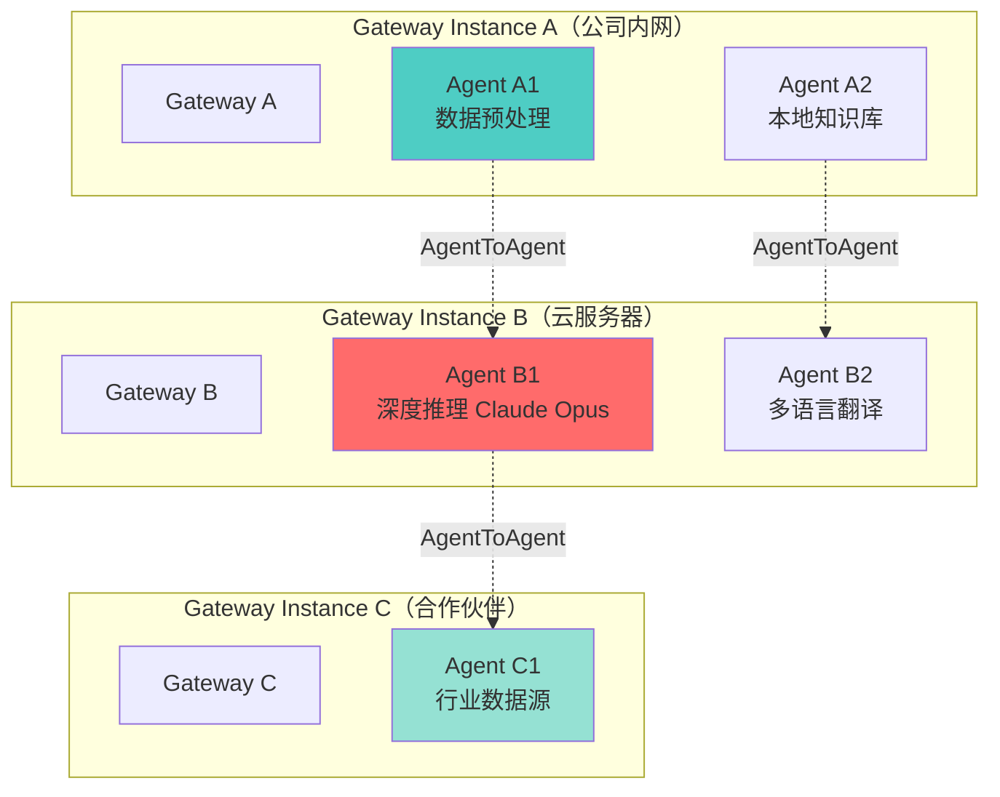
```mermaid
graph TB
    subgraph "Gateway Instance A（公司内网）"
        GA[Gateway A]
        AA1[Agent A1<br/>数据预处理]
        AA2[Agent A2<br/>本地知识库]
    end
    
    subgraph "Gateway Instance B（云服务器）"
        GB[Gateway B]
        AB1[Agent B1<br/>深度推理 Claude Opus]
        AB2[Agent B2<br/>多语言翻译]
    end
    
    subgraph "Gateway Instance C（合作伙伴）"
        GC[Gateway C]
        AC1[Agent C1<br/>行业数据源]
    end
    
    AA1 -.AgentToAgent.-> AB1
    AA2 -.AgentToAgent.-> AB2
    AB1 -.AgentToAgent.-> AC1
    
    style AA1 fill:#4ECDC4
    style AB1 fill:#FF6B6B
    style AC1 fill:#95E1D3
```

### 5.3 AgentToAgent 消息协议

> **配图 13：AgentToAgent 消息协议时序图**

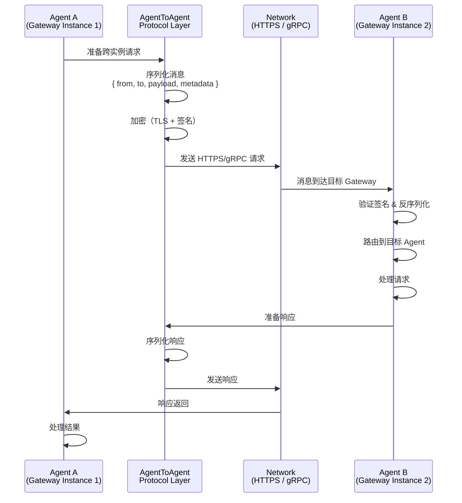
```mermaid
sequenceDiagram
    participant A as Agent A<br/>(Gateway Instance 1)
    participant Proto as AgentToAgent<br/>Protocol Layer
    participant Net as Network<br/>(HTTPS / gRPC)
    participant B as Agent B<br/>(Gateway Instance 2)
    
    A->>Proto: 准备跨实例请求
    Proto->>Proto: 序列化消息<br/>{ from, to, payload, metadata }
    Proto->>Proto: 加密（TLS + 签名）
    Proto->>Net: 发送 HTTPS/gRPC 请求
    Net->>B: 消息到达目标 Gateway
    B->>B: 验证签名 & 反序列化
    B->>B: 路由到目标 Agent
    B->>B: 处理请求
    B->>Proto: 准备响应
    Proto->>Proto: 序列化响应
    Proto->>Net: 发送响应
    Net->>A: 响应返回
    A->>A: 处理结果
```

**消息结构（概念模型）：**

```json
{
  "protocol": "openclaw.agent-to-agent/v1",
  "from": {
    "gateway_id": "gw-prod-01",
    "agent_id": "data-preprocessor",
    "request_id": "req-abc123"
  },
  "to": {
    "gateway_id": "gw-cloud-01",
    "agent_id": "deep-reasoner"
  },
  "payload": {
    "action": "analyze",
    "data": { "input": "..." }
  },
  "metadata": {
    "timestamp": "2026-08-02T05:00:00Z",
    "timeout_seconds": 300,
    "priority": "normal"
  }
}
```

### 5.4 三种机制总结对比

| 维度 | SubAgent | Agent Teams | AgentToAgent |
|------|----------|-------------|--------------|
| **复杂度** | 低 | 中 | 高 |
| **通信** | 单向 | 多向 | 跨实例（结构化协议） |
| **上下文** | 独立 | 共享内存 | 独立（跨网络） |
| **部署** | 单 Gateway | 单 Gateway | 多 Gateway |
| **典型场景** | 任务委派 | 团队协作 | 分布式协作 |
| **配置难度** | 低（几行 JSON） | 中（需要定义团队成员） | 高（需要配置跨实例连接） |
| **调试难度** | 低 | 中 | 高 |
| **推荐度** | 首选 | 需要实时协调时用 | 跨服务器时用 |

---

## 六、核心源码剖析

本章基于 OpenClaw v2026.5.27 的源码，深入剖析多 Agent 交互的底层实现。

### 6.1 Gateway 路由机制：Binding 匹配与消息分发

OpenClaw 的消息路由遵循**最精确匹配优先**原则。每条入站消息经过 Binding Router 后，被精确路由到目标 Agent。

> **配图 14：Gateway 消息路由流程图**

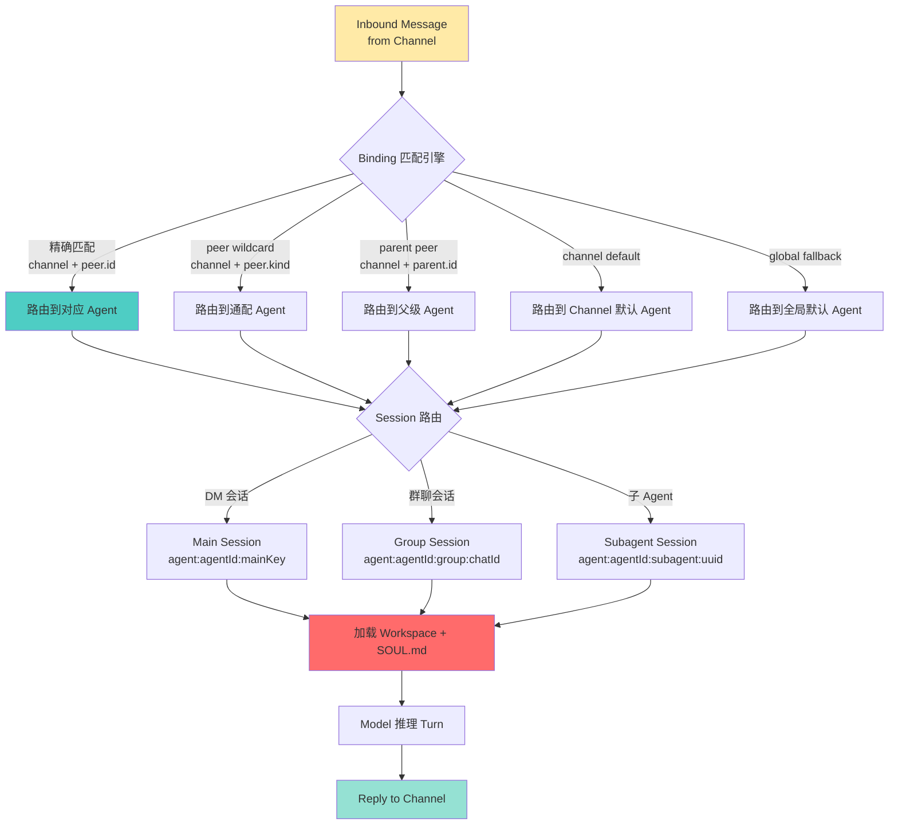
```mermaid
graph TD
    A[Inbound Message<br/>from Channel] --> B{Binding 匹配引擎}
    
    B -->|精确匹配<br/>channel + peer.id| C[路由到对应 Agent]
    B -->|peer wildcard<br/>channel + peer.kind| D[路由到通配 Agent]
    B -->|parent peer<br/>channel + parent.id| E[路由到父级 Agent]
    B -->|channel default| F[路由到 Channel 默认 Agent]
    B -->|global fallback| G[路由到全局默认 Agent]
    
    C --> H{Session 路由}
    D --> H
    E --> H
    F --> H
    G --> H
    
    H -->|DM 会话| I[Main Session<br/>agent:agentId:mainKey]
    H -->|群聊会话| J[Group Session<br/>agent:agentId:group:chatId]
    H -->|子 Agent| K[Subagent Session<br/>agent:agentId:subagent:uuid]
    
    I --> L[加载 Workspace + SOUL.md]
    J --> L
    K --> L
    
    L --> M[Model 推理 Turn]
    M --> N[Reply to Channel]
    
    style A fill:#FFEAA7
    style C fill:#4ECDC4
    style L fill:#FF6B6B
    style N fill:#95E1D3
```

**路由层级详解（从高到低）：**

| 优先级 | 匹配规则 | 示例 | 说明 |
|--------|----------|------|------|
| **1** | channel + peer.id | whatsapp + +15551230001 | 精确到具体用户 |
| **2** | channel + peer.kind | whatsapp + direct | 匹配所有 DM |
| **3** | channel + parent.id | telegram + group-123 | 群聊父级 |
| **4** | channel | discord | Channel 级别默认 |
| **5** | 全局默认 | — | 所有未匹配的消息 |

### 6.2 sessions_spawn 的实现链路

> **配图 15：sessions_spawn 源码调用链路图**

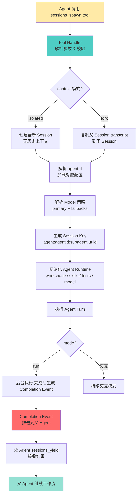
```mermaid
graph TD
    A[Agent 调用 sessions_spawn tool] --> B[Tool Handler<br/>解析参数 & 校验]
    B --> C{context 模式?}
    C -->|isolated| D[创建全新 Session<br/>无历史上下文]
    C -->|fork| E[复制父 Session transcript<br/>到子 Session]
    
    D --> F[解析 agentId<br/>加载对应配置]
    E --> F
    
    F --> G[解析 Model 策略<br/>primary + fallbacks]
    G --> H[生成 Session Key<br/>agent:agentId:subagent:uuid]
    H --> I[初始化 Agent Runtime<br/>workspace / skills / tools / model]
    
    I --> J[执行 Agent Turn]
    J --> K{mode?}
    K -->|run| L[后台执行 完成后生成 Completion Event]
    K -->|交互| M[持续交互模式]
    
    L --> N[Completion Event<br/>推送到父 Agent]
    N --> O[父 Agent sessions_yield<br/>接收结果]
    O --> P[父 Agent 继续工作流]
    
    style A fill:#FFEAA7
    style B fill:#4ECDC4
    style N fill:#FF6B6B
    style P fill:#95E1D3
```

**关键源码文件（基于 v2026.5.27）：**

| 文件 | 职责 | 关键内容 |
|------|------|----------|
| `get-reply-*.js` | 核心 Turn 处理 | sessionKey 路由、Turn 生命周期管理 |
| `spawn-requester-origin-*.js` | Spawn 请求来源解析 | Workspace override 计算 |
| `subagent-recovery-state-*.js` | 子 Agent 状态恢复 | 崩溃恢复、状态持久化 |
| `agent-limits-*.js` | 限制检查 | maxSpawnDepth / maxChildrenPerAgent 校验 |
| `thread-bindings-*.js` | 线程绑定策略 | Session 绑定与路由规则 |
| `runtime-policy-session-key-*.js` | Session Key 策略 | Runtime 级别的 Session Key 解析 |
| `commands-status.runtime.js` | 状态命令 | /status 和 Agent 状态查询 |

### 6.3 会话隔离与上下文管理：SQLite Session Store

OpenClaw 使用 **SQLite** 作为 Session Store 的底层存储。每个 Agent 拥有独立的 SQLite 数据库，确保会话数据严格隔离。

> **配图 16：SQLite Session Store 数据模型图**

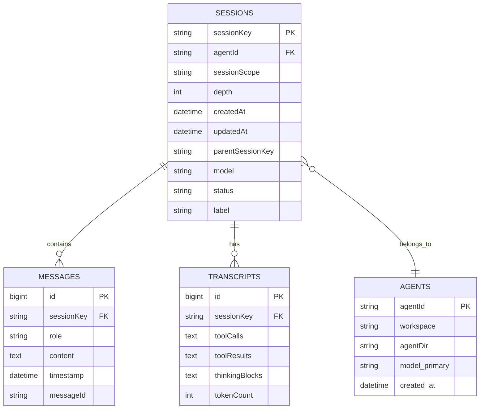
```mermaid
erDiagram
    SESSIONS ||--o{ MESSAGES : contains
    SESSIONS ||--o{ TRANSCRIPTS : has
    SESSIONS }o--|| AGENTS : belongs_to
    
    AGENTS {
        string agentId PK
        string workspace
        string agentDir
        string model_primary
        datetime created_at
    }
    
    SESSIONS {
        string sessionKey PK
        string agentId FK
        string sessionScope
        int depth
        datetime createdAt
        datetime updatedAt
        string parentSessionKey
        string model
        string status
        string label
    }
    
    MESSAGES {
        bigint id PK
        string sessionKey FK
        string role
        text content
        datetime timestamp
        string messageId
    }
    
    TRANSCRIPTS {
        bigint id PK
        string sessionKey FK
        text toolCalls
        text toolResults
        text thinkingBlocks
        int tokenCount
    }
```

**数据模型说明：**

| 表 | 作用 | 关键字段 |
|------|------|----------|
| **AGENTS** | Agent 注册信息 | agentId, workspace, agentDir, model_primary |
| **SESSIONS** | 会话元数据 | sessionKey（唯一标识）, depth（嵌套深度）, parentSessionKey（父会话引用） |
| **MESSAGES** | 消息记录 | sessionKey, role（user/assistant/system）, content |
| **TRANSCRIPTS** | 工具调用与推理记录 | toolCalls, toolResults, thinkingBlocks, tokenCount |

**会话隔离保证：**

- 每个 Agent 有独立的 SQLite 数据库（`~/.openclaw/agents/<agentId>/agent/openclaw-agent.sqlite`）
- `sessions_spawn` 创建的子会话使用独立的 sessionKey
- 子会话无法访问父会话的 SQLite 数据

### 6.4 子 Agent 完成事件回传与 sessions_yield 机制

`sessions_yield` 是父 Agent 等待子 Agent 完成的核心机制。与轮询不同，它是**事件驱动的**：

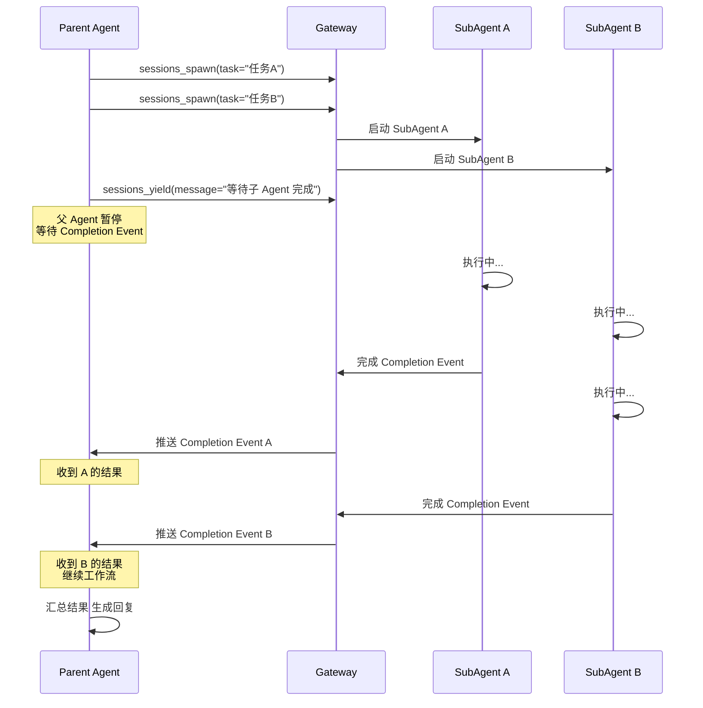
```mermaid
sequenceDiagram
    participant Parent as Parent Agent
    participant Gateway as Gateway
    participant Sub1 as SubAgent A
    participant Sub2 as SubAgent B
    
    Parent->>Gateway: sessions_spawn(task="任务A")
    Parent->>Gateway: sessions_spawn(task="任务B")
    Gateway->>Sub1: 启动 SubAgent A
    Gateway->>Sub2: 启动 SubAgent B
    Parent->>Gateway: sessions_yield(message="等待子 Agent 完成")
    
    Note over Parent: 父 Agent 暂停<br/>等待 Completion Event
    
    Sub1->>Sub1: 执行中...
    Sub2->>Sub2: 执行中...
    Sub1->>Gateway: 完成 Completion Event
    Sub2->>Sub2: 执行中...
    Gateway->>Parent: 推送 Completion Event A
    Note over Parent: 收到 A 的结果
    
    Sub2->>Gateway: 完成 Completion Event
    Gateway->>Parent: 推送 Completion Event B
    Note over Parent: 收到 B 的结果<br/>继续工作流
    Parent->>Parent: 汇总结果 生成回复
```

**关键区别：**

| 方式 | 行为 | 资源消耗 | 推荐度 |
|------|------|----------|--------|
| **sessions_yield** | 事件驱动，完成后自动恢复 | 零轮询开销 | 推荐 |
| **轮询 subagents list** | 定时查询子 Agent 状态 | 持续消耗 token | 不推荐 |

> 不要轮询 `subagents list` 或 `sessions_list` 等待子 Agent 完成。使用 `sessions_yield` 等待完成事件，仅在需要干预/调试时才按需检查状态。

### 6.5 安全策略：Tool Allowlist / 嵌套深度限制

> **配图 17：安全策略配置决策图**

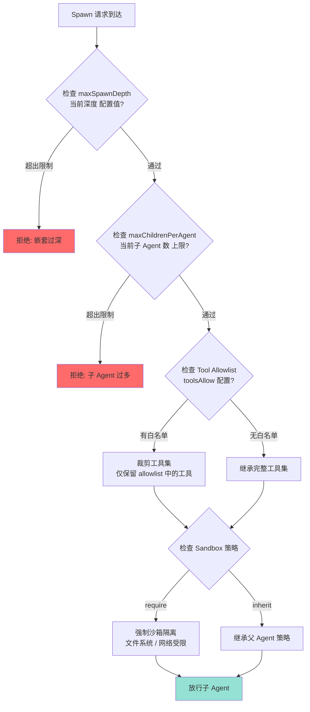
```mermaid
graph TD
    A[Spawn 请求到达] --> B{检查 maxSpawnDepth<br/>当前深度 配置值?}
    B -->|超出限制| C[拒绝: 嵌套过深]
    B -->|通过| D{检查 maxChildrenPerAgent<br/>当前子 Agent 数 上限?}
    
    D -->|超出限制| E[拒绝: 子 Agent 过多]
    D -->|通过| F{检查 Tool Allowlist<br/>toolsAllow 配置?}
    
    F -->|有白名单| G[裁剪工具集<br/>仅保留 allowlist 中的工具]
    F -->|无白名单| H[继承完整工具集]
    
    G --> I{检查 Sandbox 策略}
    H --> I
    
    I -->|require| J[强制沙箱隔离<br/>文件系统 / 网络受限]
    I -->|inherit| K[继承父 Agent 策略]
    
    J --> L[放行子 Agent]
    K --> L
    
    style C fill:#FF6B6B
    style E fill:#FF6B6B
    style L fill:#95E1D3
```

**安全配置详解：**

| 配置项 | 默认值 | 说明 |
|--------|--------|------|
| `maxSpawnDepth` | 1 | 最大嵌套深度（0=不允许 spawn，1=主子，2=主子孙） |
| `maxChildrenPerAgent` | 10 | 单个 Agent 同时运行的子 Agent 上限 |
| `toolsAllow` | null（不限制） | 子 Agent 允许使用的工具白名单 |
| `sandbox` | inherit | 沙箱策略（inherit 继承父 / require 强制沙箱） |
| `lightContext` | false | 轻量引导上下文，减少 token 消耗 |

**安全配置示例：**

```json
{
  "agents": {
    "defaults": {
      "runtime": {
        "maxSpawnDepth": 1,
        "maxChildrenPerAgent": 5,
        "sandbox": "require"
      },
      "toolsAllow": ["exec", "read", "write", "edit", "web_search", "web_fetch"]
    },
    "entries": {
      "coder": {
        "workspace": "~/.openclaw/workspace-coder",
        "toolsAllow": ["exec", "read", "write", "edit", "browser"]
      },
      "researcher": {
        "workspace": "~/.openclaw/workspace-researcher",
        "toolsAllow": ["web_search", "web_fetch", "read", "write"]
      }
    }
  }
}
```

---

## 七、应用配置实战

### 7.1 多 Agent 环境初始化

```bash
# Step 1: 创建 Agent
openclaw agents add coding --model claude-sonnet-4-6
openclaw agents add social --model gpt-4o

# Step 2: 配置 Channel 账户
openclaw channels login --channel telegram --account coding-bot
openclaw channels login --channel telegram --account social-bot

# Step 3: 添加 Binding（向导会自动提示）
openclaw agents list --bindings

# Step 4: 重启并验证
openclaw gateway restart
openclaw agents list --bindings
openclaw channels status --probe
```

> **配图 18：多 Agent 初始化工作流图**

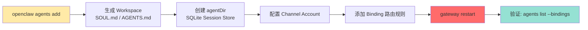
```mermaid
graph LR
    A[openclaw agents add] --> B[生成 Workspace<br/>SOUL.md / AGENTS.md]
    B --> C[创建 agentDir<br/>SQLite Session Store]
    C --> D[配置 Channel Account]
    D --> E[添加 Binding 路由规则]
    E --> F[gateway restart]
    F --> G[验证: agents list --bindings]
    
    style A fill:#FFEAA7
    style F fill:#FF6B6B
    style G fill:#95E1D3
```

### 7.2 配置案例 1：Orchestrator + 专业子 Agent 模式

```json
{
  "agents": {
    "list": [
      {
        "id": "orchestrator",
        "name": "Orchestrator",
        "workspace": "~/.openclaw/workspace-orchestrator",
        "model": "anthropic/claude-opus-4-6"
      },
      {
        "id": "coder",
        "name": "Coding Expert",
        "workspace": "~/.openclaw/workspace-coder",
        "model": "anthropic/claude-sonnet-4-6"
      },
      {
        "id": "researcher",
        "name": "Web Researcher",
        "workspace": "~/.openclaw/workspace-researcher",
        "model": "anthropic/claude-sonnet-4-6"
      },
      {
        "id": "ops",
        "name": "DevOps Expert",
        "workspace": "~/.openclaw/workspace-ops",
        "model": "gpt-4o"
      }
    ]
  },
  "bindings": [
    { "agentId": "orchestrator", "match": { "channel": "telegram", "peer": { "kind": "direct", "id": "+8613800000001" } } },
    { "agentId": "coder", "match": { "channel": "telegram", "peer": { "kind": "direct", "id": "+8613800000002" } } },
    { "agentId": "researcher", "match": { "channel": "discord", "channelId": "coding-channel" } },
    { "agentId": "ops", "match": { "channel": "whatsapp", "peer": { "kind": "direct", "id": "+8613800000003" } } }
  ]
}
```

> **配图 19：Orchestrator 模式部署架构图**

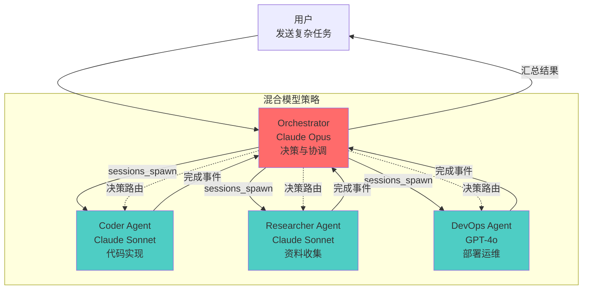
```mermaid
graph TB
    User[用户<br/>发送复杂任务] --> O[Orchestrator<br/>Claude Opus<br/>决策与协调]
    
    O -->|sessions_spawn| C[Coder Agent<br/>Claude Sonnet<br/>代码实现]
    O -->|sessions_spawn| R[Researcher Agent<br/>Claude Sonnet<br/>资料收集]
    O -->|sessions_spawn| D[DevOps Agent<br/>GPT-4o<br/>部署运维]
    
    C -->|完成事件| O
    R -->|完成事件| O
    D -->|完成事件| O
    
    O -->|汇总结果| User
    
    subgraph 混合模型策略
        O -.决策路由.-> C
        O -.决策路由.-> R
        O -.决策路由.-> D
    end
    
    style O fill:#FF6B6B
    style C fill:#4ECDC4
    style R fill:#4ECDC4
    style D fill:#4ECDC4
```

### 7.3 配置案例 2：同 WhatsApp 号码拆分多 Agent

```json
{
  "agents": {
    "list": [
      { "id": "alex", "workspace": "~/.openclaw/workspace-alex" },
      { "id": "mia", "workspace": "~/.openclaw/workspace-mia" }
    ]
  },
  "bindings": [
    {
      "agentId": "alex",
      "match": { "channel": "whatsapp", "peer": { "kind": "direct", "id": "+15551230001" } }
    },
    {
      "agentId": "mia",
      "match": { "channel": "whatsapp", "peer": { "kind": "direct", "id": "+15551230002" } }
    }
  ],
  "channels": {
    "whatsapp": {
      "dmPolicy": "allowlist",
      "allowFrom": ["+15551230001", "+15551230002"]
    }
  }
}
```

> **配图 20：多 Channel 绑定拓扑图**

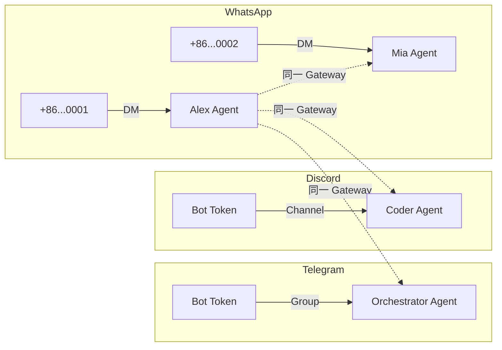
```mermaid
graph LR
    subgraph WhatsApp
    WA1[+86...0001] -->|DM| A[Alex Agent]
    WA2[+86...0002] -->|DM| M[Mia Agent]
    end
    
    subgraph Telegram
    TG[Bot Token] -->|Group| O[Orchestrator Agent]
    end
    
    subgraph Discord
    DS[Bot Token] -->|Channel| C[Coder Agent]
    end
    
    A -.同一 Gateway.-> M
    A -.同一 Gateway.-> O
    A -.同一 Gateway.-> C
```

### 7.4 性能调优：混合模型策略

| 角色 | 推荐模型 | 理由 |
|------|----------|------|
| **Orchestrator（决策/路由）** | Claude Opus / GPT-4o | 需要强推理能力做任务分解 |
| **Worker（执行）** | Claude Sonnet / GPT-4o-mini | 执行特定任务，性价比更高 |
| **Simple Task（简单任务）** | GPT-4o-mini / Qwen-Turbo | 快速响应，成本极低 |

> **配图 21：混合模型策略成本对比柱状图**
>
> 使用 Python matplotlib 生成：

```python
import matplotlib.pyplot as plt
import numpy as np

categories = ['路由决策', '代码生成', '数据分析', '内容写作', '总计']
pure_opus = [12.5, 45.0, 38.0, 32.0, 127.5]   # 全 Opus 成本 ($/月)
mixed = [12.5, 18.0, 15.0, 12.0, 57.5]          # 混合模型成本

x = np.arange(len(categories))
width = 0.35

fig, ax = plt.subplots(figsize=(10, 5))
bars1 = ax.bar(x - width/2, pure_opus, width, label='纯 Claude Opus', color='#FF6B6B')
bars2 = ax.bar(x + width/2, mixed, width, label='混合模型策略', color='#4ECDC4')

ax.set_ylabel('月度成本 ($)')
ax.set_title('混合模型策略 vs 纯 Opus 成本对比')
ax.set_xticks(x)
ax.set_xticklabels(categories)
ax.legend()
ax.bar_label(bars1, padding=3)
ax.bar_label(bars2, padding=3)

# 标注降本比例
ax.annotate('55% reduction', xy=(4.35, 65), fontsize=14, color='green', fontweight='bold')

plt.tight_layout()
plt.savefig('cost-comparison.png', dpi=150)
plt.show()
```

**预期输出效果：** 左右柱状图对比，清晰展示混合模型策略降本 55%（$127.5 → $57.5/月）。

### 7.5 安全最佳实践

| 实践 | 配置 | 说明 |
|------|------|------|
| **凭证隔离** | 每个 Agent 独立的 agentDir | 防止 OAuth refresh token 泄漏 |
| **权限控制** | 子 Agent 配置 toolsAllow 白名单 | 最小权限原则 |
| **Sandbox 隔离** | sandbox: "require" | 子 Agent 必须在沙箱中执行 |
| **嵌套深度** | maxSpawnDepth: 1 | 防止无限递归 spawn |
| **并发限制** | maxChildrenPerAgent: 5 | 控制资源消耗 |

```json
{
  "agents": {
    "defaults": {
      "runtime": {
        "maxSpawnDepth": 1,
        "maxChildrenPerAgent": 5,
        "sandbox": "require"
      }
    }
  }
}
```

---

## 八、总结与展望

### 8.1 三种机制对比总结

| 维度 | SubAgent | Agent Teams | AgentToAgent |
|------|----------|-------------|--------------|
| **复杂度** | 低 | 中 | 高 |
| **通信** | 单向 | 多向 | 跨实例 |
| **上下文** | 独立 | 共享 | 独立 |
| **部署** | 单 Gateway | 单 Gateway | 多 Gateway |
| **典型场景** | 任务委派 | 团队协作 | 分布式协作 |
| **推荐度** | 首选 | 需要实时协调时用 | 跨服务器时用 |

### 8.2 OpenClaw 多 Agent 架构的设计哲学

OpenClaw 多 Agent 架构遵循**显式优于隐式**原则：

- **Agent 之间不直接通信**，必须通过主 Agent 协调
- **跨 Agent 访问需要显式配置**（如 extraCollections、copyToAgents）
- **权限边界清晰**：Workspace 是默认 cwd，非硬沙箱
- **工具访问遵循最小权限**：子 Agent 默认受限

### 8.3 未来演进方向

- **Agent Teams 增强**：更灵活的协调策略、动态成员加入/退出
- **AgentToAgent 标准化**：跨厂商 Agent 互操作协议
- **智能路由优化**：基于任务特征自动选择最优 Agent
- **多模态协作**：不同 Agent 处理不同模态（文本/图像/音频）的融合

> **配图 22：全文知识地图**

```mermaid
mindmap
  root((OpenClaw<br/>多 Agent 交互))
    单 Agent 瓶颈
      上下文天花板
      认知过载
      串行延迟
    架构总览
      Workspace
      agentDir
      Session Store
      Binding
    SubAgent
      sessions_spawn
      Session Key 层级
      isolated / fork
      Code Review 流水线
    Agent Teams
      Orchestrator
      Peer-to-Peer
      Hierarchical
      共享内存
    AgentToAgent
      跨 Gateway
      消息协议
      分布式协作
    源码实现
      路由机制
      Spawn 链路
      SQLite Store
      安全策略
    配置实战
      CLI 初始化
      Orchestrator 模式
      WhatsApp 拆分
      混合模型降本
```

---

## 附录

### A. 常用 CLI 命令速查

```bash
# Agent 管理
openclaw agents add <id> --model <model> --workspace <dir>
openclaw agents list --bindings
openclaw agents remove <id>

# Channel 管理
openclaw channels login --channel <channel> --account <account>
openclaw channels status --probe

# Gateway 管理
openclaw gateway restart
openclaw gateway status
openclaw logs --follow

# Session 管理（在对话中）
/subagents spawn        # 手动 spawn 子 Agent
/subagents list         # 查看当前活跃的子 Agent
/subagents cancel <id>  # 取消运行中的子 Agent
/status                 # 查看当前会话状态（模型、token 用量、时间）
```

### B. 参考链接

- OpenClaw 官方文档：https://docs.openclaw.ai
- OpenClaw GitHub 源码：https://github.com/openclaw/openclaw
- Multi-Agent Routing 文档：https://docs.openclaw.ai/concepts/multi-agent
- Agent Bindings 文档：https://docs.openclaw.ai/concepts/agent-bindings
- Skills 文档：https://docs.openclaw.ai/tools/skills

---

_全文完。_
