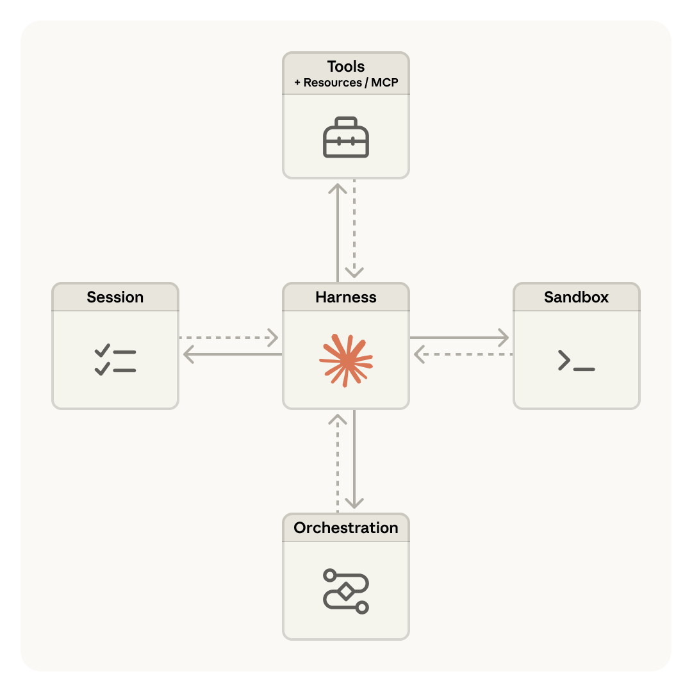
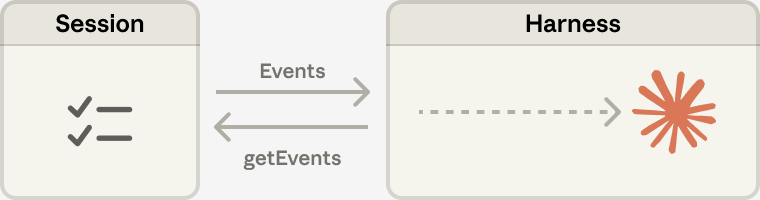
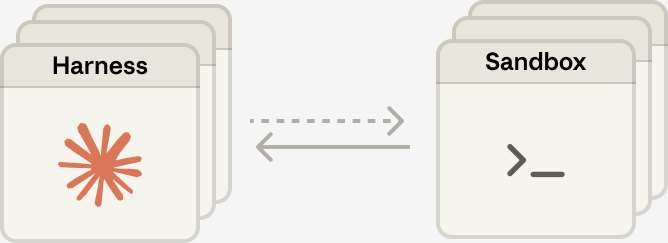
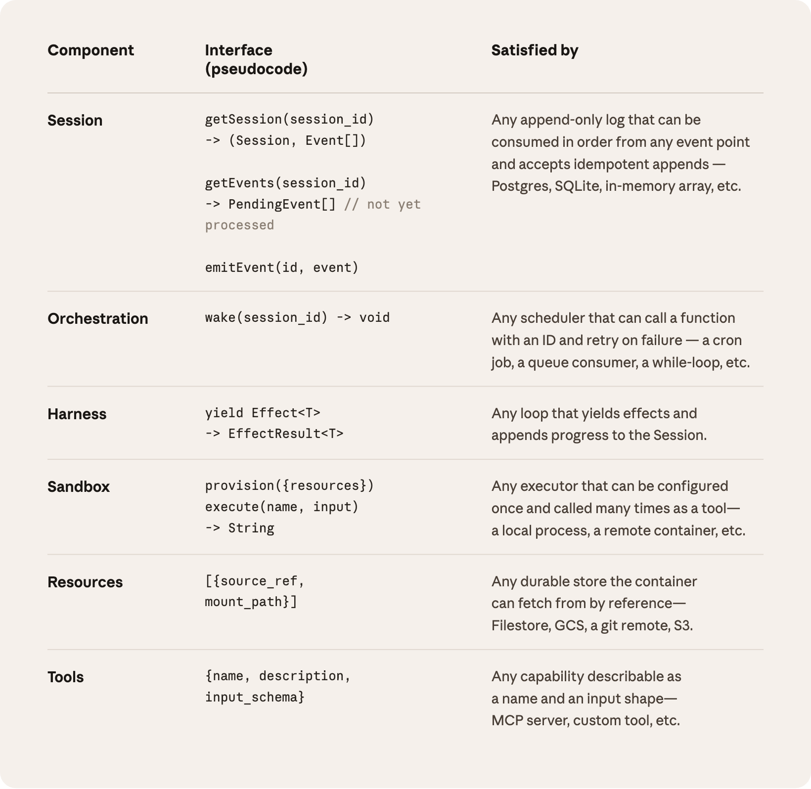

# 扩展 Managed Agents：将"大脑"与"双手"解耦

> 原文：[Scaling Managed Agents: Decoupling the brain from the hands](https://www.anthropic.com/engineering/managed-agents)  
> 作者：Lance Martin, Gabe Cemaj, Michael Cohen  
> 发表于：2026 年 4 月 8 日

---

按照我们的[文档](https://platform.claude.com/docs/en/managed-agents/overview)快速上手 Claude Managed Agents。

工程博客上一直在讨论的热门话题是如何[构建有效的智能体](https://www.anthropic.com/engineering/building-effective-agents)以及为[长时间运行的任务](https://www.anthropic.com/engineering/harness-design-long-running-apps)[设计控制器（harness）](https://www.anthropic.com/engineering/effective-harnesses-for-long-running-agents)。贯穿这些工作的一个共同线索是：**控制器编码了关于 Claude 自身无法完成的事情的假设**。然而，这些假设需要经常被质疑，因为随着模型能力的提升，它们会[过时](http://www.incompleteideas.net/IncIdeas/BitterLesson.html)。

仅举一个例子：在我们之前的[研究](https://www.anthropic.com/engineering/harness-design-long-running-apps)中，我们发现 Claude Sonnet 4.5 在感知到上下文限制接近时，会过早地结束任务——这种行为有时被称为"上下文焦虑（context anxiety）"。我们通过向控制器中添加上下文重置来解决这个问题。但当我们使用同一个控制器来运行 Claude Opus 4.5 时，发现这种行为消失了。这些重置机制变成了冗余负担。

我们预计控制器将继续演进。因此，我们构建了 **Managed Agents**：这是 Claude 平台中的一项托管服务，通过一组精简的接口为你运行长周期的智能体——这些接口的设计目标是超越任何特定实现（包括我们今天正在运行的那些）。

构建 Managed Agents 意味着要解决计算领域的一个经典问题：如何为"**尚未被构想出来的程序**（[programs as yet unthought of](http://www.catb.org/esr/writings/taoup/html/ch03s01.html)）"设计系统。几十年前，操作系统通过将硬件虚拟化为抽象层——进程（process）、文件（file）——来解决这个问题，这些抽象足够通用，可以容纳尚不存在的程序。抽象比硬件寿命更长。`read()` 命令并不关心它访问的是 1970 年代的磁盘组还是现代 SSD。上层的抽象保持稳定，而下层的实现可以自由变化。

Managed Agents 遵循相同的模式。我们将智能体的组件虚拟化：**会话（session，一切已发生事件的只追加日志）**、**控制器（harness，调用 Claude 并将 Claude 的工具调用路由到相关基础设施的循环）**、以及**沙箱（sandbox，Claude 可以在其中运行代码和编辑文件的执行环境）**。这使得每个组件的实现可以被替换而不会干扰其他组件。**我们对这些接口的形态有明确主张，但对接口背后运行什么不做假设。**

> *图 1：Managed Agents 架构概览——Harness 位于中心，通过双向箭头连接 Session、Sandbox、Orchestration 和 Tools + Resources/MCP。*

---

## 不要养宠物

我们最初的方案是将所有智能体组件放入单个容器中，这意味着会话、智能体控制器和沙箱共享同一个环境。这种方法有其优点，包括文件编辑是直接系统调用，且不需要设计服务边界。

但将所有内容耦合到一个容器中，我们遇到了一个经典的基础设施问题：我们养了一只**[宠物](https://cloudscaling.com/blog/cloud-computing/the-history-of-pets-vs-cattle/)**。在"宠物 vs 牲畜"的类比中，宠物是一个被命名、需要精心照料、失去就损失惨重的个体，而牲畜是可以互换的。在我们的案例中，服务器成了那只宠物：如果一个容器发生故障，会话就丢失了。如果一个容器无响应，我们必须把它"照料"回健康状态。

照料容器意味着调试无响应的卡死会话。我们唯一的观察窗口是 WebSocket 事件流，但它无法告诉我们故障**发生在哪里**——这意味着控制器中的 bug、事件流中的丢包、或者容器下线都呈现相同的表现。为了找出问题所在，工程师必须在容器内打开一个 shell，但因为那个容器通常也持有用户数据，这种方法本质上意味着我们缺乏调试能力。

第二个问题是，控制器假设 Claude 所操作的一切都与其共处同一个容器中。当客户要求我们将 Claude 连接到他们的虚拟私有云（VPC）时，他们要么必须将他们的网络与我们的对等互联，要么在我们的环境中运行他们的控制器。一个嵌入到控制器中的假设，在我们想将其连接到不同基础设施时成了问题。

### 将大脑与双手解耦

我们最终找到的解决方案是，将我们所谓的"**大脑**"（Claude 及其控制器）与"**双手**"（执行操作的沙箱和工具）以及"**会话**"（会话事件的日志）解耦。每一个都变成了一个对其他组件做最少假设的接口，且每一个都可以独立故障或被替换。

**控制器离开容器。** 将大脑与双手解耦意味着控制器不再驻留在容器内部。它像调用任何其他工具一样调用容器：`execute(name, input) → string`。容器变成了牲畜。如果容器挂了，控制器捕获到工具调用错误并将其返回给 Claude。如果 Claude 决定重试，可以使用标准配方重新初始化一个新容器：`provision({resources})`。我们不再需要把挂掉的容器"照料"回健康状态。

**从控制器故障中恢复。** 控制器也变成了牲畜。因为会话日志位于控制器之外，控制器中没有任何东西需要在崩溃后存活。当一个控制器故障时，一个新的可以用 `wake(sessionId)` 重新启动，使用 `getSession(id)` 取回事件日志，然后从最后一个事件处恢复。在智能体循环期间，控制器使用 `emitEvent(id, event)` 写入会话以保持事件的持久记录。

> *图 2：Session（会话）与 Harness（控制器）之间的数据流——事件从会话流向控制器，getEvents 从控制器回查会话。*

**安全边界。** 在耦合设计中，Claude 生成的任何不受信任的代码都在与凭据相同的容器中运行——因此提示词注入只需说服 Claude 读取自己的环境变量。一旦攻击者获得那些 token，他们就可以生成全新的、不受限的会话并委托工作给它们。缩小作用域是显而易见的缓解措施，但这编码了一个关于 Claude 在受限 token 下能做什么的假设——而 Claude 变得越来越聪明。结构性修复是确保 token 永远不会被 Claude 生成代码所运行的沙箱触及。

我们使用两种模式来确保这一点。**认证可以绑定到资源上，或存放在沙箱之外的保险库（vault）中。** 对于 Git，我们在沙箱初始化期间使用每个仓库的访问 token 来克隆仓库，并将其连接到本地 git remote。Git 的 push 和 pull 在沙箱内工作，而智能体本身从不处理 token。对于自定义工具，我们支持 MCP 并将 OAuth token 存放在安全的保险库中。Claude 通过专用代理调用 MCP 工具；这个代理接收与会话关联的 token。代理随后可以从保险库中获取相应的凭据并对外部服务进行调用。**控制器从不知道任何凭据。**

---

## 会话不是 Claude 的上下文窗口

长周期任务通常会超过 Claude 的上下文窗口长度，而解决这个问题的标准方法都涉及对保留什么内容的不可逆决策。我们在关于上下文工程的[先前工作](https://www.anthropic.com/engineering/effective-context-engineering-for-ai-agents)中探讨过这些技术。例如，压缩（compaction）让 Claude 保存其上下文窗口的摘要，记忆工具（memory tool）让 Claude 将上下文写入文件，实现跨会话的学习。这可以与上下文裁剪（context trimming）搭配使用，有选择地移除诸如旧工具结果或思维块之类的 token。

但对上下文进行有选择性的保留或丢弃的不可逆决策可能导致失败。很难知道未来的轮次需要哪些 token。如果消息被压缩步骤转换，控制器会将压缩后的消息从 Claude 的上下文窗口中移除，这些消息只有在被存储的情况下才可恢复。[先前的研究](https://arxiv.org/pdf/2512.24601)探索了通过将上下文存储为一个生活在上下文窗口之外的对象来解决这个问题的方法。例如，上下文可以是 REPL 中的一个对象，LLM 通过编写代码来以编程方式过滤或切片它。

在 Managed Agents 中，会话提供了同样的好处，作为一个生活在 Claude 上下文窗口之外的上下文对象。但与存储在沙箱或 REPL 中不同，上下文被持久地存储在会话日志中。接口 `getEvents()` 允许大脑通过选择事件流的位置切片来审查上下文。该接口可以灵活使用，允许大脑从上次停止读取的位置继续、在特定时刻之前回溯几个事件以查看前情、或在特定操作前重新阅读上下文。

任何获取到的事件也可以在传递到 Claude 的上下文窗口之前在控制器中进行转换。这些转换可以是控制器编码的任何内容，包括为实现高提示词缓存命中率和上下文工程而进行的上下文组织。**我们将会话中可恢复的上下文存储与控制器中的任意上下文管理这两个关注点分离开来，因为我们无法预测未来模型需要什么样的具体上下文工程。** 这些接口将上下文管理推入控制器，仅保证会话是持久的且可供查询。

---

## 多大脑，多双手

**多大脑。** 将大脑与双手解耦解决了我们最早的顾客抱怨之一。当团队想让 Claude 在他们自己的 VPC 中的资源上工作时，唯一的路径是将他们的网络与我们的对等互联，因为持有控制器的容器假设每个资源都紧挨着它。一旦控制器不再在容器内，这个假设就不存在了。同样的改变带来了性能回报。当我们最初把大脑放在容器中时，意味着多个大脑需要同样多的容器。对于每个大脑，在该容器被配置之前无法进行任何推理；每个会话都预先承担了完整的容器设置成本。每个会话，即使那些永远不会触及沙箱的会话，也必须克隆仓库、启动进程、从我们的服务器获取待处理事件。

那段死时间体现在**首 token 时间（TTFT，time-to-first-token）**上，它衡量一个会话在接受工作和产生第一个响应 token 之间等待的时间。TTFT 是用户感受最深刻的延迟。

将大脑与双手解耦意味着容器仅在大脑通过工具调用 `execute(name, input) → string` 需要时才被配置。所以一个暂时不需要容器的会话不用等它。推理可以在编排层从会话日志拉取待处理事件后立即开始。使用这种架构，我们的 p50 TTFT 下降了约 **60%**，p95 下降了超过 **90%**。扩展到多个大脑仅仅意味着启动多个无状态的控制器，并在需要时连接到双手。

**多双手。** 我们还希望每个大脑能够连接到多个双手。在实践中，这意味着 Claude 必须对多个执行环境进行推理并决定将工作发送到哪里——这比在单个 shell 中操作更难。我们最初把大脑放在单个容器中，因为早期的模型没有这种能力。随着智能扩展，单个容器反而成了限制：当那个容器故障时，我们丢失了大脑所触及的每双手的状态。

将大脑与双手解耦使每双手都变成一个工具，`execute(name, input) → string`：名字和输入进去，字符串返回。该接口支持任何自定义工具、任何 MCP 服务器，以及我们自己的工具。控制器不知道沙箱是容器、手机、还是 Pokémon 模拟器。而且因为没有手与任何大脑耦合，大脑之间可以互相传递双手。

> *图 3：多大脑多双手架构——多个 Harness 实例可以与多个 Sandbox 实例建立连接，解耦后每个大脑可灵活调度不同的执行环境。*

---

## 结论

我们面临的挑战是一个老问题：如何为"尚未被构想出来的程序"设计系统。操作系统通过虚拟化为足够通用的抽象来容纳尚不存在的程序，从而延续了几十年。对于 Managed Agents，我们的目标是设计一个系统，能够容纳围绕 Claude 的未来控制器、沙箱或其他组件。

Managed Agents 是相同精神的**元控制器（meta-harness）**，对 Claude 未来需要的具体控制器不做主张。相反，它是一个具有通用接口的系统，允许许多不同的控制器。例如，Claude Code 是一个出色的控制器，我们在各种任务中广泛使用。我们也展示了特定任务的智能体控制器在狭窄领域中表现出色。Managed Agents 可以容纳所有这些，随着时间推移与 Claude 的智能匹配。

元控制器设计意味着对 Claude 周围的接口有明确主张：我们预计 Claude 将需要操作状态（会话）和执行计算（沙箱）的能力。我们也预计 Claude 将需要扩展到多大脑和多双手的能力。我们设计的接口使得这些可以可靠且安全地在长时间范围内运行。但我们对 Claude 需要的大脑或双手的数量或位置不做任何假设。

---

## 组件接口一览

| 组件 | 接口（伪代码） | 满足方式 |
|------|---------------|---------|
| **Session** | `getSession(session_id) → (Session, Event[])` `getEvents(session_id) → PendingEvent[]` // 尚未处理 `emitEvent(id, event)` | 任何可以从任意事件点按顺序消费并接受幂等追加的只追加日志——Postgres、SQLite、内存数组等。 |
| **Orchestration** | `wake(session_id) → void` | 任何可以用 ID 调用函数并在失败时重试的调度器——cron 任务、队列消费者、while 循环等。 |
| **Harness** | `yield Effect<T> → EffectResult<T>` | 任何产生效果并将进度追加到 Session 的循环。 |
| **Sandbox** | `provision({resources})` `execute(name, input) → String` | 任何可以配置一次并作为工具被多次调用的执行器——本地进程、远程容器等。 |
| **Resources** | `[{source_ref, mount_path}]` | 容器可以通过引用从中获取的任何持久存储——Filestore、GCS、git remote、S3。 |
| **Tools** | `{name, description, input_schema}` | 任何可描述为名称和输入形状的能力——MCP 服务器、自定义工具等。 |

> *图 4：Managed Agents 各组件的接口定义一览——从 Session、Orchestration、Harness、Sandbox、Resources 到 Tools，每行定义了接口形态及可能的后端实现。*

---

## 致谢

本文由 **Lance Martin**、**Gabe Cemaj** 和 **Michael Cohen** 撰写。感谢 **Nodir Turakulov** 和 **Jeremy Fox** 在这些话题上的有益讨论。特别感谢 **Agents API 团队**和 **Jake Eaton** 的贡献。

---

*翻译仅供参考，原文请以 [Anthropic Engineering Blog](https://www.anthropic.com/engineering/managed-agents) 为准。*
