# Pi Coding Agent：极简主义编码代理的设计与实现

> **作者：** 大风  
> **日期：** 2026-08-02  
> **系列：** AI Coding Agent 源码解析  
> **关键词：** Pi · pi-mono · 极简Agent · 编码代理 · Agent Loop · Extensions · RPC · OpenClaw底层

---

## 一、极简主义哲学：为什么 Pi 只有四个工具？

### 1.1 从"功能军备竞赛"到"少即是多"

2025-2026年，AI编码代理正处于一场功能军备竞赛中。各大产品拼命堆砌工具和特性：

| 产品 | 工具数量 | System Prompt长度 | 核心代码 | 开源 |
|------|----------|-------------------|----------|------|
| **Claude Code** | 20+ | >10,000 tokens | 数千行闭源 | ❌ |
| **Cursor** | 15+ | 复杂IDE集成 | 闭源 | ❌ |
| **LangChain** | 1000+集成 | 47M+ PyPI下载 | 庞大 | ✅ |
| **OpenCode** | 10+ | 中等 | 中等 | ✅ |
| **Pi** | **4个** | **<1,000 tokens** | **418行核心循环** | ✅ |

然而，Pi 以极简设计在 Terminal-Bench 2.0 上与 Claude Code、Cursor 等顶级产品同场竞技， consistently 排名前列。

GitHub 上，pi-mono 已积累 80,000+ Stars，而基于 Pi RPC 模式构建的 OpenClaw 更是狂揽 370,000+ Stars。

### 1.2 Pi 的设计哲学

Pi 的 creator Mario Zechner（知名游戏框架 libGDX 的创建者）的设计哲学可以用一句话概括：

> "Adapt Pi to your workflows, not the other way around."

```
┌───────────────────────────────────────────────────────────┐
│              Pi 极简主义设计五原则                          │
├─────────────────┬─────────────────────────────────────────┤
│  核心极简        │  4个工具 + <1,000 token 系统提示词        │
│  外部可扩展      │  TypeScript Extensions + Skills         │
│  按需添加        │  需要什么功能就构建什么                   │
│  不预设          │  无子Agent、无Plan Mode、无内置权限系统   │
│  可自定义        │  提示词模板、主题、Skills、Packages       │
└─────────────────┴─────────────────────────────────────────┘
```

Pi 的核心理念是：**一个 agent harness 应该保持最小核心，通过扩展来适应用户的工作流，而不是强迫用户适应预设的功能。**

### 1.3 Pi 与 OpenClaw 的关系

Pi 是 OpenClaw 的底层"大脑"——负责"思考下一步做什么"并将决定转化为实际代码操作。如果说 Pi 是 AI 代理的"大脑"，OpenClaw 就是它的"身体"——负责多渠道接入（Telegram、Slack、Discord、WhatsApp 等 20+ 通讯渠道）、多 Agent 调度和用户交互界面。

> 🖼 **配图 1：Pi 与 OpenClaw 关系图**

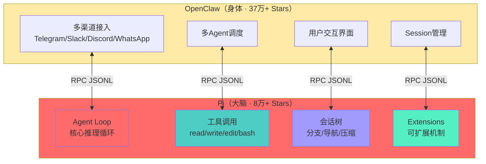

---

## 二、项目架构总览：Monorepo 四层设计

### 2.1 pi-mono 项目结构

Pi 采用 monorepo 架构（项目名 pi-mono），包含四个核心 npm 包：

| 包名 | 职责 | 类比 | 技术栈 |
|------|------|------|--------|
| **@earendil-works/pi-ai** | 统一多厂商 LLM API（OpenAI/Anthropic/Google/OpenRouter） | "神经中枢" | TypeScript |
| **@earendil-works/pi-agent-core** | Agent 运行时 + 工具调用 + 状态管理 | "大脑皮层" | TypeScript |
| **@earendil-works/pi-coding-agent** | 交互式编码代理 CLI | "手脚" | TypeScript + Bun |
| **@earendil-works/pi-tui** | 终端 UI 库（差分渲染） | "五官" | TypeScript |

> 🖼 **配图 2：Pi Monorepo 四层架构图**

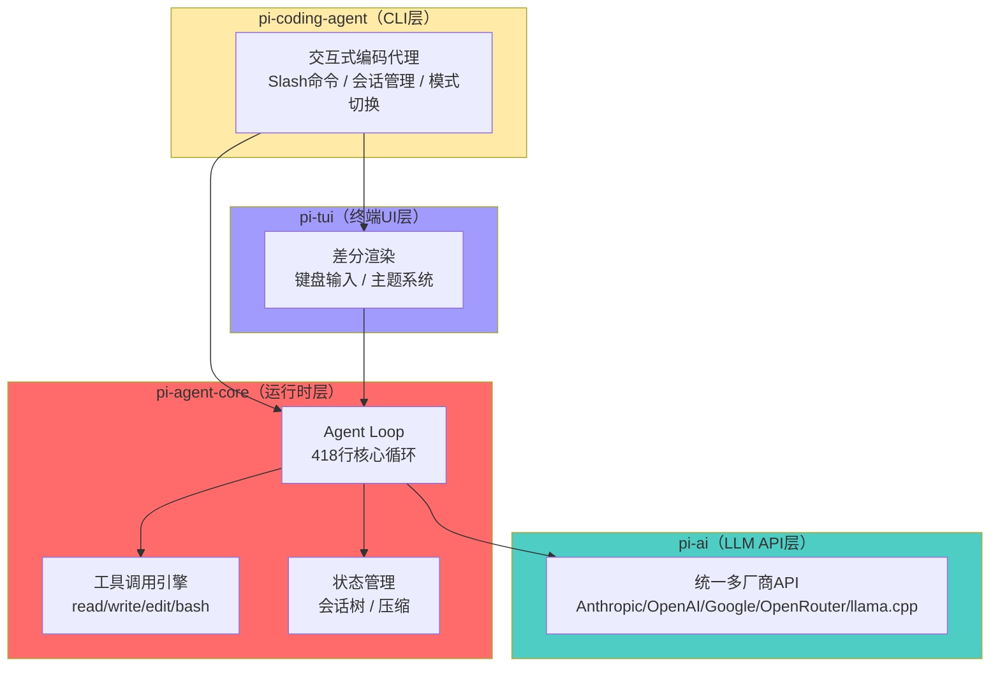

### 2.2 四种运行模式

Pi 提供四种运行模式，适应不同使用场景：

| 模式 | 说明 | 使用场景 |
|------|------|----------|
| **Interactive** | 交互式 TUI，键盘驱动 | 日常开发 |
| **Print/JSON** | 结构化事件流输出 | CI/CD集成、日志分析 |
| **RPC** | stdin/stdout JSONL 双向通信 | OpenClaw集成 |
| **SDK** | Node.js API 嵌入 | 自定义应用 |

---

## 三、核心机制一：四大工具设计

### 3.1 Pi 的四个核心工具

Pi 只内置四个工具，这是其极简主义的核心体现。所有编码操作都通过这四个工具完成：

| 工具 | 功能 | 设计意图 |
|------|------|----------|
| **read** | 读取文件内容 | 统一文件读取入口 |
| **write** | 创建或覆盖文件 | 统一文件写入入口 |
| **edit** | 精确文本替换（基于 diff） | 安全的局部修改 |
| **bash** | 执行 shell 命令 | 唯一的外部命令入口 |

对比 Claude Code 的 20+ 专用工具（文件读取、搜索、替换、终端、浏览器、GitHub API 等），Pi 的哲学是：**bash 可以做一切事，LLM 已经知道 bash 命令怎么用。**

### 3.2 bash 工具：唯一的"万能工具"

bash 是 Pi 唯一的执行外部命令的工具。所有 Git 操作、npm install、测试运行、服务启动等都通过它完成。

**为什么不需要更多内置工具？**

```
┌────────────────────────────────────────────────────┐
│  Pi 工具设计原则                                    │
├────────────────────────────────────────────────────┤
│  1. bash 可以做一切事                                │
│  2. 专用工具 = 更多维护成本 + 更复杂的 system prompt │
│  3. LLM 已经知道 bash 命令怎么用                     │
│  4. 需要安全限制？用 Extension 拦截即可              │
│  5. 需要新工具？自己注册一个                         │
└────────────────────────────────────────────────────┘
```

### 3.3 edit 工具：精确文本替换

与 Claude Code 的"写整个文件"不同，Pi 的 edit 工具采用**精确文本替换**策略，基于 diff 实现安全的局部修改：

```typescript
// edit 工具的参数结构（概念模型）
interface EditParams {
  path: string;            // 文件路径
  edits: Array<{
    oldText: string;       // 要替换的原文（必须在文件中唯一匹配）
    newText: string;       // 替换后的内容
  }>;
}
```

这种设计的优势：

| 维度 | write（写整个文件） | edit（精确替换） |
|------|---------------------|------------------|
| **安全性** | 低（可能覆盖未预期的内容） | 高（只修改指定区域） |
| **效率** | 低（传输整个文件） | 高（只传输差异） |
| **LLM 负担** | 高（需要重写整个文件） | 低（只关注修改区域） |
| **冲突风险** | 高（可能丢失用户修改） | 低（精确匹配） |

> 🖼 **配图 3：四大工具交互时序图**

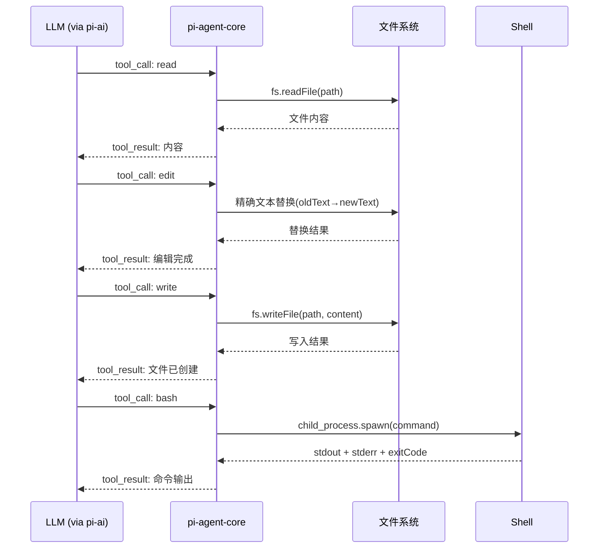

---

## 四、核心机制二：Agent Loop 实现

### 4.1 418行核心循环

Pi 的 Agent Loop 核心逻辑仅 418 行 TypeScript 代码。这是其极简主义的极致体现——用最少的代码实现完整的 Agent 推理-执行循环。

> 🖼 **配图 4：Agent Loop 核心流程图**

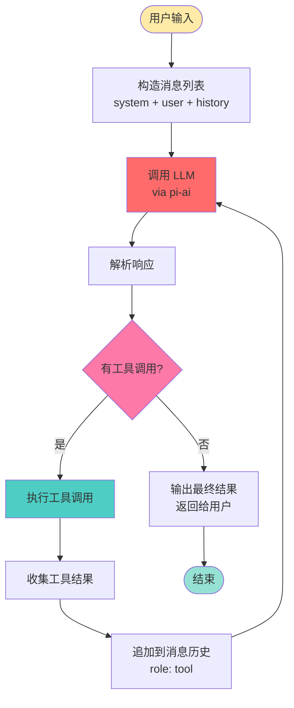

### 4.2 Agent Loop 伪代码

```typescript
// pi-agent-core Agent Loop 核心伪代码
async function agentLoop(messages: Message[]): Promise<FinalResult> {
  while (true) {
    // 1. 调用 LLM
    const response = await llm.chat(messages);
    
    // 2. 解析响应：检查是否有工具调用
    const toolCalls = parseToolCalls(response);
    
    if (!toolCalls || toolCalls.length === 0) {
      // 没有工具调用 → LLM 给出最终回复
      return {
        type: "final",
        content: response.text,
      };
    }
    
    // 3. 执行每个工具调用
    const toolResults = [];
    for (const toolCall of toolCalls) {
      // 触发 tool_call 事件（Extension 可拦截）
      const interception = await emitEvent("tool_call", toolCall);
      if (interception?.blocked) {
        toolResults.push({
          toolCallId: toolCall.id,
          content: interception.reason,
          isError: true,
        });
        continue;
      }
      
      // 执行工具
      const tool = registry.get(toolCall.name);
      const result = await tool.execute(toolCall.input);
      
      // 触发 tool_result 事件（Extension 可修改）
      const modified = await emitEvent("tool_result", result);
      toolResults.push(modified ?? result);
    }
    
    // 4. 将工具结果追加到消息历史
    for (const result of toolResults) {
      messages.push({
        role: "tool",
        toolCallId: result.toolCallId,
        content: result.content,
      });
    }
    
    // 5. 继续下一轮循环
  }
}
```

### 4.3 事件驱动架构

Pi 的 Agent Loop 采用**事件驱动**设计，通过丰富的生命周期事件实现扩展。这是 Pi 可扩展性的核心。

> 🖼 **配图 5：事件驱动生命周期图**

```mermaid
flowchart TD
    Start[pi 启动] --> ProjTrust[project_trust]
    ProjTrust --> SessStart[session_start]
    SessStart --> ResDiscover[resources_discover]
    
    ResDiscover --> UserPrompt[用户发送提示]
    UserPrompt --> InputEvt[input 事件<br/>可拦截/转换]
    InputEvt --> BeforeAgent[before_agent_start<br/>可注入消息/修改系统提示]
    BeforeAgent --> AgentStart[agent_start]
    
    AgentStart --> MsgStart[message_start]
    MsgStart --> TurnStart[turn_start]
    
    TurnStart --> ContextEvt[context 事件<br/>可修改消息]
    ContextEvt --> BeforeReq[before_provider_request<br/>可检查/替换请求]
    BeforeReq --> AfterResp[after_provider_response]
    AfterResp --> ToolExecStart[tool_execution_start]
    
    ToolExecStart --> ToolCallEvt[tool_call 事件<br/>可拦截/阻止]
    ToolCallEvt --> ToolExecUpdate[tool_execution_update]
    ToolExecUpdate --> ToolResultEvt[tool_result 事件<br/>可修改结果]
    ToolResultEvt --> ToolExecEnd[tool_execution_end]
    
    ToolExecEnd --> HasMore{还有工具调用?}
    HasMore -->|是| TurnStart
    HasMore -->|否| MsgEnd[message_end]
    
    MsgEnd --> Compaction[compaction<br/>会话压缩]
    Compaction --> SessEnd[session_end]
    
    style Start fill:#FFEAA7
    style ToolCallEvt fill:#FF6B6B
    style ToolResultEvt fill:#4ECDC4
    style Compaction fill:#A29BFE
    style SessEnd fill:#95E1D3
```

**关键事件分类：**

| 类别 | 事件 | 扩展能力 |
|------|------|----------|
| **生命周期** | project_trust, session_start, session_end | 初始化/清理资源 |
| **输入处理** | input, before_agent_start | 拦截/转换用户输入 |
| **Agent 执行** | agent_start, message_start/end | 注入上下文 |
| **Turn 循环** | turn_start, context | 修改消息列表 |
| **工具调用** | tool_call, tool_result | **拦截/阻止/修改工具调用** |
| **Provider** | before_provider_request, after_provider_response | 检查/替换 API 请求 |
| **资源** | resources_discover | 自定义资源发现 |

---

## 五、核心机制三：会话树（Session Tree）

### 5.1 树形会话设计

Pi 的会话采用**树形结构**存储，而非传统的线性列表。这是 Pi 区别于其他编码代理的关键设计。

> 🖼 **配图 6：会话树结构图**

```mermaid
graph TD
    Root[Root Session<br/>初始对话]
    
    Root --> A[Branch A<br/>"实现用户认证"]
    Root --> B[Branch B<br/>"实现支付模块"]
    Root --> C[Branch C<br/>"重构数据库层"]
    
    A --> A1[A1: 完成认证<br/>✅ 成功]
    A --> A2[A2: 添加OAuth<br/>⚠️ 遇到问题]
    A --> A3[A3: 简化方案<br/>✅ 成功]
    
    A2 --> A2_1[A2-1: 尝试方案1<br/>❌ 失败]
    A2 --> A2_2[A2-2: 尝试方案2<br/>✅ 成功]
    
    B --> B1[B1: Stripe集成<br/>✅ 成功]
    B --> B2[B2: 支付宝集成<br/>✅ 成功]
    
    style Root fill:#FF6B6B
    style A fill:#4ECDC4
    style A2 fill:#FFEAA7
    style A2_1 fill:#FF6B6B
    style A2_2 fill:#95E1D3
    style B fill:#4ECDC4
    style C fill:#4ECDC4
```

**关键特性：**

| 特性 | 说明 |
|------|------|
| **单文件存储** | 所有分支存储在单个 JSONL 文件中 |
| **`/tree` 导航** | 在会话树中上下切换，从任何分支点继续 |
| **消息过滤** | 按消息类型过滤（工具调用、结果、文本） |
| **书签标记** | 标记重要节点为书签 |
| **HTML 导出** | `/export` 导出为可读 HTML |
| **Gist 分享** | `/share` 上传到 GitHub Gist，生成可分享 URL |

### 5.2 会话压缩（Compaction）

当会话过长时，Pi 会自动进行上下文压缩，防止 token 溢出：

> 🖼 **配图 7：会话压缩流程图**

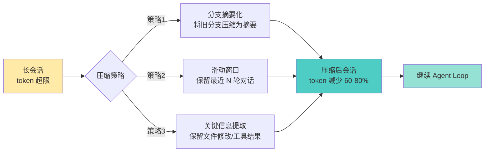

---

## 六、核心机制四：Extensions 扩展系统

### 6.1 Extensions 设计哲学

> "Pi ships with powerful defaults but skips features like sub-agents and plan mode. Ask Pi to build what you want, or install a package that does it your way."

Pi 不内置复杂功能，而是通过 **TypeScript Extensions** 实现一切扩展。Extensions 是 TypeScript 模块，在运行时通过 [jiti](https://github.com/unjs/jiti) 加载，无需编译：

| 扩展能力 | 说明 | 示例 |
|----------|------|------|
| **Custom Tools** | 注册 LLM 可调用的自定义工具 | 新增浏览器控制工具 |
| **Event Interception** | 拦截/修改工具调用、注入上下文 | 权限门控 |
| **User Interaction** | 通过 `ctx.ui` 与用户交互 | 确认对话框 |
| **Custom Commands** | 注册 `/mycommand` 类命令 | `/deploy` 部署命令 |
| **Session Persistence** | 持久化状态，重启后保留 | 配置缓存 |
| **Custom Rendering** | 控制 TUI 渲染方式 | 自定义工具输出格式 |

### 6.2 Extension 示例代码

```typescript
import type { ExtensionAPI } from "@earendil-works/pi-coding-agent";
import { Type } from "typebox";

export default function (pi: ExtensionAPI) {
  // 1. 事件订阅：会话启动时通知用户
  pi.on("session_start", async (_event, ctx) => {
    ctx.ui.notify("Extension loaded!", "info");
  });

  // 2. 工具调用拦截：安全护栏（权限门控）
  pi.on("tool_call", async (event, ctx) => {
    if (event.toolName === "bash" && event.input.command?.includes("rm -rf")) {
      const ok = await ctx.ui.confirm("⚠️ 危险操作!", "允许执行 rm -rf?");
      if (!ok) return { block: true, reason: "用户拒绝" };
    }
  });

  // 3. 注册自定义工具
  pi.registerTool({
    name: "greet",
    label: "Greet",
    description: "按名称打招呼",
    parameters: Type.Object({
      name: Type.String({ description: "要打招唿的名称" }),
    }),
    async execute(toolCallId, params, signal, onUpdate, ctx) {
      return {
        content: [{ type: "text", text: `Hello, ${params.name}!` }],
        details: {},
      };
    },
  });

  // 4. 注册自定义命令
  pi.registerCommand("hello", {
    description: "说你好",
    handler: async (args, ctx) => {
      ctx.ui.notify(`Hello ${args || "world"}!`, "info");
    },
  });
}
```

> 🖼 **配图 8：Extension 加载与事件流图**

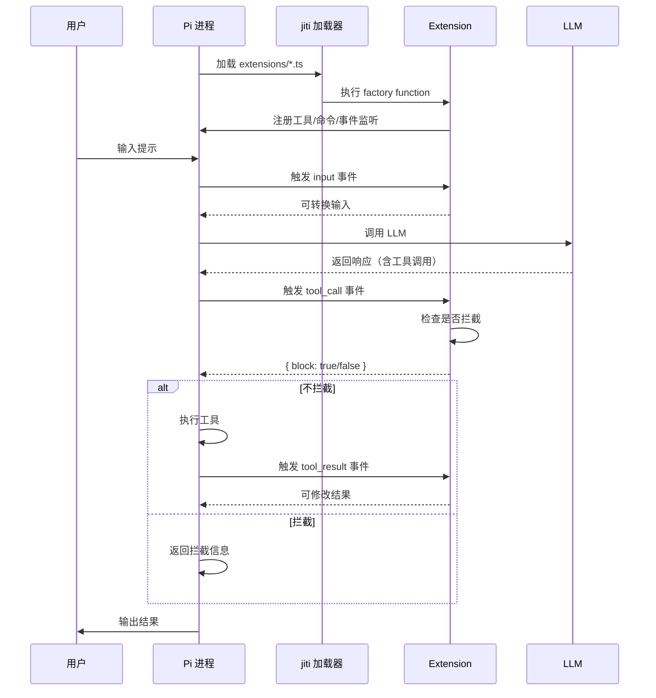

### 6.3 扩展位置与热重载

| 位置 | 作用域 | 热重载 |
|------|--------|--------|
| `~/.pi/agent/extensions/*.ts` | 全局（所有项目） | `/reload` 热重载 |
| `.pi/extensions/*.ts` | 项目级 | `/reload` 热重载 |
| `pi -e ./path.ts` | 临时测试 | 不热重载 |

**Extension 组织方式：**

```
# 单文件扩展
~/.pi/agent/extensions/
└── permission-gate.ts

# 目录扩展（多文件）
~/.pi/agent/extensions/
└── git-checkpoint/
    ├── index.ts        # 入口（导出 default function）
    ├── git-tools.ts    # 辅助模块
    └── utils.ts        # 工具函数

# 带依赖的扩展（包）
~/.pi/agent/extensions/
└── browser-control/
    ├── package.json    # 声明依赖
    ├── package-lock.json
    ├── node_modules/
    └── src/
        └── index.ts
```

### 6.4 典型扩展场景

| 场景 | 实现方式 | 代码复杂度 |
|------|----------|-----------|
| **权限门控** | 拦截 `rm -rf`/`sudo` 等危险命令 | <50行 |
| **Git Checkpoint** | 每轮自动 stash，失败时恢复 | <100行 |
| **路径保护** | 阻止写入 `.env`/`node_modules/` | <30行 |
| **自定义压缩** | 自定义对话摘要逻辑 | <80行 |
| **状态工具** | Todo列表/连接池 | <100行 |
| **外部集成** | 文件监听/webhook/CI触发 | <150行 |
| **等待小游戏** | 蛇形游戏等 | <200行 |

---

## 七、核心机制五：统一 LLM API（pi-ai）

### 7.1 多厂商 API 统一接入

Pi 通过 `pi-ai` 包实现对多个 LLM 厂商的统一接入，屏蔽各厂商 API 差异：

| 厂商 | API类型 | 认证方式 | 说明 |
|------|---------|----------|------|
| **Anthropic** | Claude | API Key / Subscription | 主力模型 |
| **OpenAI** | GPT/o系列 | API Key | 备用模型 |
| **Google** | Gemini | API Key | 轻量推理 |
| **OpenRouter** | 多模型聚合 | API Key | 模型路由器 |
| **llama.cpp** | 本地模型 | 本地运行 | 离线推理 |

> 🖼 **配图 9：pi-ai 多厂商统一 API 架构图**

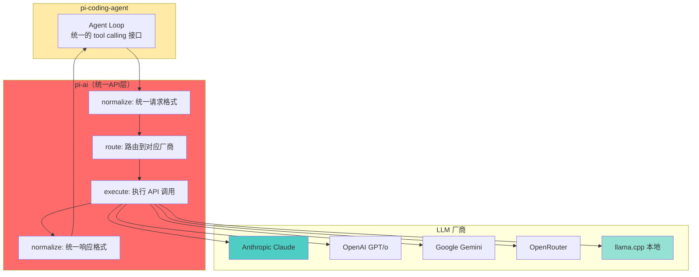

### 7.2 本地模型支持

Pi 支持通过 llama.cpp 运行本地模型，实现完全离线推理：

- `/llama` 命令管理本地模型（加载、卸载、切换）
- 支持 OpenAI 兼容 API 格式
- 可与远程模型混合使用（不同任务路由到不同模型）

### 7.3 自定义 Provider 注册

Extension 可以在启动时动态注册自定义 Provider：

```typescript
export default async function (pi: ExtensionAPI) {
  const response = await fetch("http://localhost:1234/v1/models");
  const payload = (await response.json()) as {
    data: Array<{
      id: string;
      name?: string;
      context_window?: number;
      max_tokens?: number;
    }>;
  };

  pi.registerProvider("local-openai", {
    baseUrl: "http://localhost:1234/v1",
    apiKey: "$LOCAL_OPENAI_API_KEY",
    api: "openai-completions",
    models: payload.data.map((model) => ({
      id: model.id,
      name: model.name ?? model.id,
      reasoning: false,
      input: ["text"],
      cost: { input: 0, output: 0, cacheRead: 0, cacheWrite: 0 },
      contextWindow: model.context_window ?? 128000,
      maxTokens: model.max_tokens ?? 4096,
    })),
  });
}
```

---

## 八、安全与沙箱设计

### 8.1 Pi 的安全哲学

> "Pi does not include a built-in permission system. By default, it runs with the permissions of the user and process that launched it."

Pi **不自带权限系统**，默认以启动用户的完整权限运行。这是极简主义设计的体现——权限控制不是核心功能，而是扩展功能。

如果需要更强的安全边界，Pi 提供三种沙箱方案：

### 8.2 三种沙箱方案

| 沙箱模式 | 原理 | 适用场景 | 安全级别 |
|----------|------|----------|----------|
| **Gondolin** | Linux 微VM隔离，默认拒绝网络 | 生产环境 | ⭐⭐⭐⭐⭐ |
| **Docker** | 容器隔离，完整文件系统隔离 | 开发环境 | ⭐⭐⭐⭐ |
| **OpenShell** | 策略控制沙箱，细粒度权限 | 企业环境 | ⭐⭐⭐⭐ |

> 🖼 **配图 10：Gondolin 微VM沙箱架构图**

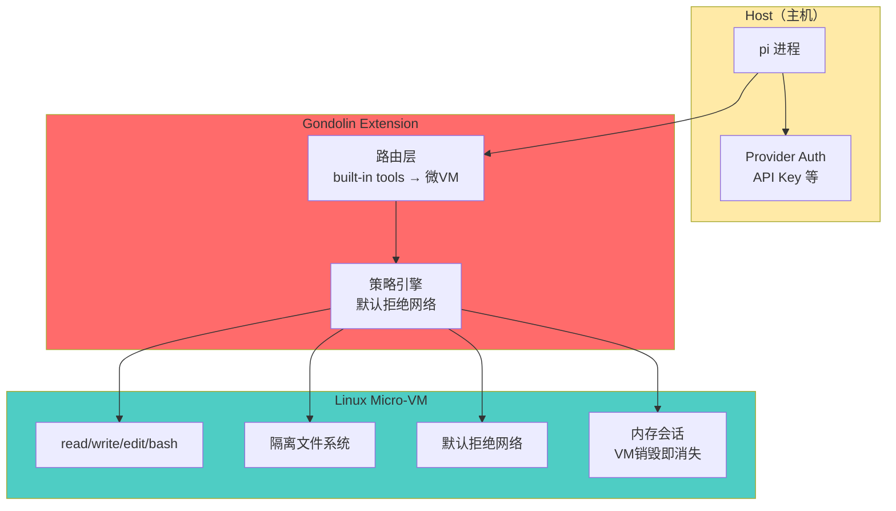

### 8.3 通过 Extension 实现权限门控

对于不需要完整沙箱的场景，可以用简单的 Extension 实现权限门控：

```typescript
// 权限门控 Extension（<50行）
import type { ExtensionAPI } from "@earendil-works/pi-coding-agent";

export default function (pi: ExtensionAPI) {
  const dangerousCommands = ["rm -rf", "sudo", "git push --force", "mkfs"];
  
  pi.on("tool_call", async (event, ctx) => {
    if (event.toolName !== "bash") return;
    
    const cmd = event.input.command || "";
    const isDangerous = dangerousCommands.some(d => cmd.includes(d));
    
    if (isDangerous) {
      const ok = await ctx.ui.confirm(
        "⚠️ 危险操作",
        `允许执行: ${cmd}?`
      );
      if (!ok) {
        return { block: true, reason: "用户拒绝执行危险命令" };
      }
    }
  });
  
  // 路径保护：阻止写入敏感文件
  pi.on("tool_call", async (event, ctx) => {
    if (event.toolName === "write" || event.toolName === "edit") {
      const path = event.input.path || "";
      const blocked = [".env", "node_modules/", ".git/"];
      
      if (blocked.some(b => path.includes(b))) {
        return { block: true, reason: `禁止写入受保护路径: ${path}` };
      }
    }
  });
}
```

---

## 九、RPC 模式：OpenClaw 的底层通信协议

### 9.1 RPC 模式工作原理

Pi 的 RPC 模式通过 **stdin/stdout JSONL** 实现进程间通信。这是 OpenClaw 集成 Pi 的底层协议。

> 🖼 **配图 11：RPC 通信时序图**

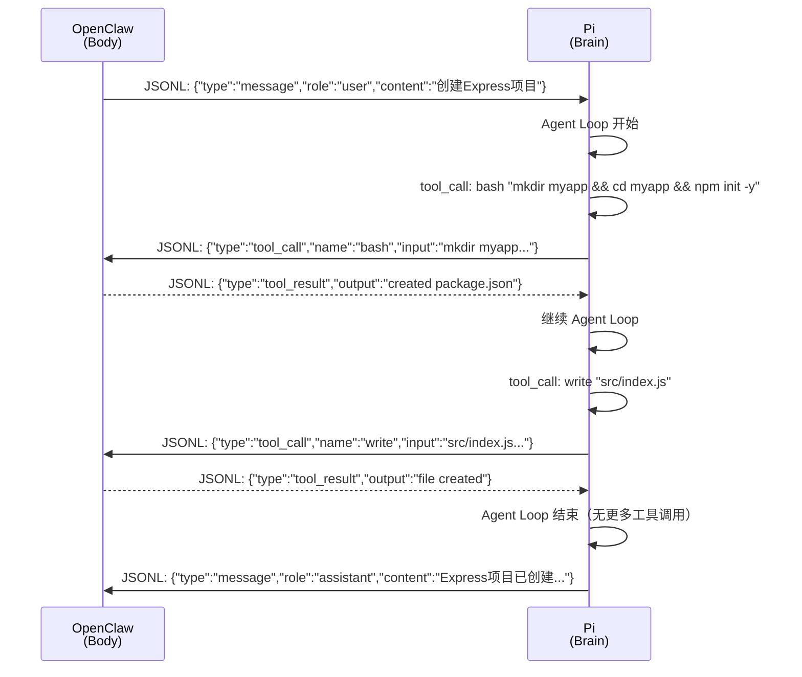

### 9.2 JSONL 消息格式

```json
// 用户消息
{"type": "message", "role": "user", "content": "创建一个Express项目"}

// 工具调用
{"type": "tool_call", "id": "tc1", "name": "bash", "input": {"command": "npm init -y"}}

// 工具结果
{"type": "tool_result", "id": "tc1", "output": "created package.json", "exitCode": 0}

// 助手回复
{"type": "message", "role": "assistant", "content": "Express项目已创建，包含以下文件..."}
```

**RPC 模式的优势：**

| 优势 | 说明 |
|------|------|
| **解耦** | OpenClaw 与 Pi 独立进程，可分别升级 |
| **简单** | JSONL 协议，无需复杂序列化 |
| **双向** | stdin 发送请求，stdout 接收响应 |
| **流式** | 支持流式输出，用户可实时看到进度 |

---

## 十、总结：极简主义的胜利

### 10.1 Pi 的核心设计总结

| 核心机制 | 设计哲学 | 代码量 | 关键词 |
|----------|----------|--------|--------|
| **四大工具** | bash 可以做一切事 | 极简 | read/write/edit/bash |
| **Agent Loop** | 最简推理-执行循环 | 418行 | while + tool_call + loop |
| **会话树** | 单文件存储所有分支 | 高效 | JSONL / tree / compaction |
| **Extensions** | 按需扩展，不预设功能 | 灵活 | TypeScript / events / hot-reload |
| **统一LLM API** | 多厂商统一接入 | 通用 | normalize / route / execute |
| **安全沙箱** | 不自带权限，外部隔离 | 安全 | Gondolin / Docker / OpenShell |

### 10.2 Pi vs 其他编码代理

> 🖼 **配图 12：Pi vs Claude Code vs Cursor 对比表**

| 维度 | Pi | Claude Code | Cursor |
|------|----|-------------|--------|
| **核心工具数** | 4个（极简） | 20+（内置） | 15+（IDE集成） |
| **System Prompt** | <1,000 tokens | >10,000 tokens | 不公开 |
| **核心代码量** | 418行循环 | 数千行 | 闭源 |
| **可扩展性** | ⭐⭐⭐⭐⭐（Extensions） | ⭐⭐⭐（有限） | ⭐⭐（IDE插件） |
| **多模型支持** | ⭐⭐⭐⭐⭐（5+厂商+本地） | ⭐⭐⭐⭐（Anthropic为主） | ⭐⭐（OpenAI为主） |
| **离线支持** | ✅（llama.cpp） | ❌ | 部分 |
| **会话管理** | 树形（分支/导航） | 线性 | 线性 |
| **价格** | 开源免费（MIT） | 付费 | 付费 |
| **GitHub Stars** | 80,000+ | — | — |
| **学习成本** | ⭐⭐⭐⭐⭐（极低） | ⭐⭐⭐ | ⭐⭐ |

### 10.3 Pi 给 Agent 框架设计的启示

1. **极简核心 > 功能堆砌**：418行核心循环证明了最少代码也能做出强大工具
2. **扩展机制 > 内置功能**：通过事件驱动的 Extensions 实现按需扩展
3. **bash 是万能工具**：与其内置20+专用工具，不如用好 bash
4. **解耦架构**：Pi（大脑）+ OpenClaw（身体）的分离是微服务思维在 Agent 领域的体现
5. **用户信任 > 安全限制**：不自带权限系统，让用户自己决定安全级别

> 🖼 **配图 13：Pi 核心架构全景图**

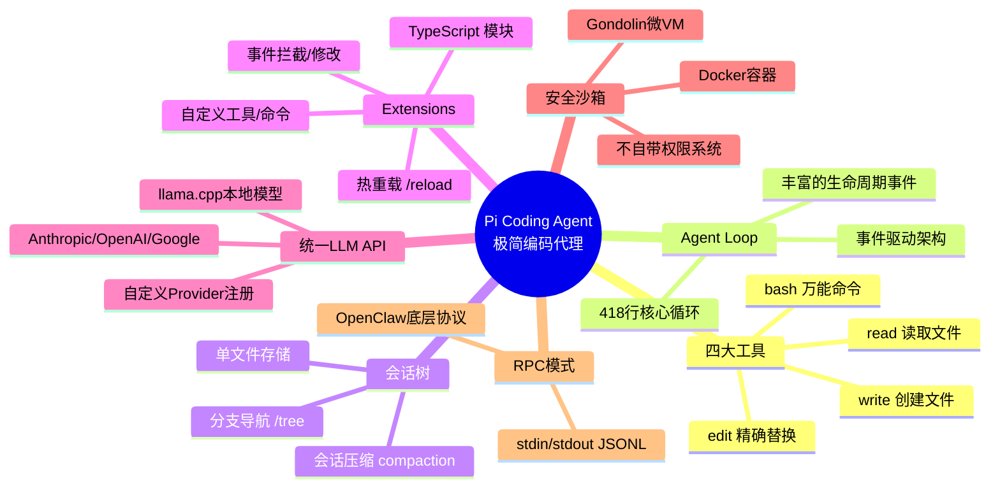

---

## 附录

### A. 关键术语表

| 术语 | 说明 |
|------|------|
| **Pi / pi-mono** | Mario Zechner（badlogic）创建的极简开源AI编码代理框架，libGDX 创建者的新项目 |
| **Agent Loop** | Agent 核心循环：LLM调用 → 解析工具调用 → 执行工具 → 循环，直到无工具调用 |
| **Session Tree** | 树形会话结构，支持分支和导航，所有分支存储在单个 JSONL 文件中 |
| **Extension** | TypeScript 扩展模块，可注册工具/命令/事件监听，运行时加载无需编译 |
| **RPC Mode** | 通过 stdin/stdout JSONL 的进程间通信模式，OpenClaw 集成 Pi 的底层协议 |
| **Gondolin** | Pi 生态的微VM安全沙箱扩展，将工具调用路由到隔离的 Linux 微VM |
| **pi-ai** | 统一多厂商 LLM API 包，屏蔽 Anthropic/OpenAI/Google 等 API 差异 |
| **pi-tui** | 终端 UI 库，支持差分渲染、键盘输入、主题系统 |
| **Compaction** | 会话压缩，防止 token 溢出，通过摘要化/滑动窗口/关键信息提取实现 |

### B. 参考链接

- Pi 官方文档：https://pi.dev
- Pi GitHub 仓库：https://github.com/earendil-works/pi
- Extensions 详细文档：https://github.com/earendil-works/pi/blob/main/packages/coding-agent/docs/extensions.md
- Armin Ronacher（mitsuhiko）博客：https://lucumr.pocoo.org/2026/1/31/pi
- Mario Zechner (badlogic) GitHub：https://github.com/badlogic
- Pi Hugging Face Session 数据：https://huggingface.co/datasets/badlogicgames/pi-mono

---

_全文完。_
