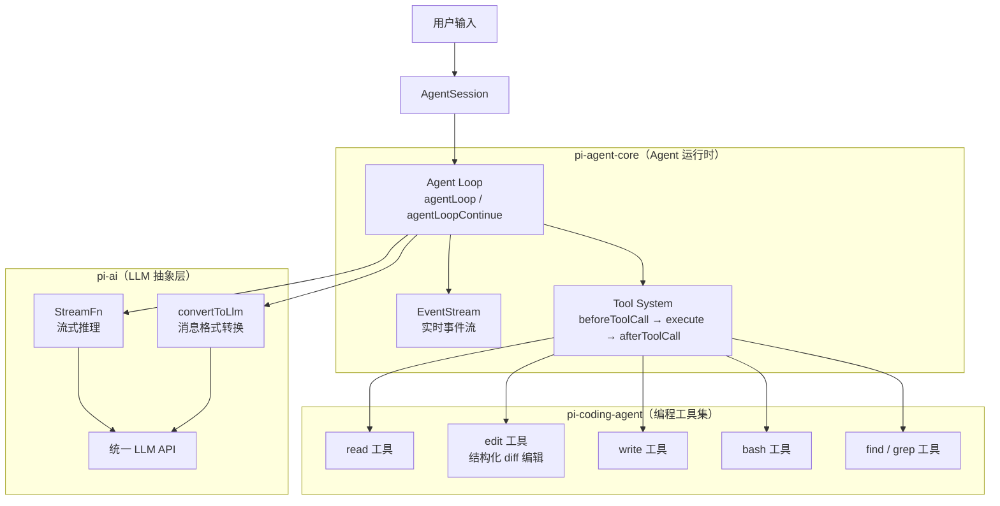
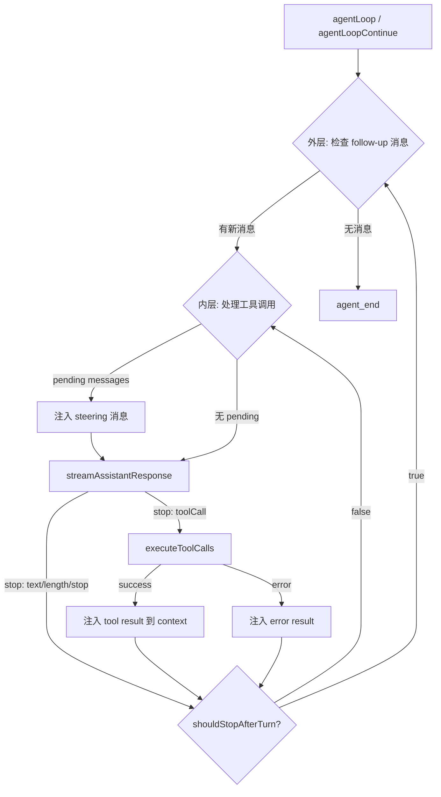
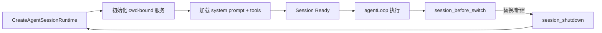

# Pi Coding Agent：核心架构设计与源码实现

> [Pi](https://github.com/earendil-works/pi/) 是一个开源的 AI Coding Agent 框架（GitHub ⭐82K+），采用 TypeScript 编写，采用 MIT 协议。本文剥离 TUI、RPC、扩展系统等外围功能，聚焦 Pi 最核心的 **Agent Loop + Tool System + Coding Tools** 三层架构，结合真实源码逐层拆解其设计哲学与工程实现。

---

## 一、引言

### 1.1 为什么是 Pi

在 AI 编程助手赛道中，Cursor、Copilot 等以 IDE 插件形态存在，深度绑定编辑器；而 Claude Code、OpenHands 等则是独立的命令行 Agent。Pi 的独特之处在于其**高度模块化的架构设计**：

- **`pi-ai`**：统一 LLM API 抽象层，屏蔽 OpenAI、Anthropic、Google 等不同厂商的 API 差异
- **`pi-agent-core`**：纯 Agent 运行时，包含事件驱动的循环引擎、工具调度系统、状态管理
- **`pi-coding-agent`**：面向编程场景的 CLI 应用，内置 read/edit/write/bash 等核心工具，以及 TUI 和会话管理

Pi 不依赖 IDE，直接在终端中运行，通过沙箱化的文件系统操作和 Shell 执行完成开发任务。其核心设计理念是：**Event-Driven Agent Loop（事件驱动的 Agent 循环）**。

### 1.2 Pi 的核心架构

```
pi-ai          → 统一 LLM API（OpenAI / Anthropic / Google / ...）
pi-agent-core  → Agent Loop + Tool System + EventStream
pi-coding-agent → 编程工具（read/edit/write/bash/find/grep）+ 会话管理
```

### 1.3 本文范围

- 聚焦核心：Agent Loop、Tool System、Coding Tools、System Prompt 构建、Session Runtime
- 结合源码：引用 `packages/agent/src/agent-loop.ts`、`packages/coding-agent/src/core/tools/edit.ts` 等真实源码
- 剥离外围：TUI 渲染、RPC 通信、扩展系统生命周期、权限沙箱、模型 fallback 机制

---

## 二、架构总览

### 2.1 核心架构图

Pi 的架构清晰地分为三层，层与层之间通过明确的接口通信：



**各层职责**：
- **pi-ai**：提供统一的 `Context`、`Message`、`Tool` 接口，以及 `streamSimple` 流式推理函数。任何 LLM 厂商只需实现该接口即可接入 Pi。
- **pi-agent-core**：核心循环引擎。不关心具体工具实现，只负责调度：调用 LLM → 解析 toolCall → 执行工具 → 注入结果 → 循环。
- **pi-coding-agent**：具体的编程工具实现。包含文件系统操作、Shell 执行、diff 计算等，将底层能力包装为 `AgentTool` 注册到 Agent Core。

### 2.2 三大核心模块职责

| 模块 | 包 | 职责 | 关键文件 |
|------|-----|------|----------|
| **Agent Loop** | `pi-agent-core` | 事件驱动的循环：LLM 调用 → 工具执行 → 结果注入 → 下一轮 | `agent-loop.ts`, `types.ts` |
| **Tool System** | `pi-agent-core` | 工具注册、参数校验、执行拦截（before/after hook）、并行/串行调度 | `types.ts` |
| **Coding Tools** | `pi-coding-agent` | 文件读写、结构化 diff 编辑、bash 执行、文件搜索 | `tools/edit.ts`, `tools/bash.ts`, `tools/read.ts` |

---

## 三、Agent Loop：事件驱动的循环引擎

### 3.1 核心循环流程

Pi 的 Agent Loop 不是简单的 `while(true)`，而是一个**双层循环 + 事件流**架构。外层负责处理 follow-up 消息（用户在 Agent 运行时中途输入的新指令），内层负责处理工具调用（LLM 返回 toolCall → 执行 → 注入结果）。



**关键设计洞察**：
- 内层循环保证 LLM 可以连续调用多个工具（如 `read` 多个文件，或 `edit` 后 `bash` 测试），直到返回纯文本回复。
- 外层循环保证用户在 Agent 执行长任务时，可以中途插入新指令（steering message），而不必等待当前任务结束。

### 3.2 核心源码拆解

**`agentLoop` 函数签名**（`packages/agent/src/agent-loop.ts`）：
```typescript
export function agentLoop(
    prompts: AgentMessage[],       // 用户输入消息
    context: AgentContext,         // 当前上下文（含历史消息、工具、系统提示）
    config: AgentLoopConfig,       // 循环配置（模型、工具、hook 等）
    signal: AbortSignal | undefined,
    streamFn: StreamFn,           // LLM 流式推理函数
): EventStream<AgentEvent, AgentMessage[]>
```

**`AgentLoopConfig` 关键配置**（`packages/agent/src/types.ts`）：
```typescript
interface AgentLoopConfig {
    model: Model<Api>;                          // LLM 模型
    tools?: AgentTool[];                        // 可用工具列表
    toolExecutionMode?: "sequential" | "parallel"; // 工具执行模式
    getSteeringMessages?: () => Promise<AgentMessage[]>; //  Steering 消息（用户中途输入）
    getFollowUpMessages?: () => Promise<AgentMessage[]>; // Follow-up 消息
    beforeToolCall?: (ctx: BeforeToolCallContext) => Promise<BeforeToolCallResult>;
    afterToolCall?: (ctx: AfterToolCallContext) => Promise<AfterToolCallResult>;
    shouldStopAfterTurn?: (ctx: TurnContext) => Promise<boolean>;
    transformContext?: (messages: AgentMessage[], signal) => Promise<AgentMessage[]>;
    convertToLlm?: (messages: AgentMessage[]) => Promise<Message[]>;
}
```

**主循环核心逻辑**（`runLoop` 函数内部）：
```typescript
async function runLoop(...): Promise<void> {
    let hasMoreToolCalls = true;
    while (hasMoreToolCalls || pendingMessages.length > 0) {
        // 1. 注入 steering 消息（用户中途输入）
        if (pendingMessages.length > 0) {
            for (const message of pendingMessages) {
                currentContext.messages.push(message);
            }
            pendingMessages = [];
        }

        // 2. 流式调用 LLM
        const message = await streamAssistantResponse(currentContext, config, signal, emit, streamFunction);
        
        // 3. 检查停止原因
        if (message.stopReason === "error" || message.stopReason === "aborted") return;

        // 4. 提取 toolCalls
        const toolCalls = message.content.filter((c) => c.type === "toolCall");
        hasMoreToolCalls = false;

        if (toolCalls.length > 0) {
            // 5. 执行工具（支持并行/串行）
            const executedToolBatch = await executeToolCalls(currentContext, message, config, signal, emit);
            toolResults.push(...executedToolBatch.messages);
            hasMoreToolCalls = !executedToolBatch.terminate; // 如果工具返回 terminate=true，则停止

            // 6. 将工具结果注入上下文
            for (const result of toolResults) {
                currentContext.messages.push(result);
            }
        }

        // 7. 检查是否应该停止本轮
        if (await config.shouldStopAfterTurn?.({ message, toolResults, context: currentContext })) {
            return;
        }

        // 8. 准备下一轮（可能动态切换模型/工具）
        const nextTurnSnapshot = await config.prepareNextTurn?.({ ... });
        if (nextTurnSnapshot) {
            currentContext = nextTurnSnapshot.context;
            // 更新模型、思考等级等
        }

        // 9. 检查是否有新的 follow-up 消息
        pendingMessages = (await config.getSteeringMessages?.()) || [];
    }
}
```

### 3.3 事件流（EventStream）设计

Pi 使用 `EventStream<AgentEvent, AgentMessage[]>` 实现实时事件推送。前端（TUI/CLI/Web）订阅事件流即可渲染进度，无需轮询。

**核心事件类型**：
| 事件 | 含义 | 触发时机 |
|------|------|----------|
| `agent_start` | Agent 开始执行 | 进入循环前 |
| `turn_start` | 新一轮 LLM 调用 | 每次 LLM 调用前 |
| `message_start/update/end` | LLM 流式输出 | 文本/工具调用生成中 |
| `tool_execution_start/end` | 工具执行 | 工具调用前后 |
| `turn_end` | 本轮完成 | LLM + 工具执行完毕 |
| `agent_end` | Agent 结束，携带完整消息历史 | 循环退出 |

`EventStream` 的巧妙之处在于它是一个**泛型流**：输入是 `AgentEvent`，当流结束时，输出是 `AgentMessage[]`（完整的对话历史）。这使得调用方既可以实时消费事件，又可以在结束后拿到完整结果。

---

## 四、Tool System：工具注册与执行拦截

### 4.1 工具执行生命周期

Pi 的工具系统不是简单的“调用函数”，而是包含完整的生命周期钩子（Hook），支持拦截、修改、审计。

```mermaid
sequenceDiagram
    participant Loop as Agent Loop
    participant Hook as beforeToolCall
    participant Tool as Tool Executor
    participant After as afterToolCall
    participant Ctx as Context

    Loop->>Loop: LLM 返回 toolCall
    Loop->>Hook: beforeToolCall(toolCall, args)
    alt 拦截 (block: true)
        Hook-->>Loop: { block: true, reason: "..." }
        Loop->>Ctx: 注入 error tool result
    else 放行 (block: false)
        Hook-->>Loop: { block: false }
        Loop->>Tool: tool.execute(args)
        Tool-->>Loop: { success, output }
        Loop->>After: afterToolCall(toolCall, result)
        After-->>Loop: { content?, terminate? }
        Loop->>Ctx: 注入 tool result
    end
```

**Hook 的作用**：
- **`beforeToolCall`**：可用于权限检查（如拦截 `rm -rf /`）、参数修正、缓存命中跳过执行。
- **`afterToolCall`**：可用于修改工具返回内容（如脱敏）、触发副作用（如自动 commit）、或设置 `terminate: true` 提前结束循环。

### 4.2 工具执行模式

| 模式 | 行为 | 适用场景 |
|------|------|----------|
| **`sequential`** | 逐个执行：准备 → 执行 → 完成 → 下一个 | 工具间有依赖关系（如先 `read` 再 `edit`） |
| **`parallel`** | 批量准备 → 并发执行 → 按完成顺序返回 | 独立工具调用（如同时 `read` 多个不相关文件） |

源码中，并行执行通过 `Promise.all` 实现，但**结果注入顺序**严格按照 LLM 返回的 toolCall 顺序，确保 LLM 上下文中的 toolResult 顺序与请求顺序一致，避免上下文错乱。

### 4.3 AgentTool 接口设计

```typescript
interface AgentTool {
    name: string;                           // 工具名（如 "edit", "bash"）
    description: string;                    // 工具描述（注入系统提示）
    parameters: TSchema;                    // JSON Schema（TypeBox 定义）
    execute: (args: unknown, signal?) => Promise<ToolExecutionResult>;
    render?: { ... };                       // TUI 渲染组件（可选）
}
```

参数校验使用 `@sinclair/typebox`，在工具执行前自动校验 LLM 返回的参数是否符合 Schema，不符合则直接返回错误，不执行工具。

---

## 五、Coding Tools：编程核心工具实现

### 5.1 工具总览

Pi 为编程场景内置了 6 个核心工具，覆盖了开发者的日常操作：

| 工具 | 功能 | 核心文件 | 关键特性 |
|------|------|----------|----------|
| **read** | 读取文件内容 | `tools/read.ts` | 路径解析、截断控制、语法高亮提示 |
| **edit** | 结构化 diff 编辑 | `tools/edit.ts` | 非覆盖式编辑、diff 预览、行尾保留、冲突检测 |
| **write** | 写入/创建文件 | `tools/write.ts` | 全量覆盖、目录自动创建 |
| **bash** | 执行 shell 命令 | `tools/bash.ts` | 超时控制、输出截断、cwd 限制、交互式命令拦截 |
| **find** | 文件搜索 | `tools/find.ts` | glob 匹配、递归搜索、忽略 .git 等 |
| **grep** | 内容搜索 | `tools/grep.ts` | 正则匹配、上下文行输出 |

### 5.2 `edit` 工具：结构化 diff 编辑（核心差异化）

`edit` 是 Pi 最具特色的工具。与传统 Coding Agent 直接覆盖整个文件不同，Pi 采用**结构化精准编辑**：LLM 只需提供要替换的原文本（`oldText`）和新文本（`newText`），系统负责精确匹配、冲突检测、diff 生成。

**输入 Schema**（`packages/coding-agent/src/core/tools/edit.ts`）：
```typescript
const editSchema = Type.Object({
    path: Type.String({ description: "文件路径（相对或绝对）" }),
    edits: Type.Array(Type.Object({
        oldText: Type.String({ 
            description: "精确匹配原文本。必须在原文件中唯一，且不能与其他 edit 重叠。" 
        }),
        newText: Type.String({ description: "替换为新文本" }),
    }), { 
        description: "一个或多个精准替换。每个 edit 独立匹配原文件，不增量应用。禁止重叠或嵌套 edits。" 
    }),
});
```

**核心编辑流程**：
```
1. readFile → 获取文件原始内容
2. normalizeToLF → 统一行尾为 LF（处理 Windows CRLF 兼容）
3. stripBom → 移除字节序标记（BOM）
4. 对每个 edit: 
   a. 查找 oldText 在原文中的精确位置
   b. 若未找到或找到多个 → 报错返回
   c. 检测与其他 edit 的重叠区域 → 重叠则报错
5. applyEditsToNormalizedContent → 应用所有 edits（从后往前替换避免偏移）
6. restoreLineEndings → 恢复原文件行尾格式（CRLF/LF）
7. computeEditsDiff → 生成统一 diff 字符串
8. writeFile → 写回文件
9. 返回 diff 和变更行号给 LLM
```

**为什么用 `edit` 而不是 `write`？**
| 维度 | `write`（全量覆盖） | `edit`（结构化 diff） |
|------|-------------------|---------------------|
| **代码丢失风险** | 高（LLM 可能漏写未提及的代码） | 极低（只修改指定部分） |
| **Token 消耗** | 高（需输出完整文件内容） | 低（只输出变更部分） |
| **LLM 难度** | 高（需保持缩进、格式一致） | 低（只需提供匹配文本） |
| **反馈质量** | 无（覆盖后无法直观对比） | 高（返回 diff，LLM 可自查） |

**文件并发写入保护（`file-mutation-queue`）**：
```typescript
// 防止多个 edit/write 工具同时修改同一文件导致竞态条件
export async function withFileMutationQueue<T>(
    filePath: string,
    fn: () => Promise<T>
): Promise<T> {
    // 为每个文件维护一个独立的 Promise 队列
    // 同一文件的写操作串行化，不同文件可并发
    const queue = fileQueues.get(filePath) ?? Promise.resolve();
    const next = queue.then(() => fn());
    fileQueues.set(filePath, next);
    return next;
}
```

### 5.3 `bash` 工具：命令执行与安全控制

```typescript
const bashSchema = Type.Object({
    command: Type.String({ description: "要执行的 shell 命令" }),
});
```

**安全控制**：
- **`cwd` 限制**：命令在工作目录内执行，防止越权访问
- **超时控制**：默认 300s 超时，超时后强制 kill 进程树
- **输出截断**：单命令输出限制为 100KB，超出部分追加 `... (output truncated)`
- **交互式命令拦截**：检测到 `vim`、`nano`、`ssh` 等交互式命令时，返回错误提示使用其他工具
- **输出累积器（`output-accumulator`）**：将 stdout 和 stderr 合并，按行缓冲，支持实时流式推送给 TUI

### 5.4 `truncate` 与输出控制

当工具返回内容过长时，Pi 使用智能截断策略：
- 保留开头和结尾各 50% 的内容，中间替换为 `... (N lines truncated)`
- LLM 可通过 `read` 工具的分页参数查看被截断的部分
- 避免上下文窗口被单个工具输出撑爆

---

## 六、System Prompt 构建：动态提示工程

### 6.1 System Prompt 结构

Pi 的 System Prompt 不是硬编码的长字符串，而是**动态组装**的。这使得 Pi 可以灵活适配不同项目、不同工具集、不同用户偏好。

**`buildSystemPrompt` 函数**（`packages/coding-agent/src/core/system-prompt.ts`）：
```typescript
export function buildSystemPrompt(options: BuildSystemPromptOptions): string {
    // 1. 自定义 prompt（如果有）或加载默认模板
    // 2. 注入可用工具列表（仅注入 selectedTools 且有 snippet 的工具）
    // 3. 动态生成工具使用指南（根据实际可用工具）
    // 4. 加载 Project Context（AGENTS.md、.pi 配置等）
    // 5. 注入 Skills（技能定义）
    // 6. 追加 Append System Prompt（用户自定义后缀）
    // 7. 注入当前工作目录
}
```

### 6.2 工具指南动态生成

Pi 不一次性注入所有工具指南，而是**根据当前启用的工具动态生成**，节省 Token 并减少 LLM 困惑：

```typescript
const guidelinesList: string[] = [];
if (tools.includes("edit")) {
    guidelinesList.push(
        "Use the `edit` tool for targeted changes. Each edit.oldText must match " +
        "the file exactly and must not overlap with other edits. " +
        "Merge adjacent changes into a single edit."
    );
}
if (tools.includes("bash")) {
    guidelinesList.push("Use `bash` for commands. Prefer non-interactive commands.");
}
if (tools.includes("find")) {
    guidelinesList.push("Use `find` to locate files by name or glob pattern.");
}
```

### 6.3 Project Context 注入

Pi 自动扫描并加载项目根目录的上下文文件，实现“开箱即用”的项目感知：
- **`AGENTS.md`**：项目特定规则（类似 Cursor 的 `.cursorrules`）
- **`.pi/`**：Pi 专属配置目录
- **`README.md`**：项目说明（部分注入）
- **用户指定的 `contextFiles`**：通过 CLI 参数传入

```typescript
// 加载的上下文会被包装为 XML 标签注入 System Prompt
<project_context>
  <project_instructions path="AGENTS.md">
    - Always run tests before committing
    - Use TypeScript strict mode
    - Follow conventional commits
  </project_instructions>
</project_context>
```

---

## 七、AgentSessionRuntime：会话运行时

### 7.1 Runtime 生命周期

Pi 的会话不是简单的“对话历史”，而是一个**完整的运行时环境**，绑定到特定的工作目录（cwd），包含文件系统访问、工具注册、模型配置、扩展状态等。



### 7.2 核心组件

| 组件 | 职责 | 关键源码 |
|------|------|----------|
| `AgentSessionRuntime` | 管理当前 session + cwd-bound 服务，提供 session 切换/替换能力 | `agent-session-runtime.ts` |
| `SessionManager` | 会话创建、切换、恢复（从 JSONL 文件加载历史） | `session-manager.ts` |
| `AgentSessionServices` | cwd 绑定的服务集合（工具配置、模型配置、文件系统路径解析） | `agent-session-services.ts` |
| `ExtensionRunner` | 扩展系统的事件触发器（`session_start`, `session_shutdown`, `session_before_switch`） | `extensions/runner.ts` |

**Session 替换机制**：
当用户切换项目或使用 `/import` 导入历史会话时，Pi 不会在原地修改状态，而是：
1. 触发 `session_before_switch` 事件（扩展清理）
2. 触发 `session_shutdown` 事件（资源释放）
3. 创建新的 `AgentSessionRuntime`
4. 替换当前 runtime 引用

这种设计保证了状态切换的原子性，避免了残留状态污染新会话。

---

## 八、完整运行示例

### 8.1 示例任务：为项目添加新功能

```
用户: "在 utils/validator.ts 中添加一个 email 验证函数，并写一个测试"
```

### 8.2 运行流程追踪（EventStream 视角）

以下是 Pi 处理该任务时的真实事件流（已简化）：

```
[agent_start] Agent 开始执行
[turn_start] 第 1 轮 LLM 调用
  [message_update] LLM 输出思考中...
  [message_end] LLM 返回 toolCall: read("src/utils/validator.ts")
[tool_execution_start] 执行 read 工具
  [tool_execution_end] read 完成，返回 42 行代码
[turn_end] 第 1 轮完成，注入 toolResult

[turn_start] 第 2 轮 LLM 调用
  [message_update] LLM 输出思考中...
  [message_end] LLM 返回 toolCall: edit("src/utils/validator.ts", edits: [{oldText: "...", newText: "..."}])
[tool_execution_start] 执行 edit 工具
  [tool_execution_end] edit 完成，返回 diff: "+ export function isValidEmail(email: string) {...}"
[turn_end] 第 2 轮完成，注入 toolResult

[turn_start] 第 3 轮 LLM 调用
  [message_update] LLM 输出思考中...
  [message_end] LLM 返回 toolCall: write("tests/validator.test.ts", content: "...")
[tool_execution_start] 执行 write 工具
  [tool_execution_end] write 完成，创建测试文件（15 个用例）
[turn_end] 第 3 轮完成，注入 toolResult

[turn_start] 第 4 轮 LLM 调用
  [message_update] LLM 输出思考中...
  [message_end] LLM 返回 toolCall: bash("npm test -- validator.test.ts")
[tool_execution_start] 执行 bash 工具
  [tool_execution_end] bash 完成，输出: "✓ 15 tests passed (0.8s)"
[turn_end] 第 4 轮完成，注入 toolResult

[turn_start] 第 5 轮 LLM 调用
  [message_update] LLM 输出纯文本: "已完成。我在 validator.ts 中添加了 isValidEmail 函数，并编写了 15 个测试用例覆盖正常邮箱、无效格式、边界情况等。所有测试已通过。"
  [message_end] LLM 返回纯文本，无 toolCall
[turn_end] 第 5 轮完成
[agent_end] Agent 完成，返回最终回复（共 18 条消息）
```

### 8.3 关键点分析

- **5 轮交互**：LLM 并非“一次完成”，而是通过“读取→修改→创建测试→运行测试”的迭代流程，确保代码正确性。
- **工具调用串行**：每轮只有一个 `toolCall`，因为每个步骤依赖上一步的结果（如测试文件依赖已修改的源码）。
- **自动终止**：第 5 轮 LLM 返回纯文本，无 `toolCall`，`hasMoreToolCalls = false`，内层循环退出。外层检查无 follow-up 消息，Agent 结束。
- **如果测试失败**：第 4 轮 bash 返回错误输出 → 注入 `toolResult`（含错误信息）→ 第 5 轮 LLM 读取错误 → 生成修复 edit → 重新运行测试（进入新循环）。

---

## 九、关键设计决策与权衡

### 9.1 为什么 EventStream 而不是回调或 Promise？

| 方案 | 优点 | 缺点 | Pi 的选择 |
|------|------|------|----------|
| 回调 | 简单、同步感强 | 难以组合、错误传播复杂、地狱回调 | ❌ |
| Promise | 异步友好、支持 await | 无法推送中间状态、只能一次性 resolve | ❌ |
| **EventStream** | ✅ 实时推送、可组合、错误传播统一、支持背压 | 实现复杂度高 | ✅ **Pi 采用** |

Pi 选择 `EventStream` 是因为 Agent 循环需要**实时推送中间状态**给 TUI/CLI/Web 前端。用户可以看到 LLM 正在思考、工具正在执行、diff 正在生成，而不是面对一个黑盒等待最终结果。同时，流结束时一次性返回 `AgentMessage[]`，满足“事后获取完整历史”的需求。

### 9.2 为什么 `edit` 用结构化 diff 而不是 patch/apply？

| 方案 | 优点 | 缺点 | Pi 的选择 |
|------|------|------|----------|
| 全量 `write` | 简单、确定性强 | 容易丢失未提及代码、Token 消耗大 | ❌ 仅用于新建文件 |
| `patch`/`diff` 文本 | 精准、省 Token | LLM 生成 patch 格式准确率低、行号易错 | ❌ |
| **结构化 `edit`** | LLM 只需提供 oldText/newText，系统计算 diff | 需要精确匹配 oldText、重叠检测复杂 | ✅ **Pi 采用** |

Pi 的 `edit` 工具让 LLM 只需提供自然语言级别的 `oldText` 和 `newText`，系统负责：
1. 精确查找 `oldText` 在文件中的位置
2. 检测多个 edit 之间的重叠冲突
3. 生成统一 diff 供 LLM 自查
4. 保留原文件的行尾格式（CRLF/LF）

这种设计将“格式正确性”的负担从 LLM 转移到了系统层，大幅提高了编辑成功率。

### 9.3 为什么没有内置权限系统？

Pi 的 README 明确指出：
> *Pi does not include a built-in permission system for restricting filesystem, process, network, or credential access. By default, it runs with the permissions of the user and process that launched it.*

**设计哲学**：运行时不内置权限，依赖外部沙箱。
- **Gondolin 扩展**：将 Pi 的工具和 `!` 命令路由到 Linux 微 VM，主机保留认证信息
- **Plain Docker**：整个 Pi 进程跑在容器中，简单隔离
- **OpenShell**：策略控制的沙箱环境

这使得核心运行时更轻量，权限策略可灵活定制，符合 Unix “做一件事，做好” 的哲学。

### 9.4 为什么 Agent Loop 不内置重试逻辑？

Pi 的 `agentLoop` 本身不重试失败的 LLM 调用。重试逻辑交由上层的 `AgentSessionRuntime` 或 `SessionManager` 处理。
- **关注点分离**：循环只负责调度，不关心网络波动、API 限流等基础设施问题
- **灵活降级**：上层可根据错误类型决定是重试、换模型、还是提示用户
- **事件一致性**：重试不应产生重复事件，由上层统一包装更合理

---

## 十、总结与最佳实践

### 10.1 Pi 的核心要义

1. **Agent Loop 是心脏**：双层循环（outer: follow-up, inner: tool calls）+ EventStream 实时推送，构成高响应性的交互基础
2. **Tool System 是骨架**：`beforeToolCall`/`afterToolCall` hook + 并行/串行执行模式 + TypeBox 参数校验，提供安全可控的工具调度
3. **Coding Tools 是肌肉**：`read`/`edit`/`write`/`bash`/`find`/`grep`，其中**结构化 diff 编辑**是核心差异化，大幅降低 LLM 修改代码的出错率
4. **System Prompt 是大脑**：动态组装工具列表、使用指南、项目上下文，避免 Token 浪费，提升指令遵循度
5. **Session Runtime 是容器**：cwd 绑定的服务集合 + 原子化 Session 切换，保证状态隔离与可恢复性

### 10.2 给扩展者的三条建议

1. **优先理解 `AgentLoopConfig`**：所有自定义行为（拦截工具、修改上下文、控制停止、动态换模型）都通过 config hook 实现，不要修改核心循环代码
2. **`edit` 优先于 `write`**：修改现有文件时永远优先使用 `edit`，仅在新建文件或重构整个文件时使用 `write`
3. **利用 `EventStream` 调试**：订阅所有事件可以完整回溯 Agent 的执行过程，是调试 LLM 不遵循指令、工具参数错误的最佳手段

### 10.3 Pi 的局限与未来

- **多 Agent 协作**：当前 Pi 是单 Agent 架构，多 Agent 编排需依赖外部框架（如 LangGraph、AutoGen）
- **Git 集成**：Pi 不自动 commit 或创建分支，需通过 `bash` 工具手动执行 Git 命令
- **代码审查**：无内置的 diff review 机制，依赖 LLM 自查或外部 CI/CD

尽管如此，Pi 的**模块化架构**为这些扩展留下了充足的空间。通过 `ExtensionRunner` 和 `AgentLoopConfig`，开发者可以无缝接入 Git 操作、多 Agent 路由、代码审查流水线。

---

*本文聚焦 Pi Coding Agent（earendil-works/pi）最核心的架构设计与源码实现。完整的工程系统还需考虑：TUI 渲染、RPC 通信、模型 fallback、权限沙箱、session 持久化等外围功能。*

*架构的本质不是功能的堆砌，而是对核心链路的极致打磨。Pi 用 EventStream 串联循环，用结构化 edit 降低 LLM 出错率，用 cwd-bound 服务保证状态隔离——这些设计取舍，值得每一个 AI Agent 开发者借鉴。*

