# Loop Engineering：从 Prompt 到系统自主

> **摘要**：2026 年 6 月，AI Agent 领域发生了一场静悄悄的范式转移。Peter Steinberger（OpenClaw 作者）发了一条推文——"你不应该再手动给 coding agent 写 prompt 了，你应该设计让 agent 自动跑的 loop"——这条推文获得了 830 万浏览，引爆了整个行业。Loop Engineering 从此成为 AI Agent 开发的核心技能。本文将从概念、架构、模式、系统实现和最佳实践五个维度，全面拆解 Loop Engineering。

---

## 📊 插图索引

| 编号 | 插图 | 说明 |
|------|------|------|
| 图 1 | 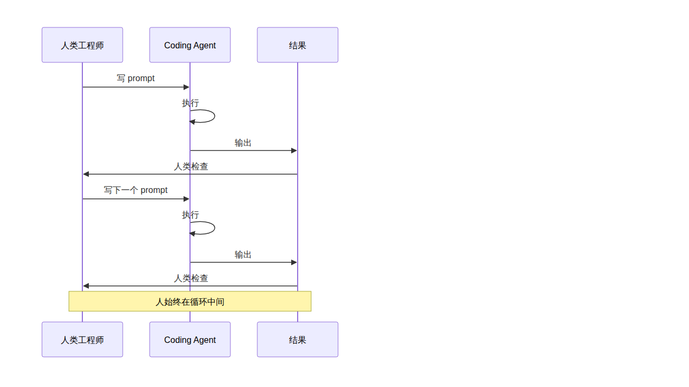 | 传统 Prompt 工作模式 vs Loop Engineering |
| 图 2 | 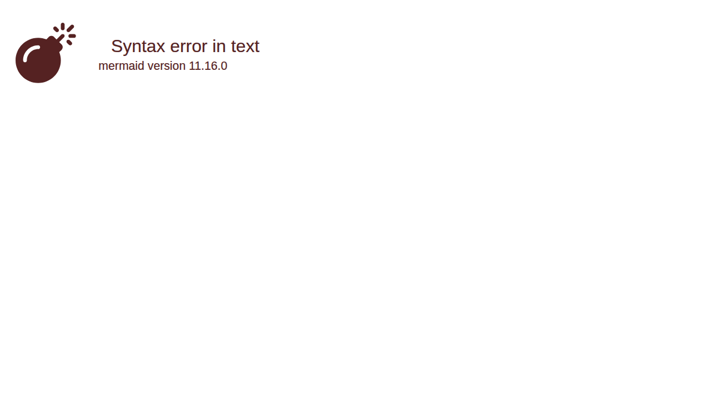 | Loop Engineering 自动循环架构 |
| 图 3 | 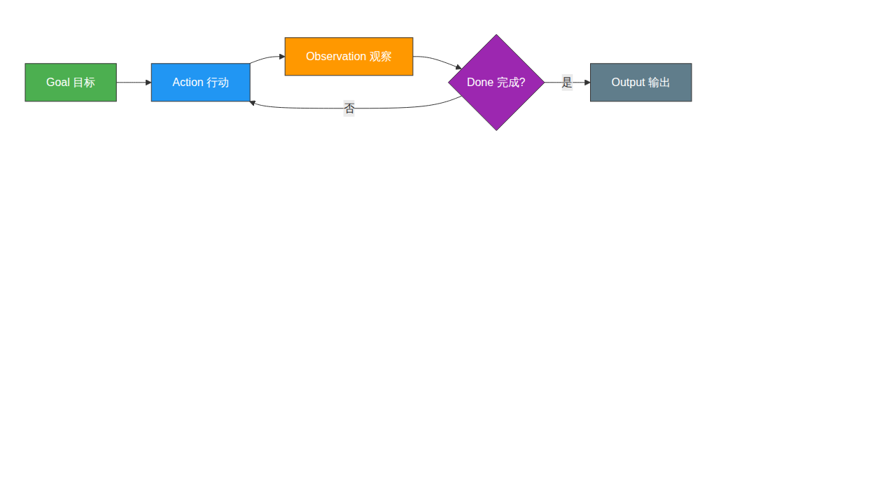 | Agent Loop：目标→行动→观察→判断 |
| 图 4 | 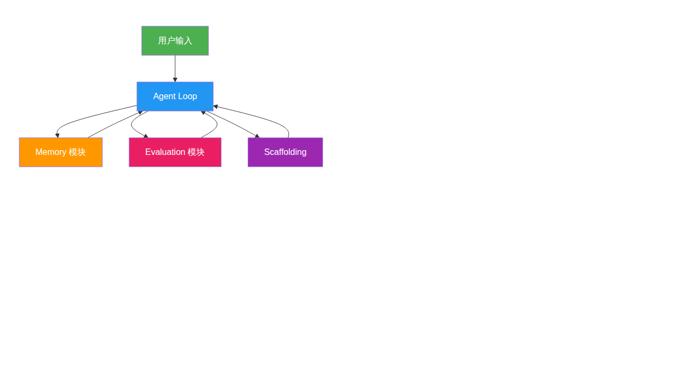 | 加入记忆、评估和脚手架 |
| 图 5 | 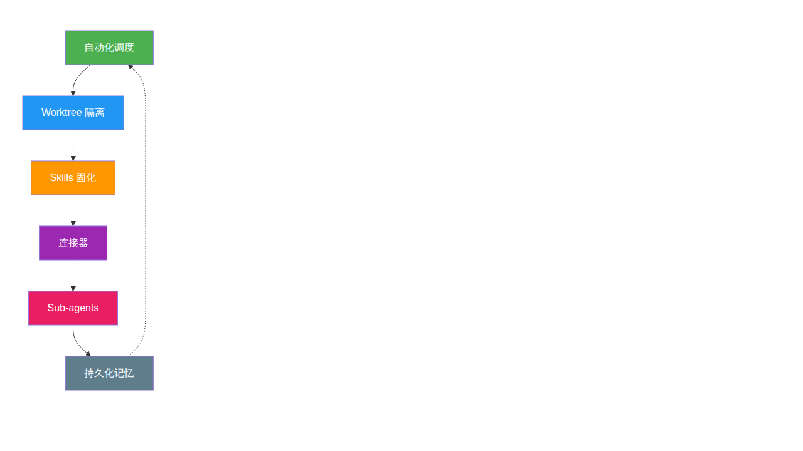 | Addy Osmani 框架的六大组件 |
| 图 6 | 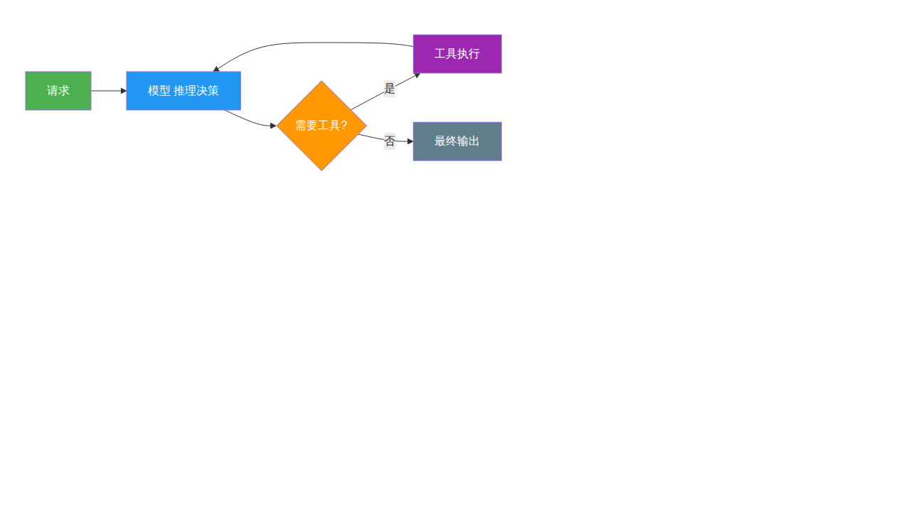 | 基础循环：模型 + 工具 |
| 图 7 | 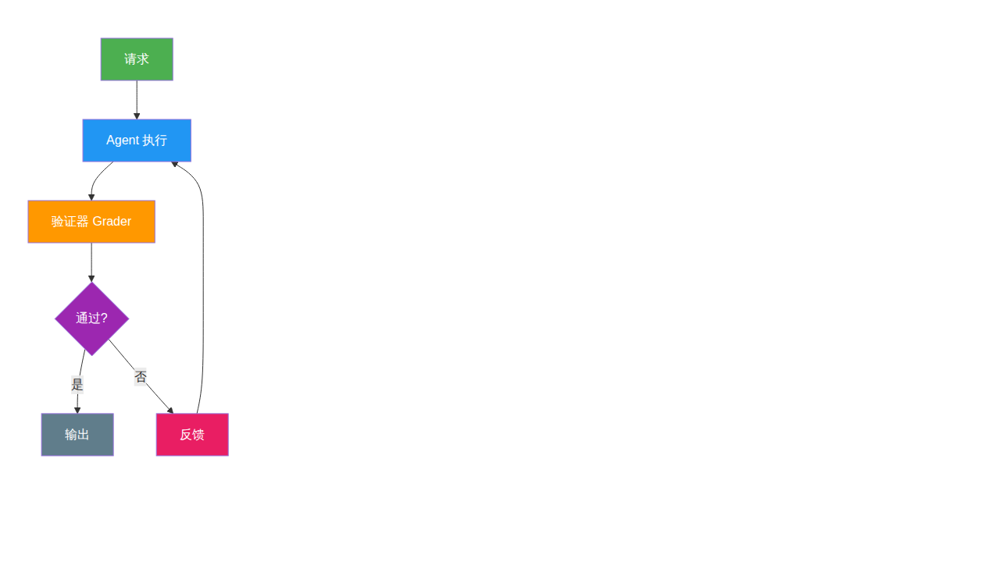 | 验证循环 + Maker-Checker |
| 图 8 | 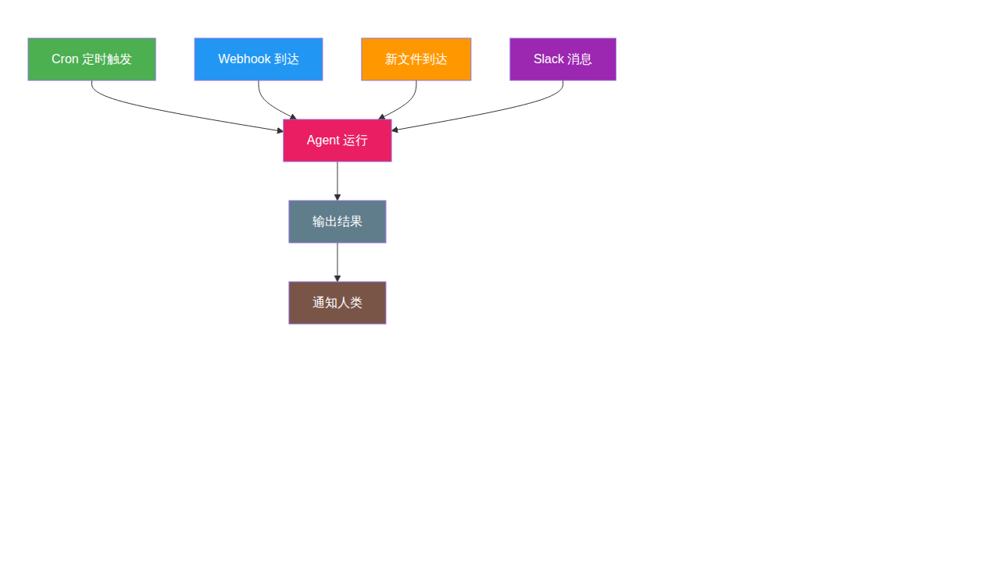 | 事件驱动循环 |
| 图 9 | 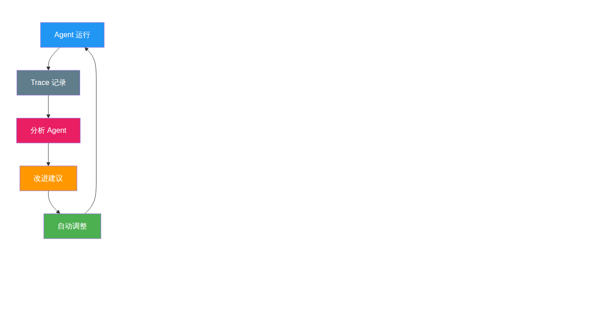 | 爬坡循环：自我改进 |
| 图 10 | 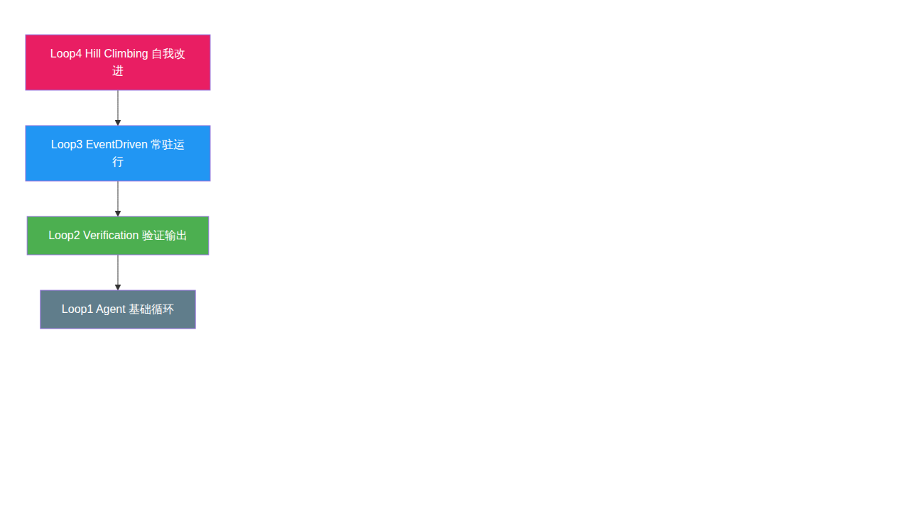 | Loopcraft：堆叠 loop 的艺术 |
| 图 11 | 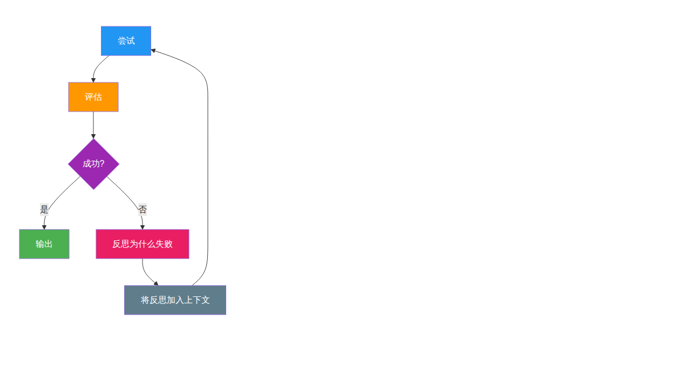 | 失败后自我反思模式 |
| 图 12 | 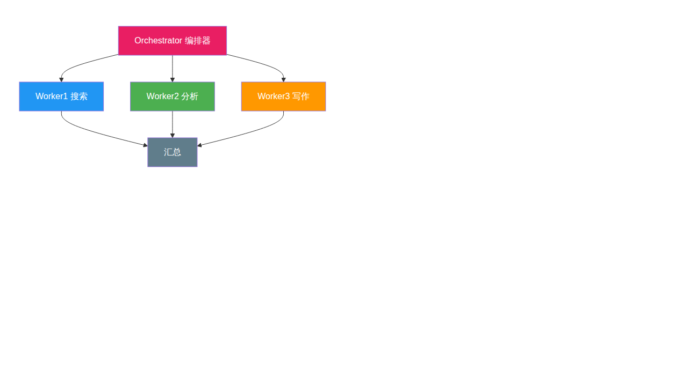 | 编排器调度多个 Worker |
| 图 13 | 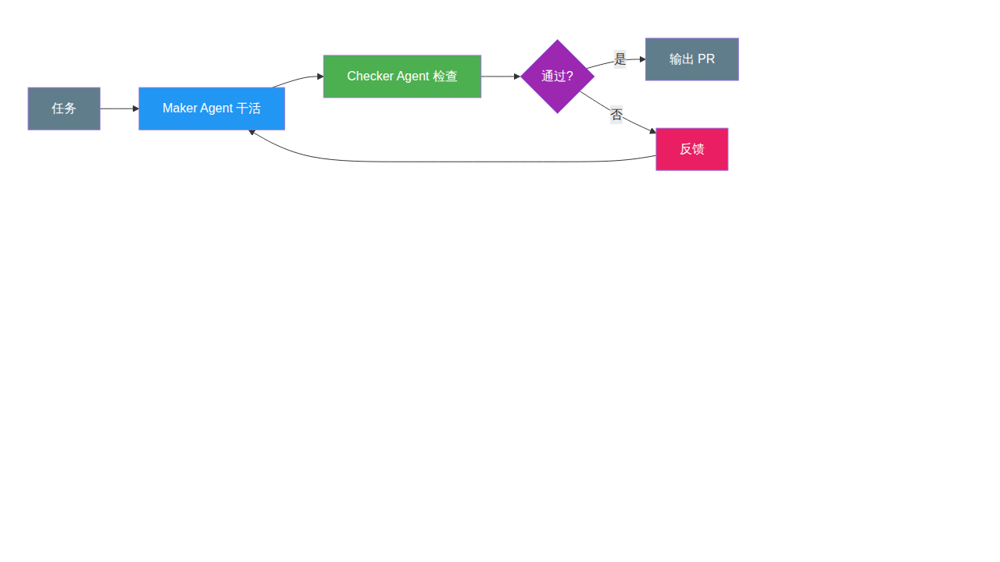 | 生产环境最主流模式 |
| 图 14 | 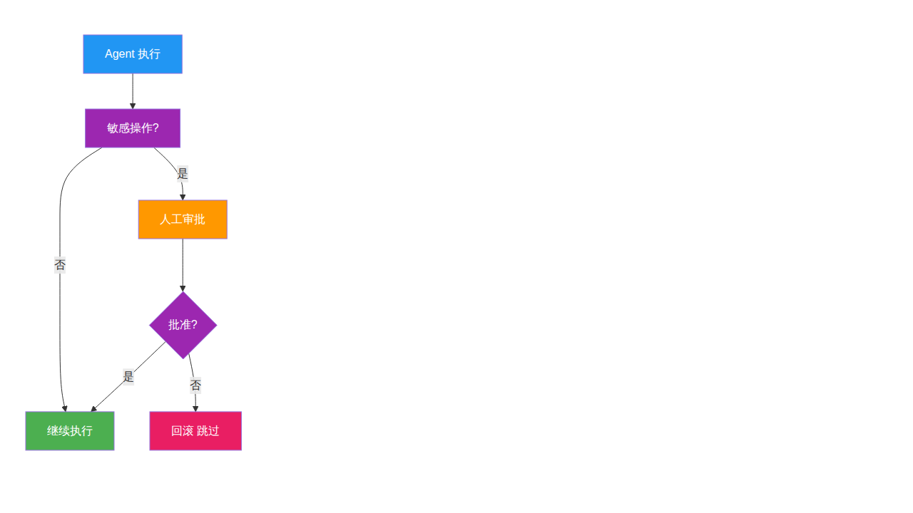 | 敏感操作人工审批流 |
| 图 15 | 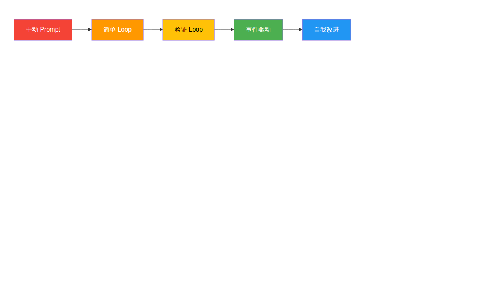 | 从手动 Prompt 到自我改进 |

---

## 一、引言：为什么 Loop Engineering 在 2026 年爆发

### 1.1 一句话定义

**Loop Engineering 就是：不再自己手动给 Agent 写 prompt，而是设计一个系统，让系统自动给 Agent 发 prompt、检查结果、决定下一步。**

用 Addy Osmani 的话说：

> *"Loop engineering is replacing yourself as the person who prompts the agent. You design the system that does it instead."*

### 1.2 引爆点：2026 年 6 月的十天

| 日期 | 人物 / 来源 | 关键言论 | 影响 |
|------|------------|---------|------|
| 2026-06-07 | Peter Steinberger (@steipete) | "You shouldn't be prompting coding agents anymore. You should be designing loops that prompt your agents." | 830 万浏览，引爆讨论 |
| 2026-06-08 | Boris Cherny（Anthropic Claude Code 负责人） | "My job is to write loops." | 行业领袖背书 |
| 2026-06-07 | Addy Osmani | 发布博文 "Loop Engineering"，首次系统命名 | 广泛传播，奠定概念框架 |
| 2026-06-12 | swyx（Latent Space） | "Loopcraft: The Art of Stacking Loops" | 提出"堆叠 loop"概念 |
| 2026-06-16 | LangChain 官方博客 | "The Art of Loop Engineering"，四层 loop 框架 | 框架化、工程化 |

### 1.3 范式转移的三段演进

```
Prompt Engineering (2022-2024)
    ↓
Agent Harness Engineering (2025)
    ↓
Loop Engineering (2026)
```

| 阶段 | 核心问题 | 人的角色 | 典型做法 |
|------|---------|---------|---------|
| **Prompt Engineering** | 怎么写一个好 prompt？ | 手写每一条 prompt | 写 prompt → 等回复 → 写下一条 |
| **Harness Engineering** | Agent 需要什么环境才能工作？ | 搭建工具链、上下文、安全边界 | 配工具、设上下文、加 guardrails |
| **Loop Engineering** | 什么循环让 Agent 持续工作，何时停？ | 设计系统，让系统自动 prompt Agent | 自动发现 → 分派 → 验证 → 记忆 → 下一轮 |

### 1.4 从"人用工具"到"系统用人"

过去两年的工作模式是这样的：


Loop Engineering 要做的，是把人从循环中间**抽出来**：


**核心区别**：从"人逐条 prompt"变成"人设计系统，系统自动跑"。

---

## 二、核心概念拆解

### 2.1 Agent Loop 的本质

Agent Loop 是最基本的循环：**模型调用工具，观察结果，再调用，直到任务完成**。

为什么需要循环？因为**长程任务无法在一次 LLM 调用中完成**。一个 LLM 调用的输出长度有限（通常几万字），而一个真实的工程任务（"修复这个 bug 并更新相关测试"）需要多步操作。

Agent Loop 的标准模式：


这个循环在学术上最早可追溯到 **ReAct 模式**（Princeton + Google，2022），它证明了"Reason + Act"交替比纯推理或纯行动都更有效。

### 2.2 Agent Loop 的三层复杂度（Oracle 框架）

Agent Loop 不是一个固定模式，它随着记忆、工具、脚手架的加入而进化：

**Level 1：简单工具调用循环**

```python
# 最基础的 agent loop
def simple_agent_loop(prompt, tools):
    messages = [{"role": "user", "content": prompt}]
    while True:
        response = model.chat(messages, tools=tools)
        if not response.tool_calls:
            return response.content
        # 执行工具调用，将结果加回上下文
        for tool_call in response.tool_calls:
            result = execute_tool(tool_call)
            messages.append({"role": "tool", "content": result})
```

- 没有持久化记忆，没有外部状态
- 循环的原因：工具结果必须反馈给模型，模型才能给出最终答案

**Level 2：加入记忆、评估和脚手架**


**Level 3：完整系统集成**

Agent 不再是孤立的 loop，而是整个系统的一部分——接入搜索引擎、数据库、API、CI/CD 管道等。

### 2.3 Loop Engineering vs Harness Engineering

这是两个密切相关但不同的概念，经常被混用，但理解区别很重要：

| 维度 | Harness Engineering | Loop Engineering |
|------|---------------------|------------------|
| **关注点** | 单个 Agent 运行的环境 | 多个 Agent/多轮次的时间编排 |
| **核心问题** | "Agent 需要什么才能工作？" | "什么循环让它持续工作，何时停？" |
| **范围** | 一个 Agent 的上下文、工具、安全 | 发现工作 → 分派 → 验证 → 记忆 → 下一轮 |
| **类比** | 给一个 Agent 造"身体" | 造"工厂"——自动运转 |
| **典型原语** | 工具定义、上下文窗口、guardrails | `/goal`、`/loop`、cron、heartbeat、sub-agent |
| **时间维度** | 单次运行 | 跨多次运行，持续自主 |

用一句话总结：**Harness 是一个 Agent 住在哪里；Loop 是什么时候启动 Agent、给它什么任务、怎么处理它的输出。**

### 2.4 一个完整 Loop 的六大要素

Addy Osmani 提出了一个 Loop 需要的六个核心组件（外加一个记忆层）：


| 要素 | 作用 | 具体例子 |
|------|------|---------|
| **⏰ 自动化调度** | 定时发现工作、分派任务，让 loop 真正跑起来 | heartbeat、cron、webhook |
| **🌿 Worktree 隔离** | 多个 Agent 并行工作时不冲突 | git worktree，每个 sub-agent 独立分支 |
| **📋 Skills** | 把项目知识固化，Agent 不用每次都猜 | SKILL.md 文件，定义了项目规范和约定 |
| **🔌 连接器** | 接入现有工具链 | MCP servers、GitHub、Slack、Linear |
| **🤖 Sub-agents** | 一个干活（Maker），一个检查（Checker） | `.claude/agents/` 或 `.codex/agents/` |
| **💾 持久化记忆** | 跨轮次记录"做了什么"和"下一步做什么" | `progress.md`、Linear 看板 |

> **关于记忆的真相**：模型每次运行之间会遗忘一切，所以记忆**必须在磁盘上，不能在上下文里**。Agent 会忘，Repo 不会。这是所有长程 Agent 依赖的同一个技巧。

---

## 三、Loop 的分层架构

LangChain 官方博客将 Loop 分成了四层，从基础自动化到自我改进，层层递进：

### 3.1 Loop 1：Agent Loop（基础循环）

这是最基本的 loop：**模型 + 工具 → 循环调用直到完成**。


以 LangChain 的 `create_agent` 为例，选一个模型、插上工具，你就有了一个能工作的 agent loop。

### 3.2 Loop 2：Verification Loop（验证循环）

Agent 能干活了，但它第一次的输出**不一定正确**。当一致性很重要时，需要在 Agent 外面包一个验证循环。


验证器可以是：
- **确定性检查**：运行测试、lint、链接检查等
- **LLM-as-judge**：用另一个 LLM 按 rubric 评分

**关键原则**：干活的 Agent 和检查的 Agent 必须分离。自己检查自己永远觉得没问题。这就是著名的 **Maker-Checker 模式**。

```python
# LangChain 的 RubricMiddleware 示例
from langchain.agents import create_agent
from langchain.middleware import RubricMiddleware

agent = create_agent(model="gpt-4o", tools=[...])

# 加一个验证层：每次 agent 输出后自动检查
agent = RubricMiddleware(
    agent,
    rubric=[
        "所有链接能正常打开",
        "CI 检查通过",
        "diff 范围不超过请求范围"
    ],
    max_retries=3
)
```

### 3.3 Loop 3：Event-Driven Loop（事件驱动循环）

Agent 不再是你手动调用的东西，而是系统里的**常驻组件**。


OpenClaw 的 **heartbeat** 机制就是这个模式的典型案例：定时检查邮箱、日历、通知，有重要发现才通知用户，没事就保持安静。

### 3.4 Loop 4：Hill Climbing Loop（爬坡循环）

前三层 loop 自动化了**工作**，第四层自动化了**改进**。


每一次 Agent 运行都产生 **trace**（模型做了什么、调了什么工具、grader 给了什么反馈）。这些 trace 里藏着高价值信号。Hill Climbing Loop 用一个分析 Agent 去读这些 trace，自动发现哪些地方工作得不好，然后**自动改写配置**——调整 prompt、更换工具、优化 grader。

这是价值最高的一层，因为它让系统**自我改进**。

### 3.5 四层 Loop 的叠加关系

swyx 称之为 **"Loopcraft：堆叠 loop 的艺术"**。四层 loop 不是互相替代，而是层层叠加：


> swyx 原话：*"The entire game of the next century is to be able to stack loops as effectively as possible."*

---

## 四、经典 Loop 模式

Loop Engineering 不是凭空发明的，它建立在多年的研究积累之上。以下是经过验证的经典模式：

### 4.1 ReAct（Reason + Act）

- **来源**：Princeton + Google，2022 年论文
- **核心思想**：推理和行动交替进行
- **结构**：Thought → Action → Observation → Thought → ...

```
Thought: 我需要搜索 XX 的最新信息
Action: search["XX 2026"]
Observation: [搜索结果]
Thought: 根据结果，我需要进一步查阅...
Action: fetch["https://..."]
Observation: [页面内容]
Thought: 现在我有了足够信息，可以写总结了
```

这是所有 Agent Loop 的学术先驱。

### 4.2 Reflexion

- **核心思想**：失败后自我反思，带着反思重新尝试
- **结构**：尝试 → 评估 → 反思（生成语言反馈）→ 带着反思重新尝试


与简单重试的区别：Reflexion 会生成**语言化的反思**（"我上次的搜索关键词太宽泛了"），而不只是"再试一次"。

### 4.3 Evaluator-Optimizer

- **核心思想**：评估器和优化器两个角色反复迭代
- **与 Maker-Checker 的区别**：Evaluator-Optimizer 更关注**质量提升**（如代码性能优化），Maker-Checker 更关注**正确性验证**（如代码是否能跑通）

### 4.4 Orchestrator-Workers

- **核心思想**：一个编排器（Orchestrator）将任务拆解、分派给多个专业 Worker
- **适用场景**：复杂的多子任务问题


### 4.5 Maker-Checker（生产环境主导模式）

这是 2026 年 Loop Engineering 中**最主流**的模式：


**铁律**：干活的 Agent 和检查的 Agent **必须是不同的**，最好用不同的模型。同一个模型检查自己的输出，倾向于轻易放行。

### 4.6 Ralph Loop

- **来源**：Geoffrey Huntley
- **核心思想**：简单粗暴——把同一个 prompt 反复喂给 Agent，直到 spec 满足
- **本质**：while (spec 不满足) { 再跑一次 }
- **价值**：证明了即使是最简单的 loop，加上终止条件，也能产生远超手动 prompt 的效果

### 4.7 `/goal` 原语

- **来源**：Claude Code / OpenAI Codex
- **核心思想**：定义一个**可验证的终止条件**，Agent 持续工作直到条件满足
- **关键**：由**独立的小模型**检查条件，不是干活的 Agent 自己检查

```
/goal "test/auth 所有测试通过 且 lint 无错误"
```

Agent 会跨多轮工作，每轮结束后独立模型检查条件，满足才停。支持 pause 和 resume。

---

## 五、实现 Loop Engineering 的系统

2026 年的好消息是：**这些 loop 原语不再是你自己写的一堆 bash 脚本了，它们已经内建在产品里**。

### 5.1 Claude Code（Anthropic）

| 原语 | 说明 |
|------|------|
| `/loop` | 按 cadence 重复运行 prompt |
| `/goal` | 运行直到满足可验证的终止条件，独立模型检查 |
| **子 Agent** | `.claude/agents/` 目录下定义，支持 agent teams |
| **Skills** | SKILL.md 文件，自动匹配或手动 `$skill-name` 调用 |
| **Hooks** | Agent 生命周期各阶段自动触发 shell 命令 |
| **Worktree 隔离** | `--worktree` 或 `isolation: worktree` |
| **GitHub Actions** | 整个 loop 推到 CI 上跑，合上电脑也能继续 |

### 5.2 OpenAI Codex

| 原语 | 说明 |
|------|------|
| **Automations 面板** | 选项目、写 prompt、设 cadence、选环境；发现问题的跑到 Triage 收件箱，没发现的自动归档 |
| `/goal` | 同 Claude Code，跨轮次工作直到条件满足，支持 pause/resume |
| **Subagents** | `.codex/agents/` 目录下 TOML 定义 |
| **Agent Skills** | SKILL.md 格式，`$` 调用或自动匹配 |
| **Worktree** | 每个 thread 内建 worktree |
| **Connectors/MCP** | 接入外部工具 |

### 5.3 OpenClaw

| 原语 | 说明 |
|------|------|
| **Heartbeat** | 定时心跳，可配置检查任务（邮箱、日历、通知等） |
| **Cron** | 精确定时任务，支持 at/every/cron 三种调度 |
| **Sub-agent 分派** | `sessions_spawn` 创建隔离子任务，支持 Maker-Checker 模式 |
| **Memory 持久化** | MEMORY.md + memory/*.md + heartbeat-state.json |
| **多渠道连接器** | DingTalk、Discord、WhatsApp、Telegram 等 |

### 5.4 系统对比表

| 能力 | Claude Code | OpenAI Codex | OpenClaw | LangChain |
|------|:-----------:|:------------:|:--------:|:---------:|
| 定时调度 | `/loop`, cron, hooks, GitHub Actions | Automations 面板, 调度 | Heartbeat, Cron | Fleet schedules, cron |
| 条件循环 | `/goal` | `/goal` | —（可自定义） | RubricMiddleware |
| 子 Agent | `.claude/agents/` | `.codex/agents/` (TOML) | `sessions_spawn` | Multi-agent |
| Skills | SKILL.md | SKILL.md | SKILL.md | — |
| Worktree 隔离 | ✅ | ✅ | —（可扩展） | — |
| MCP 连接器 | ✅ | ✅ | ✅ | ✅ |
| Trace 分析/自我改进 | — | — | — | LangSmith Engine |
| Human-in-the-loop | — | — | ✅（审批流） | ✅（原生支持） |

### 5.5 框架层：LangChain

LangChain 提供了实现四层 loop 的完整工具链：

- **Loop 1**：`create_agent(model, tools)` — 基础 agent
- **Loop 2**：`RubricMiddleware` / `after_agent` hook — 验证
- **Loop 3**：Fleet channels + schedules — 事件驱动
- **Loop 4**：LangSmith Engine — trace 分析，自动优化

### 5.6 云平台

| 平台 | 支持能力 |
|------|---------|
| **Google Vertex AI** | Loop agent pattern、Multi-agent loop agent pattern、终止条件、迭代优化 |
| **Databricks** | Custom Agents 支持单/多 Agent loop + human-in-the-loop |
| **AWS Bedrock** | Agent 编排 + 循环工作流 |

---

## 六、设计模式与最佳实践

### 6.1 Maker-Checker 分离

这是 Loop Engineering 中**最重要**的设计决策。

```
❌ 错误做法：同一个 Agent 写完代码，自己检查
   → 模型倾向于放过自己的输出

✅ 正确做法：
   Maker Agent（可用较强的模型）负责干活
   Checker Agent（可用不同模型）负责检查
   → 不同的指令、不同的视角，能发现 Maker 遗漏的问题
```

这个模式也叫做 **LLM-as-judge**。Checker 可以是：
- 另一个 LLM Agent
- 确定性程序（测试、lint、构建）
- 人工审批

### 6.2 终止条件设计

终止条件是 Loop 安全的生命线。

| ❌ 不好的终止条件 | ✅ 好的终止条件 |
|---|---|
| "跑 10 轮就停" | "`test/auth` 所有测试通过且 lint clean" |
| "写到满意为止" | "PR 通过 CI，所有 link 能打开" |
| 没有终止条件 | "progress.md 中记录的 5 个 issue 都 closed" |

**关键原则**：
- 用**可验证的条件**，不要用模糊的主观判断
- 由**独立模型/程序**检查，不要让干活的 Agent 自己判断
- 设置**最大轮数兜底**（如 max_iterations=20），防止无限循环

### 6.3 Token 成本控制

Loop 的 token 消耗是手动 prompt 的数倍甚至数十倍。控制手段：

1. **`max_iterations`**：硬性上限
2. **spend cap**：费用上限
3. **分层模型**：Checker 用便宜的小模型，Maker 用强模型
4. **Skills 固化**：减少重复解释的 token
5. **精简上下文**：只传必要的信息

### 6.4 Human-in-the-loop

即使在自主 loop 中，也需要人工审批的节点：


典型需要人工审批的场景：发送邮件、发布到生产环境、删除数据、对外发布内容。

### 6.5 状态持久化

> **"Agent 会忘，Repo 不会。"**

Loop 跨多次运行，每次运行之间模型上下文是清空的。所以状态**必须持久化在磁盘上**：

```bash
# 示例：用 progress.md 记录进度
$ cat progress.md
## 已完成
- [x] 修复 auth 模块的 token 过期问题
- [x] 更新相关测试用例

## 进行中
- [ ] 更新 API 文档（#42）

## 待处理
- [ ] 检查其他模块是否有同样问题
```

Agent 每次启动时先读这个文件，就知道之前做了什么、接下来该做什么。

### 6.6 Worktree 隔离

当多个 Agent 并行工作时，文件冲突是最大的失败源。

```
main branch
├── worktree-1/  ← Agent A 在此修改 auth 模块
├── worktree-2/  ← Agent B 在此修改 UI 模块
└── worktree-3/  ← Checker Agent 在此验证

每个 worktree 有独立的分支和工作目录，互不干扰。
```

---

## 七、挑战与风险

### 7.1 无限循环风险

终止条件定义不当 → Agent 永远无法满足条件 → 循环永不停止 → token 费用爆炸。

**防护**：
- 始终设置 `max_iterations` 兜底
- 终止条件必须是**可客观验证**的
- Checker 用独立模型/程序

### 7.2 Token 成本爆炸

弱 Loop（无 verifier、无 spend cap）= 烧钱。

一次手动 prompt 可能花 $0.10，一个跑了 20 轮还没停的 loop 可能花掉 $50。

**防护**：
- spend cap 硬限制
- 分层模型策略
- 监控 token 用量，超阈值自动暂停

### 7.3 验证器瓶颈

> *"In any loop, the verifier is the bottleneck, not the model."* — AI Builder Club

模型能力已经很强了，真正限制 Loop 质量的是**验证器够不够好**。一个弱的 verifier 会让垃圾输出通过。

### 7.4 早期阶段

Loop Engineering 的概念在 2026 年 6 月才成型，到现在只有几个月。产品能力仍在快速演进，最佳实践仍在形成中。

### 7.5 何时不该用 Loop

Loop 不是万能的。以下场景更适合手动：

| 场景 | 推荐方式 |
|------|---------|
| 一次性任务，不会重复 | 手动 prompt，人工检查 |
| 验证成本比人工检查还高 | 直接手动 |
| 需要高度创造性、无明确标准 | 人工 + Agent 辅助 |
| 安全敏感操作，不能有自主决策 | 人工审批每一步 |

---

## 八、总结

### 8.1 核心回顾

Loop Engineering 的本质可以用三句话概括：

1. **从"人用工具"到"系统设计"**：不再是人逐条 prompt Agent，而是人设计 loop，让 loop 自动 prompt Agent
2. **关键技能不再是写 prompt，而是定义"好"和"完成"**：Maker-Checker 分离、终止条件设计、状态持久化
3. **产品已经准备好了**：Claude Code、Codex、OpenClaw 都内建了 loop 原语，竞争点在于谁能更好地设计 loop

### 8.2 能力成熟度


大部分团队现在在 A→B→C 之间，D 和 E 是前沿。

### 8.3 2026 年的工程师红利

> *"The shift from 'prompt the agent' to 'design the loop' is the single biggest force multiplier for engineering teams in 2026."*

模型能力已经足够了，工具也准备好了。真正的问题是：

**你还在自己手动 prompt，还是已经设计了让系统自动 prompt 的 loop？**

---

## 📚 参考文献

1. **Peter Steinberger** (@steipete) — "You shouldn't be prompting coding agents anymore"，Twitter/X，2026-06-07（830 万浏览）
2. **Boris Cherny** (Anthropic) — "My job is to write loops"，Acquired Podcast / Twitter/X，2026-06
3. **Addy Osmani** — "Loop Engineering"，https://addyosmani.com/blog/loop-engineering ，2026-06-07
4. **Addy Osmani** — "Agent Harness Engineering"，https://addyosmani.com/blog/agent-harness-engineering
5. **Addy Osmani** — "Long-Running Agents"，https://addyosmani.com/blog/long-running-agents
6. **swyx** — "Loopcraft: The Art of Stacking Loops"，Latent Space，2026-06-12
7. **LangChain Blog** — "The Art of Loop Engineering"，https://www.langchain.com/blog/the-art-of-loop-engineering ，2026-06-16
8. **Oracle Developers** — "The Agent Loop Decoded: Three Levels Every Agent Engineer Must Know"，https://blogs.oracle.com/developers/the-agent-loop-decoded ，2026-06-11
9. **Cobus Greyling** — "The Core of Loop Engineering"，Medium，2026
10. **Michael Rouveure** (Black Matter VC) — "Loop Engineering: An Honest Verdict"，https://blackmatter.vc/lab/loop-engineering-an-honest-verdict-from-someone-who-actually-runs-agent-loops
11. **Shirley / AI Builder Club** — "Loop Engineering Guide (2026)"，https://www.aibuilderclub.com/blog/loop-engineering-guide-2026
12. **Tosea.ai** — "What Is Loop Engineering? A Complete Guide from Prompt to Harness Engineering (2026)"，https://tosea.ai/blog/loop-engineering-ai-agents-complete-guide-2026
13. **TrueFoundry** — "Loop Engineering at Enterprise Grade"，https://www.truefoundry.com/blog/loop-engineering-enterprise-agent-runtime
14. **MindStudio** — "Loop Engineering vs Harness Engineering"，https://www.mindstudio.ai/blog/loop-engineering-vs-harness-engineering
15. **Requesty** — "Loop Engineering: How to Build AI Agent Loops That Run Themselves"，https://www.requesty.ai/blog/loop-engineering-how-to-build-ai-agent-loops-that-run-themselves
16. **IBM Think** — "What Is Loop Engineering?"，https://www.ibm.com/think/topics/loop-engineering
17. **Google Cloud Architecture** — "Choose a Design Pattern for Your Agentic AI System"，https://docs.cloud.google.com/architecture/choose-design-pattern-agentic-ai-system
18. **Databricks** — "Agent System Design Patterns"，https://docs.databricks.com/aws/en/agents/agent-system-design-patterns
19. **Simon Willison** — "Designing Agentic Loops"，2025-09
20. **Andrej Karpathy** — "autoresearch" 项目（630 行代码，夜间自动发现研究改进点）
21. **AI Jason** — "Loop Engineer: Systemization and Artifacts"（视频）
22. **Andrew Ng** — The Batch Newsletter，2026-06-30（Nested Three-Loop Model + Context Advantage）
23. **Fareed Khan** — "Testing 17 Agentic Loop Engineering Techniques for Reliable AI Agents"，Level Up Coding
24. **Cobus Greyling** — github.com/cobusgreyling/loop-engineering（MIT，生产 Loop 模式 starter kits）
25. **LangChain** — "The Art of Loop Engineering: How to Build Agents That Improve Over Time"（视频），Interrupt Conference 2026-07-23
26. **Eric Roby** — "Loop Engineering: Stop Prompting Agents"，Brain Bytes Substack
