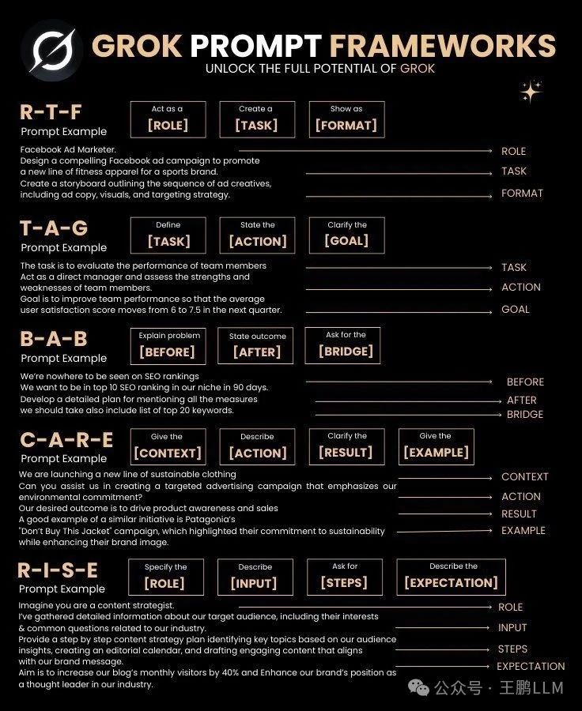

# Grok 提示框架

看看Gork的提示词5种Prompt框架，充分发挥 Grok 的潜力：

1. R-T-F（角色 - 任务 - 格式）
2. T-A-G（任务 - 行动 - 目标）
3. B-A-B（之前 - 之后 - 桥梁）
4. C-A-R-E（背景 - 行动 - 结果 - 示例）
5. R-I-S-E（角色 - 输入 - 步骤 - 期望）

# 参考
[Grok 提示框架（Grok Prompt Frameworks）](https://mp.weixin.qq.com/s/6J17IE9ctRj4Yi6wySjO4g)