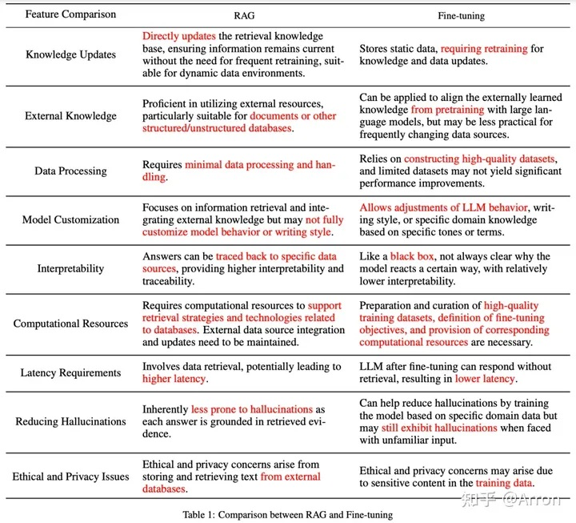

<!-- more -->

# RAG vs FT[1]

### RAG vs 微调[场景]

+ 动态数据：RAG

+ 模型能力定制：微调

+ 幻觉：RAG > 微调

+ 可解释性：RAG

+ 成本：RAG

+ 依赖通用能力：RAG

​       微调会有灾难性的遗忘

+ 延迟：微调

​       rag的流程长

+ 智能设备：微调

【rag和微调可以一起使用】

### 应用 Case

A: 投资理财规划师   **[用RAG]**

- 处理动态数据：RAG
- 很强的对话能力：RAG
- 金融能力：微调 ×

B: 金融信息抽取Bot  **[用微调]**

- 很强的抽取能力：微调  [特定的能力]
- 金融能力

C: 销售机器人   **[用RAG+微调]**

- 多轮对话/动态：RAG
- 销售技巧/语气：微调

# RAG vs FT [2]

todo:  有中文翻译的图片

# 参考

1. [大模型项目选择RAG还是微调：三个案例](https://www.bilibili.com/video/BV1xM4m117FP/)  v

[大模型项目选择RAG还是微调：八个判断依据](https://www.bilibili.com/video/BV1vJ4m1M7qG/) v

2. \#1《Retrieval-Augmented Generation for Large Language Models: A Survey》 

   [面向大语言模型的检索增强生成技术：综述 [译]](https://baoyu.io/translations/ai-paper/2312.10997-retrieval-augmented-generation-for-large-language-models-a-survey) 翻译 

   [LLM之RAG理论（二）| RAG综述论文详解](https://zhuanlan.zhihu.com/p/673910600)

   [同济大学发布最新检索增强(RAG)的LLM生成技术综述](https://cloud.tencent.com/developer/article/2373340)   

   [面向大模型的检索增强生成（RAG）综述](https://mp.weixin.qq.com/s/JjcN6OoxNK7tddmIOpvr2g)

​       [大语言模型的检索增强生成 (RAG) 方法](https://www.promptingguide.ai/zh/research/rag)

- [LLM知识增强：RAG&微调？微软给出部分答案](https://mp.weixin.qq.com/s?__biz=Mzk0ODU3MjcxNA==&mid=2247486105&idx=1&sn=05a92efdb7bdb00501342a03cea653d0&chksm=c364cddcf41344ca609fc326330c9b2cd432edb6cdef99c6771e0716aafd9efa4da5b88012c6&scene=21#wechat_redirect)  microsoft
- [RAG 或 Fine Tume - 为您的用例选择正确方法的权威指南](https://mp.weixin.qq.com/s/TRZgLIksGcpghGjG03mY3g)

