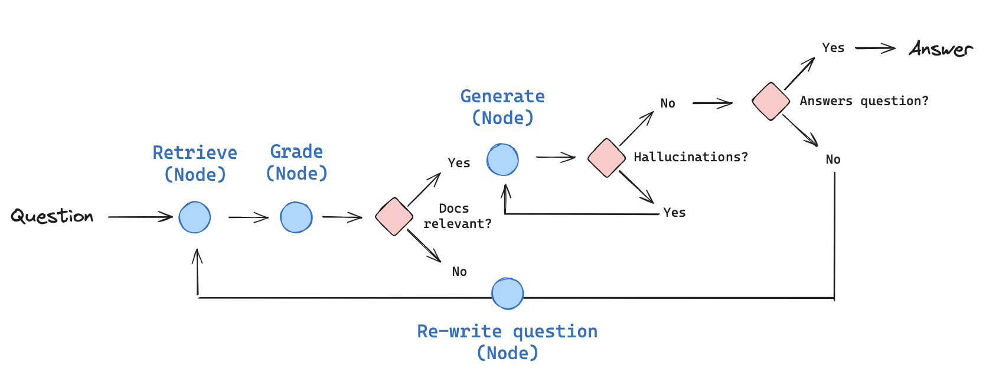

<!-- more -->

# Cognitive Architecture [2]
+ Cognitive architectures for RAG [1]

# CRAG
### 论文
[Corrective Retrieval Augmented Generation](https://arxiv.org/pdf/2401.15884.pdf) Figure 2 

### 实现[10]

Corrective-RAG (CRAG) is a strategy for RAG that incorporates **self-reflection / self-grading** on retrieved documents.

In the paper here, a few steps are taken:
+ If at least one document exceeds the threshold for relevance, then it proceeds to generation
+ Before generation, it performs knowledge refinement
+ This partitions the document into "knowledge strips"
+ It grades each strip, and filters our irrelevant ones
+ If all documents fall below the relevance threshold or if the grader is unsure, then the framework seeks an additional datasource
+ It will use web search to supplement retrieval

We will implement some of these ideas from scratch using LangGraph:
+ Let's skip the knowledge refinement phase as a first pass. This can be added back as a node, if desired.
+ If any documents are irrelevant, let's opt to supplement retrieval with web search.
+ We'll use Tavily Search for web search.
+ Let's use query re-writing to optimize the query for web search.

#  Self-RAG  
### 论文
[SELF-RAG: LEARNING TO RETRIEVE, GENERATE, AND
CRITIQUE THROUGH SELF-REFLECTION](https://arxiv.org/pdf/2310.11511.pdf) Figure 1 

### 原理 [20]
Self-RAG 则是更加主动和智能的实现方式，主要步骤概括如下：
1. 判断是否需要额外检索事实性信息（retrieve on demand），仅当有需要时才召回
2. 平行处理每个片段：生产prompt+一个片段的生成结果
3. 使用**反思字段(Reflection tokens)**，检查输出是否相关，选择最符合需要的片段；
4. 再重复检索
5. 生成结果会引用相关片段，以及输出结果是否符合该片段，便于查证事实。

### 实现[21]

Self-RAG is a strategy for RAG that incorporates **self-reflection / self-grading** on retrieved documents and generations.

In the [paper](https://arxiv.org/abs/2310.11511), a few decisions are made:

1. Should I retrieve from retriever, `R` -

- Input: `x (question)` OR `x (question)`, `y (generation)`
- Decides when to retrieve `D` chunks with `R`
- Output: `yes, no, continue`

2. Are the retrieved passages `D` relevant to the question `x` -

- Input: (`x (question)`, `d (chunk)`) for `d` in `D`
- `d` provides useful information to solve `x`
- Output: `relevant, irrelevant`

3. Are the LLM generation from each chunk in `D` is relevant to the chunk (hallucinations, etc) -

- Input: `x (question)`, `d (chunk)`, `y (generation)` for `d` in `D`
- All of the verification-worthy statements in `y (generation)` are supported by `d`
- Output: `{fully supported, partially supported, no support`

4. The LLM generation from each chunk in `D` is a useful response to `x (question)` -

- Input: `x (question)`, `y (generation)` for `d` in `D`
- `y (generation)` is a useful response to `x (question)`.
- Output: `{5, 4, 3, 2, 1}`

We will implement some of these ideas from scratch using [LangGraph](https://langchain-ai.github.io/langgraph/).

 

# 参考

1. [Self-Reflective RAG with LangGraph](https://blog.langchain.dev/agentic-rag-with-langgraph/)  *** 

2. [OpenAI's Bet on a Cognitive Architecture](https://blog.langchain.dev/openais-bet-on-a-cognitive-architecture/)  

1xx. [写的太通透了！大模型自省式 RAG 与 LangGraph 的实践！](https://blog.csdn.net/2301_78285120/article/details/136103211)  

### CRAG

10. [Corrective RAG (CRAG)](https://github.com/langchain-ai/langgraph/blob/main/examples/rag/langgraph_crag.ipynb) langgraph  git  

1xx. 【社区第十三讲】 老刘说NLP线上交流  

### Self-RAG
20. [NLP（廿一）：从 RAG 到 Self-RAG —— LLM 的知识增强](https://zhuanlan.zhihu.com/p/661465330?utm_id=0) ***   

21. [Self-RAG](https://github.com/langchain-ai/langgraph/blob/main/examples/rag/langgraph_self_rag.ipynb) langGraph git  

1xx. [original implementation of Self-RAG](https://github.com/AkariAsai/self-rag) 

