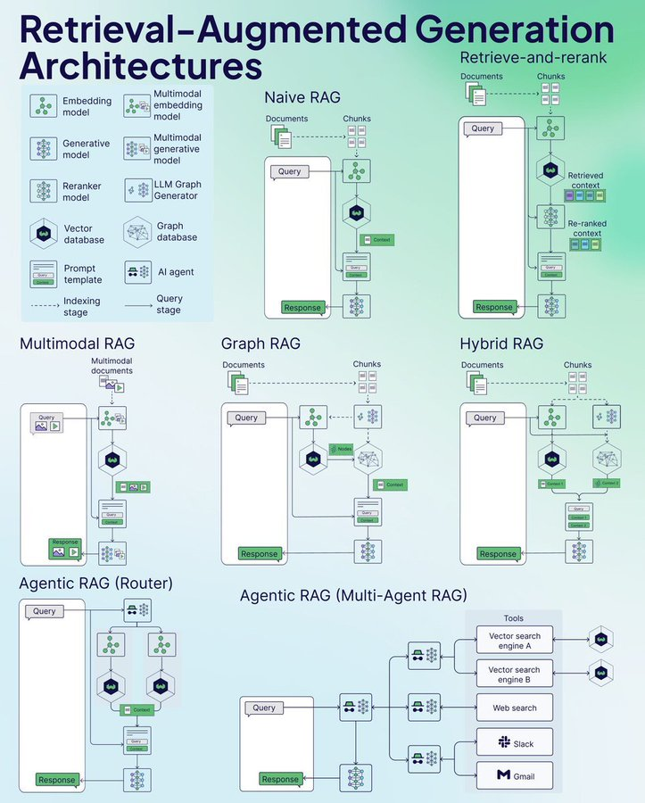

<!-- more -->

# 7 种 RAG 模式

1. Naive RAG 是最基础的架构，包含简单的文档检索、处理和生成响应的流程
2. Retrieve-and-rerank 在基础 RAG 上增加了重排序步骤，可以优化检索结果的相关性
3. Multimodal RAG 能够处理图像等多种类型的数据，不仅限于文本
4. Graph RAG 利用图数据库增强知识连接，可以更好地理解文档间的关系
5. Hybrid RAG 结合了多种技术的优势，包含图结构和传统检索方法
6. Agentic RAG Router 使用 AI Agent 来路由和处理查询，可以选择最适合的处理路径
7. Agentic RAG Multi-Agent 使用多个专门的 AI Agent 协同工作，可以调用不同的工具（如向量搜索、网页搜索、Slack、Gmail 等）

### 核心组件

- 嵌入模型：将文本转换为向量表示
- 生成模型：负责最终的内容生成
- 重排序模型：优化检索结果的相关性
- 向量数据库：存储和检索向量化的内容
- 提示模板：规范化的查询处理模板
- AI Agent：智能决策和任务协调

# 参考

[RAG 架构图解：从基础到高级的7种模式](https://mp.weixin.qq.com/s/v8Dd4mQmaemxpOyrrI7o6g) 

[RAG 架构图解：从基础到高级的7种模式](https://twitter.com/shao__meng/status/1866626166079230355?s=46&t=1AUvwyftFbcog4yHzgnysw)   x