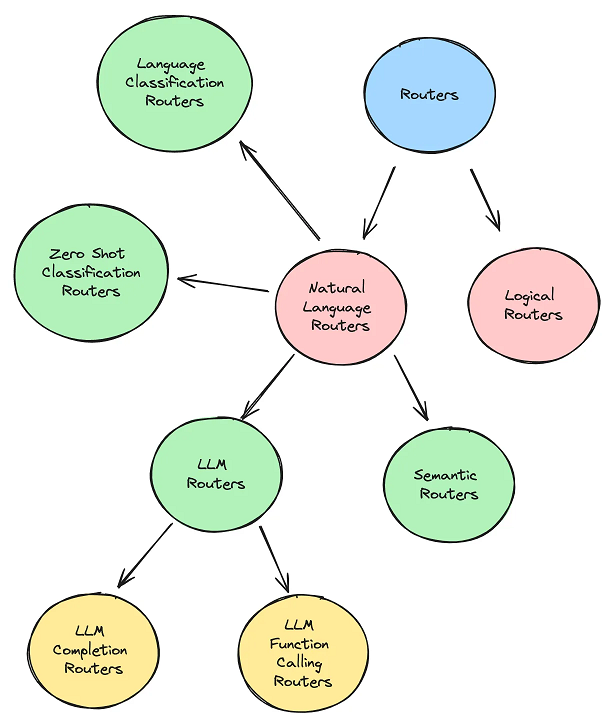
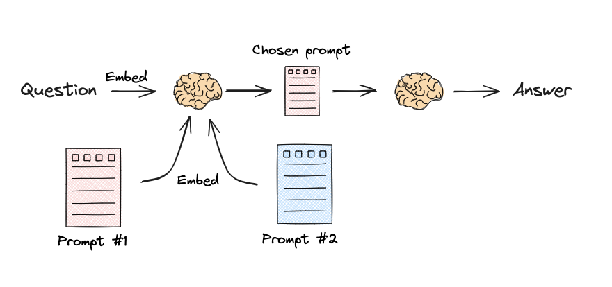

<p></p>
<!-- more -->

# 类型[1]
+ **LLM Routers**
	- LLM Completion Routers
	- LLM Function Calling Routers
+ **Semantic Routers** [2]
+ Zero Shot Classification Routers
+ Language Classification Routers



# Logical and Semantic routing[3]
### Logical routing 


{}

``` python
from typing import Literal

from langchain_core.prompts import ChatPromptTemplate
from langchain_core.pydantic_v1 import BaseModel, Field
from langchain_openai import ChatOpenAI

# Data model
class RouteQuery(BaseModel):
    """Route a user query to the most relevant datasource."""

    datasource: Literal["python_docs", "js_docs", "golang_docs"] = Field(
        ...,
        description="Given a user question choose which datasource would be most relevant for answering their question",
    )

# LLM with function call 
llm = ChatOpenAI(model="gpt-3.5-turbo-0125", temperature=0)
structured_llm = llm.with_structured_output(RouteQuery)

# Prompt 
system = """You are an expert at routing a user question to the appropriate data source.

Based on the programming language the question is referring to, route it to the relevant data source."""

prompt = ChatPromptTemplate.from_messages(
    [
        ("system", system),
        ("human", "{question}"),
    ]
)

# Define router 
router = prompt | structured_llm

def choose_route(result):
    if "python_docs" in result.datasource.lower():
        ### Logic here 
        return "chain for python_docs"
    elif "js_docs" in result.datasource.lower():
        ### Logic here 
        return "chain for js_docs"
    else:
        ### Logic here 
        return "golang_docs"

from langchain_core.runnables import RunnableLambda

full_chain = router | RunnableLambda(choose_route)
full_chain.invoke({"question": question})
```

{}

### Semantic routing


{}

``` python
from langchain.utils.math import cosine_similarity
from langchain_core.output_parsers import StrOutputParser
from langchain_core.prompts import PromptTemplate
from langchain_core.runnables import RunnableLambda, RunnablePassthrough
from langchain_openai import ChatOpenAI, OpenAIEmbeddings

# Two prompts
physics_template = """You are a very smart physics professor. \
You are great at answering questions about physics in a concise and easy to understand manner. \
When you don't know the answer to a question you admit that you don't know.

Here is a question:
{query}"""

math_template = """You are a very good mathematician. You are great at answering math questions. \
You are so good because you are able to break down hard problems into their component parts, \
answer the component parts, and then put them together to answer the broader question.

Here is a question:
{query}"""

# Embed prompts
embeddings = OpenAIEmbeddings()
prompt_templates = [physics_template, math_template]
prompt_embeddings = embeddings.embed_documents(prompt_templates)

# Route question to prompt 
def prompt_router(input):
    # Embed question
    query_embedding = embeddings.embed_query(input["query"])
    # Compute similarity
    similarity = cosine_similarity([query_embedding], prompt_embeddings)[0]
    most_similar = prompt_templates[similarity.argmax()]
    # Chosen prompt 
    print("Using MATH" if most_similar == math_template else "Using PHYSICS")
    return PromptTemplate.from_template(most_similar)


chain = (
    {"query": RunnablePassthrough()}
    | RunnableLambda(prompt_router)
    | ChatOpenAI()
    | StrOutputParser()
)

print(chain.invoke("What's a black hole"))

```
{}

【基于embedding的相似度匹配】

# 参考
1. [Routing in RAG-Driven Applications](https://towardsdatascience.com/routing-in-rag-driven-applications-a685460a7220)  

2. [Sematic router 让LLM更加快速做出决策](https://www.bilibili.com/video/BV1H64y1E75Y/) V  
   [semantic-router Repo](https://github.com/aurelio-labs/semantic-router/) git  
   [semantic-router doc](https://docs.aurelio.ai/semantic-router/get-started/introduction)  
   
3. [一文详看Langchain框架中的RAG多阶段优化策略：从问题转换到查询路由再到生成优化](https://mp.weixin.qq.com/s/pK2BRLrWpEKKIPFhUtGvcg)  
   [rag-from-scratch Repo](https://github.com/langchain-ai/rag-from-scratch) git  
   [RAG(检索增强） 从入门到精通 路由（routing)](https://www.bilibili.com/video/BV1eJ4m1p7kj/) V  

