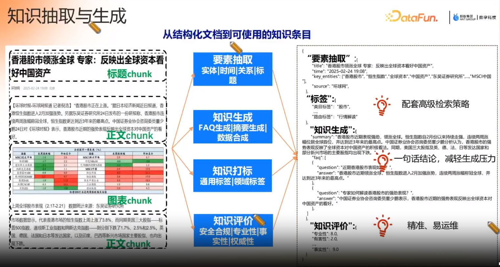

# Arch

+ 最重要 →     
  文档预处理     
  离线知识加工  

# pipeline

【pipeline】  

# 知识抽取与生成

【 chunk - markdown 的chunk】  
【要素  标签】  
【markdown - chunking 器   
层级知识保留， chunk完后是张图】  

# query理解

【推理模型   -   大篇幅的意图理解 】

# 参考
1. 蚂蚁数科 AI Agent知识工程实践   datafun