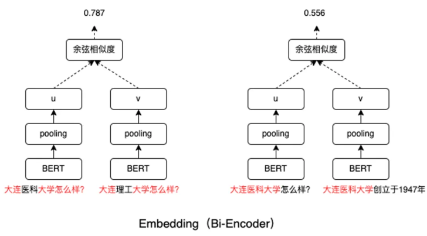
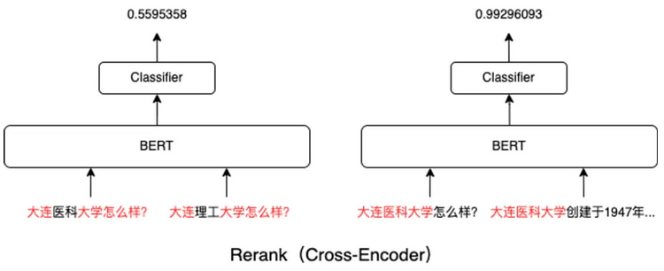

<!-- more -->

# QAnything 
### Arch[1]

+ 索引（indexing）
通过Embedding为每一个文本块生成一个向量表示，用于计算**文本向量**和**问题向量**之间的**相似度**。创建索引将原始文本块和Embedding向量以键值对的形式存储，以便将来进行快速和频繁的搜索。

+ 检索（Retrieval）
使用Embedding模型将用户输入问题转换为向量，计算问题的Embedding向量和语料库中文本块Embedding向量之间的相似度，选择**相似度最高的前K个文档块**作为当前问题的增强上下文信息。

+ 生成（Generation）
将检索得到的前K个文本块和用户问题一起送进大模型，让大模型基于给定的文本块来回答用户的问题。

### 1st Retrieval（embedding）[1]
+ Bcembedding模型 [3]
  - 中英双语和跨语种能力
  - 多领域覆盖

+ Embedding 可以给出一个得分，但是这个得分描述的更多的是**相似性**。Embedding本质上是一个**双编码器**，两个文本在模型内部没有任何信息交互。只在最后计算两个向量的余弦相似度时才进行唯一一次交互。所以Embedding检索只能把**最相似的**文本片段给你，**没有**能力来判断候选文本和query之间的**相关性**。但是**相似又不等于相关**。

【embedding -> 相似性】

### 2nd Retrieval（rerank）[1]
+ Rerank [3]

+ Rerank本质是一个**Cross-Encoder**的模型。Cross-Encoder能让两个文本片段一开始就在BERT模型各层中通过self-attention进行交互。

【rerank -> 相关性】

# 参考
### QAnything
1. [QAnything Repo](https://github.com/netease-youdao/QAnything) git  
2. xxx  
3. [有道QAnything背后的故事：关于RAG的一点经验分享](https://www.bilibili.com/video/BV1HF4m1w7rY/) V  
 [有道QAnything背后的故事---关于RAG的一点经验分享](https://mp.weixin.qq.com/s/FUex1Q984-IhQ-FoLZTf5Q)   文字版  
   [公众号有其他文章]  
   

1xx. [前沿重器[45] RAG开源项目Qanything源码阅读1-概述+服务](https://mp.weixin.qq.com/s?__biz=MzIzMzYwNzY2NQ==&mid=2247489671&idx=1&sn=564a232c3c7919c70a7a1cf5efa77628)