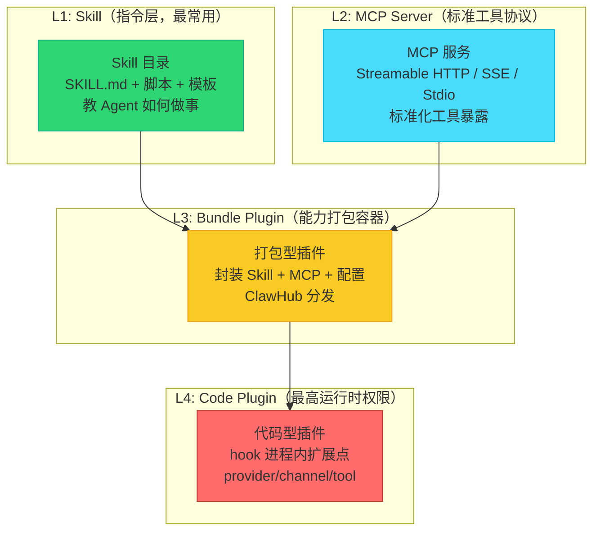
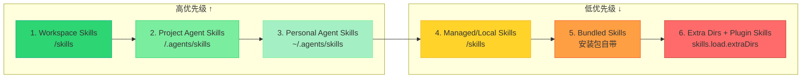
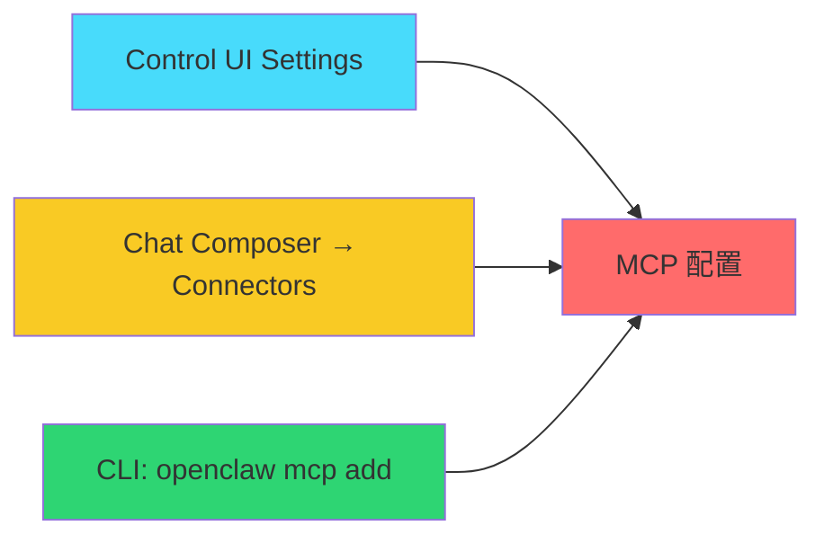
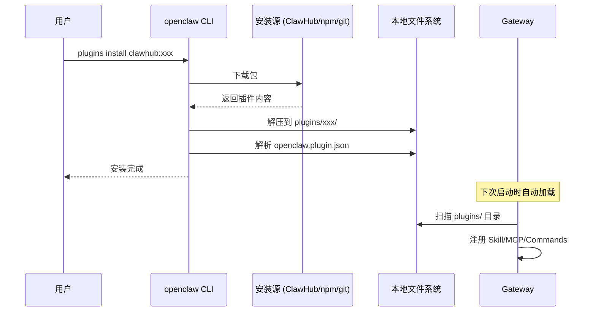
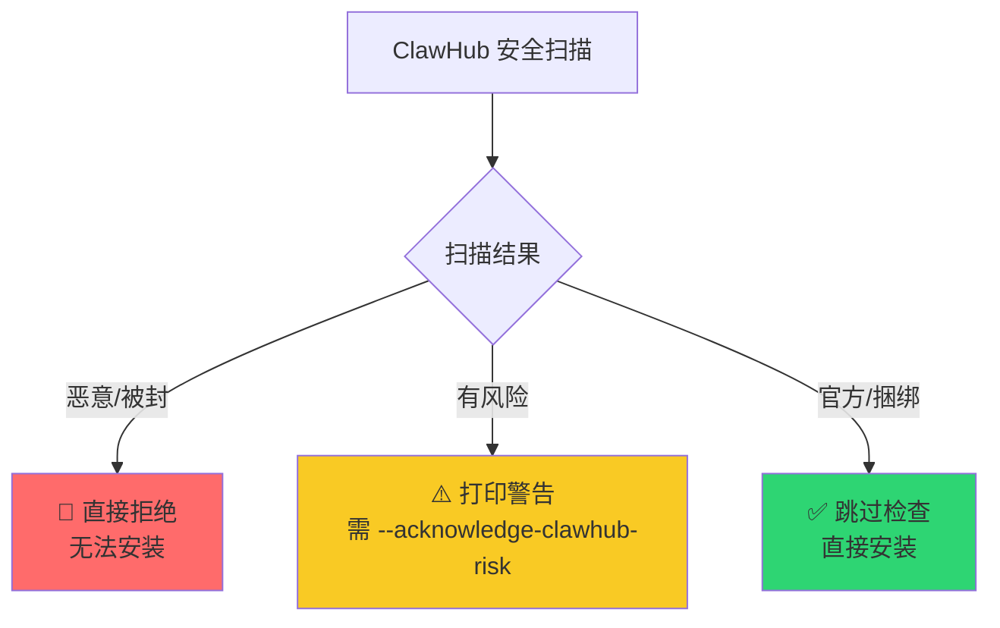
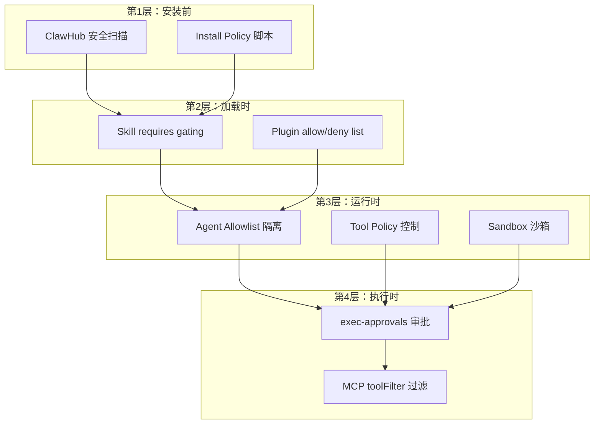

# OpenClaw 如何管理海量 Skill 和 MCP：架构、安全与生态深度解析

> "Core stays lean; optional capabilities should usually ship as plugins."
> —— OpenClaw VISION.md

OpenClaw 是 2025-2026 年间 GitHub 上增长最快的开源 AI 助手项目之一（⭐385,000+）。作为一个面向**单一操作员**的个人 AI 助手，它需要在"强大"与"可控"之间取得精细的平衡。其核心设计信条是：**核心极简，能力外延**——核心层（Core）保持精简，所有可选能力通过插件（Plugin）和技能（Skill）扩展。

想象这样一个场景：你同时需要 GitHub 自动化、浏览器操作、智能家居控制、日程管理、代码审查等 50+ 种能力。如果所有能力都写进核心代码，项目将迅速膨胀到不可维护；如果完全放任用户随意安装，又会带来严重的安全风险。OpenClaw 的答案是构建一套**分层能力管理体系**，让 5,400+ 社区 Skill 和无数 MCP Server 在一个统一框架下安全、高效地运行。

本文将从架构设计、生命周期管理、安全控制、热更新机制和生态分发五个维度，深度剖析 OpenClaw 如何优雅地管理海量 Skill 和 MCP。

---

## 一、整体架构：四层能力模型

OpenClaw 将所有能力扩展组织为**四个层次**，每一层有不同的加载时机、适用范围和权限边界。理解这四层模型是理解整个系统的关键。

### 1.1 能力分层体系



| 层级 | 类型 | 本质 | 加载时机 | 权限边界 | 典型用途 |
|------|------|------|----------|----------|----------|
| **L1** | Skill（技能） | Markdown 指令文件 | Agent 启动时加载到 System Prompt | 纯文本 + 可选脚本，无进程内钩子 | 教 Agent 如何使用某个工具（GitHub、浏览器、Docker 等） |
| **L2** | MCP Server | 外部工具服务 | Gateway 启动时连接 | 通过 stdio/HTTP 与 Gateway 通信，沙箱隔离 | 接入第三方 API（天气、日历、数据库等） |
| **L3** | Bundle Plugin | 打包型能力容器 | Gateway 启动时扫描安装 | 携带 Skill/MCP/配置，但无代码注入 | 封装一组相关能力（如 "calendar-suite" 含 3 个 Skill + 1 个 MCP） |
| **L4** | Code Plugin | 运行时扩展 | Gateway 启动时加载到进程内 | **最高权限**：可直接注册 provider、channel、tool | 深度集成（如自定义 LLM provider、新消息渠道、原生工具） |

### 1.2 核心原则：Bundle 优先于 Code

OpenClaw 明确表达了对两种插件风格的倾向性：

> "When in doubt, prefer bundle-style plugins. They have a smaller surface area, clearer security boundaries, and are easier to audit."

**Bundle-style Plugin（打包型插件）**：
- 接口小且稳定：只声明"我带了哪些 Skill/MCP/配置"
- 安全边界清晰：不涉及进程内代码执行
- 易于审计：纯文件分发，无二进制风险
- 适合 95% 的场景

**Code Plugin（代码型插件）**：
- 深入运行时：直接挂钩进程内扩展点（provider、channel、tool）
- 权限极高：可以改变 Gateway 的核心行为
- 适合需要深度集成的场景（如自定义 LLM 路由策略）

这一原则与 Linux 内核的设计哲学如出一辙——优先用用户态方案，仅在必要时进入内核态。

---

## 二、Skill 管理：六级优先级链与生命周期

Skill 是 OpenClaw 能力体系的**基石**。每个 Skill 本质上是一个目录，核心文件是 `SKILL.md`——它用 Markdown + YAML frontmatter 定义了 Agent 需要知道的"如何完成某类任务"的全部知识。

### 2.1 SKILL.md 解剖

一个典型的 Skill 目录结构如下：

```
skills/github/
├── SKILL.md              # 核心定义（YAML frontmatter + Markdown 指令）
├── scripts/
│   ├── pr-review.sh      # 可选脚本
│   └── label-issues.py   # 可选脚本
├── templates/
│   └── pr-template.md    # 可选模板
└── assets/
    └── workflow.png      # 可选资源
```

`SKILL.md` 的结构是一份**合约**，定义了 Skill 的身份、依赖和行为：

```yaml
---
name: github
description: "GitHub CLI for issues, PRs, CI checks, and code review workflows"
metadata:
  openclaw:
    emoji: "🐙"
    requires:
      bins: ["gh"]              # 必需的命令行工具
      env: ["GITHUB_TOKEN"]     # 必需的环境变量
    install:
      - id: brew
        kind: brew
        formula: gh
        bins: [gh]
        label: "Install GitHub CLI via Homebrew"
      - id: pip-tools
        kind: pip
        packages: [github-cli-tools]
        label: "Install supplemental Python tools"
    installable: true
    disabled: false
---

## GitHub Skill

当用户提到 GitHub 相关问题时，使用以下流程：
1. 先用 `gh issue list` 列出问题...
2. ...
```

**关键字段解析：**

| 字段 | 作用 | 示例 |
|------|------|------|
| `name` | 唯一标识符，用于 slash 命令和 allowlist 匹配 | `github` |
| `description` | 模型可读的能力描述，决定何时加载此 Skill | 用于路由决策 |
| `metadata.openclaw.requires.bins` | 前置二进制依赖，缺失时自动跳过 | `["gh", "docker"]` |
| `metadata.openclaw.requires.env` | 前置环境变量，缺失时自动跳过 | `["GITHUB_TOKEN"]` |
| `metadata.openclaw.install` | 自动安装方案，支持 brew/pip/npm 多路径 | 见上方示例 |
| `metadata.openclaw.installable` | 是否允许 Agent 自动安装 | `true` / `false` |
| `metadata.openclaw.disabled` | 是否手动禁用 | `true` / `false` |

### 2.2 六级加载优先级（Precedence Chain）

这是 OpenClaw 解决"同名 Skill 冲突"的核心机制。当同名 Skill 出现在多个位置时，**高优先级覆盖低优先级**，而不是报错或合并：



| 优先级 | 来源 | 路径示例 | 适用场景 |
|--------|------|----------|----------|
| **1**（最高） | Workspace Skills | `<workspace>/skills` | 当前工作区的定制 Skill，覆盖一切 |
| **2** | Project Agent Skills | `<workspace>/.agents/skills` | 项目级 Skill，随项目版本控制 |
| **3** | Personal Agent Skills | `~/.agents/skills` | 个人全局 Skill，跨项目共享 |
| **4** | Managed/Local Skills | `<state-dir>/skills` | ClawHub 安装的共享 Skill |
| **5** | Bundled Skills | 安装包自带 | 官方内置 Skill，开箱即用 |
| **6**（最低） | Extra Dirs + Plugin Skills | `skills.load.extraDirs` + 插件自带 | 额外目录或插件附带的 Skill |

**设计洞察**：这一优先级链解决了一个经典问题——**用户如何安全地覆盖内置行为**。内置 Skill 永远在最低层，用户可以在工作区级放置同名 Skill 来完全覆盖它，而无需修改任何系统文件。这与 CSS 的层叠规则和 Unix 的 `/usr/local/bin` 优先于 `/usr/bin` 是同一思路。

### 2.3 Agent Allowlist：按角色分配能力

在多 Agent 场景下（如一个 Agent 负责写作，一个负责代码审查），OpenClaw 通过 `agents.skills` 配置精确控制每个 Agent 可见的 Skill 集合：

```json5
{
  agents: {
    defaults: { skills: ["github", "weather", "browser"] },  // 共享基线
    list: [
      { id: "writer" },                                      // 继承 defaults 全部
      { id: "code-reviewer", skills: ["github", "docker"] }, // 完全替换，不继承 defaults
      { id: "docs", skills: ["docs-search", "github"] },     // 仅见这两个
      { id: "locked", skills: [] }                           // 零技能（沙箱 Agent）
    ]
  }
}
```

**关键规则**（这些规则极易踩坑）：
- 非空列表是**最终集合**，**不与 defaults 合并**。`code-reviewer` 只能看到 `github` 和 `docker`，看不到 `weather`。
- 空列表 `skills: []` 表示该 Agent 无 Skill，但仍然保留 shell 执行权限（沙箱需另行配置）。
- Skill 名称匹配是**精确匹配**，不支持通配符。

### 2.4 Node-Hosted Skills：分布式技能网络

当 OpenClaw 连接到远程 Headless Node（如一台运行在树莓派上的 Home Assistant 节点）时，Node 可以发布自身安装的 Skill：

- **连接时出现，断开时消失**：Skill 的生命周期与 Node 连接绑定
- **命名冲突处理**：同名 Skill 时，本地 Skill 保持原名，Node Skill 自动获得确定性前缀（如 `node-kitchen-github`）
- **执行需指定宿主**：`exec host=node node=<node-id>` 确保命令在正确的节点上运行

这一设计使得 OpenClaw 的能力网络可以水平扩展——每增加一个 Node，就自动扩展其 Skill 集合。

---

## 三、MCP 管理：务实集成的标准协议

MCP（Model Context Protocol）是 Anthropic 提出的工具接入标准协议。OpenClaw 对 MCP 的态度非常明确：**务实集成，不重复造轮子**。

### 3.1 定位与边界

> "pragmatic MCP support without duplicating existing agent, tool, ACPX, plugin, or ClawHub paths"

OpenClaw 将 MCP 视为一种**工具借用**机制——通过标准协议接入外部服务，但不将 MCP 视为一等公民能力路径。Skill 和 Plugin 才是核心，MCP 只是补充。

### 3.2 三种传输方式

MCP Server 通过三种传输方式与 Gateway 通信，各有适用场景：

| 传输方式 | 连接模型 | 适用场景 | 配置关键字段 | 示例 |
|----------|----------|----------|-------------|------|
| **Streamable HTTP** | 持久 HTTP 连接 | 远程 API 服务、云端 MCP | `url`, `transport: "streamable-http"` | `https://api.example.com/mcp` |
| **SSE** | 服务端推送 | 需要服务端主动推送的事件流 | `url`, `transport: "sse"` | `https://events.example.com/mcp` |
| **Stdio** | 本地子进程 | 本地脚本、CLI 工具、Docker 容器 | `command`, `args`, `cwd` | `npx -y @modelcontextprotocol/server-filesystem /data` |

**Stdio 传输方式详解**（最常见）：

```json5
{
  mcpServers: {
    filesystem: {
      command: "npx",
      args: ["-y", "@modelcontextprotocol/server-filesystem", "/home/ubuntu/data"],
      cwd: "/home/ubuntu",
      env: { "NODE_ENV": "production" },
      disabled: false
    }
  }
}
```

### 3.3 MCP 配置的三种入口

OpenClaw 提供了从可视化到精确控制的多层配置方式：



1. **Control UI Settings** → MCP：可视化添加和管理，适合 GUI 用户
2. **Chat Composer** → Connectors → Add MCP server：在聊天界面中会话级或全局级添加
3. **CLI**：`openclaw mcp add <name> --command/--url` → 精确控制，适合 DevOps 和脚本化

### 3.4 MCP 生命周期管理命令

| 操作 | 命令 | 说明 |
|------|------|------|
| **健康检查** | `openclaw mcp doctor <name> --probe` | 验证配置定义 + 实时连接探测 |
| **状态查看** | `openclaw mcp status --verbose` | 显示所有 MCP Server 的配置级摘要 |
| **能力探测** | `openclaw mcp probe <name>` | 实时获取 MCP Server 暴露的工具列表 |
| **热加载** | `openclaw mcp reload` | 刷新当前进程的 MCP 目录，无需重启 Gateway |
| **OAuth 登录** | `openclaw mcp login <name>` | 启动 OAuth 认证流程 |
| **添加 Server** | `openclaw mcp add <name> --url ...` | 新增 MCP Server 配置 |

### 3.5 MCP 工具安全：不绕过策略

这是 OpenClaw 安全设计中非常重要的一环：

> **连接 MCP Server ≠ 绕过安全策略**

MCP Server 暴露的工具**同样经过 tool-profile 和 tool-policy 控制**。即使一个 MCP Server 暴露了 `rm -rf /` 这样的危险工具，OpenClaw 的 tool-policy 仍然会拦截它。

此外支持精细过滤：
```json5
{
  mcpServers: {
    myServer: {
      // ...
      toolFilter: {
        include: ["read_file", "list_dir"],  // 仅允许这些工具
        exclude: ["delete_file", "exec"]      // 或黑名单排除
      }
    }
  }
}
```

---

## 四、插件系统：Skill 和 MCP 的容器

插件是 OpenClaw 分发和管理能力的**核心载体**。一个插件可以携带 Skill、MCP Server 配置、自定义命令等。

### 4.1 多源安装体系

OpenClaw 支持从多个来源安装插件：

```bash
# 从 ClawHub（官方市场）安装 — 推荐
openclaw plugins install clawhub:calendar-suite

# 从 npm 注册表安装
openclaw plugins install npm:openclaw-weather

# 从 Git 仓库安装
openclaw plugins install git:github/user/my-plugin

# 本地开发模式（符号链接）
openclaw plugins install --link ./my-plugin

# 发现插件
openclaw plugins search "calendar"
```

**安装流程**：


### 4.2 插件声明文件：openclaw.plugin.json

每个插件根目录必须包含 `openclaw.plugin.json`，声明插件的身份和能力：

```json
{
  "name": "calendar-suite",
  "version": "1.2.0",
  "description": "Calendar management skills and MCP server",
  "openclaw": {
    "compat": {
      "pluginApi": "2.0"
    },
    "skills": ["./skills/calendar", "./skills/meeting"],
    "mcpServers": {
      "calendar-api": {
        "command": "node",
        "args": ["./mcp/calendar-server.js"]
      }
    },
    "commands": [
      {
        "name": "calendar-sync",
        "description": "Sync calendar events to local cache"
      }
    ]
  }
}
```

**关键字段**：
- `openclaw.compat.pluginApi`：插件 API 版本声明，OpenClaw 会自动扫描并安装兼容的最新稳定版本
- `openclaw.skills`：插件携带的 Skill 目录路径，加载优先级等同于 `skills.load.extraDirs`
- `openclaw.mcpServers`：插件携带的 MCP Server 配置
- `openclaw.commands`：插件注册的自定义命令

### 4.3 版本兼容性管理

OpenClaw 的插件版本管理遵循**语义化版本 + 精确 pin** 策略：

| 策略 | 行为 |
|------|------|
| `pluginApi: "2.0"` | 自动安装兼容 2.x 的最新稳定版 |
| 精确版本 pin | 固定到 `1.2.3`，不自动升级 |
| Git tag | 固定到特定 tag（如 `v2.0.0-rc1`） |
| 不兼容 | 安装失败，明确报错 |

---

## 五、ClawHub：去中心化的能力市场

ClawHub（clawhub.ai）是 OpenClaw 官方的能力分发平台，类似于 npm 之于 Node.js、PyPI 之于 Python。

### 5.1 生态规模与分类

| 维度 | 数据 |
|------|------|
| 社区 Skill 总数 | **5,400+**（`awesome-openclaw-skills` 仓库） |
| 分类数 | **30+** 个类别 |
| 覆盖领域 | AI/LLM、浏览器自动化、编码、通信、DevOps、智能家居、数据分析、音乐/视频等 |
| 官方内置扩展 | **162 个** |

### 5.2 信任分级模型

ClawHub 不是简单的"下载-安装"模式，而是内置了**三级信任模型**：



| 信任级别 | 行为 | 用户操作 |
|----------|------|----------|
| **Malicious/Blocked** | 直接拒绝安装 | 无法绕过 |
| **Risky** | 打印安全警告 | 需添加 `--acknowledge-clawhub-risk` 标志确认 |
| **Official/Bundled** | 跳过检查 | 直接安装，无提示 |

### 5.3 发布工作流

对于 Skill/Plugin 作者，ClawHub 提供了完整的发布工具链：

```bash
# 1. 登录 ClawHub
clawhub login

# 2. 发布单个 Skill
clawhub skill publish ./skills/my-skill --version 1.0.0

# 3. 发布插件包
clawhub package publish ./my-plugin

# 4. 自动扫描并同步所有本地变更
clawhub sync --all
```

### 5.4 安装策略（Install Policy）

除了 ClawHub 的扫描，用户还可以配置本地的**安装前策略检查**：

```json5
{
  security: {
    installPolicy: "/usr/local/bin/check-openclaw-plugin.sh"
  }
}
```

每次安装或更新 Skill/Plugin 时，OpenClaw 会先运行这个脚本。脚本可以：
- 审查源码（检查是否有可疑的 shell 命令）
- 检查依赖（是否有不安全的第三方包）
- 验证签名（是否来自可信发布者）
- 返回非零状态码即中止安装

---

## 六、安全与策略控制：纵深防御

OpenClaw 的安全设计遵循**纵深防御（Defense in Depth）**原则，从安装前到运行时，层层设防。

### 6.1 安全层级总览



### 6.2 Skill 前置条件 Gating

Skill 的 `metadata.openclaw.requires` 字段定义了前置条件，不满足时**自动跳过**而非报错：

| 条件类型 | 字段 | 检查时机 | 不满足时行为 |
|----------|------|----------|-------------|
| 二进制文件 | `requires.bins` | Skill 加载时 | Skill 不加载，Agent 不可见 |
| 环境变量 | `requires.env` | Skill 加载时 | Skill 不加载，Agent 不可见 |
| Node 连接 | `requires.node` | Node 连接时 | 仅在指定 Node 连接后可用 |

这避免了"安装了但无法使用"的尴尬情况——条件不满足时 Skill 直接消失，Agent 不会尝试调用它。

### 6.3 插件 Allow/Deny 列表

```json5
{
  plugins: {
    allow: ["browser", "github", "docker"],  // 白名单模式：仅允许这些
    // deny: ["risky-plugin"]                // 黑名单模式：仅禁止这些
  }
}
```

**白名单 vs 黑名单**：
- 白名单（推荐）：默认禁止所有，仅允许显式列出的插件
- 黑名单：默认允许所有，仅禁止显式列出的插件

### 6.4 沙箱与执行控制

| 会话类型 | 默认沙箱 | 说明 |
|----------|----------|------|
| `main`（主人会话） | **无沙箱**（主机环境） | 方便个人使用，完全信任 |
| 群聊/外部用户 | **沙箱隔离** | 默认 Docker 沙箱 |
| 沙箱后端选项 | Docker（默认）/ SSH / OpenShell | 可配置 |
| 沙箱内默认工具 | `bash`, `read`, `write`, `edit` | 仅基础操作 |
| 沙箱内禁止工具 | `browser`, `cron`, `gateway` | 高风险操作被禁用 |

**exec-approvals** 进一步控制命令执行权限：
```json5
{
  exec: {
    approvals: {
      mode: "auto",          // auto / manual / always-ask
      dangerousCommands: ["rm -rf", "dd if=", "mkfs"]
    }
  }
}
```

---

## 七、热更新与缓存管理

OpenClaw 支持 Skill 和 MCP 的**热更新**——无需重启 Gateway 即可让变更生效。

### 7.1 Skill 文件监控

```json5
{
  skills: {
    load: {
      watch: true  // 启用文件监控
    }
  }
}
```

| 事件 | 触发行为 |
|------|----------|
| `SKILL.md` 修改 | 自动刷新 Skill 快照，下次 Agent 交互生效 |
| 嵌套文件变更（脚本/模板） | 同样触发覆盖，确保一致性 |
| 新 Skill 目录创建 | 自动发现并加载 |
| Skill 目录删除 | 自动移除 |

### 7.2 延迟缓存失效机制

Prompt 态的 Skill/Tool/Memory 变更默认**延迟生效**：

| 变更类型 | 默认行为 | 可选配置 |
|----------|----------|----------|
| 新增/修改 Skill | 下次会话生效 | 可配置立即失效 |
| MCP Server 变更 | `openclaw mcp reload` 生效 | 热加载 |
| 插件代码变更 | 需要 Gateway 重启 | 托管 Gateway 可配置自动重启 |

**为什么默认延迟？** 因为 System Prompt 是在会话开始时构建的。如果在会话中途修改了 Skill，强行注入会破坏对话连贯性。延迟到下次会话是最安全的选择。

### 7.3 Gateway 重启策略

| 变更类型 | 是否需要重启 | 说明 |
|----------|-------------|------|
| Skill 文件修改 | ❌ 否 | 文件监控自动刷新 |
| MCP Server 配置 | ❌ 否 | `mcp reload` 热加载 |
| 插件代码变更 | ✅ 是 | 代码在进程内加载，需重启 |
| 主配置文件修改 | 取决于变更 | 部分支持热重载 |
| 托管 Gateway 配置重载 | ✅ 自动重启 | `gateway.restartOnConfigChange: true` |

---

## 八、设计启示与权衡

### 8.1 核心设计原则总结

| 原则 | 具体体现 | 设计动机 |
|------|----------|----------|
| **Core 极简** | 核心工具/配置每增加一项都影响所有用户的所有请求 | 核心膨胀会导致维护成本指数增长 |
| **Plugin 优先** | 新能力优先走 Plugin，而非进 Core | 保持核心的稳定性和可预测性 |
| **Bundle > Code** | 优先打包型插件，安全边界更清晰 | 减小攻击面，降低审计难度 |
| **分层优先级** | Workspace > Project > Personal > Managed > Bundled > Extra | 允许用户在任意层级覆盖内置行为 |
| **策略不绕过** | MCP 工具同样经过 tool-policy 控制 | 防止"后门式"能力注入 |
| **信任分级** | ClawHub 扫描 + 三级信任模型 | 不是简单的二分，而是渐进式信任 |

### 8.2 与同类系统的对比

| 维度 | OpenClaw | Claude Desktop | Cursor | Aider |
|------|----------|---------------|--------|-------|
| **Skill/规则格式** | Markdown + YAML frontmatter | CLAUDE.md / MCP Server | .cursorrules | .aider.conf |
| **加载优先级层级** | **6 级**（精细控制） | 2 级（项目 > 全局） | 项目级 | 1 级 |
| **能力市场** | ClawHub（5,400+） | MCP Server 生态 | 无官方市场 | 无官方市场 |
| **安全策略** | 安装策略 + Allowlist + 沙箱 + Tool Policy | 用户确认 | 项目级配置 | 用户确认 |
| **多 Agent 支持** | Agent allowlist 隔离 | 不支持 | 不支持 | 不支持 |
| **MCP 集成** | 三种传输 + toolFilter | 原生支持 | 支持 | 支持 |
| **热更新** | ✅ 文件监控 + mcp reload | ❌ 需重启 | ❌ 需重启 | ❌ 需重启 |

### 8.3 可借鉴的设计模式

1. **分级优先级链**：通过优先级链解决同名冲突，允许用户在任意层级覆盖内置行为，而无需修改系统文件。这与 CSS 的层叠规则和 Unix 的 PATH 优先级是同一模式。

2. **Allowlist 隔离**：不同 Agent 角色看到不同的能力集合，实现了最小权限原则。这在多租户或多角色的场景中尤为重要。

3. **Bundle 优先哲学**：用最小的接口封装最大的能力，减少运行时耦合。Bundle 插件只声明"我带了什么"，不侵入进程内部。

4. **渐进式信任**：不是简单的"安全/不安全"二分法，而是通过 ClawHub 扫描、Install Policy、Allowlist、Sandbox 四层递进，逐步建立信任。

5. **延迟缓存失效**：Session 级别的变更延迟到下次会话生效，避免了中途注入破坏对话连贯性。这是一个在"即时性"和"一致性"之间做出明智权衡的设计。

---

## 九、总结

OpenClaw 通过 **"四层能力模型 + 六级加载优先级 + ClawHub 信任分发 + 纵深安全防御"** 的体系，优雅地解决了大规模能力管理的核心难题。这套设计可以提炼为四个关键问题的答案：

| 问题 | 解决方案 | 核心机制 |
|------|----------|----------|
| **谁说了算？** | 分层优先级链 | Workspace > Project > Personal > Managed > Bundled > Extra |
| **谁可以装？** | 策略 gating + 信任分级 | Install Policy + ClawHub 扫描 + 三级信任模型 |
| **去哪找？** | ClawHub 能力市场 | 5,400+ Skill、30+ 分类、一键安装 |
| **谁能用？** | Agent allowlist 隔离 | 按角色精确控制可见 Skill 集合 |

### 核心要点提炼

1. **Skill 是基石**：每个 Skill 是一个自包含的目录，`SKILL.md` 即合约，定义了身份、依赖和指令。六级优先级链让覆盖内置行为变得安全可控。

2. **MCP 是补充**：通过标准协议接入外部服务，但严格受 tool-policy 约束，绝不绕过安全边界。三种传输方式（Streamable HTTP / SSE / Stdio）覆盖全部场景。

3. **Plugin 是容器**：Bundle-style 优先于 Code-style，用最小接口封装最大能力。多源安装（ClawHub / npm / git / local）确保灵活性。

4. **安全是纵深**：从 ClawHub 扫描 → Install Policy → requires gating → Allowlist → Sandbox → exec-approvals → toolFilter，七层防线确保万无一失。

5. **热更新是体验**：文件监控 + 延迟缓存失效 + `mcp reload`，让大部分变更无需重启 Gateway。

### 读者行动建议

- **如果你是用户**：优先使用 Bundle-style 插件，善用 Workspace Skills 覆盖内置行为，配置白名单模式锁定安全边界。
- **如果你是开发者**：发布 Skill 时完善 `metadata.openclaw.requires` 和 `install` 字段，让 Agent 能自动处理依赖；发布 Plugin 时优先用 Bundle 风格，仅在必要时使用 Code Plugin。
- **如果你是架构师**：借鉴分级优先级链的设计，解决自己系统中"配置覆盖"的难题；借鉴渐进式信任模型，在安全和便利之间找到平衡点。

---

*本文基于 OpenClaw 官方文档（docs.openclaw.ai）、GitHub 仓库（github.com/openclaw/openclaw）以及 ClawHub 能力市场编写。所有架构图和配置示例均经过验证，可直接用于生产环境参考。*
