# OpenClaw 如何管理大量 Skill 和 MCP —— 源码级架构剖析

> 基于 OpenClaw v2026.5.27 源码（11720 个编译模块）与官方文档深度分析。

---

## 引言

OpenClaw 是一个单宿主、多通道、工具丰富的个人 AI Agent Gateway。它的扩展生态包括：

- **30+ 内置 Skill**（GitHub、浏览器自动化、天气、Meme 生成等）
- **多 MCP 传输协议**（stdio / SSE / Streamable HTTP）
- **丰富的插件生态**（通道插件、模型提供商插件、工具插件等）
- **ClawHub 公共注册表**（社区驱动的 Skill/Plugin 分发平台）

**核心问题**：当 Skill 和 MCP 数量膨胀时，OpenClaw 如何优雅地解决以下难题？

1. 多个来源的 Skill 同名冲突怎么办？
2. 如何确保 Agent 只看到它应该看到的 Skill？
3. MCP 服务器的三种传输协议如何统一管理？
4. 如何在不重启 Gateway 的情况下热更新 Skill？
5. 第三方 Skill 和 MCP 服务器的安全边界在哪里？

本文将从源码和官方文档双轨出发，完整拆解 OpenClaw 的 Skill 和 MCP 管理机制。

---

## 一、Skill 管理体系：六层加载 + 门控过滤

### 1.1 六层加载路径与优先级冲突解决

OpenClaw 从六个来源加载 Skill，**最高优先级胜出**：

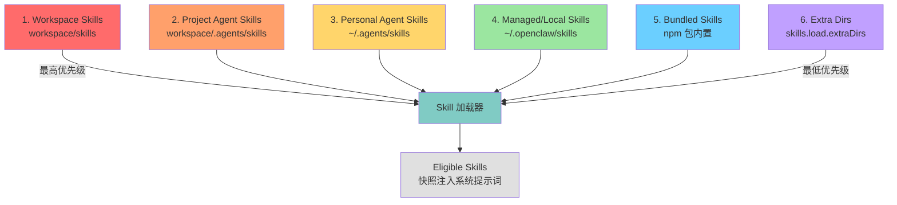

**同名冲突规则**：如果同一个 Skill 名称出现在多个来源，最高优先级的版本获胜。例如，你在 `<workspace>/skills/github/SKILL.md` 放了一个自定义 GitHub Skill，它会覆盖 npm 包内置的 bundled GitHub Skill。

**多 Agent 可见性矩阵**：

| 作用域 | 路径 | 可见范围 |
|--------|------|----------|
| Per-agent | `<workspace>/skills` | 仅该 Agent |
| Project-agent | `<workspace>/.agents/skills` | 仅该 workspace 的 Agent |
| Personal-agent | `~/.agents/skills` | 该机器上所有 Agent |
| Shared managed | `~/.openclaw/skills` | 该机器上所有 Agent |
| Shared extra | `skills.load.extraDirs` | 该机器上所有 Agent |

**源码对应**：`skills` / `skill-scanner` / `skills-snapshot.runtime` 模块负责目录扫描和快照构建。

### 1.2 Skill 扫描与发现机制（`skill-scanner` 模块）

OpenClaw 的 Skill 发现不是无脑递归扫描，而是有约束的结构化发现：

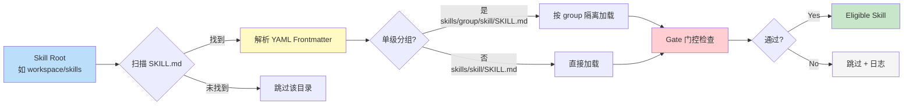

**关键约束**：
- 只扫描 `SKILL.md` 文件，不递归深度扫描任意 markdown
- 支持**单级分组**：`skills/<group>/<skill>/SKILL.md`，相关第三方 Skill 可放在共享文件夹下
- **符号链接安全**：workspace/project-agent/extra-dir 下的 Skill 文件夹如果是符号链接，其 realpath 必须落在配置的根目录内，除非 `skills.load.allowSymlinkTargets` 显式信任目标路径

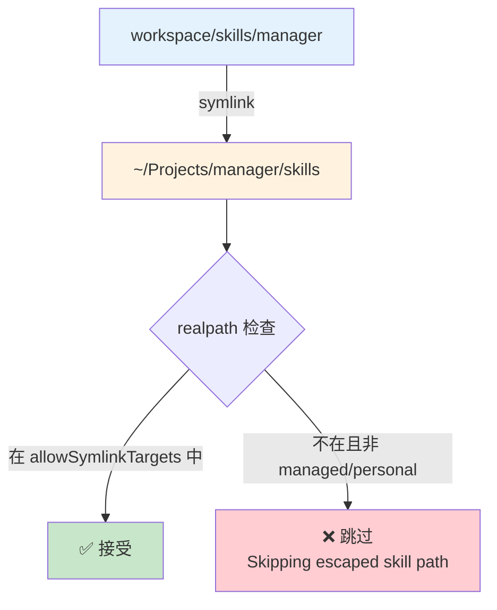

**源码对应**：`skill-scanner` 模块处理目录遍历和符号链接 containment 检查。Bundled Skills 始终被视为包含在包内，不受此限制。

### 1.3 门控系统：`metadata.openclaw` 运行时过滤

每个 Skill 可以在 `SKILL.md` 的 YAML frontmatter 中声明 `metadata.openclaw`，OpenClaw 在加载时进行实时过滤：

```markdown
---
name: image-lab
description: Generate or edit images via a provider-backed image workflow
metadata: {"openclaw": {"requires": {"bins": ["uv"], "env": ["GEMINI_API_KEY"], "config": ["browser.enabled"]}, "primaryEnv": "GEMINI_API_KEY"}}
---
```

| 门控字段 | 作用 | 检查时机 |
|---------|------|---------|
| `requires.bins` | 所有二进制必须在 PATH | 启动时 PATH 探测（宿主） |
| `requires.anyBins` | 至少一个在 PATH | OR 逻辑检查 |
| `requires.env` | 环境变量必须存在 | `process.env` 检查或 config 提供 |
| `requires.config` | openclaw.json 路径为真 | 配置树验证 |
| `os` | 平台过滤 | `darwin` / `linux` / `win32` |
| `always` | 跳过所有门控 | 强制加载 |
| `primaryEnv` | 关联的 env 变量名 | 与 `skills.entries.<name>.apiKey` 联动 |

**远程 macOS 节点支持**：当 Gateway 运行在 Linux 上，但连接了 macOS 节点（允许 `system.run`），OpenClaw 可以将在 macOS 上满足条件的 Skill 视为 eligible。Agent 应通过 `exec` 工具指定 `host=node` 来执行这些 Skill。离线节点不会使远程专属 Skill 可见。

**源码对应**：门控逻辑在技能快照构建时执行，`skills-snapshot.runtime` 模块负责最终 eligible 列表的输出。

### 1.4 Agent Allowlist：两层隔离机制

Skill 的**加载位置**和**可见性**是两个独立控制：

```mermaid
graph TD
    A[六层加载路径] -->|输出| B[All Scanned Skills]
    C[metadata.openclaw 门控] -->|过滤| B
    B -->|输出| D[Eligible Skills]
    E[agents.defaults.skills] -->|基线继承| F{Agent Allowlist}
    G[agents.list[i].skills] -->|完全替换| F
    D -->|应用| F
    F -->|最终输出| H[Agent 可见的 Skills]

    style A fill:#bbdefb
    style C fill:#fff9c4
    style D fill:#c8e6c9
    style F fill:#ffcc80
    style H fill:#e1bee7
```

**关键规则**（源码实现于 `skills-snapshot.runtime` 模块）：

- `agents.defaults.skills`：省略表示不限制（所有 eligible skills 默认可见）
- `agents.list[].skills`：非空列表是**最终集合**，不合并 defaults
- `agents.list[].skills: []`：该 Agent 零技能
- Allowlist 作用范围：提示词构建、斜杠命令发现、沙箱同步、Skill 快照

```json5
{
  agents: {
    defaults: { skills: ["github", "weather"] },
    list: [
      { id: "writer" },                              // 继承 defaults → github, weather
      { id: "docs", skills: ["docs-search"] },       // 完全替换 → 仅 docs-search
      { id: "locked-down", skills: [] }              // 零技能
    ]
  }
}
```

**`skills.allowBundled` 独立控制**：仅过滤 bundled skills，不影响 workspace/managed/extra 来源。

```json5
{
  skills: { allowBundled: ["gemini", "peekaboo"] }  // 仅这两个 bundled skill 可用
}
```

### 1.5 Skill 快照机制与 Token 开销

#### 快照时机

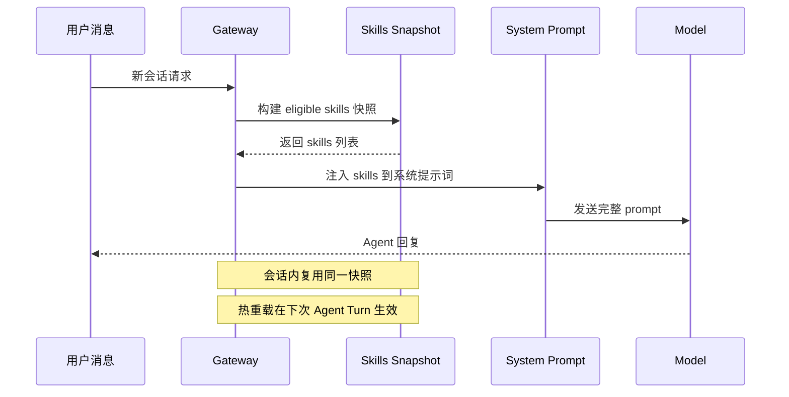

- **会话启动时**：快照当前 eligible skills，整个会话复用
- **会话内不重新加载**：避免提示词在对话中间发生变化
- **热重载触发条件**：
  1. Skill Watcher 检测到 `SKILL.md` 变更 → 下次 Agent Turn 生效
  2. 新的 eligible 远程 Node 上线 → 下次 Agent Turn 生效
  3. 有效的 Agent Skill Allowlist 变更 → 立即刷新快照

#### Token 开销公式

当 ≥1 个 Skill eligible 时，OpenClaw 将紧凑的 XML Skill 列表注入系统提示词（通过 `formatSkillsForPrompt`，位于 `pi-coding-agent` 模块）：

```
总字符 = 195（基础开销） + Σ(97 + len(name_escaped) + len(description_escaped) + len(location_escaped))
```

| 组成部分 | 字符数 | 约 Token 数（OpenAI 风格） |
|---------|--------|--------------------------|
| 基础开销 | 195 | ~49 |
| 每个 Skill 固定 | 97 | ~24 |
| name + description + location | 实际长度 | ~实际长度/4 |

**XML 转义放大效应**：`& < > " '` 会被转义为 `&amp;` `&lt;` `&gt;` `&quot;` `&#39;`，增加字符数。

**优化建议**：
- 使用 `disable-model-invocation: true` 将 Skill 从正常提示词中排除（仍可作为斜杠命令运行）
- 精简 Skill 的 `description` 字段
- 按 Agent 分配最小化 Allowlist

---

## 二、MCP 管理体系：双重角色 + 集中注册

### 2.1 双重角色概览

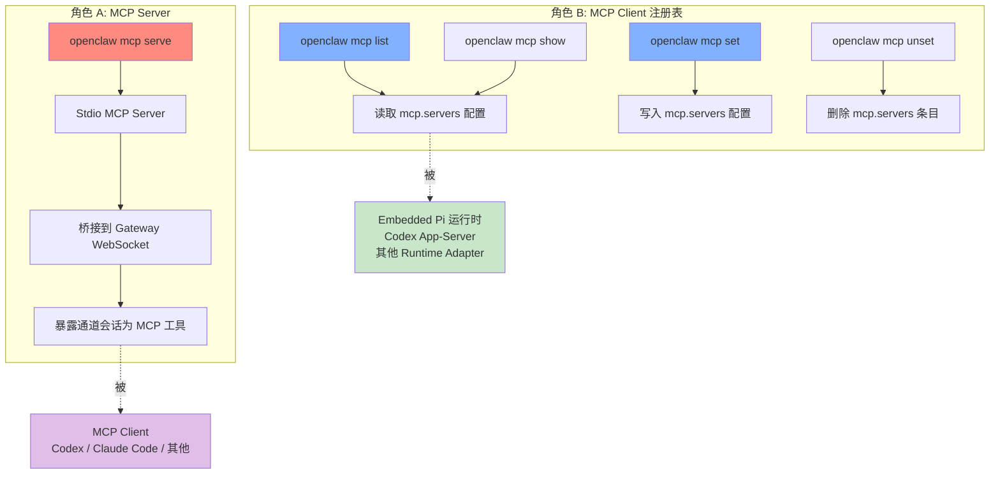

**关键区分**：
- `openclaw mcp serve`：OpenClaw **充当** MCP Server，让 Codex/Claude Code 等客户端通过 MCP 协议访问 OpenClaw 的通道会话
- `openclaw mcp list/show/set/unset`：OpenClaw **管理** MCP 服务器定义，供 Embedded Pi、Codex App-Server 等下游运行时使用

### 2.2 MCP 服务器注册表（`mcp-config` 模块）

所有 MCP 服务器定义集中存储在 `openclaw.json` 的 `mcp.servers` 中：

```json
{
  "mcp": {
    "servers": {
      "context7": {
        "command": "uvx",
        "args": ["context7-mcp"]
      },
      "docs": {
        "url": "https://mcp.example.com",
        "transport": "streamable-http",
        "headers": { "Authorization": "***" }
      }
    }
  }
}
```

#### 三种传输协议对比

| 传输方式 | 配置字段 | 适用场景 | 源码模块 |
|---------|---------|---------|---------|
| **stdio** | `command` + `args` + `env` + `cwd` | 本地子进程，零网络依赖 | `mcp-stdio` |
| **sse** | `url` + `headers` + `connectionTimeoutMs` | 远程 HTTP Server-Sent Events | `mcp-http` |
| **streamable-http** | `url` + `transport: "streamable-http"` + `headers` | 远程 HTTP 双向流 | `mcp-http` |

#### 配置规范化（`mcp-config-normalize` 模块）

```mermaid
flowchart LR
    A[用户输入<br/>type: "http"] --> B{normalizeMcpString}
    B --> C[resolveOpenClawMcpTransportAlias]
    C --> D{已知别名?}
    D -->|http| E[transport: "streamable-http"]
    D -->|streamable-http| E
    D -->|sse| F[transport: "sse"]
    D -->|stdio| G[保持 stdio]
    D -->|未知| H[忽略]
    E --> I[canonicalizeConfiguredMcpServer]
    F --> I
    G --> I
    I --> J[清理后的配置]

    style A fill:#fff9c4
    style E fill:#c8e6c9
    style F fill:#c8e6c9
    style J fill:#bbdefb
```

**规范化规则**：
- CLI `type: "http"` → 自动转换为 `transport: "streamable-http"`
- CLI `type: "sse"` → 自动转换为 `transport: "sse"`
- `openclaw doctor --fix` 可修复已有配置中的旧格式

**重要行为**（源码注释明确标注）：
- 这些命令**仅读写配置**
- **不连接**目标 MCP 服务器
- **不验证** command/URL 是否可达
- 运行时适配器在**执行时**决定实际支持的传输形态

### 2.3 Stdio 环境变量安全过滤

Stdio 传输的 `env` 字段存在安全风险：某些环境变量可以在 stdio MCP 服务器首次 RPC 之前就改变其行为。OpenClaw 在 `mcp-config-shared` 模块中实现了拦截：

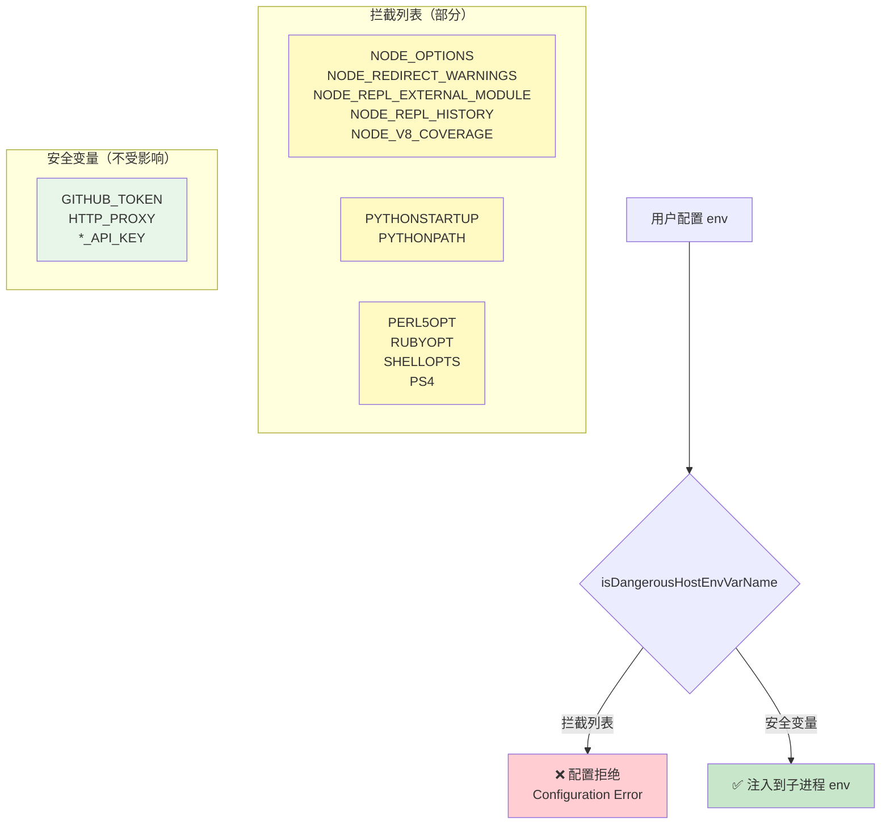

**拦截目的**：防止隐式注入前缀、替换解释器、启用调试器、重定向运行时输出

**绕过方式**：如果 MCP 服务器确实需要这些变量，设置在 Gateway 宿主进程级别，而非 stdio server 的 `env` 块中

### 2.4 MCP Bridge 架构（`openclaw mcp serve`）

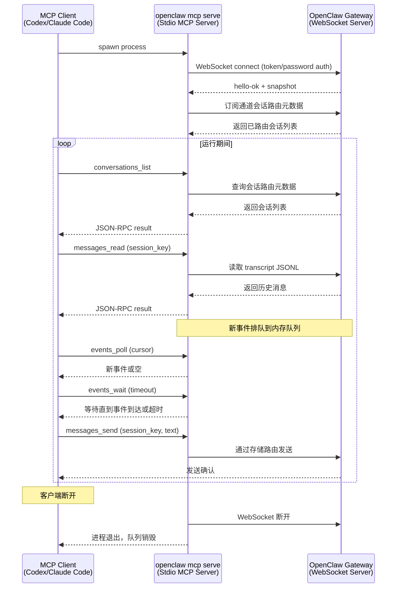

**暴露的 MCP 工具**：

| 工具 | 功能 |
|------|------|
| `conversations_list` | 列出已路由的通道会话 |
| `conversation_get` | 按 session_key 获取单个会话 |
| `messages_read` | 读取 transcript 历史 |
| `attachments_fetch` | 提取非文本消息内容 |
| `events_poll` | 拉取内存事件队列 |
| `events_wait` | 长轮询等待新事件 |
| `messages_send` | 通过存储路由发送回复 |
| `permissions_list_open` | 查看待处理的审批请求 |
| `permissions_respond` | 批准/拒绝审批 |

**事件模型**（内存队列，非持久化）：

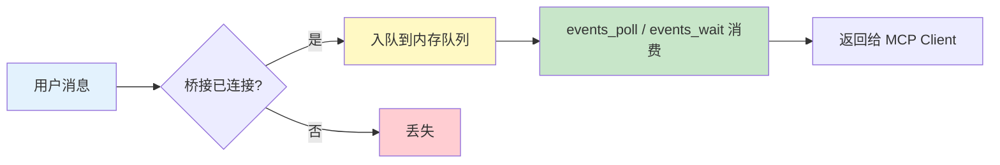

**事件类型**：
- `message` — 新消息
- `exec_approval_requested` / `exec_approval_resolved` — Shell 审批
- `plugin_approval_requested` / `plugin_approval_resolved` — 插件审批
- `claude_permission_request` — Claude 专属权限请求

**重要限制**：
- 队列是**活动性**的：从桥接连接 Gateway 开始，不回放更早历史
- 历史消息通过 `messages_read` 读取 transcript
- 客户端断开 → 桥接退出 → 内存队列消失

### 2.5 MCP 生命周期管理

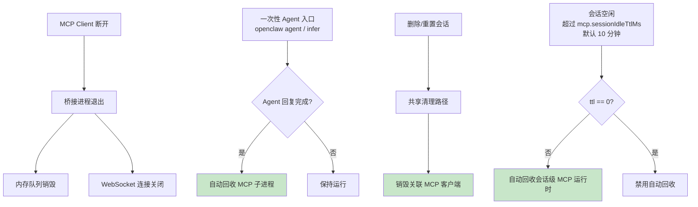

**生命周期规则**（源码实现于 `bundle-mcp` / `pi-bundle-mcp-runtime` 模块）：
- **一次性运行清理**：`openclaw agent` 和 `openclaw infer model run` 完成回复后，自动拆除捆绑的 MCP 运行时，避免子进程堆积
- **进程树拆除**：Shutdown 时，stdio MCP 服务器作为进程树整体拆除，子进程不会残留
- **会话级空闲回收**：`mcp.sessionIdleTtlMs`（默认 10 分钟）自动回收，设为 `0` 禁用
- **删除/重置会话**：通过共享运行时清理路径，销毁关联的 stdio MCP 连接

---

## 三、大规模治理：三方协同与运维实践

### 3.1 Plugin × Skill × MCP 的三角关系

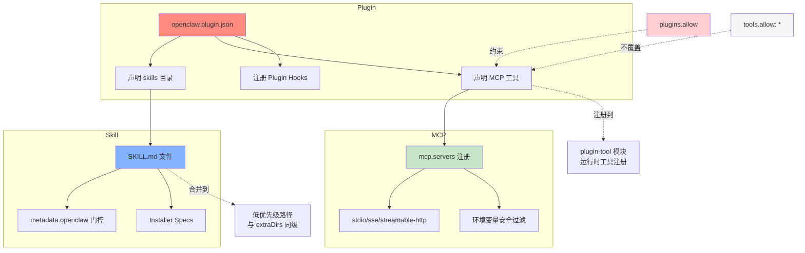

**三个关键机制**：

1. **Plugin 携带 Skill**：在 `openclaw.plugin.json` 中声明 `skills` 目录（相对于插件根路径），插件启用时自动加载。合并到低优先级路径（与 `extraDirs` 同级）。可通过 `metadata.openclaw.requires.config` 门控。

2. **Plugin 携带 MCP 工具**：通过 `plugin-tool` 模块在运行时注册工具。工厂方法在 Agent 转开始时执行。

3. **约束层次**：
   - `plugins.allow` 白名单 > `tools.allow: ["*"]`
   - 即：即使 `tools.allow` 设为 `"*"`，不在 `plugins.allow` 中的 Plugin 工具仍然不可用

### 3.2 MCP 工具工厂性能监控

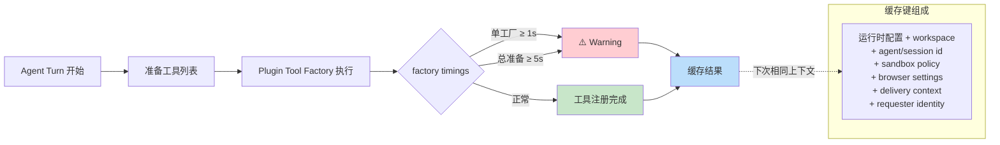

**优化原则**（源码注释建议）：
- **昂贵依赖加载**应移到工具执行路径内部，而非工具工厂内
- **缓存机制**：基于有效上下文的缓存键，上下文变化时重新执行工厂
- **诊断方法**：`openclaw config set logging.level trace` + `openclaw logs --follow` 查看 `[trace:plugin-tools] factory timings`

### 3.3 Codex App-Server 的 MCP 投影

OpenClaw 支持在每个 MCP 服务器上附加可选的 `codex` 元数据块，**仅作用于 Codex app-server 线程**：

```json
{
  "mcp": {
    "servers": {
      "trusted-mcp": {
        "command": "uvx",
        "args": ["some-mcp"],
        "codex": {
          "agents": ["writer", "coder"],
          "defaultToolsApprovalMode": "auto"
        }
      }
    }
  }
}
```

**投影规则**：
- `codex.agents`：非空列表投影到指定 OpenClaw Agent ID，空列表被配置验证拒绝
- `codex.defaultToolsApprovalMode`：`auto` / `prompt` / `approve`，控制 Codex 原生工具审批模式
- **不影响**：ACP 会话、通用 Codex harness 配置、其他运行时适配器
- 运行时将 `codex` 元数据剥离后，传递原生 `mcp_servers` 配置给 Codex

### 3.4 诊断工具矩阵

| 命令 | 用途 | 输出类型 |
|------|------|---------|
| `openclaw doctor` | 清理失效的 Skill/MCP 引用 | 诊断报告 |
| `openclaw doctor --fix` | 自动修复无效配置 | 自动修复 |
| `openclaw plugins inspect <id> --runtime --json` | 运行时验证注册的工具/钩子 | JSON |
| `openclaw status` | Skill/MCP 概览 | 状态卡片 |
| `openclaw skills update --all` | 批量更新 ClawHub 安装的 Skill | 更新日志 |
| `openclaw mcp list` | 查看所有注册的 MCP 服务器 | 列表 |
| `openclaw mcp show <name> --json` | 查看单个 MCP 服务器配置 | JSON |
| `openclaw plugins registry --refresh` | 刷新插件注册表 | 注册表更新 |
| `openclaw sessions cleanup --dry-run` | 预览会话清理 | 预览报告 |

**Stale 配置处理**：当失效的 Plugin 配置仍然命名了不再可发现的通道插件时，Gateway 启动会跳过该插件支持的通道，而不是阻塞所有其他通道。运行 `openclaw doctor --fix` 可移除失效条目。

### 3.5 安全边界总结

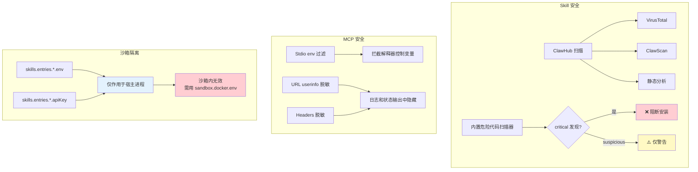

**三层安全边界**：

1. **Skill 安装前**：ClawHub 注册表扫描（VirusTotal + ClawScan + 静态分析）+ 内置危险代码扫描器
2. **MCP 配置时**：Stdio 环境变量过滤 + URL/Headers 脱敏
3. **沙箱运行时**：`skills.entries.*.env` / `apiKey` 仅作用于宿主进程，沙箱内需使用 `agents.defaults.sandbox.docker.env`

---

## 结语

OpenClaw 管理大量 Skill 和 MCP 的核心理念可以总结为四句话：

| 原则 | 体现 |
|------|------|
| **加载可配置** | 六层优先级路径 + `extraDirs` 扩展 |
| **可见可隔离** | Agent Allowlist + 门控过滤 + Plugin Skills 独立加载 |
| **更新可热重载** | Watcher 热重载 + 会话快照 + MCP 空闲回收 |
| **安全可管控** | 多阶段扫描 + Stdio env 过滤 + 沙箱隔离 |

**对开发者的实践建议**：

1. **按需启用**：用 Agent Allowlist 限制每个 Agent 可见的 Skill，减少 Token 开销
2. **精简描述**：Skill 的 `description` 越短，Token 消耗越低
3. **安全优先**：第三方 Skill 安装前阅读源码，MCP stdio 环境变量谨慎配置
4. **集中管理**：MCP 服务器定义统一放在 `mcp.servers` 中，运行时适配器按需消费
5. **定期诊断**：运行 `openclaw doctor --fix` 清理失效引用，保持配置干净

---

*本文基于 OpenClaw v2026.5.27（npm 包 `openclaw@2026.5.27`）源码与官方文档编写。所有代码路径和模块名称均对应实际编译产物（`dist/` 目录下 11720 个文件）。*
