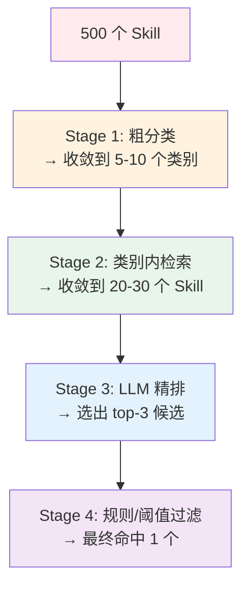
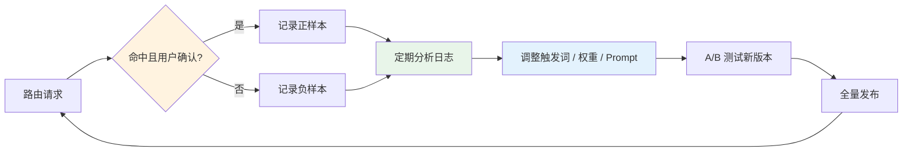

# 大规模 Skill 路由与命中率优化指南

> *"When you have one skill, you have a tool. When you have a thousand, you need a system."*
>
> 当 Skill 数量从几十个膨胀到成百上千时，**路由命中率**会成为 Agent 体验的核心瓶颈。

---

## 一、核心矛盾：为什么 Skill 多了命中率会掉？

```
Skill < 20   → LLM 可以直接看列表选 ✅
Skill 50+    → Context 窗口不够，需要检索 ⚠️
Skill 100+   → 语义冲突、同名异义、误命中严重 ❌
Skill 500+   → 检索噪声淹没信号，命中率断崖下跌 💀
```

### 1.1 根因分析

| 原因 | 描述 |
|------|------|
| **语义冲突** | 多个 Skill 功能相似（如 `grep`、`find`、`search_code`），检索结果难以区分 |
| **同名异义** | 不同类别的 Skill 使用相似描述，向量检索无法区分上下文 |
| **长尾查询** | 用户表达方式多样，预设的关键词覆盖不全 |
| **上下文不足** | 检索时缺乏运行时上下文（如当前目录、可用工具），导致误匹配 |

---

## 二、分层路由：从"扁平检索"到"漏斗筛选"

不要一次性从 500 个 Skill 里找，而是**分阶段收敛**：



### 2.1 分阶段处理参数

| 阶段 | 方法 | 耗时 | 候选数变化 |
|------|------|------|-----------|
| **粗分类** | 轻量分类器 / 关键词匹配 / 前缀路由 | <10ms | 500 → 50 |
| **类别内检索** | BM25 + 向量混合检索 | ~50ms | 50 → 20 |
| **LLM 精排** | 小模型（Haiku/4o-mini）做 Re-rank | ~200ms | 20 → 3 |
| **规则过滤** | 阈值 + 允许工具校验 + 上下文匹配 | <5ms | 3 → 1 |

**总延迟**：约 250ms，远低于单次 LLM 调用。

---

## 三、Skill 元数据设计：让"匹配"有据可依

Skill 的匹配质量 **80% 取决于元数据设计，20% 取决于检索算法**。

### 3.1 标准元数据结构

```yaml
# SKILL.md
---
name: search_code
category: development
description: Search and navigate codebase using grep, find, and ripgrep
triggers:
  keywords: ["search code", "find file", "grep", "look up"]
  regex: ["find.*function", "where.*defined"]
  patterns: ["search for {term} in {path}"]
required_context:
  - has_codebase: true
  - directory_structure: true
allowed_tools: ["Bash(grep)", "Bash(find)", "Bash(rg)"]
priority: high
version: 2.1
---
```

**关键字段作用**：

| 字段 | 用途 | 匹配方式 |
|------|------|---------|
| `triggers.keywords` | 显式关键词 | 精确匹配 / BM25 |
| `triggers.regex` | 模式触发 | 正则匹配 |
| `triggers.patterns` | 意图模板 | 槽位填充匹配 |
| `required_context` | 前置条件 | 上下文校验 |
| `category` | 粗分类 | 类别预过滤 |
| `priority` | 优先级 | 同分时的 tie-breaker |

### 3.2 三层描述策略（借鉴 L0/L1/L2 思想）

| 层级 | 内容 | 大小 | 用途 |
|------|------|------|------|
| **L0** | 一句话摘要 | ~30 tokens | 快速筛选（粗检索用） |
| **L1** | 使用场景 + 触发条件 | ~200 tokens | LLM 精排用 |
| **L2** | 完整 SKILL.md | 1-5K tokens | 命中后加载执行用 |

---

## 四、混合检索策略：BM25 + 向量 + 规则

单一检索方式在 Skill 量大时必然失效。**混合检索**是工业界标准做法。

### 4.1 RRF（Reciprocal Rank Fusion）融合

```python
# 伪代码：混合 Skill 检索
def hybrid_skill_search(query, skills, top_k=20):
    # BM25 检索（擅长精确关键词）
    bm25_scores = bm25_search(query, skills)
    
    # 向量检索（擅长语义理解）
    vector_scores = vector_search(query, skills)
    
    # RRF 融合
    fused_scores = {}
    for skill_id in all_candidates:
        bm25_rank = bm25_scores.get(skill_id, float('inf'))
        vector_rank = vector_scores.get(skill_id, float('inf'))
        # RRF 公式：1 / (k + rank)
        fused_scores[skill_id] = 1/(60 + bm25_rank) + 1/(60 + vector_rank)
    
    return sorted(fused_scores.items(), key=lambda x: x[1], reverse=True)[:top_k]
```

**为什么 RRF 有效**：

| 检索方式 | 擅长 | 短板 |
|---------|------|------|
| **BM25** | 精确关键词匹配（"grep"、"find file"） | 无法理解语义意图 |
| **向量检索** | 语义理解（"帮我找一下这个函数在哪定义的"） | 精确词匹配不稳定 |
| **RRF 融合** | 结合两者优势 | 需要调参（k 值） |

### 4.2 预过滤（Pre-filtering）加速

```
用户查询 → 提取类别/上下文标签
    ↓
只检索匹配的类别（如 development → 50 个 Skill）
    ↓
混合检索 → 候选 20 个
    ↓
LLM 精排 → 最终 1-3 个
```

**预过滤维度**：

| 维度 | 示例 | 效果 |
|------|------|------|
| **类别** | 查询含 "代码" → 只搜 `development` 类 | 减少 80% 候选 |
| **工具可用性** | 当前环境无 Git → 过滤 Git 类 Skill | 避免误命中 |
| **用户权限** | 普通用户 → 过滤 admin 类 Skill | 安全+降噪 |
| **历史偏好** | 用户常用 Python Skill → 提高权重 | 个性化提升 |

---

## 五、LLM 精排：让"大脑"做最终决策

检索只能给候选，**最终命中决策必须交给 LLM**。

### 5.1 精排 Prompt 设计

```text
You are a Skill Router. Given a user query and a list of candidate skills,
select the most appropriate one (or none).

User query: "帮我找一下这个函数在哪定义的"

Candidate skills:
1. [search_code] Search and navigate codebase using grep, find, and ripgrep
   - Triggers: search code, find file, grep, look up
   - Context: has_codebase=true
2. [read_file] Read and display file contents
   - Triggers: read file, show me the content
   - Context: has_file_path=true
3. [code_navigation] Navigate code symbols (callers, callees, definitions)
   - Triggers: who calls this, definition of, references
   - Context: has_codebase=true, has_symbol=true

Think step by step:
1. What is the user's intent?
2. Which skill best matches the intent AND has the right context?
3. Return ONLY the skill name or "none".
```

### 5.2 结构化输出

```python
from pydantic import BaseModel
from typing import Optional

class SkillRoutingResult(BaseModel):
    selected_skill: Optional[str]      # 命中的 Skill 名
    confidence: float                  # 置信度 0-1
    reasoning: str                     # LLM 的推理过程（用于调试）
    alternative: Optional[str]         # 第二候选
```

---

## 六、反馈闭环：让路由越用越准

命中率不是一次性调优出来的，而是**持续学习出来的**。

### 6.1 命中率监控

```python
class SkillRoutingMetrics:
    def __init__(self):
        self.total_queries = 0
        self.hits = 0
        self.misses = 0
        self.false_positives = 0
        
    def hit_rate(self):
        return self.hits / self.total_queries if self.total_queries > 0 else 0
```

### 6.2 反馈信号采集

| 信号 | 含义 | 用途 |
|------|------|------|
| ✅ 用户确认使用该 Skill | 正样本 | 提高该 Skill 权重 |
| ❌ 用户拒绝 / 切换 Skill | 负样本 | 降低权重或调整描述 |
| ⏰ 用户手动输入 Skill 名 | 路由失败 | 更新 triggers / 添加同义词 |
| 🔁 用户重试同一查询 | 首次匹配错误 | 修正精排 Prompt |

### 6.3 自动调优循环



---

## 七、工业级最佳实践清单

| 实践 | 说明 | 效果 |
|------|------|------|
| **1. 控制 Skill 粒度** | 一个大 Skill 拆成多个小 Skill，而非一个万能 Skill | 提高精准度 |
| **2. 类别预过滤** | 按 domain 分桶，只检索相关桶 | 延迟降低 80% |
| **3. 三层描述（L0/L1/L2）** | 粗检索用 L0，精排用 L1，执行用 L2 | 上下文窗口节省 70% |
| **4. BM25 + 向量混合** | RRF 融合，互为补充 | 命中率提升 15-25pp |
| **5. LLM 精排** | 小模型做 Re-rank，大模型做执行 | 准确率提升 20-30pp |
| **6. 上下文预校验** | 前置条件不满足直接过滤 | 误命中降低 50% |
| **7. 缓存热门 Skill** | top-20 Skill 缓存检索结果 | P99 延迟降低 60% |
| **8. 定期淘汰低使用 Skill** | 90 天未使用的 Skill 归档 | 检索噪声降低 |
| **9. 同义词扩展** | 自动从用户查询中学习新触发词 | 长尾查询命中率提升 |
| **10. 路由可观测性** | 记录每次路由的候选列表和得分 | 快速定位问题 |

---

## 八、OpenViking 的实现参考

OpenViking 的 Skill 路由（`openviking/core/skill_loader.py` + `openviking/session/skill/`）采用了：

| 模块 | 源码路径 | 功能 |
|------|---------|------|
| **SkillLoader** | `core/skill_loader.py` | 解析 SKILL.md 的 frontmatter，提取 triggers、allowed_tools 等元数据 |
| **Skill Dedup** | `session/skill/dedup.py` | Skill 去重，避免重复加载 |
| **Context Assembler** | `retrieve/context_assembler/` | 上下文组装管道中集成 Skill 检索 |
| **混合检索** | `retrieve/hierarchical_retriever.py` | BM25 + 向量 + Rerank 精排 |
| **预算控制** | `retrieve/context_assembler/budget.py` | 限制注入的 Skill 数量和 token 上限 |

---

## 九、总结

保证大规模 Skill 的命中率，核心就**三句话**：

> 1. **不要扁平检索** → 分层漏斗（粗分类 → 检索 → 精排 → 过滤）
> 2. **不要只靠向量** → BM25 + 向量 + LLM 精排，三位一体
> 3. **不要静态配置** → 反馈闭环，越用越准

这套方法论在 OpenViking、Mem0、Hindsight 等主流框架中都有类似实现，工业界已经验证过效果。如果在实际项目中遇到具体的命中率问题，可以针对具体的 Skill 设计和路由逻辑做针对性优化。

---

*本文由小伟整理，基于 OpenViking 源码设计与工业界最佳实践，截至 2026 年 8 月。*
